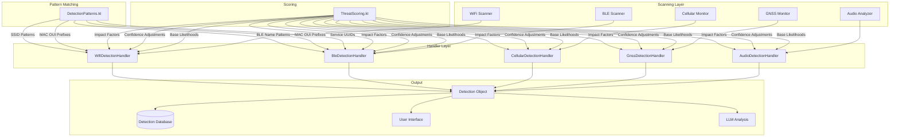

# CLAUDE_DETECTION_AUTHORING.md

## Purpose

This document provides comprehensive instructions for LLMs (Large Language Models) creating new detection types in the Flock-You surveillance detection application. Follow this guide systematically to ensure all necessary files are updated correctly and consistently.

**Target Audience**: Claude, GPT, or other LLMs assisting developers in extending detection capabilities.

---

## Quick Start Checklist

Before beginning, ensure you understand the detection being added. Then update these files **in order**:

- [ ] **1. Detection.kt** - Add `DeviceType` enum value
- [ ] **2. Detection.kt** - Add `DetectionMethod` enum value (if new method needed)
- [ ] **3. ThreatScoring.kt** - Add impact factor for the new `DeviceType`
- [ ] **4. DetectionPatterns.kt** - Add detection patterns (SSID, BLE name, MAC OUI, Service UUID)
- [ ] **5. DetectionPatterns.kt** - Add `DeviceTypeInfo` entry with description and context
- [ ] **6. Handler File** - Add detection logic to appropriate handler
- [ ] **7. Handler File** - Add LLM prompt generation for the new device type
- [ ] **8. Components.kt** - Add icon mapping (if custom icon needed)
- [ ] **9. Tests** - Add unit tests for pattern matching and scoring
- [ ] **10. Documentation** - Update relevant docs

**Order matters!** The enums must exist before they can be referenced in patterns and handlers.

---

## Detection Architecture Overview

### System Design

Flock-You uses a **handler-based architecture** where each detection protocol (WiFi, BLE, Cellular, etc.) has a dedicated handler responsible for analyzing scan data and producing detections.



### Core Components

#### 1. Detection.kt - Data Model
Defines the core enums and data classes:
- `DeviceType` - What kind of surveillance device (e.g., `FLOCK_SAFETY_CAMERA`, `AIRTAG`, `STINGRAY_IMSI`)
- `DetectionMethod` - How it was detected (e.g., `SSID_PATTERN`, `BLE_SERVICE_UUID`, `CELL_ENCRYPTION_DOWNGRADE`)
- `DetectionProtocol` - Which wireless protocol (WiFi, BLE, Cellular, GNSS, Audio, RF, Satellite)
- `Detection` - The Room entity storing detection data

#### 2. DetectionPatterns.kt - Pattern Database
Contains all known surveillance device signatures:
- SSID regex patterns (for WiFi)
- BLE device name patterns
- MAC address OUI prefixes
- BLE Service UUIDs
- Tracker specifications with stalking context
- Device type information for LLM prompts

#### 3. ThreatScoring.kt - Scoring System
Implements the threat calculation formula:
```
threat_score = base_likelihood * impact_factor * confidence
```
Where:
- `base_likelihood` (0-100): Probability this is a real threat
- `impact_factor` (0.5-2.0): Potential harm if threat is real
- `confidence` (0.0-1.0): Detection quality and confirming indicators

#### 4. Detection Handlers - Protocol-Specific Logic
Each handler processes scan data for its protocol:
- `WifiDetectionHandler.kt` - WiFi AP scanning
- `BleDetectionHandler.kt` - Bluetooth LE devices
- `CellularDetectionHandler.kt` - Cell tower anomalies (IMSI catchers)
- `GnssDetectionHandler.kt` - GPS/satellite spoofing
- `UltrasonicDetector.kt` - Audio/ultrasonic beacons

#### 5. DetectionRegistry.kt - Handler Coordination
Central registry that:
- Maps protocols to handlers
- Maps device types to handlers
- Provides profile lookup
- Coordinates aggregate threat analysis

---

## Step 1: Define the Detection Type

### File: `app/src/main/java/com/flockyou/data/model/Detection.kt`

#### A. Add to DeviceType Enum

Add your new device type to the `DeviceType` enum. Choose a descriptive name and appropriate emoji.

```kotlin
enum class DeviceType(val displayName: String, val emoji: String) {
    // ... existing types ...

    // Add your new type in the appropriate category section:
    // - Surveillance Equipment
    // - Police Technology
    // - Trackers
    // - Smart Home/IoT
    // - Network Attacks
    // - Traffic Enforcement
    // - Hacking Tools

    // Example: Adding a new acoustic sensor
    ACOUSTIC_GUNSHOT_SENSOR("Acoustic Gunshot Sensor", "🎯"),

    // Example: Adding a new tracker brand
    CHIPOLO_TRACKER("Chipolo Tracker", "🔵"),
}
```

**Naming Conventions**:
- Use `SCREAMING_SNAKE_CASE` for enum values
- Use descriptive `displayName` that users will understand
- Choose emoji that visually represents the device
- Group similar device types together in the enum

#### B. Add to DetectionMethod Enum (If Needed)

If your device requires a new detection methodology, add it to `DetectionMethod`:

```kotlin
enum class DetectionMethod(val displayName: String, val description: String) {
    // ... existing methods ...

    // Add new method if the detection technique is novel:
    ACOUSTIC_PATTERN("Acoustic Pattern", "Device identified by sound frequency signature"),
    NFC_SIGNATURE("NFC Signature", "Device identified via NFC tag data"),
}
```

**When to add a new DetectionMethod**:
- The detection technique is fundamentally different from existing methods
- The UI needs to display detection-specific guidance
- The LLM needs different context based on how detection occurred

**When NOT to add a new DetectionMethod**:
- An existing method adequately describes the technique
- The difference is only in the pattern matched, not the technique

---

## Step 2: Configure Threat Scoring

### File: `app/src/main/java/com/flockyou/detection/ThreatScoring.kt`

#### A. Add Impact Factor

Add your device type to the `impactFactors` map. Impact factor represents potential harm if the threat is real.

```kotlin
private val impactFactors: Map<DeviceType, Double> = mapOf(
    // ... existing mappings ...

    // Add your new device type with appropriate impact factor:
    DeviceType.YOUR_NEW_DEVICE to 1.2,  // Choose appropriate value
)
```

**Impact Factor Scale**:

| Factor | Description | Example Devices |
|--------|-------------|-----------------|
| 2.0 | Maximum - Intercepts all communications, extreme privacy violation | STINGRAY_IMSI, CELLEBRITE_FORENSICS, MAN_IN_MIDDLE |
| 1.8 | High - Can cause physical harm or intercept communications | GNSS_SPOOFER, GNSS_JAMMER, RF_JAMMER, WIFI_PINEAPPLE |
| 1.5 | Significant - Stalking/tracking concern | AIRTAG, TILE_TRACKER, TRACKING_DEVICE, SURVEILLANCE_VAN |
| 1.2-1.3 | Moderate - Privacy violations, recording | HIDDEN_CAMERA, FLOCK_SAFETY_CAMERA, LICENSE_PLATE_READER |
| 1.0 | Standard - Known surveillance but expected type | BODY_CAMERA, POLICE_VEHICLE, CCTV_CAMERA |
| 0.7-0.8 | Lower - Consumer IoT, some privacy concern | RING_DOORBELL, NEST_CAMERA, AMAZON_SIDEWALK |
| 0.5-0.6 | Minimal - Infrastructure, low privacy impact | TRAFFIC_SENSOR, TOLL_READER, RF_INTERFERENCE |

**Guidelines for Choosing Impact Factor**:
1. **Physical harm potential**: Can it endanger someone? (GPS spoofing -> 1.8)
2. **Communication interception**: Can it read messages/calls? (IMSI catcher -> 2.0)
3. **Location tracking**: Does it follow individuals? (Trackers -> 1.5)
4. **Data extraction**: Can it steal device data? (Cellebrite -> 2.0)
5. **Recording capability**: Does it record A/V? (Hidden camera -> 1.3)
6. **Expectation**: Is it expected in public? (Traffic camera -> 0.6)

#### B. Also Update Detection.kt getImpactFactorForDeviceType()

The same impact factors should be mirrored in `Detection.kt`'s `getImpactFactorForDeviceType()` function for consistency:

```kotlin
private fun getImpactFactorForDeviceType(deviceType: DeviceType): Double = when (deviceType) {
    // ... existing cases ...

    DeviceType.YOUR_NEW_DEVICE -> 1.2,  // Same value as ThreatScoring.kt

    else -> 1.0
}
```

---

## Step 3: Add Detection Patterns

### File: `app/src/main/java/com/flockyou/data/model/DetectionPatterns.kt`

Add patterns to identify your device. Choose the appropriate pattern type(s) based on how the device can be detected.

### A. SSID Patterns (WiFi Detection)

For devices that broadcast WiFi networks:

```kotlin
val ssidPatterns = listOf(
    // ... existing patterns ...

    // Add your new SSID pattern:
    DetectionPattern(
        type = PatternType.SSID_REGEX,
        pattern = "(?i)^your[_-]?pattern[_-]?.*",  // Case-insensitive regex
        deviceType = DeviceType.YOUR_NEW_DEVICE,
        manufacturer = "Manufacturer Name",  // null if unknown
        threatScore = 85,  // 0-100 base score
        description = "Description of what this device does and why it's flagged",
        sourceUrl = "https://example.com/research"  // Optional documentation link
    ),
)
```

**SSID Pattern Guidelines**:
- Use `(?i)` prefix for case-insensitive matching
- Use `[_-]?` to match optional separators
- Use `.*` suffix if the SSID may have variable suffixes
- Be specific enough to avoid false positives
- Include manufacturer if known from OUI lookups or research

### B. BLE Name Patterns (Bluetooth Detection)

For devices advertising via Bluetooth LE:

```kotlin
val bleNamePatterns = listOf(
    // ... existing patterns ...

    DetectionPattern(
        type = PatternType.BLE_NAME_REGEX,
        pattern = "(?i)^device[_-]?name[_-]?.*",
        deviceType = DeviceType.YOUR_NEW_DEVICE,
        manufacturer = "Manufacturer Name",
        threatScore = 80,
        description = "BLE device description"
    ),
)
```

### C. MAC Address OUI Prefixes

For devices identifiable by manufacturer OUI (first 3 octets of MAC):

```kotlin
data class MacPrefix(
    val prefix: String,
    val manufacturer: String,
    val deviceType: DeviceType,
    val threatScore: Int,
    val description: String
)

val macPrefixes = listOf(
    // ... existing prefixes ...

    MacPrefix(
        prefix = "AA:BB:CC",  // Format: XX:XX:XX (uppercase)
        manufacturer = "Manufacturer Name",
        deviceType = DeviceType.YOUR_NEW_DEVICE,
        threatScore = 70,
        description = "OUI registered to manufacturer used in surveillance equipment"
    ),
)
```

**Finding OUI Information**:
- IEEE OUI lookup: https://standards-oui.ieee.org/
- Wireshark OUI database
- FCC filings for specific devices
- Security research papers

### D. BLE Service UUIDs

For devices with specific Bluetooth services:

```kotlin
val serviceUuidPatterns = mapOf(
    // ... existing UUIDs ...

    // Standard format: 128-bit UUID
    UUID.fromString("XXXXXXXX-XXXX-XXXX-XXXX-XXXXXXXXXXXX") to DeviceType.YOUR_NEW_DEVICE,

    // 16-bit UUID (expanded to 128-bit):
    // 0000XXXX-0000-1000-8000-00805F9B34FB
)
```

**Finding Service UUIDs**:
- Bluetooth SIG assigned numbers: https://www.bluetooth.com/specifications/assigned-numbers/
- Reverse engineering with nRF Connect or similar apps
- Security research and device teardowns
- Manufacturer documentation

### E. Device Type Information (For LLM Context)

Add comprehensive information about the device for AI analysis:

```kotlin
val deviceTypeInfo = mapOf(
    // ... existing entries ...

    DeviceType.YOUR_NEW_DEVICE to DeviceTypeInfo(
        description = """
            Detailed description of what this device is.
            Include:
            - Purpose and functionality
            - How it works technically
            - Who typically deploys it
            - Physical characteristics
        """.trimIndent(),

        capabilities = listOf(
            "Capability 1 (e.g., 'Records license plates')",
            "Capability 2 (e.g., 'Stores data for 30 days')",
            "Capability 3 (e.g., 'Shares with law enforcement')"
        ),

        privacyConcerns = """
            Explain the privacy implications:
            - What data is collected
            - How long it's retained
            - Who has access
            - Legal considerations
        """.trimIndent(),

        recommendations = listOf(
            "Recommendation 1 for the user",
            "Recommendation 2 for the user",
            "How to verify the detection"
        ),

        realWorldSources = listOf(
            "https://example.com/research-paper",
            "https://eff.org/related-article"
        )
    )
)
```

---

## Step 4: Implement Detection Logic

### Choosing the Right Handler

| Device Detection Method | Handler File |
|------------------------|--------------|
| WiFi SSID/AP | `WifiDetectionHandler.kt` |
| Bluetooth LE name/UUID/OUI | `BleDetectionHandler.kt` |
| Cellular anomalies | `CellularDetectionHandler.kt` |
| GPS/GNSS spoofing | `GnssDetectionHandler.kt` |
| Ultrasonic/audio | `UltrasonicDetector.kt` |
| RF spectrum | `RfDetectionHandler.kt` |
| Satellite/NTN | `SatelliteDetectionHandler.kt` |

### Handler Implementation Pattern

Most new device types only need pattern additions in `DetectionPatterns.kt`. The handlers already process patterns dynamically. However, if your device requires **special detection logic**, follow this pattern:

```kotlin
// In the appropriate handler (e.g., BleDetectionHandler.kt)

/**
 * Check for [YOUR_DEVICE_NAME] by [detection method].
 *
 * [Explain the detection technique and what makes it reliable]
 */
private fun checkYourNewDevice(context: BleDetectionContext): BleDetectionResult? {
    // 1. Check if feature is enabled in config
    if (!config.enableYourDeviceDetection) {
        return null
    }

    // 2. Apply your detection heuristics
    val isMatch = when {
        // Primary indicator
        context.serviceUuids.contains(YOUR_SERVICE_UUID) -> true

        // Secondary indicator (name pattern)
        context.deviceName?.matches(Regex("(?i)^your[_-]?pattern.*")) == true -> true

        // Manufacturer data check
        context.manufacturerData.containsKey(YOUR_MANUFACTURER_ID) -> true

        else -> false
    }

    if (!isMatch) return null

    // 3. Calculate threat score using ThreatScoring system
    val threatResult = calculateProperThreatScore(
        baseLikelihood = 70,  // Base probability this is a real threat
        deviceType = DeviceType.YOUR_NEW_DEVICE,
        rssi = context.rssi,
        seenCount = getSeenCount(context.macAddress),
        hasMultipleIndicators = hasMultipleIndicators(context),
        hasCrossProtocolCorrelation = false,
        isKnownFalsePositivePattern = isKnownFalsePositive(context),
        isConsumerDevice = false
    )

    // 4. Check if meets threshold
    if (threatResult.rawScore < getThresholds().minThreatScore) {
        return null
    }

    // 5. Build Detection object
    val detection = Detection(
        protocol = DetectionProtocol.BLUETOOTH_LE,
        detectionMethod = DetectionMethod.BLE_SERVICE_UUID,
        deviceType = DeviceType.YOUR_NEW_DEVICE,
        deviceName = context.deviceName ?: "Your Device Name",
        macAddress = context.macAddress,
        rssi = context.rssi,
        signalStrength = rssiToSignalStrength(context.rssi),
        latitude = context.latitude,
        longitude = context.longitude,
        threatLevel = threatResult.severity,
        threatScore = threatResult.rawScore,
        manufacturer = "Manufacturer Name",
        serviceUuids = context.serviceUuids.joinToString(",") { it.toString() },
        matchedPatterns = buildMatchedPatternsJson(listOf(
            "Pattern match description",
            "Additional indicator"
        )),
        rawData = formatRawBleData(context)
    )

    Log.d(TAG, "Detected YOUR_NEW_DEVICE: ${context.macAddress} (score=${threatResult.rawScore})")

    return BleDetectionResult(
        detection = detection,
        aiPrompt = buildYourDevicePrompt(context, detection, threatResult),
        confidence = threatResult.confidence.toFloat()
    )
}
```

### Adding to Detection Priority Chain

If you add a new check function, add it to the handler's main detection method:

```kotlin
fun handleDetection(context: BleDetectionContext): BleDetectionResult? {
    // ... existing checks ...

    // Add your check at appropriate priority level
    checkYourNewDevice(context)?.let { result ->
        lastDetectionTime[context.macAddress] = now
        return result
    }

    // ... remaining checks ...
}
```

**Priority Guidelines**:
1. High-confidence, high-impact detections first (e.g., active attacks)
2. Service UUID matches (most reliable for BLE)
3. Device name pattern matches
4. MAC OUI matches (lower confidence)
5. Behavioral/heuristic detections last

---

## Step 5: Add LLM Context

### Prompt Generation Pattern

Every handler should generate comprehensive prompts for LLM analysis. Follow this structure:

```kotlin
/**
 * Build AI analysis prompt for [YOUR_DEVICE_NAME] detection.
 */
private fun buildYourDevicePrompt(
    context: BleDetectionContext,
    detection: Detection,
    threatResult: ThreatCalculationResult
): String {
    return buildString {
        // Section 1: Header with device identification
        appendLine("=== ${detection.deviceType.displayName} Detection ===")
        appendLine()

        // Section 2: Detection data
        appendLine("== DETECTION DATA ==")
        appendLine("Device Name: ${context.deviceName ?: "(None)"}")
        appendLine("MAC Address: ${context.macAddress}")
        appendLine("Signal Strength: ${context.rssi} dBm (${detection.signalStrength.displayName})")
        appendLine("Estimated Distance: ${rssiToDistance(context.rssi)}")
        context.latitude?.let { lat ->
            context.longitude?.let { lon ->
                appendLine("Location: $lat, $lon")
            }
        }
        appendLine()

        // Section 3: Threat assessment
        appendLine("== THREAT ASSESSMENT ==")
        appendLine("Threat Level: ${detection.threatLevel.displayName}")
        appendLine("Threat Score: ${detection.threatScore}/100")
        appendLine("Confidence: ${(threatResult.confidence * 100).toInt()}%")
        appendLine()
        appendLine("Assessment: ${getThreatAssessment(detection.threatScore)}")
        appendLine()

        // Section 4: What this device is
        appendLine("== ABOUT THIS DEVICE ==")
        appendLine(getDeviceDescription(DeviceType.YOUR_NEW_DEVICE))
        appendLine()

        // Section 5: Privacy implications
        appendLine("== PRIVACY IMPLICATIONS ==")
        appendLine(getPrivacyImplications(DeviceType.YOUR_NEW_DEVICE))
        appendLine()

        // Section 6: What the user should do
        appendLine("== RECOMMENDED ACTIONS ==")
        appendLine(getRecommendedActions(detection, threatResult))
        appendLine()

        // Section 7: How to verify
        appendLine("== VERIFICATION STEPS ==")
        appendLine(getVerificationSteps(DeviceType.YOUR_NEW_DEVICE))
        appendLine()

        // Section 8: Legal context (if applicable)
        appendLine("== LEGAL CONTEXT ==")
        appendLine(getLegalContext(DeviceType.YOUR_NEW_DEVICE))
        appendLine()

        // Section 9: AI analysis instructions
        appendLine("=" .repeat(50))
        appendLine("ANALYSIS INSTRUCTIONS")
        appendLine("=" .repeat(50))
        appendLine()
        appendLine("Based on the above information, provide:")
        appendLine("1. Assessment of whether this is likely a real threat or false positive")
        appendLine("2. What specific indicators support your assessment")
        appendLine("3. Questions to ask the user about their context/situation")
        appendLine("4. Specific, actionable recommendations")
        appendLine("5. How to verify the detection if possible")
    }
}
```

### Required LLM Context Elements

Every prompt should include:

1. **What is this device?** - Technical description
2. **What does it do?** - Capabilities and functionality
3. **What data does it collect?** - Specific data types
4. **Why is it flagged?** - Privacy/security concerns
5. **What should the user do?** - Actionable recommendations
6. **How to verify?** - Steps to confirm detection
7. **Legal context** - Laws and rights (vary by jurisdiction)
8. **Real-world sources** - Links to research/documentation

---

## Step 6: Update UI Components (If Needed)

### File: UI Icon Mappings

If your device type needs a custom icon beyond the emoji, update the icon mapping:

```kotlin
// In appropriate UI component file
fun getIconForDeviceType(deviceType: DeviceType): ImageVector {
    return when (deviceType) {
        // ... existing mappings ...
        DeviceType.YOUR_NEW_DEVICE -> Icons.Default.YourIcon
        else -> Icons.Default.Warning
    }
}
```

**Note**: Most device types use the emoji from `DeviceType.emoji`. Custom icons are only needed for special UI treatments.

---

## Step 7: Testing

### Required Test Cases

Create tests in the appropriate test file (e.g., `BleDetectionHandlerTest.kt`):

```kotlin
class YourDeviceDetectionTest {

    @Test
    fun `pattern matches YOUR_DEVICE SSID`() {
        val pattern = DetectionPatterns.ssidPatterns.find {
            it.deviceType == DeviceType.YOUR_NEW_DEVICE
        }
        assertNotNull(pattern)

        // Test positive matches
        assertTrue(pattern.pattern.toRegex().matches("YourDevice_123"))
        assertTrue(pattern.pattern.toRegex().matches("yourdevice-456"))

        // Test negative matches (avoid false positives)
        assertFalse(pattern.pattern.toRegex().matches("NotYourDevice"))
        assertFalse(pattern.pattern.toRegex().matches("SomeOtherSSID"))
    }

    @Test
    fun `impact factor exists for YOUR_NEW_DEVICE`() {
        val impactFactor = ThreatScoring.getImpactFactor(DeviceType.YOUR_NEW_DEVICE)
        assertNotNull(impactFactor)
        assertTrue(impactFactor in 0.5..2.0)
    }

    @Test
    fun `threat score calculation is reasonable`() {
        val result = ThreatScoring.calculateThreat(
            ThreatScoring.ThreatInput(
                baseLikelihood = 70,
                deviceType = DeviceType.YOUR_NEW_DEVICE,
                rssi = -60,
                seenCount = 2,
                hasMultipleIndicators = true
            )
        )

        // Score should be in valid range
        assertTrue(result.rawScore in 0..100)
        assertTrue(result.adjustedScore in 0..100)

        // With 70% likelihood and multiple indicators, should be at least MEDIUM
        assertTrue(result.severity in listOf(ThreatLevel.MEDIUM, ThreatLevel.HIGH, ThreatLevel.CRITICAL))
    }

    @Test
    fun `detection creates valid Detection object`() {
        val handler = BleDetectionHandler(mockContext)
        val context = BleDetectionContext(
            macAddress = "AA:BB:CC:DD:EE:FF",
            deviceName = "YourDevice_123",
            rssi = -55,
            serviceUuids = listOf(YOUR_SERVICE_UUID),
            manufacturerData = emptyMap(),
            advertisingRate = 1.0f,
            timestamp = System.currentTimeMillis()
        )

        val result = handler.handleDetection(context)

        assertNotNull(result)
        assertEquals(DeviceType.YOUR_NEW_DEVICE, result.detection.deviceType)
        assertTrue(result.confidence > 0)
        assertTrue(result.aiPrompt.isNotEmpty())
    }
}
```

### Manual Testing Checklist

- [ ] Build succeeds with no errors
- [ ] Device type appears in UI device type list
- [ ] Pattern matching works with test SSID/BLE names
- [ ] Threat score is reasonable for the device type
- [ ] LLM prompt is generated with all required sections
- [ ] Detection appears correctly in detection list UI
- [ ] Export/share includes the new detection type
- [ ] No regression in existing detection types

---

## Subsystem Connection Reference

### BLE Subsystem

**Available Data in BleDetectionContext**:
```kotlin
data class BleDetectionContext(
    val macAddress: String,
    val deviceName: String?,
    val rssi: Int,
    val serviceUuids: List<UUID>,
    val manufacturerData: Map<Int, String>,  // ManufacturerId -> Hex data
    val advertisingRate: Float,               // Packets per second
    val timestamp: Long,
    val latitude: Double?,
    val longitude: Double?
)
```

**Key Methods**:
- `DetectionPatterns.matchBleNamePattern(name)` - Match against BLE name patterns
- `DetectionPatterns.matchServiceUuid(uuid)` - Match against known service UUIDs
- `DetectionPatterns.matchMacPrefix(mac)` - Match against OUI database

### WiFi Subsystem

**Available Data in WifiDetectionContext**:
```kotlin
data class WifiDetectionContext(
    val ssid: String,
    val bssid: String,
    val rssi: Int,
    val frequency: Int,
    val channel: Int,
    val capabilities: String,  // Security capabilities (WPA2, WPA3, etc.)
    val isHidden: Boolean,
    val timestamp: Long,
    val latitude: Double?,
    val longitude: Double?
)
```

**Key Methods**:
- `DetectionPatterns.matchSsidPattern(ssid)` - Match against SSID patterns
- `DetectionPatterns.matchMacPrefix(bssid)` - Match against OUI database

### Cellular Subsystem

**Available Data in CellularDetectionContext**:
```kotlin
data class CellularDetectionContext(
    val anomalyType: CellularMonitor.AnomalyType,
    val mcc: String?,              // Mobile Country Code
    val mnc: String?,              // Mobile Network Code
    val cellId: Long?,             // Cell tower ID
    val previousCellId: Long?,
    val lac: Int?,                 // Location Area Code (2G/3G)
    val tac: Int?,                 // Tracking Area Code (4G/5G)
    val signalStrength: Int,
    val previousSignalStrength: Int?,
    val networkType: String,       // "5G", "4G", "3G", "2G"
    val previousNetworkType: String?,
    val encryptionType: EncryptionType,
    val isRoaming: Boolean,
    val latitude: Double?,
    val longitude: Double?,
    val timestamp: Long,
    val imsiCatcherScore: Int,     // 0-100 IMSI catcher likelihood
    val contributingFactors: List<String>,
    val movementType: MovementType?,
    val cellTrustScore: Int?       // 0-100 cell familiarity
)
```

**Anomaly Types**:
- `ENCRYPTION_DOWNGRADE` - Forced to weaker encryption (2G)
- `SUSPICIOUS_NETWORK` - Invalid/test MCC-MNC codes
- `STATIONARY_CELL_CHANGE` - Tower changed while not moving
- `RAPID_CELL_SWITCHING` - Abnormal tower switching
- `SIGNAL_SPIKE` - Sudden strong signal
- `UNKNOWN_CELL_FAMILIAR_AREA` - New tower in known area

### GNSS Subsystem

**Available Data in GnssDetectionContext**:
```kotlin
data class GnssDetectionContext(
    val satellites: List<SatelliteInfo>,
    val hdop: Float?,              // Horizontal Dilution of Precision
    val pdop: Float?,              // Position Dilution of Precision
    val fixType: GnssFixType,      // NONE, FIX_2D, FIX_3D
    val cn0DbHz: Float?,           // Carrier-to-noise density
    val agcLevel: Float?,          // Automatic Gain Control
    val latitude: Double?,
    val longitude: Double?,
    val timestamp: Long
)

data class SatelliteInfo(
    val svid: Int,                 // Satellite vehicle ID
    val constellation: String,     // GPS, GLONASS, Galileo, etc.
    val cn0DbHz: Float,            // Signal strength
    val elevation: Float,          // Degrees above horizon
    val azimuth: Float,            // Compass direction
    val usedInFix: Boolean
)
```

**Detection Indicators**:
- Unusually strong/uniform C/N0 across all satellites (spoofing)
- Impossible satellite geometry (wrong elevations/azimuths)
- AGC anomalies (jamming)
- HDOP/PDOP anomalies

### Audio Subsystem

**Available Data for Ultrasonic Detection**:
```kotlin
data class AudioDetectionContext(
    val frequencyHz: Int,          // Detected frequency
    val amplitudeDb: Double,       // Signal strength
    val duration: Long,            // Detection duration ms
    val spectralPeaks: List<Int>,  // Frequency peaks
    val modulationType: String?,   // Detected modulation
    val isUltrasonic: Boolean,     // Above 18kHz
    val timestamp: Long,
    val latitude: Double?,
    val longitude: Double?
)
```

**Ultrasonic Beacon Frequencies**:
- 18-20 kHz: Cross-device tracking beacons
- Silverpush/Shopkick: ~18-19 kHz
- Various ad beacons: 17.5-20 kHz range

---

## Heuristics Guidelines

### What Makes a Good Detection Heuristic

1. **Low False Positive Rate**
   - Be specific rather than overly broad
   - Combine multiple indicators when possible
   - Consider environmental context

2. **Clear Reasoning**
   - Document why this pattern indicates this device
   - Provide sources/research when available
   - Explain confidence level

3. **Environmental Awareness**
   - Consider location (protest vs. home)
   - Consider time patterns
   - Consider movement correlation

4. **Actionable Output**
   - Detection should lead to useful information
   - User should know what to do next
   - Verification steps should be provided

### Heuristic Patterns to Use

**Strong Indicators** (high confidence):
- Exact service UUID match
- Known manufacturer data bytes
- Multiple confirming patterns
- Cross-protocol correlation

**Moderate Indicators** (medium confidence):
- Device name pattern match
- MAC OUI match
- Signal strength patterns
- Temporal persistence

**Weak Indicators** (low confidence, use cautiously):
- Single generic pattern match
- RSSI alone
- Frequency of appearance alone

### Anti-Patterns to Avoid

1. **Single-Indicator Detection**
   - Don't flag based on one weak signal
   - Combine indicators for confidence

2. **Ignoring Context**
   - A Ring doorbell at a house is normal
   - The same Ring at multiple of YOUR locations is suspicious

3. **Hard-Coded Thresholds Without Explanation**
   - Document why -55 dBm means "close proximity"
   - Explain the reasoning in comments

4. **Missing False Positive Handling**
   - Known consumer devices should reduce score
   - Common network names need exclusion lists

5. **Vague Threat Descriptions**
   - "This might be surveillance" is unhelpful
   - Be specific about what it does and doesn't do

---

## Complete Example: Adding a Hypothetical New Device

Let's walk through adding detection for a hypothetical "AcmeCam" surveillance camera.

### Step 1: Add to Detection.kt

```kotlin
// In DeviceType enum
ACME_CAM("AcmeCam Surveillance", "📷"),

// In DetectionMethod enum (if new method needed)
// Not needed for this example - uses existing SSID_PATTERN and BLE_DEVICE_NAME
```

### Step 2: Add Impact Factor

```kotlin
// In ThreatScoring.kt impactFactors map
DeviceType.ACME_CAM to 1.2,  // Privacy violation - records video

// In Detection.kt getImpactFactorForDeviceType()
DeviceType.ACME_CAM -> 1.2,
```

### Step 3: Add Patterns

```kotlin
// In DetectionPatterns.kt ssidPatterns
DetectionPattern(
    type = PatternType.SSID_REGEX,
    pattern = "(?i)^acme[_-]?cam[_-]?.*",
    deviceType = DeviceType.ACME_CAM,
    manufacturer = "Acme Surveillance Inc.",
    threatScore = 75,
    description = "AcmeCam surveillance camera - records video and shares with cloud",
    sourceUrl = "https://example.com/acmecam-research"
),

// In bleNamePatterns
DetectionPattern(
    type = PatternType.BLE_NAME_REGEX,
    pattern = "(?i)^acme[_-]?(cam|setup).*",
    deviceType = DeviceType.ACME_CAM,
    manufacturer = "Acme Surveillance Inc.",
    threatScore = 75,
    description = "AcmeCam BLE configuration interface"
),

// In macPrefixes (if OUI is known)
MacPrefix(
    prefix = "AC:ME:CA",
    manufacturer = "Acme Surveillance Inc.",
    deviceType = DeviceType.ACME_CAM,
    threatScore = 65,
    description = "Acme Surveillance Inc. OUI"
),
```

### Step 4: Add Device Info

```kotlin
// In deviceTypeInfo map
DeviceType.ACME_CAM to DeviceTypeInfo(
    description = """
        AcmeCam is a cloud-connected surveillance camera manufactured by
        Acme Surveillance Inc. These cameras are commonly deployed in:
        - Retail stores
        - Office buildings
        - Some residential areas

        The camera records 1080p video and uploads to Acme's cloud servers.
    """.trimIndent(),

    capabilities = listOf(
        "Records 1080p video 24/7",
        "Motion detection and alerts",
        "Cloud storage (30-day retention)",
        "Remote viewing via mobile app",
        "Two-way audio"
    ),

    privacyConcerns = """
        DATA COLLECTED:
        - Video footage of all activity in view
        - Motion events with timestamps
        - Audio if enabled

        DATA RETENTION:
        - 30 days cloud storage (paid plans: longer)
        - Acme may share with law enforcement upon request

        PRIVACY NOTES:
        - No end-to-end encryption
        - Acme employees can access footage
    """.trimIndent(),

    recommendations = listOf(
        "Check if you're in a private or public space",
        "Look for camera signage (required in some jurisdictions)",
        "Note the camera for your records",
        "If in private space without consent: may be illegal"
    ),

    realWorldSources = listOf(
        "https://example.com/acmecam-privacy-policy",
        "https://example.com/acmecam-security-research"
    )
)
```

### Step 5: Add Handler-Specific Prompt (Optional)

If the existing generic prompt is insufficient, add to WifiDetectionHandler:

```kotlin
private fun getDeviceTypeDescription(deviceType: DeviceType): String {
    return when (deviceType) {
        // ... existing cases ...

        DeviceType.ACME_CAM -> """
            AcmeCam cameras are cloud-connected surveillance systems that:
            - Record continuous 1080p video
            - Upload footage to Acme's cloud servers
            - Can be remotely accessed by the owner
            - May share footage with law enforcement

            DEPLOYMENT PATTERNS:
            - Commonly found in retail, offices, some homes
            - Small cylindrical camera, often white
            - May have visible IR LEDs for night vision

            REAL-WORLD CONFIRMATION:
            - Look for small dome or cylindrical camera nearby
            - Check for "AcmeCam" branding
            - May have LED indicator light
        """.trimIndent()

        else -> // default description
    }
}
```

### Step 6: Test

```kotlin
@Test
fun `AcmeCam SSID pattern matches correctly`() {
    val pattern = DetectionPatterns.ssidPatterns.find {
        it.deviceType == DeviceType.ACME_CAM
    }!!

    assertTrue(pattern.pattern.toRegex().matches("AcmeCam_123"))
    assertTrue(pattern.pattern.toRegex().matches("acme-cam-setup"))
    assertTrue(pattern.pattern.toRegex().matches("ACME_CAM"))

    assertFalse(pattern.pattern.toRegex().matches("NotAcme"))
    assertFalse(pattern.pattern.toRegex().matches("SomeCamera"))
}

@Test
fun `AcmeCam has correct impact factor`() {
    assertEquals(1.2, ThreatScoring.getImpactFactor(DeviceType.ACME_CAM))
}
```

---

## Final Checklist Summary

Before submitting your changes, verify all items:

### Required Changes

- [ ] `Detection.kt` - `DeviceType` enum value added
- [ ] `Detection.kt` - `DetectionMethod` enum (if new method)
- [ ] `Detection.kt` - `getImpactFactorForDeviceType()` updated
- [ ] `ThreatScoring.kt` - Impact factor in `impactFactors` map
- [ ] `DetectionPatterns.kt` - Pattern(s) added (SSID/BLE/MAC/UUID)
- [ ] `DetectionPatterns.kt` - `DeviceTypeInfo` entry added

### Conditional Changes

- [ ] Handler file - Custom detection logic (if pattern matching insufficient)
- [ ] Handler file - Custom LLM prompt (if default insufficient)
- [ ] `Components.kt` - Custom icon (if emoji insufficient)

### Quality Checks

- [ ] Pattern regex is tested with positive and negative cases
- [ ] Impact factor is justified and documented
- [ ] Threat score is calibrated correctly
- [ ] LLM prompt includes all required sections
- [ ] No existing tests broken
- [ ] Build succeeds

### Documentation

- [ ] Code comments explain the detection rationale
- [ ] sourceUrl links to research/documentation
- [ ] Description is clear and actionable

---

## Appendix: Pattern Regex Quick Reference

### Common Regex Patterns

```regex
(?i)               # Case-insensitive flag
^pattern           # Starts with "pattern"
pattern$           # Ends with "pattern"
[_-]?              # Optional underscore or hyphen
[_-]               # Required underscore or hyphen
.*                 # Any characters (greedy)
.+                 # One or more characters
[0-9]+             # One or more digits
[0-9a-fA-F]+       # Hexadecimal characters
\d{4}              # Exactly 4 digits
[A-Z]{2}           # Exactly 2 uppercase letters
(foo|bar)          # "foo" or "bar"
(?:foo|bar)        # Non-capturing group
```

### Example Patterns by Category

**Prefix Match (Most Common)**:
```regex
(?i)^device[_-]?name.*
```

**Exact Match**:
```regex
(?i)^exact_name$
```

**Alphanumeric Suffix**:
```regex
(?i)^prefix[_-]?[a-z0-9]+$
```

**Multiple Variants**:
```regex
(?i)^(variant1|variant2|variant3)[_-]?.*
```

**MAC Address OUI Check**:
```regex
^([0-9A-F]{2}:){2}[0-9A-F]{2}
```

---

## Appendix: Threat Level Reference

| Level | Score Range | User Impact | Example Detection |
|-------|-------------|-------------|-------------------|
| CRITICAL | 90-100 | Immediate action needed | Active IMSI catcher with encryption downgrade |
| HIGH | 70-89 | Investigate immediately | Tracker following at 3+ locations |
| MEDIUM | 50-69 | Monitor closely | Unknown cell tower in familiar area |
| LOW | 30-49 | Log and watch | Single cell change while stationary |
| INFO | 0-29 | Notable, not threatening | Smart doorbell detected |

---

*Document Version: 1.0*
*Last Updated: 2026-01-21*
*Compatible with Flock-You Android codebase*
