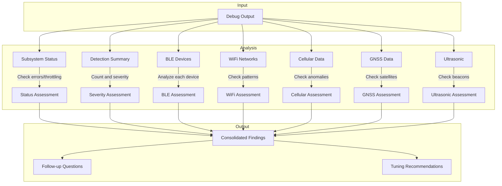
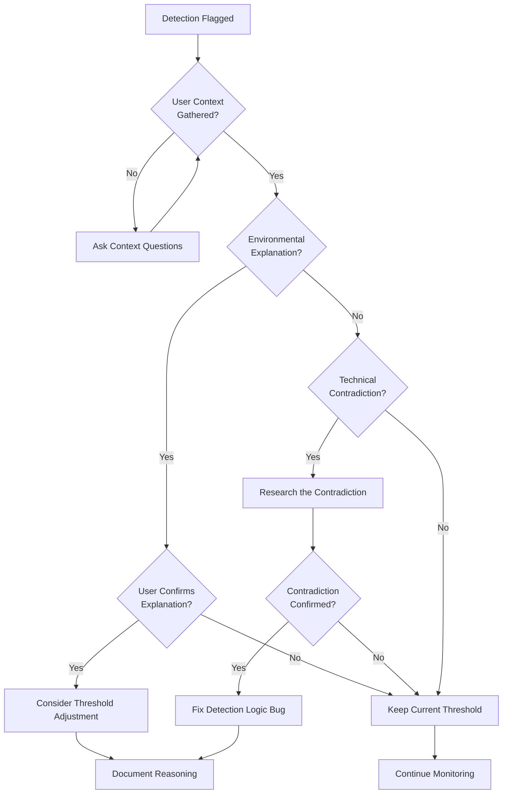

# CLAUDE_DETECTION_TUNING.md

## Purpose

This document provides instructions for LLMs analyzing detection debug output and tuning detection heuristics in the Flock-You surveillance detection application.

**Critical Principle**: Do NOT assume detections are false positives. Investigate thoroughly before adjusting thresholds. The goal is accurate detection, not suppression.

---

## Tuning Philosophy

### The Golden Rules

1. **Assume detections might be real** - Users install this app because they have legitimate concerns
2. **Research before dismissing** - A detection you don't understand isn't automatically wrong
3. **Ask the user for context** - Environmental factors matter enormously
4. **Err on the side of caution** - A false positive is annoying; a false negative could be dangerous
5. **Document your reasoning** - Every threshold change needs justification

### What We're Optimizing For

```
Detection Quality = True Positives + Appropriate Alerts
                    ─────────────────────────────────────
                    All Detections

NOT:
Detection Quality ≠ Minimum Alerts
```

We want **appropriate sensitivity**, not **minimum sensitivity**.

---

## Debug Output Analysis Protocol

When given debug output, follow this systematic analysis:

### Phase 1: Understand the Context (ASK FIRST)

Before analyzing ANY detection data, ask the user:

```markdown
## Context Questions

1. **Location Type**: Where were you during this scan?
   - [ ] Home/familiar location
   - [ ] Work
   - [ ] Public space (mall, airport, etc.)
   - [ ] Protest/demonstration
   - [ ] Near government building
   - [ ] Travel/unfamiliar area
   - [ ] Other: ___

2. **Time Context**: When did these detections occur?
   - [ ] During normal daily routine
   - [ ] During unusual activity
   - [ ] After noticing something suspicious
   - [ ] Random scan

3. **Concerns**: Why are you running this app?
   - [ ] General privacy awareness
   - [ ] Specific stalking/tracking concern
   - [ ] Journalist/activist threat model
   - [ ] Security research
   - [ ] Just curious

4. **Recent Events**: Anything unusual recently?
   - [ ] New relationship/breakup
   - [ ] Legal proceedings
   - [ ] Workplace issues
   - [ ] Protest attendance
   - [ ] Nothing notable

5. **Device Behavior**: Have you noticed anything odd?
   - [ ] Battery draining faster
   - [ ] Phone getting warm
   - [ ] Unexpected network activity
   - [ ] Strange sounds/notifications
   - [ ] Nothing unusual
```

**Do NOT skip this step.** Context determines whether a detection is concerning or benign.

### Phase 2: Parse the Debug Output

#### Section-by-Section Analysis



### Phase 3: Analyze Each Subsystem

#### 3.1 Cellular Anomalies Analysis

**What to look for:**

| Anomaly Type | Legitimate Causes | Suspicious Indicators |
|--------------|-------------------|----------------------|
| STATIONARY_CELL_CHANGE | Network load balancing, tower maintenance, edge of coverage | Multiple changes in short period, encryption downgrade, unknown MCC-MNC |
| ENCRYPTION_DOWNGRADE | Rural areas with only 2G, some international roaming | Urban area with good coverage, sudden downgrade from 5G/4G |
| SIGNAL_SPIKE | Moving closer to tower, exiting building | Stationary + sudden strong signal from unknown cell |
| RAPID_SWITCHING | Driving, train travel | Stationary + rapid switching |

**Questions to ask:**
- Were you moving or stationary?
- Is this your normal location?
- What carrier do you use?
- Have you seen these cell IDs before?

**DO NOT automatically reduce IMSI scores because:**
- 10-20% IMSI likelihood is still worth monitoring
- Real IMSI catchers often show subtle signatures
- Pattern over time matters more than single detection

**Research steps:**
1. Check cell ID against OpenCellID or CellMapper
2. Verify MCC-MNC matches user's carrier
3. Look for cell IDs with suspicious patterns (very low, sequential, round numbers)
4. Check if LAC/TAC is within normal range

#### 3.2 GNSS Anomalies Analysis

**What to look for:**

| Anomaly Type | Normal Causes | Attack Indicators |
|--------------|---------------|-------------------|
| MULTIPATH_SEVERE | Urban canyon, indoor, near water, parking garage | All constellations affected equally, no environmental explanation |
| SIGNAL_UNIFORMITY | Very open sky (rare) | Variance < 0.5 with diverse elevations |
| JAMMING_DETECTED | Near military base, prison (legal jammers) | Random location + signal loss |
| CLOCK_ANOMALY | Device issues, long time without fix | Sudden jump + position shift |

**Critical check for jamming false positives:**
```
IF satellite_count > 10 AND satellites_used_in_fix > 8:
    THEN jamming is EXTREMELY unlikely
    Research WHY jamming was flagged before dismissing
```

**Questions to ask:**
- Were you indoors, in a parking garage, or urban canyon?
- Were you near any large buildings or water?
- Did your navigation app work correctly?
- Did you notice your location jumping around?

**Research steps:**
1. Check satellite count - high count contradicts jamming
2. Check fix quality - good fix contradicts spoofing
3. Analyze constellation distribution - all affected = suspicious
4. Check C/N0 variance - too uniform = suspicious

#### 3.3 BLE Device Analysis

**For each unknown device, research:**

1. **MAC OUI lookup**: https://maclookup.app/
2. **Device name patterns**: Search for the name format
3. **Advertising behavior**: Normal rate is 1-10 pps

**Tracker detection logic:**
```
IF same_device_seen_at_multiple_user_locations:
    HIGH concern - this is following behavior
ELSE IF strong_signal_consistent_over_time:
    MEDIUM concern - may be in user's possession
ELSE IF weak_variable_signal:
    LOW concern - likely passing traffic
```

**Questions to ask:**
- Do you recognize any of these device names?
- Are any of these your devices or household members' devices?
- Have you been to multiple locations during this scan period?
- Do any devices appear at multiple of YOUR locations?

**DO NOT dismiss trackers just because:**
- They're common (AirTags are commonly used for stalking)
- Signal is weak (could be hidden in a bag)
- Name is generic (trackers often have generic names)

#### 3.4 WiFi Network Analysis

**Analyze each suspicious network:**

1. **SSID pattern check**: Does it match known surveillance patterns?
2. **OUI lookup**: What manufacturer?
3. **Location context**: Is this network expected here?

**Questions to ask:**
- Are you near any businesses that might have security cameras?
- Is this your home WiFi or a neighbor's?
- Have you seen this network at multiple locations?
- Are you near a police station, government building, or border crossing?

**For forensics device detections (Cellebrite, GrayKey):**
- Ask if user is near a police station or courthouse
- Ask if user recently crossed a border
- These are REAL threats if in unexpected locations

#### 3.5 Ultrasonic Analysis

**Beacon interpretation:**

| Frequency Range | Likely Source | Action |
|-----------------|---------------|--------|
| 17.5-18.5 kHz | SilverPush, Alphonso (ad tracking) | Check if watching TV with ads |
| 19-20 kHz | Shopkick, retail beacons | Check if in retail store |
| 20-21.5 kHz | Samba TV, smart TV ACR | Check if smart TV is on |
| Variable/unstable | Environmental noise | Likely false positive |

**Questions to ask:**
- Were you watching TV or had one on nearby?
- Were you in a retail store?
- Do you have a smart TV?
- Was this detected at multiple locations?

**Cross-location tracking is CRITICAL:**
- Same beacon frequency at home AND work = real tracking
- Same beacon only at one location = likely local source

---

## Threshold Tuning Guidelines

### When to INCREASE Sensitivity (Lower Thresholds)

Consider increasing sensitivity when:

1. **User has elevated threat model**
   - Journalist, activist, abuse survivor
   - Currently in legal dispute
   - Recent stalking concerns

2. **Detection patterns suggest real threats**
   - Same indicators appearing repeatedly
   - Correlations across protocols
   - Detections at multiple user locations

3. **User reports correlating observations**
   - "I noticed this after meeting with X"
   - "This appears when I go to Y location"
   - "My ex knows things they shouldn't"

### When to DECREASE Sensitivity (Raise Thresholds)

Consider decreasing sensitivity ONLY when:

1. **Clear environmental explanation exists**
   - User confirms they were in parking garage (multipath)
   - User confirms they were on a train (rapid cell switching)
   - User confirms smart TV was on (ultrasonic)

2. **Technical evidence contradicts detection**
   - 32 satellites in fix but "jamming detected" (impossible)
   - Strong signal + stable connection but "encryption downgrade" (verify this)

3. **User confirms benign source**
   - "That's my neighbor's Ring doorbell"
   - "That's my own AirTag"
   - "I work at that location with the forensics equipment"

### Threshold Change Protocol



---

## Common Analysis Scenarios

### Scenario 1: High GNSS Anomaly Count with Good Fix

**Debug shows:**
```
Satellites Used In Fix: 32
GNSS ANOMALIES: 24
- MULTIPATH_SEVERE x22
- JAMMING_DETECTED (70%)
```

**Analysis:**
- 32 satellites used = EXCELLENT fix
- Jamming at 70% with 32 satellites = IMPOSSIBLE
- This is a **detection logic bug**, not a threshold issue

**Action:**
- Research why jamming was flagged
- Likely the jamming check doesn't account for satellite count
- Fix the detection logic, don't just raise thresholds

**Questions to ask user:**
- Were you indoors or in an urban area? (explains multipath)
- Did your GPS navigation work correctly? (confirms good fix)

### Scenario 2: Multiple STATIONARY_CELL_CHANGE with Low IMSI Score

**Debug shows:**
```
CELLULAR ANOMALIES: 6
- STATIONARY_CELL_CHANGE (IMSI: 20%) - HIGH severity
- STATIONARY_CELL_CHANGE (IMSI: 10%) - HIGH severity
```

**Analysis:**
- LOW IMSI score + HIGH severity = **inverted logic**
- But don't just dismiss - 6 cell changes while stationary is unusual

**Questions to ask user:**
- Were you actually stationary during this time?
- Is this your normal location?
- Did you notice any call quality issues?

**Action:**
- Fix severity calculation (should match IMSI score)
- BUT keep the detection - multiple cell changes is worth monitoring
- Ask user to note if pattern continues

### Scenario 3: Tracker Detected

**Debug shows:**
```
Last Detection: AIRTAG - null
```

**NEVER automatically dismiss tracker detections.**

**Questions to ask user:**
- Do you own an AirTag?
- Do household members have AirTags?
- Has this AirTag been seen at multiple of YOUR locations?
- When did you first notice this AirTag?
- Have you checked your belongings for hidden trackers?

**If user doesn't own it and it's following them:**
- This is a CRITICAL alert
- Provide stalking resources
- Do NOT reduce sensitivity

### Scenario 4: Ultrasonic Beacon at Low Confidence

**Debug shows:**
```
ULTRASONIC ANOMALIES: 8
- RETAIL_BEACON (36% tracking likelihood)
```

**Analysis:**
- 36% is below typical alert threshold (40%)
- But 8 detections suggests persistent source

**Questions to ask user:**
- Where were you during these detections?
- Was a TV or radio on?
- Were you in a retail store?
- Have you seen this at multiple locations?

**Action:**
- If retail store: Expected, can lower user concern
- If home with TV: Likely Samba TV ACR, explain privacy implications
- If multiple locations with same frequency: INCREASE concern

---

## Research Tools and Resources

### For Cellular Analysis
- **OpenCellID**: https://opencellid.org/ - Cell tower database
- **CellMapper**: https://www.cellmapper.net/ - Crowdsourced cell data
- **MCC-MNC List**: https://mcc-mnc.com/ - Carrier code lookup

### For BLE/WiFi Analysis
- **MAC Lookup**: https://maclookup.app/ - OUI manufacturer lookup
- **Wireshark OUI**: https://www.wireshark.org/tools/oui-lookup.html
- **IEEE OUI**: https://standards-oui.ieee.org/

### For GNSS Analysis
- **GPS.gov**: https://www.gps.gov/ - Official GPS status
- **GNSS Planning**: https://www.gnssplanning.com/ - Satellite visibility

### For Surveillance Equipment
- **DeFlock**: https://deflock.me/ - Flock camera locations
- **EFF SLS**: https://www.eff.org/pages/cell-site-simulatorsimsi-catchers
- **ACLU StingRay**: https://www.aclu.org/issues/privacy-technology/surveillance-technologies/stingray-tracking-devices

---

## Output Format

After analysis, provide findings in this format:

```markdown
## Detection Analysis Report

### Context Summary
- Location type: [from user]
- Time period: [from debug]
- User threat model: [from user]

### Subsystem Findings

#### Cellular
- Status: [OK/CONCERN/INVESTIGATE]
- Key observations: [list]
- Questions for user: [list]
- Recommended action: [keep/adjust/fix]

#### GNSS
- Status: [OK/CONCERN/INVESTIGATE]
- Key observations: [list]
- Questions for user: [list]
- Recommended action: [keep/adjust/fix]

#### BLE
- Status: [OK/CONCERN/INVESTIGATE]
- Devices of interest: [list with reasoning]
- Questions for user: [list]
- Recommended action: [keep/adjust/fix]

#### WiFi
- Status: [OK/CONCERN/INVESTIGATE]
- Networks of interest: [list with reasoning]
- Questions for user: [list]
- Recommended action: [keep/adjust/fix]

#### Ultrasonic
- Status: [OK/CONCERN/INVESTIGATE]
- Key observations: [list]
- Questions for user: [list]
- Recommended action: [keep/adjust/fix]

### Threshold Recommendations

| Parameter | Current | Proposed | Justification |
|-----------|---------|----------|---------------|
| [param]   | [value] | [value]  | [reason]      |

### Detection Logic Issues Found
- [List any bugs or logic errors discovered]

### Follow-up Questions for User
1. [Question]
2. [Question]
3. [Question]

### Summary
[Overall assessment and next steps]
```

---

## What NOT to Do

### Never:

1. **Dismiss detections without investigation**
   - "This is probably just noise" ❌
   - "Let me research what could cause this" ✓

2. **Reduce all thresholds to minimize alerts**
   - "Let's raise all thresholds so users see fewer alerts" ❌
   - "Let's fix the logic so alerts are accurate" ✓

3. **Assume user is paranoid**
   - "You're probably worried about nothing" ❌
   - "Let me help you understand what this detection means" ✓

4. **Skip context gathering**
   - "Based on this data, reduce sensitivity" ❌
   - "Before I analyze this, can you tell me about your situation?" ✓

5. **Ignore correlations**
   - "These are separate unrelated detections" ❌
   - "I notice several detections around the same time - let's investigate the correlation" ✓

6. **Make changes without documentation**
   - `THRESHOLD = 50 // changed from 30` ❌
   - `THRESHOLD = 50 // Raised from 30 because: [detailed reasoning]` ✓

---

## Tuning Checklist

Before recommending any threshold changes:

- [ ] User context gathered (location, time, concerns)
- [ ] Each anomaly type researched individually
- [ ] Environmental explanations confirmed with user
- [ ] Technical contradictions verified in code
- [ ] Cross-subsystem correlations checked
- [ ] User confirmed any "benign" sources
- [ ] Changes documented with reasoning
- [ ] Considered impact on users with higher threat models
- [ ] Verified change won't mask real threats

---

## Example Analysis Session

**User provides debug output showing:**
- 14 HIGH threat detections
- Multiple STATIONARY_CELL_CHANGE
- Jamming at 70% with 32 satellites
- Tracker detection

**Correct approach:**

```
ASSISTANT: Before I analyze this debug output, I need some context:

1. Where were you during this scan? (home, work, public, etc.)
2. Were you moving or stationary?
3. Do you have any specific concerns that led you to use this app?
4. Do you own any Bluetooth trackers (AirTag, Tile, etc.)?
5. Was a TV or radio on during this time?

USER: I was at home, stationary. I've been worried my ex might be
tracking me. I don't own any trackers. TV was off.

ASSISTANT: Thank you for that context. Given your concerns about your ex,
I'm going to analyze this carefully.

**Immediate concern**: The tracker detection needs investigation. You
don't own trackers but one was detected. Can you tell me:
- Is this the first time you've seen this tracker?
- Have you scanned at other locations? Did it appear there too?
- Have you physically searched your belongings and car?

**Cellular analysis**: 6 cell changes while stationary at home is
unusual but could be network optimization. However, given your
situation, let's monitor if this pattern continues.

**GNSS note**: The jamming alert is a false positive - you have 32
satellites with a good fix. This is a detection logic issue, not a
real threat. I'll recommend fixing the code.

**My recommendations**:
1. DO NOT reduce tracker detection sensitivity
2. FIX the jamming detection logic (can't claim jamming with 32 sats)
3. MONITOR the cell changes - if they continue, investigate further
4. Please scan at another location and let me know if the tracker appears

For your safety, here's the National DV Hotline: 1-800-799-7233
```

---

*Document Version: 1.0*
*Last Updated: 2026-01-21*
*For use with Flock-You Android detection debug output*
