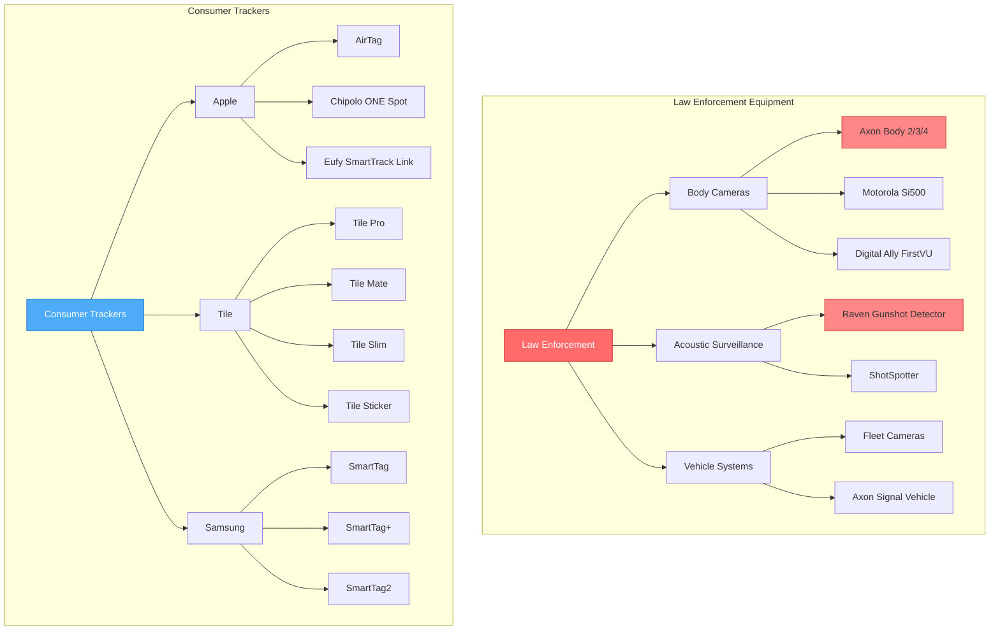
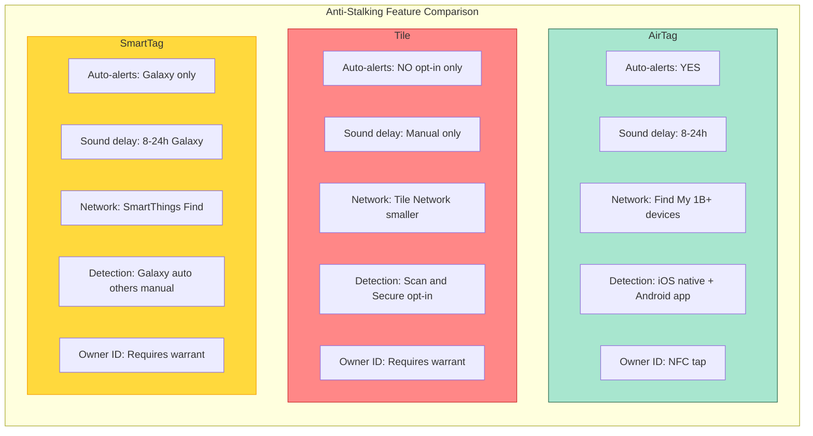
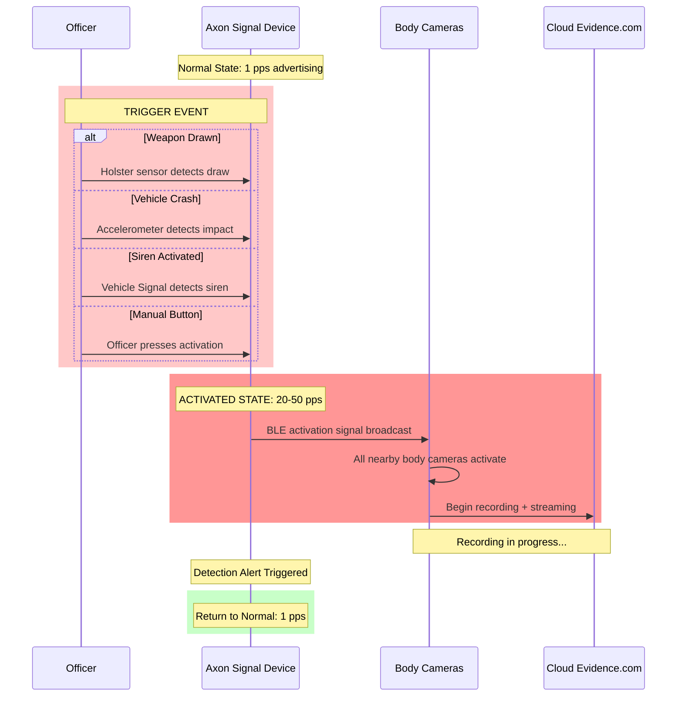
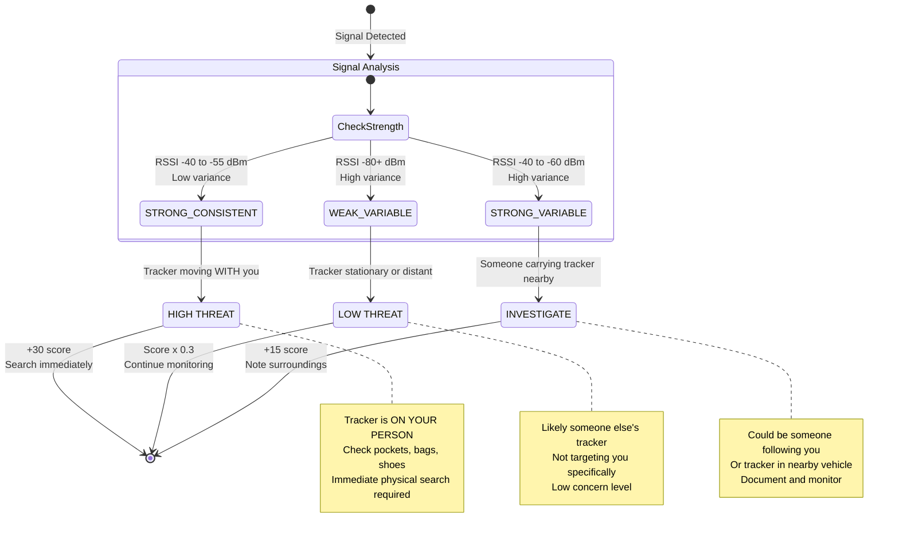
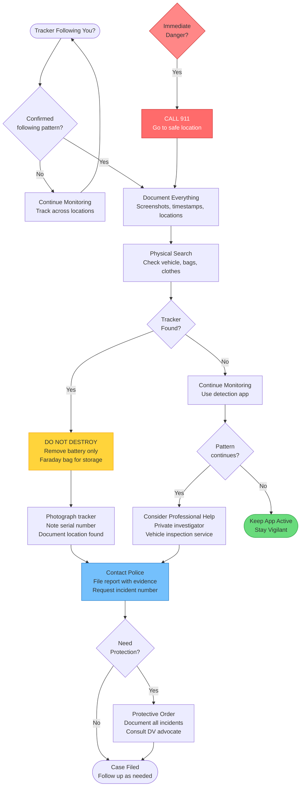
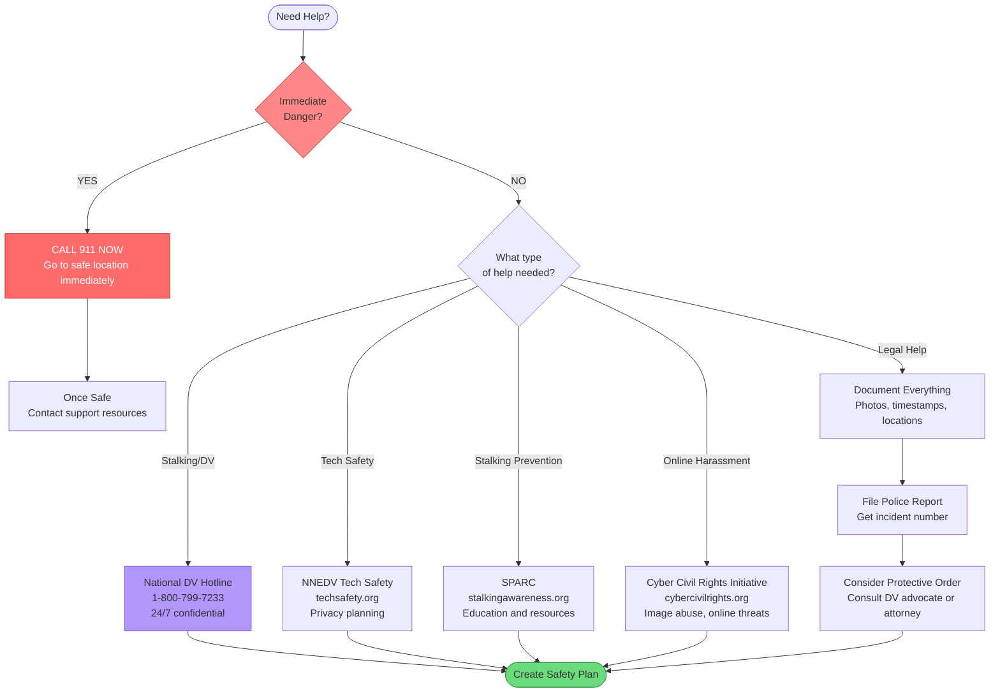

# BLE Tracker and Surveillance Device Detection System

## Table of Contents

1. [Overview](#1-overview)
2. [Consumer Tracker Detection](#2-consumer-tracker-detection)
3. [Surveillance Equipment Detection](#3-surveillance-equipment-detection)
4. [Stalking Detection Heuristics](#4-stalking-detection-heuristics)
5. [Threat Scoring System](#5-threat-scoring-system)
6. [Real-World Sources](#6-real-world-sources)
7. [Runbook: Responding to Detections](#7-runbook-responding-to-detections)
8. [Smart Home Device Context](#8-smart-home-device-context)
9. [MAC Randomization](#9-mac-randomization)
10. [Known Limitations](#10-known-limitations)

---

## 1. Overview

### Surveillance Equipment Detection Hierarchy



### The BLE Tracker Stalking Epidemic

Bluetooth Low Energy (BLE) trackers have revolutionized personal item tracking, but they have also become a tool for stalking, harassment, and unauthorized surveillance. The proliferation of cheap, long-lasting, and highly accurate tracking devices has created a significant public safety concern.

According to research and news reports, BLE trackers are increasingly used to:
- Track domestic violence victims
- Stalk former partners
- Monitor individuals without their consent
- Track vehicles for theft or surveillance
- Enable corporate espionage

### Types of Threats Detected

This system detects two primary categories of BLE-based threats:

#### Consumer Trackers (Stalking Risk)
- **Apple AirTag** - Uses the Find My network with 1 billion+ devices
- **Tile** (Pro, Mate, Slim, Sticker) - Independent tracking network with weaker anti-stalking features
- **Samsung SmartTag/SmartTag+** - SmartThings Find network, Galaxy-only alerts
- **Generic/AliExpress Trackers** - Often have NO anti-stalking features

#### Surveillance Equipment (Privacy Risk)
- **Axon Signal Sidearm** - Body camera activation triggers
- **Raven Gunshot Detector** - Audio surveillance with "human distress" detection
- **Police Body Cameras** - BLE-enabled recording devices
- **Cellebrite/GrayKey** - Mobile forensics devices

### Why Detection Matters

- **Anti-stalking protection**: Early detection can save lives
- **Privacy awareness**: Know when you are being recorded or tracked
- **Evidence preservation**: Proper documentation for legal proceedings
- **Personal safety**: Make informed decisions about your security

---

## 2. Consumer Tracker Detection

### Apple AirTag

**Manufacturer ID**: `0x004C` (Apple Inc.)

**Service UUID**: `7DFC9000-7D1C-4951-86AA-8D9728F8D66C` (Apple Find My)

**Detection Signatures**:
- Manufacturer data starting with `0x12` or `0x07` (Find My beacon type)
- Service UUID matching Apple Find My network
- Device name patterns: `(?i)^(airtag|find[_-]?my).*`

**Physical Characteristics**:
- Shape: Circular disc, white/silver
- Dimensions: 31.9mm x 8mm
- Weight: 11g
- Visual Identifiers: Apple logo, silver back, quarter-sized
- NFC Capable: Yes

**Range & Sound**:
- BLE Range: 30ft + UWB Precision Finding
- Sound Level: 60dB
- Battery: CR2032, ~1 year life

**MAC Address Rotation**:
- Rotates approximately every 15 minutes
- Detection relies on manufacturer data patterns, not MAC address

**Anti-Stalking Features**:
| Feature | Status |
|---------|--------|
| Auto-alerts victim | Yes (iOS native, Android via Tracker Detect app) |
| Plays sound automatically | Yes, 8-24 hours after separation from owner |
| Can be scanned by other apps | Yes |
| Owner info accessible | Yes, via NFC tap (partial phone number + serial) |

**NFC Owner Info Access**:
1. Hold AirTag near NFC reader on your phone
2. Tap the notification that appears
3. View partial phone number of owner
4. View serial number (useful for police reports)
5. Option to disable AirTag

**Threat Score**: 60 (base), adjusted based on stalking heuristics

**Stalking Risk Level**: HIGH
- Frequently used for stalking due to massive Find My network
- Long battery life enables extended tracking
- Small size makes concealment easy

---

### Tile (All Models)

**Manufacturer ID**: `0x00C7` (Tile)

**Service UUID**: `FEED0001-0000-1000-8000-00805F9B34FB`

**Models Detected**:

| Model | Range | Sound | Battery | Dimensions |
|-------|-------|-------|---------|------------|
| Tile Pro | 400ft | Loudest | CR2032, ~1 year | 42x42x6.5mm |
| Tile Mate | 250ft | Medium | CR1632, ~3 years | 38x38x7.2mm |
| Tile Slim | 250ft | Medium | Non-replaceable, ~3 years | 86x54x2.5mm (credit card) |
| Tile Sticker | 150ft | Quietest | Non-replaceable, ~3 years | 27mm x 7.3mm |

**Detection Signatures**:
- Manufacturer ID `0x00C7` in advertising data
- Service UUID `FEED0001-...`
- Device name patterns: `(?i)^tile[_-]?(mate|pro|slim|sticker)?.*`

**CRITICAL: WEAKER Anti-Stalking Features**:
| Feature | Status |
|---------|--------|
| Auto-alerts victim | **NO** (opt-in "Scan and Secure" only) |
| Plays sound automatically | **NO** (must manually trigger) |
| Can be scanned by other apps | Yes |
| Owner info accessible | **NO** (must contact Tile/police with warrant) |

**Why Tile is Higher Risk**:
- Victims are NOT automatically notified of unknown trackers
- No automatic sound playback for separation
- Must actively opt-in to "Scan and Secure" feature
- No NFC for owner identification
- Requires law enforcement involvement to identify owner

**Confirmation Methods**:
1. Use Tile "Scan and Secure" feature (requires opt-in)
2. Press Tile button 3x to make it ring
3. Physical search - Tile Slim is credit-card sized, check wallets
4. Cannot tap to identify owner (no NFC)

**Threat Score**: 55 (base)

**Stalking Risk Level**: CRITICAL
- Rated CRITICAL because of weak/non-existent victim alerting
- Higher risk than AirTag despite smaller network

---

### Samsung SmartTag

**Manufacturer ID**: `0x0075` (Samsung)

**Service UUID**: `0000FD5A-0000-1000-8000-00805F9B34FB`

**Models Detected**:

| Model | Range | Sound | UWB | Battery Life |
|-------|-------|-------|-----|--------------|
| SmartTag | 390ft | 89dB | No | ~300 days |
| SmartTag+ | 390ft + UWB | 89dB | Yes | ~165 days |
| SmartTag2 | 390ft | Medium | No | ~500 days |

**Detection Signatures**:
- Manufacturer ID `0x0075` in advertising data
- Service UUID `0000FD5A-...`
- Device name patterns: `(?i)^(smart[_-]?tag|galaxy[_-]?tag).*`

**LIMITATION: Galaxy-Only Alerts**:
| Feature | Status |
|---------|--------|
| Auto-alerts victim | **Galaxy phones only** |
| Plays sound automatically | Yes, 8-24 hours (Galaxy only) |
| Can be scanned by other apps | Yes |
| Owner info accessible | No (Samsung provides to law enforcement with warrant) |

**The Galaxy-Only Problem**:
- "Unknown Tag Detected" alerts only work on Samsung Galaxy phones
- iPhone users, Pixel users, and other Android users do NOT get automatic alerts
- Must download "SmartThings Find" app to scan manually

**UWB Capabilities (SmartTag+)**:
- Ultra-Wideband for precision finding
- AR-based directional finding on compatible Galaxy phones
- More accurate than BLE-only tracking

**Confirmation Methods**:
1. Galaxy phones: "Unknown Tag Detected" auto-alerts
2. Use SmartThings app to scan
3. Non-Galaxy: Download "SmartThings Find" app
4. Press button to ring
5. SmartTag+ AR finder on compatible Galaxy devices

**Threat Score**: 55 (base)

**Stalking Risk Level**: MEDIUM
- Better than Tile due to automatic alerts (on Galaxy)
- Limited by Galaxy-only ecosystem

---

### Tracker Comparison Diagram



| Feature | AirTag | Tile | SmartTag |
|---------|--------|------|----------|
| **Auto-alerts victim** | Yes (iOS + Android) | NO (opt-in only) | Galaxy phones only |
| **Sound delay** | 8-24 hours auto | Manual trigger only | 8-24 hours (Galaxy) |
| **Network size** | 1B+ Find My devices | Smaller Tile network | SmartThings network |
| **Detection method** | iOS native, Android app | Scan and Secure (opt-in) | Galaxy auto, others manual |
| **Owner identification** | NFC tap (partial info) | Requires warrant | Requires warrant |
| **Stalking Risk** | HIGH | CRITICAL | MEDIUM |

### Other Trackers

#### Chipolo ONE Spot
- Range: 200ft + Apple Find My network
- Sound: 120dB (loudest of all trackers)
- Battery: CR2032, ~2 years
- Find My compatible: Gets Apple's anti-stalking features

#### Eufy SmartTrack Link
- Range: 262ft + Apple Find My network
- Sound: Moderate
- Battery: CR2032, ~1 year
- Find My compatible: Gets Apple's anti-stalking features

#### Pebblebee Clip/Card
- Range: 500ft
- Sound: Moderate
- Battery: USB rechargeable, ~6 months
- Independent network

#### Generic/AliExpress Trackers
- Range: 100-200ft typically
- Sound: Usually quiet or none
- Battery: CR2032, 6-12 months
- **WARNING: Often have NO anti-stalking features**
- Harder to detect and identify
- No owner accountability

**Detection Pattern**: `(?i)^(chipolo|nut[_-]?find|pebblebee|cube[_-]?tracker).*`

**Threat Score**: 50 (generic trackers)

---

## 3. Surveillance Equipment Detection

### Axon Signal Sidearm

**What It Is**:
Axon Signal is a body camera activation system used by law enforcement. Signal devices are installed in police vehicles, holsters, and other equipment.

**Detection Method**: Advertising Rate Spike Detection

**Normal vs. Activated Behavior**:

| State | Advertising Rate | Meaning |
|-------|------------------|---------|
| Standby | ~1 packet/second | Officer on patrol, no active engagement |
| Activated | 20-50+ packets/second | Active police engagement |

**What Triggers Activation**:
- Police siren activated (Signal Vehicle)
- Weapon drawn from holster (Signal Sidearm)
- Vehicle crash or rapid deceleration (Signal Vehicle)
- Manual activation button pressed
- Door open while in pursuit mode

**Detection Thresholds** (from code):
```kotlin
const val ADVERTISING_RATE_SPIKE_THRESHOLD = 20f  // packets per second
const val NORMAL_ADVERTISING_RATE = 1f            // packets per second
const val RATE_CALCULATION_WINDOW_MS = 5000L      // 5 second window
```

**Manufacturer IDs Checked**:
- `0x0059` - Nordic Semiconductor (common in Axon devices)
- `0x004C` - Apple (BLE wrapper)

**Privacy Implications**:
When Signal activates, it triggers ALL nearby Axon body cameras to start recording automatically. This means:
- Multiple body cameras are likely recording
- Dash cameras in the vicinity are likely recording
- Your presence, appearance, and actions may be captured
- Footage is stored on Axon's Evidence.com cloud platform
- Retention period varies by department (typically 60-180 days)

**Threat Score**: 85-95 (CRITICAL when activated)

### Axon Signal Activation Sequence



**Adjusted Scoring Based on Patterns**:
- Recurring location + 2+ previous activations: Score reduced to 85 (likely patrol route)
- 5+ activations in 24h: Score reduced to 80 (likely equipment testing)
- Late night (00:00-06:00) + high rate: Score 100 (critical)

---

### Raven Gunshot Detector

**Manufacturer**: Flock Safety / SoundThinking

**What It Is**:
Raven devices are solar-powered acoustic surveillance systems that continuously monitor audio using AI to detect:
1. **Gunfire Detection** (Primary purpose)
2. **"Human Distress" Detection** (Announced October 2025) - listens for screaming, shouting, calls for help

**Detection Method**: Service UUID Matching

**Service UUIDs** (based on GainSec research):

| UUID | Name | Data Exposed | Firmware |
|------|------|--------------|----------|
| `0000180a-...` | Device Information | Serial, model, firmware, manufacturer | All |
| `00003100-...` | GPS Location | Lat, lon, altitude, GPS fix status | 1.2.x+ |
| `00003200-...` | Power Management | Battery level, charging, solar input | 1.2.x+ |
| `00003300-...` | Network Status | LTE signal, carrier, data usage, WiFi | 1.2.x+ |
| `00003400-...` | Upload Statistics | Bytes uploaded, detection count, last upload | 1.3.x |
| `00003500-...` | Error/Diagnostics | Error codes, system health | 1.3.x |
| `00001809-...` | Health Thermometer (Legacy) | Device temperature | 1.1.x |
| `00001819-...` | Location/Navigation (Legacy) | Basic location | 1.1.x |

**BLE Vulnerability (GainSec Research)**:
Raven devices expose sensitive data via Bluetooth without authentication:
- Exact GPS coordinates of the sensor
- Battery and solar power status
- Cellular network information
- Upload statistics and detection counts
- System diagnostics and errors

This vulnerability allows mapping of the surveillance network.

**Firmware Version Detection**:
```kotlin
fun estimateRavenFirmwareVersion(serviceUuids: List<UUID>): String {
    return when {
        hasUpload || hasError -> "1.3.x (Latest - Full diagnostics)"
        hasGps && hasPower -> "1.2.x (GPS + Power monitoring)"
        hasLegacyHealth || hasLegacyLocation -> "1.1.x (Legacy firmware)"
        else -> "Unknown version"
    }
}
```

**Audio Surveillance Capabilities**:
- Captures sound omnidirectionally
- Can hear through walls and obstacles
- Records in 5-second clips
- AI determines what constitutes "distress"
- Audio clips transmitted to Flock's cloud
- Law enforcement receives alerts without warrant

**Civil Liberties Concerns**:
- First Amendment: Chilling effect on public speech
- Fourth Amendment: Warrantless audio surveillance
- No consent from recorded individuals
- Disproportionate deployment in minority communities
- "Human distress" is subjective and prone to bias
- False positives can trigger armed police response

**Threat Score**: 100 (CRITICAL)

---

### Police Body Cameras

**BLE-Enabled Models Detected**:

#### Axon Body Cameras
- Detection patterns: `(?i)^axon[_-]?.*`, `(?i)^(body|flex)[_-]?[234]?[_-]?.*`, `(?i)^ab[234][_-]?.*`
- Manufacturer: Axon Enterprise
- Threat Score: 80

#### Motorola Body Cameras
- Detection patterns: `(?i)^(moto|si)[_-]?[v][_-]?[0-9]+.*`, `(?i)^watchguard[_-]?.*`
- Manufacturer: Motorola Solutions / WatchGuard
- Threat Score: 80

#### Digital Ally Body Cameras
- Detection patterns: `(?i)^(da|firstvu)[_-]?.*`
- Manufacturer: Digital Ally
- Threat Score: 75

**Capabilities**:
- Video and audio recording
- GPS location logging
- Automatic activation triggers (via Signal)
- Real-time streaming capability
- Night vision/low-light recording

**Privacy Concerns**:
- Records bystanders without consent
- Footage retention varies (30 days to years)
- Can be used for facial recognition
- Officers can review before writing reports
- Release policies often favor police

---

## 4. Stalking Detection Heuristics

The system uses multiple behavioral heuristics to determine if a tracker is being used for stalking.

### Tracker Stalking Detection Flow

```mermaid
flowchart TD
    START([Tracker Detected]) --> TRACK[Track across locations]
    TRACK --> LOC{3+ distinct<br/>locations?}

    LOC -->|No| MONITOR[Continue monitoring]
    MONITOR --> TRACK

    LOC -->|Yes| DUR{Duration<br/>> 30 min?}

    DUR -->|No| LOW_SCORE[Add +20 to score]
    LOW_SCORE --> RSSI_CHECK

    DUR -->|Yes| MED_SCORE[Add +40 to score<br/>Add +25 duration bonus]
    MED_SCORE --> RSSI_CHECK

    RSSI_CHECK{RSSI<br/>consistent?<br/>-40 to -55 dBm}

    RSSI_CHECK -->|Yes - Strong & Consistent| POSS[+"30 Possession Signal"<br/>Tracker ON YOUR PERSON]
    RSSI_CHECK -->|No - Weak & Variable| PASS[Score x 0.3<br/>Likely passing by]
    RSSI_CHECK -->|Strong but Variable| INVEST[+"15 Following pattern"]

    POSS --> CALC[Calculate Final<br/>Suspicion Score]
    PASS --> CALC
    INVEST --> CALC

    CALC --> ALERT{Score Level?}

    ALERT -->|80-100| CRIT[/CRITICAL ALERT/]
    ALERT -->|60-79| HIGH[/HIGH ALERT/]
    ALERT -->|40-59| MED[/MEDIUM - Investigate/]
    ALERT -->|20-39| LOW_A[/LOW - Monitor/]
    ALERT -->|0-19| MIN[/MINIMAL - Passing/]

    style CRIT fill:#ff6b6b,stroke:#c92a2a,color:#fff
    style HIGH fill:#ff922b,stroke:#e8590c,color:#fff
    style MED fill:#ffd43b,stroke:#f59f00
    style LOW_A fill:#74c0fc,stroke:#1971c2
    style MIN fill:#69db7c,stroke:#2f9e44
    style POSS fill:#ff8787,stroke:#c92a2a
```

### Heuristic 1: Multiple Locations (CRITICAL)

**Condition**: Same tracker detected at 3+ distinct locations

**Thresholds** (from code):
```kotlin
val MIN_LOCATIONS_FOR_FOLLOWING = 3
val SAME_LOCATION_RADIUS_METERS = 50.0
val MIN_TIME_BETWEEN_LOCATIONS_MINUTES = 5
```

**Interpretation**: Tracker is FOLLOWING you - not a coincidence

**Suspicion Score Contribution**: +40 points

**What It Means**:
- The tracker is moving WITH you
- Not staying at a fixed location
- Strong indicator of deliberate tracking

---

### Heuristic 2: Extended Duration (HIGH)

**Condition**: Same tracker present for 30+ minutes while you are moving

**Threshold** (from code):
```kotlin
val SUSPICIOUS_DURATION_MINUTES = 30
```

**Interpretation**: Tracker is moving with you, likely hidden in your belongings

**Suspicion Score Contribution**:
- 30+ minutes: +25 points
- 15-30 minutes: +10 points

---

### Heuristic 3: RSSI Analysis - Possession Signal (CRITICAL)

#### RSSI Analysis State Diagram



**Condition**: Strong signal (-40 to -60 dBm) with low variance

**Thresholds** (from code):
```kotlin
val TRACKER_POSSESSION_RSSI = -55
val LOW_RSSI_VARIANCE_THRESHOLD = 10.0
```

**RSSI Reference**:
| RSSI Value | Meaning |
|------------|---------|
| -40 dBm | Very close (< 1 meter) |
| -50 dBm | Immediate proximity |
| -55 dBm | On your person / in your bag |
| -70 dBm | Nearby (few meters) |
| -80 dBm | Moderate distance |
| -90 dBm | Far / weak signal |

**Low Variance Interpretation**:
- Low variance = signal strength is consistent = tracker moving with you
- High variance = signal fluctuating = tracker stationary or passing

**Interpretation**: Tracker is ON YOUR PERSON - check pockets, bags, shoes immediately

**Suspicion Score Contribution**: +30 points

---

### Heuristic 4: Weak Fluctuating Signal (MINIMAL)

**Condition**: Weak signal with high variance

**Interpretation**: Passing tracker, not targeting you

**Score Adjustment**: Multiply score by 0.3 (70% reduction)

---

### Heuristic 5: Home Departure Pattern (CRITICAL)

**Condition**: Tracker appears when leaving home

**Interpretation**: Planted at home or on vehicle

**Action Required**:
- Check vehicle thoroughly
- Consider home security review
- Note who has had access to your home

---

### Heuristic 6: Person Correlation (CRITICAL)

**Condition**: Tracker disappears when a specific person leaves

**Interpretation**: That person owns or planted the tracker

**Action Required**:
- Document the pattern
- May indicate domestic violence situation
- Contact support resources

---

### Suspicion Score Calculation

The system calculates a suspicion score (0-100) using the following formula:

```kotlin
var suspicionScore = 0

// Location-based scoring
if (distinctLocations >= 3) suspicionScore += 40
else if (distinctLocations >= 2) suspicionScore += 20

// Duration-based scoring
if (durationMinutes >= 30) suspicionScore += 25
else if (durationMinutes >= 15) suspicionScore += 10

// Proximity-based scoring
if (isPossessionSignal) suspicionScore += 30
else if (avgRssi > -60) suspicionScore += 15

// Reduce for passing traffic
if (isPassingBy && distinctLocations < 2) {
    suspicionScore = (suspicionScore * 0.3).toInt()
}
```

---

## 5. Threat Scoring System

### How Tracker Threat Scores Are Calculated

**Base Threat Scores by Device Type**:

| Device Type | Base Score | Risk Level |
|-------------|------------|------------|
| Apple AirTag | 60 | HIGH |
| Tile Tracker | 55 | CRITICAL (weak anti-stalking) |
| Samsung SmartTag | 55 | MEDIUM |
| Generic BLE Tracker | 50 | HIGH (no anti-stalking) |
| Axon Signal (activated) | 95 | CRITICAL |
| Raven Gunshot Detector | 100 | CRITICAL |
| Cellebrite Forensics | 95 | CRITICAL |

### Score Adjustment Based on Stalking Analysis

```kotlin
val adjustedThreatScore = when {
    analysis.suspicionScore >= 80 -> maxOf(threatScore, 90)  // Critical - likely stalking
    analysis.suspicionScore >= 60 -> maxOf(threatScore, 75)  // High - suspicious
    analysis.suspicionScore >= 40 -> maxOf(threatScore, 60)  // Medium - investigate
    analysis.isPassingBy -> minOf(threatScore, 30)           // Reduce for passing traffic
    else -> threatScore
}
```

### Suspicion Levels and Actions

| Score Range | Level | Color | Action |
|-------------|-------|-------|--------|
| 80-100 | CRITICAL | RED | Call 911 if danger. Document. Contact hotline. |
| 60-79 | HIGH | ORANGE | Search belongings/vehicle. Document. Consider police. |
| 40-59 | MEDIUM | YELLOW | Monitor across locations. Casual search. |
| 20-39 | LOW | BLUE | Keep scanning. Monitor for reappearance. |
| 0-19 | MINIMAL | GREEN | Likely passing tracker. Continue monitoring. |

### Recommendation Levels

```kotlin
enum class TrackerRecommendation {
    CONTACT_AUTHORITIES,  // Score >= 80
    LOCATE_AND_DISABLE,   // Score >= 60
    INVESTIGATE,          // Score >= 40
    MONITOR,              // Score >= 20
    IGNORE                // Score < 20
}
```

---

## 6. Real-World Sources

### Apple AirTag Stalking Reports

- **EFF Investigation**: [How Flock Safety Cameras Can Be Used to Track Your Car](https://www.eff.org/deeplinks/2024/03/how-flock-safety-cameras-can-be-used-track-your-car)
- **Apple Safety Documentation**: [What to do if you get an alert that an AirTag is with you](https://support.apple.com/en-us/HT212227)
- **Vice News**: Coverage of AirTag stalking cases and police reports

### Tile Anti-Stalking Criticism

- **Tile "Scan and Secure"**: Opt-in only feature, not automatic
- **Consumer Reports**: Analysis of tracker anti-stalking features
- **Life360 Acquisition**: Privacy concerns following Tile acquisition

### Academic Research on Tracker Abuse

- **University Studies**: Domestic violence advocates report increasing tracker-facilitated stalking
- **NNEDV (National Network to End Domestic Violence)**: Tech safety resources at techsafety.org

### Raven/ShotSpotter Research

- **GainSec Research**: BLE vulnerability analysis exposing GPS, battery, and network data
- **October 2025 Announcement**: Flock Safety's "human distress" detection expansion
- **ACLU Reports**: Civil liberties concerns about acoustic surveillance

### News Coverage of Stalking Cases

- **Multiple news outlets**: Documented cases of AirTag stalking
- **Police department reports**: Increasing reports of tracker-based stalking
- **Court cases**: Legal precedents for tracker-based stalking charges

### Manufacturer Safety Documentation

- **Apple**: [AirTag and Find My Safety](https://www.apple.com/newsroom/2022/02/an-update-on-airtag-and-unwanted-tracking/)
- **Samsung**: SmartThings Find privacy documentation
- **Tile**: Scan and Secure feature documentation

### Cell Site Simulator Information

- **EFF**: [Cell Site Simulators/IMSI Catchers](https://www.eff.org/pages/cell-site-simulatorsimsi-catchers)
- **ACLU**: [Stingray Tracking Devices](https://www.aclu.org/issues/privacy-technology/surveillance-technologies/stingray-tracking-devices)

### Mobile Forensics

- **EFF**: [Cellebrite Information](https://www.eff.org/pages/cellebrite)
- **Vice**: [GrayKey iPhone Unlocker](https://www.vice.com/en/article/graykey-iphone-unlocker-goes-on-sale-to-cops/)

---

## 7. Runbook: Responding to Detections

### If Tracker Detected

#### Step 1: Document Everything
- Take screenshots with timestamps and locations
- Note the MAC address, device type, and signal strength
- Record the time and your location
- Do NOT destroy the tracker - it is evidence

#### Step 2: Physical Search Locations

### Physical Search Locations Diagram

```mermaid
graph TB
    subgraph VEHICLE["Vehicle Search Locations"]
        direction TB
        V1[Wheel Wells<br/>magnetic cases]
        V2[Front/Rear Bumpers<br/>inside cavities]
        V3[OBD-II Port Area<br/>under dashboard]
        V4[Trunk/Cargo Area<br/>under liner]
        V5[Under Seats<br/>in seat tracks]
        V6[Glove Compartment<br/>hidden areas]
        V7[Sun Visor<br/>behind mirror]
        V8[Fuel Door Area]
    end

    subgraph PERSONAL["Personal Items Search"]
        direction TB
        P1[Bag Pockets<br/>all compartments]
        P2[Jacket Lining<br/>seams and hems]
        P3[Shoes<br/>heel area, insoles]
        P4[Wallet<br/>Tile Slim sized]
        P5[Coat Pockets<br/>inner and outer]
        P6[Hat/Cap<br/>inner band]
    end

    subgraph ITEMS["Commonly Tracked Items"]
        direction TB
        I1[Phone Case<br/>between case and phone]
        I2[Laptop Bag<br/>all pockets]
        I3[Luggage<br/>exterior pockets]
        I4[Keychain<br/>attached trackers]
        I5[Pet Items<br/>collar, leash]
        I6[Backpack<br/>hidden pockets]
    end

    SEARCH([Start Physical Search]) --> VEHICLE
    SEARCH --> PERSONAL
    SEARCH --> ITEMS

    style VEHICLE fill:#ffec99,stroke:#f59f00
    style PERSONAL fill:#b2f2bb,stroke:#2f9e44
    style ITEMS fill:#a5d8ff,stroke:#1971c2
    style V1 fill:#ff8787,stroke:#c92a2a
    style V2 fill:#ff8787,stroke:#c92a2a
    style V3 fill:#ff8787,stroke:#c92a2a
```



**Common hiding spots** (from code - `physicalCharacteristics.commonHidingSpots`):

**For AirTags**:
- Car wheel wells (magnetic cases available)
- Bag pockets and lining
- Jacket pockets
- Phone cases
- Keychains
- Shoes (heel area)
- OBD-II port area
- Under car seats
- Luggage

**For Tiles**:
- Wallets (Tile Slim)
- Key rings
- Bag pockets
- Stuck to objects (Sticker)
- Car interior
- Coat linings

**For SmartTags**:
- Keychains
- Bags/pockets
- Car interior
- Pet collars
- Luggage

#### Step 3: Confirmation Methods by Tracker Type

**AirTag Confirmation**:
1. Use Apple "Tracker Detect" app (free on Android)
2. NFC tap AirTag to see owner info and serial
3. Wait for automatic sound (8-24 hours)
4. iPhone: Look for "AirTag Found Moving With You" notification
5. iPhone 11+: Use Precision Finding

**Tile Confirmation**:
1. Use Tile "Scan and Secure" feature (opt-in required)
2. Press Tile button 3x to make it ring
3. Tile Slim is credit-card sized - check wallets
4. Cannot tap to identify (no NFC)

**SmartTag Confirmation**:
1. Galaxy: "Unknown Tag Detected" auto-alerts
2. Use SmartThings app to scan
3. Non-Galaxy: Download "SmartThings Find" app
4. Press button to ring
5. SmartTag+ AR finder on Galaxy

#### Step 4: Evidence Preservation
- Photograph the tracker BEFORE removing the battery
- Note the serial number if visible
- Use a Faraday bag or metal container to stop transmission
- Do NOT destroy or throw away the tracker

---

### If Stalking Suspected

### Stalking Response Flowchart



#### Immediate Actions (from code - `StalkingResponseGuidance.immediateActions`):

1. **DOCUMENT** - Screenshots with timestamps/locations
2. **DO NOT DESTROY** - It's evidence. Removing battery is OK.
3. **If in danger, call 911**
4. **Faraday bag/metal container** stops transmission
5. **Note who had access** to your belongings/vehicle/home

#### What NOT To Do (from code - `StalkingResponseGuidance.whatNotToDo`):

- **DO NOT confront stalker directly** - can escalate to violence
- **DO NOT destroy tracker before documenting** - evidence is critical
- **DO NOT ignore repeated detections** - pattern indicates targeting
- **DO NOT post on social media** - alerts stalker you are aware

#### Support Resources (from code - `StalkingResponseGuidance.supportResources`):

### Support Resources Flowchart



| Resource | Contact |
|----------|---------|
| **National Domestic Violence Hotline** | **1-800-799-7233** (24/7) |
| SPARC (Stalking Prevention) | stalkingawareness.org |
| Cyber Civil Rights Initiative | cybercivilrights.org |
| Tech Safety (NNEDV) | techsafety.org |

#### Law Enforcement Contact

1. **Non-emergency line** for documentation
2. Bring screenshots and documentation
3. Request incident number for records
4. Ask about protective orders if appropriate

#### Protective Orders

- Document all incidents with dates, times, locations
- Consult with domestic violence advocate
- Consider consulting an attorney
- Keep records of all communications

---

## 8. Smart Home Device Context

### Ring (Amazon) Privacy Concerns

**From code** (`smartHomeProfiles`):

| Attribute | Value |
|-----------|-------|
| Manufacturer | Ring (Amazon) |
| Law Enforcement Sharing | **YES** |
| Details | 2,500+ police partnerships. Can request footage without user consent. |
| Retention | 60 days |

**Recommendations**:
- Disable Neighbors app
- Minimize cloud storage
- Review sharing settings

**Threat Score**: 40

---

### Nest (Google) Data Practices

| Attribute | Value |
|-----------|-------|
| Manufacturer | Google/Nest |
| Law Enforcement Sharing | **YES** |
| Details | Can share via legal process. Always-on microphones. |
| Retention | 30 days (paid) |

**Recommendations**:
- Review Google Activity settings
- Disable "Familiar face" detection

**Threat Score**: 35

---

### Eufy (Anker) Concerns

| Attribute | Value |
|-----------|-------|
| Manufacturer | Eufy/Anker |
| Law Enforcement Sharing | Claimed NO |
| Details | **Claims "local only" but caught sending thumbnails to cloud (2022).** |
| Storage | Local |

**Recommendations**:
- Be skeptical of "local only" claims
- Monitor network traffic

**Threat Score**: 35

---

### Blink (Amazon) Concerns

| Attribute | Value |
|-----------|-------|
| Manufacturer | Blink (Amazon) |
| Law Enforcement Sharing | **YES** |
| Details | Same as Ring - Amazon ownership. |
| Retention | 60 days |

**Recommendations**:
- Use local Sync Module
- Same concerns as Ring

**Threat Score**: 40

---

### Which Devices Share with Law Enforcement

| Device | Shares with LE | Method |
|--------|----------------|--------|
| Ring | Yes | Neighbors app, direct requests |
| Blink | Yes | Amazon ownership |
| Nest/Google | Yes | Legal process |
| ADT | Yes | Professional monitoring |
| Vivint | Yes | Professional monitoring |
| Wyze | Unknown | Cloud-dependent |
| Eufy | Claimed No | But caught sending to cloud |
| Arlo | Unknown | Cloud storage |

---

## 9. MAC Randomization

### How Trackers Rotate Addresses

Modern BLE trackers rotate their MAC addresses to prevent simple tracking:

| Tracker | Rotation Interval |
|---------|-------------------|
| Apple AirTag | ~15 minutes |
| Tile | ~10-15 minutes |
| Samsung SmartTag | ~15 minutes |
| Generic | Varies |

**From code** (`MacRandomizationContext`):
```kotlin
val explanation = "Modern trackers rotate MACs (~15 min) but are identified by
payload, manufacturer data, service UUIDs, and timing."
```

### How Detection Still Works

Despite MAC randomization, detection remains effective through:

1. **Manufacturer Data Patterns**
   - Apple devices include manufacturer ID `0x004C`
   - Tile includes manufacturer ID `0x00C7`
   - Samsung includes manufacturer ID `0x0075`

2. **Service UUIDs**
   - Find My: `7DFC9000-7D1C-4951-86AA-8D9728F8D66C`
   - Tile: `FEED0001-0000-1000-8000-00805F9B34FB`
   - SmartTag: `0000FD5A-0000-1000-8000-00805F9B34FB`

3. **Payload Patterns**
   - Specific byte sequences in advertising data
   - Type codes that identify device class

4. **Temporal Correlation**
   - Tracking signal strength patterns over time
   - Correlating disappearance of old MAC with appearance of new MAC
   - Location continuity analysis

### Signature-Based Tracking

The system identifies trackers by their "signature" rather than MAC address:

```kotlin
private fun isLikelyAirTag(manufacturerData: String): Boolean {
    if (manufacturerData.length < 4) return false
    val typeBytes = manufacturerData.take(4)
    return typeBytes.startsWith("12") || typeBytes.startsWith("07") ||
            typeBytes.startsWith("1207") || typeBytes.startsWith("0712")
}
```

---

## 10. Known Limitations

### Trackers That Cannot Be Detected

1. **GPS-Only Trackers**
   - Devices that use only cellular/GPS (no Bluetooth)
   - LTE-connected trackers without BLE advertising
   - Satellite-based trackers

2. **Passive RFID Tags**
   - Tags that only respond when interrogated
   - Do not actively broadcast

3. **Extremely Short-Range Devices**
   - NFC-only tags
   - Devices with minimal broadcast range

4. **Custom/Modified Trackers**
   - Devices with removed/disabled BLE
   - Trackers programmed to not advertise

### Time Delays in Detection

1. **Rate Limiting**
   - Same device: 30-second cooldown between detections
   - Prevents alert fatigue but may delay detection

2. **Stalking Pattern Detection**
   - Requires multiple sightings at different locations
   - Minimum 5 minutes between location visits to count as "new"
   - 24-hour analysis window

3. **AirTag Sound Delay**
   - Apple's sound alert: 8-24 hours after separation
   - Not immediate notification

### Platform Limitations

1. **Android BLE Scanning Restrictions**
   - Background scanning limited by Android power management
   - Location permission required for BLE scanning
   - Some devices throttle BLE scans

2. **Cross-Platform Alert Gaps**
   - Samsung SmartTag alerts: Galaxy only
   - Apple AirTag alerts: Best on iOS
   - Tile alerts: Opt-in only

3. **Manufacturer Data Availability**
   - Some devices may not expose manufacturer data
   - BLE scan records vary by Android version

### Detection Confidence Levels

| Detection Method | Confidence | Notes |
|------------------|------------|-------|
| Service UUID Match | HIGH (85%+) | Strong identifier |
| Manufacturer ID Match | MEDIUM-HIGH (75%) | Could be legitimate device |
| Device Name Match | MEDIUM (70%) | Names can be spoofed |
| MAC Prefix (OUI) | LOWER (60-70%) | Many devices share OUI |
| Advertising Rate Spike | HIGH (95%) | Strong indicator for Axon |

### False Positive Scenarios

- Neighbor with same commute pattern
- Legitimate AirTag on someone's keys near you
- Public transit WiFi that matches patterns
- Office building with security equipment
- Retail tracking beacons

---

## Appendix: Detection Constants Reference

```kotlin
// RSSI Thresholds
const val DEFAULT_RSSI_THRESHOLD = -90
const val STRONG_SIGNAL_RSSI = -50
const val IMMEDIATE_PROXIMITY_RSSI = -40
const val TRACKER_POSSESSION_RSSI = -55

// Advertising Rate Detection
const val ADVERTISING_RATE_SPIKE_THRESHOLD = 20f  // packets/second
const val NORMAL_ADVERTISING_RATE = 1f            // packets/second
const val RATE_CALCULATION_WINDOW_MS = 5000L      // 5 seconds

// Rate Limiting
const val DETECTION_RATE_LIMIT_MS = 30000L        // 30 seconds

// Stalking Detection
val MIN_LOCATIONS_FOR_FOLLOWING = 3
val SAME_LOCATION_RADIUS_METERS = 50.0
val MIN_TIME_BETWEEN_LOCATIONS_MINUTES = 5
val TRACKER_ANALYSIS_WINDOW_HOURS = 24
val SUSPICIOUS_DURATION_MINUTES = 30
val LOW_RSSI_VARIANCE_THRESHOLD = 10.0

// Manufacturer IDs
const val MANUFACTURER_ID_APPLE = 0x004C
const val MANUFACTURER_ID_NORDIC = 0x0059
const val MANUFACTURER_ID_SAMSUNG = 0x0075
const val MANUFACTURER_ID_TILE = 0x00C7
const val MANUFACTURER_ID_GOOGLE = 0x00E0

// BLE Spam Detection (Flipper Zero)
const val BLE_SPAM_DETECTION_WINDOW_MS = 10000L
const val APPLE_SPAM_THRESHOLD = 15
const val FAST_PAIR_SPAM_THRESHOLD = 10
const val DEVICE_NAME_CHANGE_THRESHOLD = 8
```

---

**Document Version**: 1.0
**Based on Code Version**: BleDetectionHandler.kt, DetectionPatterns.kt
**Last Updated**: See git history
