# IMSI Catcher / Cell-Site Simulator Detection System

> Comprehensive documentation for Flock-You's cellular network anomaly detection system designed to identify IMSI catchers (StingRay), cell-site simulators, and other cellular surveillance equipment.

---

## Table of Contents

1. [Overview](#1-overview)
2. [Detection Methods](#2-detection-methods)
3. [Known Device Signatures](#3-known-device-signatures)
4. [Threat Scoring System](#4-threat-scoring-system)
5. [Real-World Sources](#5-real-world-sources)
6. [Runbook: Responding to Detections](#6-runbook-responding-to-detections)
7. [Known Limitations](#7-known-limitations)
8. [Technical Reference](#8-technical-reference)
9. [Legal Context](#9-legal-context)
10. [Changelog](#10-changelog)

---

## 1. Overview

### What is an IMSI Catcher?

An **IMSI catcher** (International Mobile Subscriber Identity catcher), also known as a **cell-site simulator** or by the brand name **StingRay**, is a surveillance device that masquerades as a legitimate cell tower. When a mobile phone connects to an IMSI catcher, the device can:

- **Collect the phone's IMSI** (permanent subscriber identity)
- **Track the phone's location** in real-time
- **Intercept communications** (calls, SMS) by forcing a downgrade to 2G
- **Inject content** such as fake emergency alerts
- **Deny service** to targeted devices

### IMSI Catcher Attack Flow

The following diagram illustrates how an IMSI catcher attack typically unfolds:

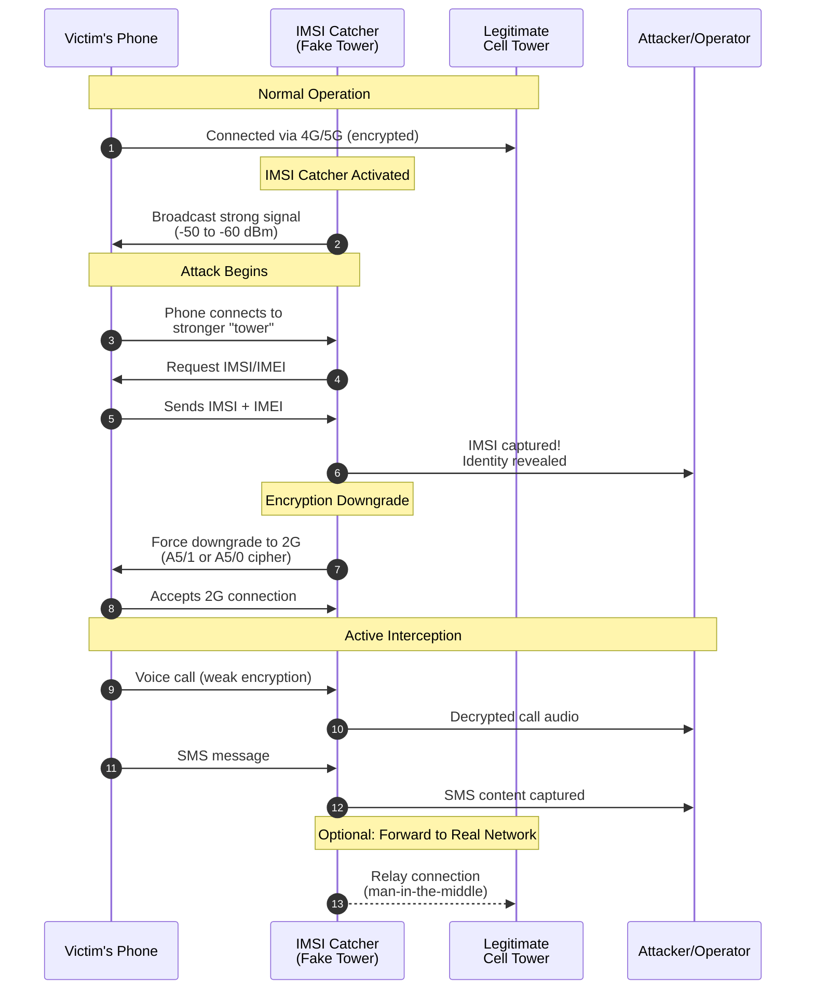

### Why Detection Matters

IMSI catchers exploit a fundamental vulnerability in cellular networks: **phones cannot verify the authenticity of cell towers**. This one-way authentication (tower verifies phone, but phone does not verify tower) means any device broadcasting as a cell tower will be trusted by nearby phones.

While IMSI catchers are used by law enforcement agencies, they also:

- Collect data from **all phones in range**, not just targets
- May be used **without proper warrants** in some jurisdictions
- Are increasingly available to **foreign intelligence services** and **criminals**
- Create **security vulnerabilities** that can be exploited by malicious actors

### Network Generation Security Comparison

Understanding the security differences between cellular generations is crucial for understanding why encryption downgrade attacks are so dangerous:

```mermaid
flowchart LR
    subgraph 2G ["2G (GSM)"]
        direction TB
        2G_AUTH["One-way Auth<br/>Tower NOT verified"]
        2G_ENC["A5/1 Cipher<br/>Crackable in real-time"]
        2G_VULN["HIGHLY VULNERABLE"]
        style 2G_VULN fill:#ff4444,color:#fff
    end

    subgraph 3G ["3G (UMTS)"]
        direction TB
        3G_AUTH["Mutual Auth<br/>Better verification"]
        3G_ENC["KASUMI Cipher<br/>Known weaknesses"]
        3G_VULN["MODERATE RISK"]
        style 3G_VULN fill:#ffaa00,color:#000
    end

    subgraph 4G ["4G (LTE)"]
        direction TB
        4G_AUTH["Mutual Auth<br/>Strong verification"]
        4G_ENC["AES-256<br/>Strong encryption"]
        4G_VULN["LOW RISK*"]
        style 4G_VULN fill:#88cc00,color:#000
    end

    subgraph 5G ["5G (NR)"]
        direction TB
        5G_AUTH["Strong Auth<br/>SUPI encryption"]
        5G_ENC["AES-256 + SUCI<br/>Identity protected"]
        5G_VULN["BEST PROTECTION"]
        style 5G_VULN fill:#00aa00,color:#fff
    end

    2G --> 3G --> 4G --> 5G
```

| Generation | Authentication | Encryption | IMSI Protection | Vulnerability Level |
|:----------:|:--------------:|:----------:|:---------------:|:-------------------:|
| **2G** | One-way (tower not verified) | A5/1 (crackable) | None | **CRITICAL** |
| **3G** | Mutual authentication | KASUMI (weak) | None | **HIGH** |
| **4G** | Mutual authentication | AES-256 | None (IMSI sent) | **MEDIUM** |
| **5G** | Strong mutual auth | AES-256 + SUCI | SUPI encrypted | **LOW** |

> **Note:** Even 4G/5G phones can be forced to connect via 2G, negating their security benefits.

### Brief History

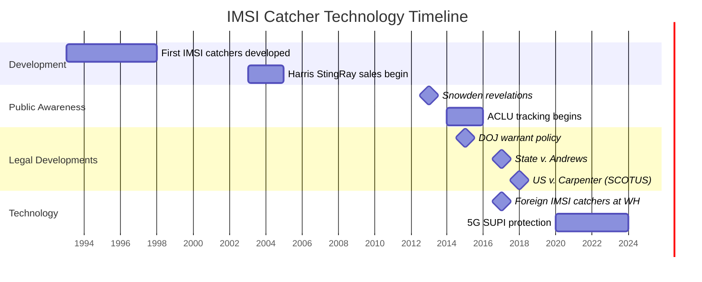

| Year | Event |
|------|-------|
| 1990s | First IMSI catchers developed for law enforcement |
| 2003 | Harris Corporation begins selling StingRay to US agencies |
| 2013 | Edward Snowden revelations increase public awareness |
| 2014 | ACLU begins tracking StingRay use by police departments |
| 2015 | US DOJ announces warrant requirement policy |
| 2016 | Research reveals widespread use by local police |
| 2017 | DHS confirms foreign IMSI catchers detected near White House |
| 2018 | US v. Carpenter establishes cell location data requires warrant |
| 2020+ | 5G introduces SUPI encryption to protect subscriber identity |

---

## 2. Detection Methods

Flock-You implements multiple detection methods based on documented IMSI catcher behavior. Each method has a **base score** that contributes to the overall IMSI catcher likelihood score.

### Detection Decision Flowchart

The following flowchart shows how Flock-You evaluates potential IMSI catcher activity:

```mermaid
flowchart TD
    START([Cell Change Detected]) --> CHECK_STAT{User<br/>Stationary?}

    CHECK_STAT -->|Yes| STAT_SCORE[+"15 points<br/>Stationary cell change"]
    CHECK_STAT -->|No| CHECK_SPEED{Movement<br/>Speed?}

    STAT_SCORE --> CHECK_ENC

    CHECK_SPEED -->|Normal| CHECK_ENC{Encryption<br/>Downgrade?}
    CHECK_SPEED -->|Impossible| IMP_SCORE[+"20 points<br/>Impossible movement"]

    IMP_SCORE --> CHECK_ENC

    CHECK_ENC -->|Yes to 2G| ENC_SCORE[+"60 points<br/>Encryption downgrade]
    CHECK_ENC -->|No| CHECK_MCC

    ENC_SCORE --> CHECK_MCC{MCC-MNC<br/>Suspicious?}

    CHECK_MCC -->|Test/Invalid| MCC_SCORE[+"90 points<br/>Suspicious network ID"]
    CHECK_MCC -->|Valid| CHECK_LAC

    MCC_SCORE --> CHECK_LAC{LAC Value<br/>1-10?}

    CHECK_LAC -->|Yes| LAC_SCORE[+"25 points<br/>StingRay LAC pattern]
    CHECK_LAC -->|No| CHECK_SIGNAL

    LAC_SCORE --> CHECK_SIGNAL{Signal<br/>Spike?}

    CHECK_SIGNAL -->|> 25 dBm increase| SIG_SCORE[+"20 points<br/>Signal spike"]
    CHECK_SIGNAL -->|Normal| CHECK_TRUST

    SIG_SCORE --> CHECK_TRUST{Cell<br/>Trusted?}

    CHECK_TRUST -->|Trust < 30%| TRUST_SCORE[+"15 points<br/>Unknown cell"]
    CHECK_TRUST -->|Trusted| CALC

    TRUST_SCORE --> CALC[Calculate Total Score]
    CHECK_TRUST -->|Trusted| CALC

    CALC --> SEVERITY{Determine<br/>Severity}

    SEVERITY -->|90-100| CRIT([CRITICAL])
    SEVERITY -->|70-89| HIGH([HIGH])
    SEVERITY -->|50-69| MED([MEDIUM])
    SEVERITY -->|30-49| LOW([LOW])
    SEVERITY -->|0-29| INFO([INFO])

    style CRIT fill:#cc0000,color:#fff
    style HIGH fill:#ff4400,color:#fff
    style MED fill:#ffaa00,color:#000
    style LOW fill:#88cc00,color:#000
    style INFO fill:#0088cc,color:#fff
```

### 2.1 Encryption Downgrade Detection

**Detection Method:** `CELL_ENCRYPTION_DOWNGRADE`
**Base Score:** 60 points

**What it detects:** When your phone is forced from a secure network (5G/4G/3G) to 2G, which has weak or no encryption.

**Why it matters:**
- 2G uses **one-way authentication** (phone cannot verify tower)
- 2G encryption (A5/1) can be **cracked in real-time** with commodity hardware
- This is the **primary method** IMSI catchers use for interception

```kotlin
// From CellularMonitor.kt
private fun isEncryptionDowngrade(previousType: Int, currentType: Int): Boolean {
    val previousGen = getNetworkGeneration(previousType)
    val currentGen = getNetworkGeneration(currentType)
    // Downgrade to 2G is suspicious (2G has weak/no encryption)
    return previousGen >= 3 && currentGen == 2
}
```

**Additional scoring factors:**
- Downgrade with signal spike: +15 points
- Downgrade to unknown tower: +10 points
- Downgrade while stationary: +15 points
- Impossible movement speed: +20 points
- High IMSI catcher signature (>=70%): +30 points
- Moderate IMSI catcher signature (>=50%): +15 points

### 2.2 Suspicious Network Parameters (MCC-MNC)

**Detection Method:** `CELL_SUSPICIOUS_NETWORK`
**Base Score:** 90 points

**What it detects:** Connection to networks using test, invalid, or reserved MCC-MNC codes.

**Suspicious MCC-MNC codes flagged:**

```kotlin
// From CellularMonitor.kt and CellularDetectionHandler.kt
private val SUSPICIOUS_MCC_MNC = setOf(
    // ITU Test Networks (commonly used by IMSI catchers)
    "001-01", "001-00", "001-02", "001-001",
    // Reserved test networks
    "999-99", "999-01", "999-00",
    // Invalid codes
    "000-00", "000-01",
    // Additional test codes
    "002-01", "002-02",
    // International codes that shouldn't appear as primary
    "901-01", "901-18"
)
```

**Why this is critical:** Legitimate cell networks **never** use these codes. Detection of these codes is a strong indicator of surveillance equipment or a misconfigured test system.

### 2.3 LAC/TAC Anomaly Detection

**Detection Method:** `CELL_LAC_TAC_ANOMALY`
**Base Score:** 20 points

**What it detects:** Location Area Code (2G/3G) or Tracking Area Code (4G/5G) changes without an actual cell tower change.

**Suspicious LAC values (StingRay signature):**

```kotlin
// From CellularMonitor.kt
private val SUSPICIOUS_LAC_VALUES = setOf(0, 1, 2, 3, 4, 5, 6, 7, 8, 9, 10)
private val SUSPICIOUS_TAC_VALUES = setOf(0, 1, 2, 3, 4, 5)
```

**Scoring:**
- LAC value in suspicious range (1-10): +25 points
- TAC value in suspicious range (0-5): +20 points

**Why it matters:** StingRay devices often use **LAC 1** or very low LAC values. This is a documented characteristic of Harris Corporation IMSI catchers.

### 2.4 Cell ID Pattern Analysis

**Detection Method:** Part of multiple detection methods
**Variable scoring**

**What it detects:** Suspicious patterns in Cell ID values that may indicate test or fake towers.

```kotlin
// From CellularMonitor.kt
private fun isSuspiciousCellIdPattern(cellId: Long?): Boolean {
    if (cellId == null) return false

    // Very low cell IDs are suspicious
    if (cellId in 1..100) return true

    // Round numbers (divisible by 1000 or 10000)
    if (cellId % 10000L == 0L && cellId > 0) return true
    if (cellId % 1000L == 0L && cellId < 100000L && cellId > 0) return true

    // Check for repeated digits (11111, 22222, etc.)
    val str = cellId.toString()
    if (str.length >= 4 && str.all { it == str[0] }) return true

    // Check for sequential (12345, 54321)
    if (str.length >= 5) {
        val ascending = str.zipWithNext().all { (a, b) -> b.code == a.code + 1 }
        val descending = str.zipWithNext().all { (a, b) -> b.code == a.code - 1 }
        if (ascending || descending) return true
    }

    return false
}
```

**Scoring:**
- Suspicious cell ID pattern detected: +15 points

### 2.5 Signal Strength Anomalies

**Detection Method:** `CELL_SIGNAL_ANOMALY`
**Base Score:** 15 points

**What it detects:** Sudden, unusual increases in signal strength.

**Thresholds:**

```kotlin
// From CellularMonitor.kt
private const val SIGNAL_SPIKE_THRESHOLD = 25 // dBm
private const val SIGNAL_SPIKE_TIME_WINDOW = 5_000L // 5 seconds
private const val SUSPICIOUSLY_STRONG_SIGNAL_DBM = -55
```

**Why it matters:**
- IMSI catchers broadcast **strong signals** to attract nearby phones
- **DRTbox** (airplane-mounted) often produces -50 dBm or stronger
- Close-proximity ground-based IMSI catchers also exhibit very strong signals

**Additional scoring:**
- Signal spike with cell change: +15 points
- Suspiciously strong signal (-55 dBm or better): +20 points
- Very strong signal from unknown tower: +15 points

### 2.6 Stationary Cell Change Patterns

**Detection Method:** `CELL_TOWER_CHANGE` / `STATIONARY_CELL_CHANGE`
**Base Score:** 15 points (stationary) / 10 points (general)

**What it detects:** Cell tower changes when the user is not moving.

**Movement classification:**

```kotlin
// From CellularMonitor.kt
enum class MovementType(val displayName: String, val maxSpeedKmh: Double) {
    STATIONARY("Stationary", 1.0),
    WALKING("Walking", 7.0),
    RUNNING("Running", 20.0),
    CYCLING("Cycling", 40.0),
    VEHICLE("Vehicle", 150.0),
    HIGH_SPEED_VEHICLE("High-Speed Vehicle", 350.0),
    IMPOSSIBLE("Impossible/Teleport", Double.MAX_VALUE)
}
```

**Pattern analysis heuristics:**

```kotlin
// From CellularMonitor.kt
private val stationaryChangeWindowMs = 300_000L // 5 minute window
private val quickReturnThresholdMs = 60_000L    // 1 minute quick return

// Pattern types:
// - Quick return to original cell = likely network optimization (NOT suspicious)
// - Oscillating between 2-3 cells = likely edge-of-coverage (less suspicious)
// - Multiple unique cells = more suspicious
// - Sustained change to unknown cell = most suspicious
```

**Scoring modifiers:**
- 3+ cell changes in 5 minutes while stationary: +25 points
- 2 cell changes while stationary: +10 points
- Oscillating between same cells: -10 points (reduces suspicion)
- Quick return to original cell: No additional score (likely benign)
- Unknown cell while stationary with low trust: +15 points

### 2.7 Rapid Cell Switching

**Detection Method:** `CELL_RAPID_SWITCHING`
**Base Score:** 20 points

**What it detects:** Abnormally frequent tower switching.

**Thresholds:**

```kotlin
// From CellularMonitor.kt
private const val RAPID_SWITCH_COUNT_WALKING = 5  // per minute while stationary
private const val RAPID_SWITCH_COUNT_DRIVING = 12 // per minute while moving
```

**Scoring:**
- Exceeds threshold while stationary: +25 additional points

### 2.8 Unknown Cell in Familiar Area

**Detection Method:** Part of `CELL_TOWER_CHANGE`
**Base Score:** 25 points

**What it detects:** A previously unseen cell tower appearing in a location where trusted cells have been observed.

**Trust calculation:**

```kotlin
// From CellularMonitor.kt
private const val TRUSTED_CELL_THRESHOLD = 5 // Seen 5+ times = trusted
private const val TRUSTED_CELL_LOCATION_RADIUS = 0.002 // ~200m

// Cell Trust Score calculation:
// seenCount >= 20 -> 100%
// seenCount >= 10 -> 80%
// seenCount >= 5  -> 60%
// seenCount >= 2  -> 30%
// seenCount = 1   -> 10%
// never seen      -> 0%
```

---

## 3. Known Device Signatures

The following IMSI catcher devices are documented in the codebase for AI analysis context and pattern matching.

### IMSI Catcher Device Comparison

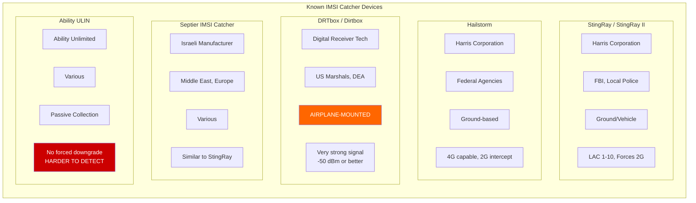

| Device | Manufacturer | Primary Users | Deployment | Key Signatures | Detection Difficulty |
|:------:|:------------:|:-------------:|:----------:|:---------------|:--------------------:|
| **StingRay** | Harris (L3Harris) | FBI, Local PD | Ground/Vehicle | LAC 1-10, sequential CellIDs, 2G downgrade | Medium |
| **StingRay II** | Harris (L3Harris) | FBI, Local PD | Ground/Vehicle | Same as StingRay, updated hardware | Medium |
| **Hailstorm** | Harris (L3Harris) | Federal agencies | Ground-based | 4G capable, similar LAC patterns | Medium-Hard |
| **DRTbox** | Digital Receiver Tech | US Marshals, DEA | **Airplane** | Very strong signal (-50 dBm+), wide coverage | Easy (signal) |
| **Septier** | Israeli | ME, Europe, Global | Various | StingRay-like characteristics | Medium |
| **ULIN** | Ability Unlimited | Various | Passive | No downgrades, passive collection | **Very Hard** |
| **FinFisher** | Gamma Group | Governments | Various | May include malware injection | Hard |

### 3.1 Harris StingRay / StingRay II

| Property | Details |
|----------|---------|
| **Manufacturer** | Harris Corporation (now L3Harris) |
| **Primary Users** | FBI, local police departments |
| **Deployment** | Ground-based, vehicle-mounted, portable |
| **Key Signatures** | LAC values 1-10 (LAC 1 very common), sequential/round Cell IDs, forces 2G downgrade |
| **Capabilities** | IMSI collection, location tracking, call/SMS interception |

### 3.2 Harris Hailstorm

| Property | Details |
|----------|---------|
| **Manufacturer** | Harris Corporation (now L3Harris) |
| **Primary Users** | Federal agencies |
| **Key Features** | 4G/LTE capability, upgraded StingRay |
| **Key Signatures** | Similar LAC patterns to StingRay |
| **Capabilities** | LTE identification, often still forces 2G for content interception |

### 3.3 DRT/DRTbox (Dirtbox)

| Property | Details |
|----------|---------|
| **Full Name** | Digital Receiver Technology |
| **Primary Users** | US Marshals Service, FBI, DEA |
| **Deployment** | **Airplane-mounted** |
| **Key Signatures** | Very strong signal (-50 dBm or stronger), unusual signal patterns from above |
| **Capabilities** | Covers large geographic area, can collect from thousands of phones simultaneously |

### 3.4 Septier IMSI Catcher

| Property | Details |
|----------|---------|
| **Origin** | Israeli-manufactured |
| **Primary Users** | Middle East, Europe, exported globally |
| **Key Signatures** | Similar characteristics to StingRay |

### 3.5 Ability Unlimited ULIN

| Property | Details |
|----------|---------|
| **Type** | Passive collection variant |
| **Key Features** | May not force downgrades (harder to detect) |
| **Capabilities** | Collects IMSI/IMEI through passive monitoring |

### 3.6 Gamma Group FinFisher

| Property | Details |
|----------|---------|
| **Type** | Commercial spyware suite |
| **Primary Users** | Governments worldwide |
| **Key Features** | Includes IMSI catcher components, may include malware injection |

---

## 4. Threat Scoring System

### Threat Scoring State Diagram

The following diagram shows how threat severity levels are determined based on the calculated IMSI catcher score:

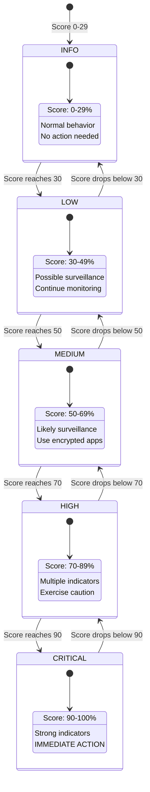

### Score Threshold Visualization

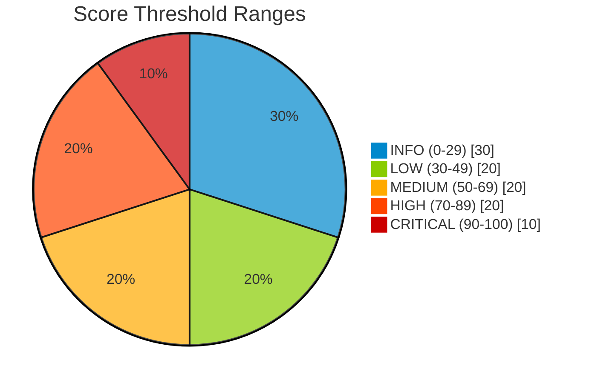

### 4.1 IMSI Catcher Score Calculation

The system calculates an **IMSI Catcher Likelihood Score** (0-100%) based on multiple weighted factors.

```kotlin
// From CellularDetectionHandler.kt
fun calculateImsiCatcherScore(context: CellularDetectionContext): Int {
    var score = 0

    // Base score from anomaly type
    score += getAnomalyBaseScore(context.anomalyType)

    // Encryption downgrade is highly suspicious
    if (context.encryptionType == EncryptionType.WEAK_2G ||
        context.encryptionType == EncryptionType.NONE) {
        score += 25
    }

    // Signal spike with tower change
    context.previousSignalStrength?.let { prev ->
        val delta = context.signalStrength - prev
        if (delta > 20) { // signalSpikeThreshold
            score += 20
        }
    }

    // Unknown/untrusted cell
    if (context.cellTrustScore != null && context.cellTrustScore < 30) {
        score += 15
    }

    // Stationary but cell changed
    if (context.movementType == MovementType.STATIONARY &&
        context.cellId != context.previousCellId) {
        score += 15
    }

    // Impossible movement speed
    if (context.movementType == MovementType.IMPOSSIBLE) {
        score += 20
    }

    // Test network MCC-MNC
    val mccMnc = "${context.mcc}-${context.mnc}"
    if (mccMnc in SUSPICIOUS_MCC_MNC) {
        score += 30
    }

    return score.coerceIn(0, 100)
}
```

### 4.2 Base Scores by Anomaly Type

```mermaid
flowchart LR
    subgraph SCORES ["Base Scores by Anomaly Type"]
        direction TB
        S90["SUSPICIOUS_NETWORK<br/>90 pts"]
        S60["ENCRYPTION_DOWNGRADE<br/>60 pts"]
        S25["UNKNOWN_CELL_FAMILIAR<br/>25 pts"]
        S20A["RAPID_CELL_SWITCHING<br/>20 pts"]
        S20B["LAC_TAC_ANOMALY<br/>20 pts"]
        S15A["STATIONARY_CELL_CHANGE<br/>15 pts"]
        S15B["SIGNAL_SPIKE<br/>15 pts"]
        S10["CELL_TOWER_CHANGE<br/>10 pts"]
    end

    style S90 fill:#cc0000,color:#fff
    style S60 fill:#ff4400,color:#fff
    style S25 fill:#ff6600,color:#fff
    style S20A fill:#ffaa00,color:#000
    style S20B fill:#ffaa00,color:#000
    style S15A fill:#cccc00,color:#000
    style S15B fill:#cccc00,color:#000
    style S10 fill:#88cc00,color:#000
```

```kotlin
// From CellularMonitor.kt
enum class AnomalyType(val displayName: String, val baseScore: Int, ...) {
    SUSPICIOUS_NETWORK("Suspicious Network ID", 90, ...)
    ENCRYPTION_DOWNGRADE("Encryption Downgrade", 60, ...)
    UNKNOWN_CELL_FAMILIAR_AREA("Unknown Cell in Familiar Area", 25, ...)
    RAPID_CELL_SWITCHING("Rapid Cell Switching", 20, ...)
    LAC_TAC_ANOMALY("Location Area Anomaly", 20, ...)
    STATIONARY_CELL_CHANGE("Cell Changed While Stationary", 15, ...)
    SIGNAL_SPIKE("Sudden Signal Spike", 15, ...)
    CELL_TOWER_CHANGE("Cell Tower Change", 10, ...)
}
```

### 4.3 Severity Level Thresholds

```kotlin
// From CellularDetectionHandler.kt
private const val IMSI_CRITICAL_THRESHOLD = 90
private const val IMSI_HIGH_THRESHOLD = 70
private const val IMSI_MEDIUM_THRESHOLD = 50
private const val IMSI_LOW_THRESHOLD = 30

// Severity determination
return when {
    imsiCatcherScore >= 90 -> ThreatLevel.CRITICAL  // 90-100%
    imsiCatcherScore >= 70 -> ThreatLevel.HIGH      // 70-89%
    imsiCatcherScore >= 50 -> ThreatLevel.MEDIUM    // 50-69%
    imsiCatcherScore >= 30 -> ThreatLevel.LOW       // 30-49%
    else -> ThreatLevel.INFO                         // 0-29%
}
```

### 4.4 Severity Level Meanings

| Level | Score Range | Assessment | Action Required |
|-------|-------------|------------|-----------------|
| **CRITICAL** | 90-100% | Strong indicators of active IMSI catcher | Immediate action required |
| **HIGH** | 70-89% | Multiple confirmed surveillance indicators | Exercise caution with communications |
| **MEDIUM** | 50-69% | Likely surveillance equipment detected | Monitor for additional indicators |
| **LOW** | 30-49% | Possible surveillance activity | Continue monitoring, no immediate action |
| **INFO** | 0-29% | Normal cellular behavior with minor anomalies | No action required |

### 4.5 Confidence Level Factors

```kotlin
// From CellularMonitor.kt
enum class AnomalyConfidence(val displayName: String, val minFactors: Int) {
    LOW("Low - Possibly Normal", 1),
    MEDIUM("Medium - Suspicious", 2),
    HIGH("High - Likely Threat", 3),
    CRITICAL("Critical - Strong Indicators", 4)
}

// Confidence boosting based on factor count
when (anomaly.confidence) {
    CRITICAL -> score += 20
    HIGH -> score += 10
    MEDIUM -> score += 5
    LOW -> { /* no boost */ }
}

// Factor count boosting
if (contributingFactors.size >= 4) score += 15
else if (contributingFactors.size >= 3) score += 10
else if (contributingFactors.size >= 2) score += 5
```

---

## 5. Real-World Sources

### 5.1 Digital Rights Organizations

| Organization | Resource | URL |
|--------------|----------|-----|
| **ACLU** | StingRay Tracking Project | https://www.aclu.org/issues/privacy-technology/surveillance-technologies/stingray-tracking-devices |
| **EFF** | Cell-Site Simulators | https://www.eff.org/pages/cell-site-simulatorsimsi-catchers |
| **EFF** | Street Level Surveillance | https://www.eff.org/sls |
| **EPIC** | Stingray Tracking Devices | https://epic.org/issues/consumer-privacy/stingray/ |

### 5.2 Academic Research

| Paper | Authors | Key Findings |
|-------|---------|--------------|
| "Practical Attacks Against GSM Networks" | Chris Paget | Demonstrated building IMSI catcher for $1500 |
| "LTE Security and Protocol Exploits" | Multiple | LTE vulnerabilities allowing downgrade attacks |
| "5G Security: Analysis of Threats and Solutions" | Ahmad et al. | 5G SUPI encryption improvements |

### 5.3 Significant Court Cases

| Case | Year | Significance |
|------|------|--------------|
| **US v. Carpenter** | 2018 | Cell location data requires warrant (Supreme Court) |
| **US v. Lambis** | 2016 | Evidence suppressed due to warrantless StingRay use |
| **State v. Andrews** | 2017 | Maryland requires warrant for cell-site simulators |

### 5.4 Key News Coverage

| Source | Topic |
|--------|-------|
| The Intercept | Extensive coverage of DRT/Dirtbox airplane surveillance |
| Associated Press | Foreign IMSI catchers detected near White House |
| USA Today | Local police StingRay acquisition via federal grants |
| Wired | Technical analysis of IMSI catcher capabilities |

### 5.5 Cell Tower Databases for Verification

| Database | URL | Use Case |
|----------|-----|----------|
| **CellMapper** | https://cellmapper.net | Community-mapped cell towers |
| **OpenCellID** | https://opencellid.org | Open database of cell locations |
| **Mozilla Location Services** | https://location.services.mozilla.com | Crowdsourced cell data |

---

## 6. Runbook: Responding to Detections

### Response Flowchart

Use this flowchart to determine your response based on the detected threat level:

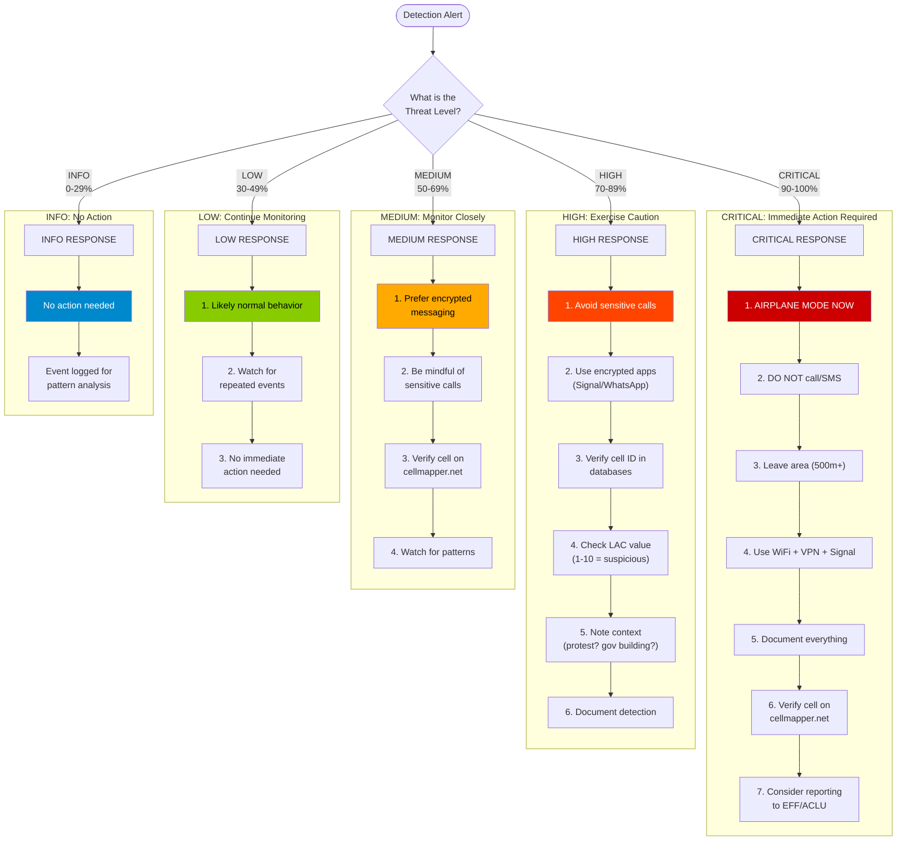

### 6.1 CRITICAL Threat (90-100%)

**Assessment:** Strong indicators of active IMSI catcher/cell-site simulator.

**Immediate Actions:**

1. **DISCONNECT NOW**
   - Enable airplane mode IMMEDIATELY
   - This breaks connection to the suspected IMSI catcher

2. **PROTECT YOUR COMMUNICATIONS**
   - DO NOT make phone calls (can be intercepted)
   - DO NOT send SMS (can be intercepted)
   - If you must communicate, use WiFi + VPN + Signal/WhatsApp

3. **MOVE TO SAFETY**
   - Leave the immediate area if possible
   - Move at least 500 meters away
   - Briefly enable cellular to check if anomaly persists

4. **DOCUMENT EVERYTHING**
   - Screenshot this detection
   - Note: time, exact location, what you were doing
   - This could be evidence for legal action or FOIA

5. **VERIFY THE THREAT**
   - Check cell ID on cellmapper.net or opencellid.org
   - Samsung users: dial `*#0011#` for service mode
   - If cell doesn't exist in databases, highly likely fake

6. **CONSIDER REPORTING**
   - Contact EFF (eff.org) or ACLU if you believe you're targeted
   - File FOIA request with local police for StingRay records
   - Document pattern if this happens repeatedly

### 6.2 HIGH Threat (70-89%)

**Assessment:** Multiple confirmed surveillance indicators.

**Actions:**

1. **IMMEDIATE PRECAUTIONS**
   - Avoid making sensitive phone calls
   - Do not send SMS with sensitive content
   - Use Signal, WhatsApp, or other E2E encrypted apps

2. **VERIFICATION STEPS**
   - Check if cell ID exists: cellmapper.net, opencellid.org
   - Samsung: `*#0011#` shows network details
   - Note LAC value - if 1-10, very suspicious

3. **IF ENCRYPTION DOWNGRADE DETECTED**
   - Your phone may have been forced to 2G
   - Voice calls on 2G can be intercepted in real-time
   - Consider airplane mode for any sensitive discussions

4. **CONTEXT CHECK**
   - Are you near: protest, government building, airport, prison?
   - These locations commonly have IMSI catcher deployment

5. **DOCUMENTATION**
   - Save this detection for your records
   - If pattern repeats, you may be specifically targeted

### 6.3 MEDIUM Threat (50-69%)

**Assessment:** Likely surveillance equipment detected.

**Actions:**

1. **CURRENT SITUATION**
   - Multiple indicators suggest possible surveillance
   - Could still be a false positive from network issues
   - Worth monitoring but not emergency

2. **RECOMMENDED ACTIONS**
   - Prefer encrypted messaging (Signal, WhatsApp) over SMS
   - Be mindful of sensitive phone conversations
   - Note your location in case pattern develops

3. **VERIFICATION**
   - Check cell ID in cellmapper.net database
   - If cell doesn't appear, suspicion increases
   - If cell appears with correct location, likely false positive

4. **WATCH FOR**
   - Additional anomalies in same area = threat increases
   - Same anomaly in different areas = possible targeted surveillance
   - Anomaly only at specific times/events = pattern worth noting

### 6.4 LOW Threat (30-49%)

**Assessment:** Possible surveillance activity.

**Actions:**

1. **ASSESSMENT**
   - This is likely normal network behavior
   - Cell networks frequently optimize and hand off
   - Single events are usually not concerning

2. **WHAT TO WATCH FOR**
   - Repeated similar events = more concerning
   - Events combined with encryption downgrade = concerning
   - Pattern tied to specific locations/times = investigate

3. **NO IMMEDIATE ACTION REQUIRED**
   - Continue using your phone normally
   - The app is logging this for pattern analysis
   - You'll be alerted if threat level increases

### 6.5 INFO Level (0-29%)

**Assessment:** Normal cellular behavior with minor anomalies.

**Actions:**
- No action needed
- Event logged for pattern analysis only
- By itself, this indicates nothing suspicious

### 6.6 Evidence Preservation Steps

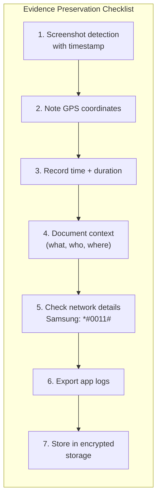

1. **Screenshot the detection** with timestamp visible
2. **Note your exact location** (GPS coordinates if possible)
3. **Record the time** and duration of the event
4. **Document context** (what you were doing, who was nearby)
5. **Check network details** using:
   - Samsung: `*#0011#`
   - Network Cell Info Lite app
   - Engineering mode if available
6. **Export detection logs** from the app
7. **Store evidence securely** (encrypted storage)

---

## 7. Known Limitations

### 7.1 What the Detection CAN'T Detect

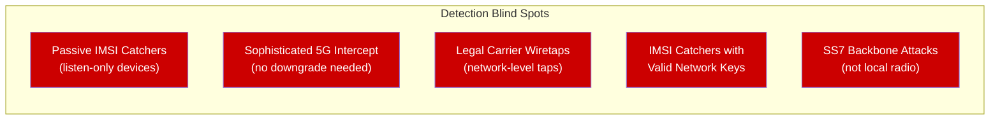

| Limitation | Explanation |
|------------|-------------|
| **Passive IMSI catchers** | Devices that only listen without broadcasting (Ability ULIN type) |
| **Sophisticated 5G intercept** | Advanced equipment that doesn't force downgrades |
| **Legal intercept via carrier** | Wiretaps implemented at the carrier network level |
| **IMSI catchers using valid credentials** | Devices with access to legitimate network keys |
| **SS7 attacks** | Attacks on the telecom backbone, not local radio |

### 7.2 False Positive Scenarios

| Scenario | Why It Triggers | Mitigation |
|----------|-----------------|------------|
| **5G beam steering** | Frequent handoffs in 5G mmWave | Suppressed with 5G grace period |
| **Edge of coverage** | Oscillating between towers | Detected as oscillation pattern |
| **Network congestion** | Load balancing causes handoffs | Quick return pattern detected |
| **Carrier maintenance** | Temporary tower outages | Trust score reduces impact |
| **Indoor/outdoor transitions** | Signal changes rapidly | Movement context considered |
| **New legitimate towers** | Tower appears as unknown | Builds trust over time |
| **Rural areas with few towers** | Limited tower options | Familiar area tracking |

### 7.3 Environmental Factors

| Factor | Impact on Detection |
|--------|---------------------|
| **Dense urban areas** | More handoffs, more potential false positives |
| **Underground/buildings** | Signal changes may appear anomalous |
| **Moving vehicles** | Expected handoffs, reduced sensitivity |
| **International travel** | Different MCC-MNC codes appear |
| **Carrier switching** | MVNO/roaming may trigger alerts |

### 7.4 Technical Limitations

```kotlin
// Rate limiting may delay detection
private const val DEFAULT_MIN_ANOMALY_INTERVAL_MS = 60_000L // 1 minute
private const val DEFAULT_GLOBAL_ANOMALY_COOLDOWN_MS = 30_000L // 30 seconds

// Location staleness affects movement analysis
private const val LOCATION_STALENESS_THRESHOLD_MS = 30_000L // 30 seconds
```

---

## 8. Technical Reference

### 8.1 US Carrier MCC-MNC Codes

#### Carrier MCC-MNC Quick Reference

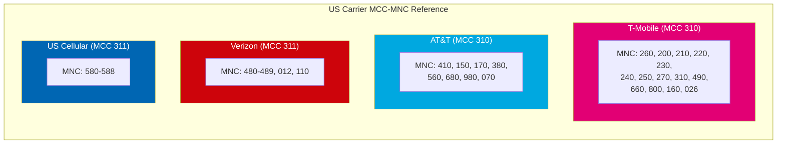

| Carrier | MCC | Valid MNC Codes |
|:-------:|:---:|:----------------|
| **T-Mobile** | 310 | 260, 200, 210, 220, 230, 240, 250, 260, 270, 310, 490, 660, 800, 160, 026 |
| **AT&T** | 310 | 410, 150, 170, 380, 560, 680, 980, 070 |
| **Verizon** | 311 | 480, 481, 482, 483, 484, 485, 486, 487, 488, 489, 012, 110 |
| **US Cellular** | 311 | 580, 581, 582, 583, 584, 585, 586, 587, 588 |

```kotlin
// From CellularMonitor.kt - Legitimate US carrier codes

// T-Mobile USA (MCC 310)
private val TMOBILE_MNC_CODES = setOf(
    "260", "200", "210", "220", "230", "240", "250", "260", "270",
    "310", "490", "660", "800", "160", "026"
)

// AT&T USA (MCC 310)
private val ATT_MNC_CODES = setOf(
    "410", "150", "170", "380", "560", "680", "980", "070"
)

// Verizon Wireless (MCC 311)
private val VERIZON_MNC_CODES = setOf(
    "480", "481", "482", "483", "484", "485", "486", "487", "488", "489",
    "012", "110"
)

// US Cellular (MCC 311)
private val US_CELLULAR_MNC_CODES = setOf(
    "580", "581", "582", "583", "584", "585", "586", "587", "588"
)
```

**Note:** If you see a US MCC (310/311) with an MNC NOT in these lists, it could be a test network or IMSI catcher.

### 8.2 Encryption Cipher Reference

```kotlin
// From CellularDetectionHandler.kt
enum class EncryptionType(val displayName: String, val description: String) {
    STRONG_5G_LTE("Strong (5G/LTE)", "AES-256 encryption"),
    MODERATE_3G("Moderate (3G)", "KASUMI cipher - known weaknesses"),
    WEAK_2G("Weak (2G)", "A5/1 cipher - crackable in real-time"),
    NONE("None", "No encryption - plaintext"),
    UNKNOWN("Unknown", "Encryption status unknown")
}
```

**Detailed Cipher Information:**

| Generation | Cipher | Security Level | Vulnerability |
|------------|--------|----------------|---------------|
| **2G (GSM)** | A5/0 | None | Plaintext transmission |
| **2G (GSM)** | A5/1 | Very Weak | Crackable in real-time with $1000 hardware |
| **2G (GSM)** | A5/2 | Very Weak | Export cipher, even weaker (deprecated) |
| **2G (GSM)** | A5/3 (KASUMI) | Moderate | Rarely deployed on 2G |
| **3G (UMTS)** | KASUMI | Moderate | Known weaknesses, requires significant resources |
| **4G (LTE)** | AES-256 | Strong | Considered secure, but can be forced to 2G |
| **5G (NR)** | AES-256 + SUPI | Very Strong | Subscriber identity protected |

### 8.3 Network Generation Security Comparison

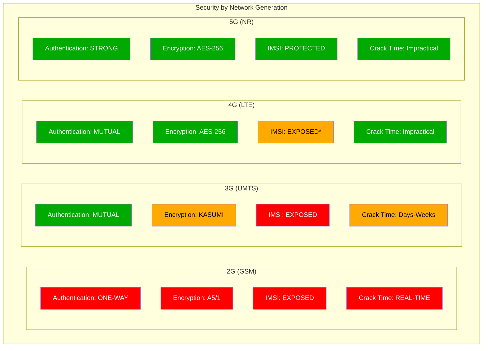

```kotlin
// From CellularMonitor.kt
enum class EncryptionStrength(val displayName: String, val description: String) {
    STRONG("Strong", "5G/LTE with modern encryption (AES-256)"),
    MODERATE("Moderate", "3G UMTS encryption (KASUMI)"),
    WEAK("Weak", "2G with A5/1 cipher (crackable)"),
    NONE("None/Broken", "2G with A5/0 or no encryption")
}

@Suppress("DEPRECATION")
private fun getNetworkGeneration(networkType: Int): Int {
    return when (networkType) {
        // 2G Networks
        TelephonyManager.NETWORK_TYPE_GPRS,
        TelephonyManager.NETWORK_TYPE_EDGE,
        TelephonyManager.NETWORK_TYPE_CDMA,
        TelephonyManager.NETWORK_TYPE_1xRTT,
        TelephonyManager.NETWORK_TYPE_IDEN,
        TelephonyManager.NETWORK_TYPE_GSM -> 2

        // 3G Networks
        TelephonyManager.NETWORK_TYPE_UMTS,
        TelephonyManager.NETWORK_TYPE_EVDO_0,
        TelephonyManager.NETWORK_TYPE_EVDO_A,
        TelephonyManager.NETWORK_TYPE_HSDPA,
        TelephonyManager.NETWORK_TYPE_HSUPA,
        TelephonyManager.NETWORK_TYPE_HSPA,
        TelephonyManager.NETWORK_TYPE_EVDO_B,
        TelephonyManager.NETWORK_TYPE_EHRPD,
        TelephonyManager.NETWORK_TYPE_HSPAP,
        TelephonyManager.NETWORK_TYPE_TD_SCDMA -> 3

        // 4G Networks
        TelephonyManager.NETWORK_TYPE_LTE,
        TelephonyManager.NETWORK_TYPE_IWLAN -> 4

        // 5G Networks
        TelephonyManager.NETWORK_TYPE_NR -> 5

        else -> 0
    }
}
```

### 8.4 Signal Strength Reference

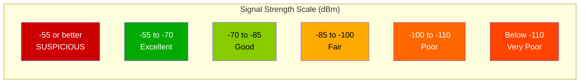

```kotlin
// From CellularMonitor.kt
private fun getSignalQuality(signalDbm: Int): String {
    return when {
        signalDbm >= -70 -> "Excellent"
        signalDbm >= -85 -> "Good"
        signalDbm >= -100 -> "Fair"
        signalDbm >= -110 -> "Poor"
        else -> "Very Poor"
    }
}

// Suspicious threshold
private const val SUSPICIOUSLY_STRONG_SIGNAL_DBM = -55
```

| Signal (dBm) | Quality | Notes |
|--------------|---------|-------|
| >= -55 | **Suspicious** | May indicate close IMSI catcher or DRTbox |
| -55 to -70 | Excellent | Very close to tower |
| -70 to -85 | Good | Normal strong signal |
| -85 to -100 | Fair | Typical indoor signal |
| -100 to -110 | Poor | Edge of coverage |
| < -110 | Very Poor | Likely to drop connection |

---

## 9. Legal Context

### 9.1 United States Federal Law

```kotlin
// From CellularDetectionHandler.kt LEGAL_CONTEXT_INFO
// Federal:
//   - Law enforcement generally needs a warrant (since 2015 DOJ policy)
//   - FBI, DEA, US Marshals, Secret Service all use them
//   - Often use "pen register" orders (lower standard than warrant)
```

**Key Federal Considerations:**
- DOJ policy (2015) requires warrants for federal agencies
- **US v. Carpenter (2018)**: Cell location data requires warrant
- Border zones (within 100 miles): Lower warrant requirements
- National security exceptions may apply

### 9.2 State-Specific Laws

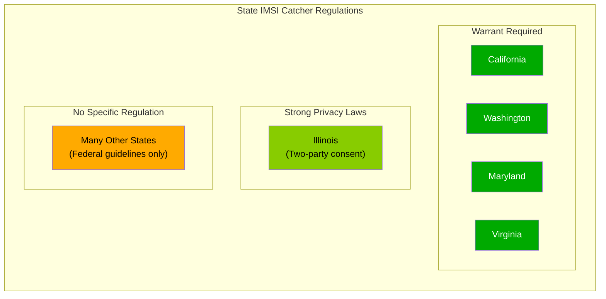

| State | Requirement | Notes |
|-------|-------------|-------|
| **California** | Warrant required | Public reporting required |
| **Washington** | Warrant required | Strong privacy protections |
| **Maryland** | Warrant required | State v. Andrews precedent |
| **Illinois** | Two-party consent | Electronic surveillance restrictions |
| **Virginia** | Warrant required | Since 2015 |
| **Many States** | No specific regulation | Rely on federal guidelines |

### 9.3 Law Enforcement Users

- **FBI**: Primary federal user
- **DEA**: Drug enforcement operations
- **US Marshals**: Fugitive tracking (often with DRTbox)
- **Secret Service**: Protective operations
- **CBP/ICE**: Border and immigration enforcement
- **Local Police**: Many departments via federal grants

**Note:** Many local police departments have acquired StingRay devices through federal grants, often with non-disclosure agreements (NDAs) with Harris Corporation that prevent disclosure of usage.

### 9.4 User Rights

If you believe you're being surveilled:

1. **Document** time, location, and detection details
2. **Note patterns** (same location, following you)
3. **File FOIA requests** with local police/FBI
4. **Contact digital rights organizations** (EFF, ACLU)
5. **Consult an attorney** specializing in surveillance law
6. **If immediate threat**: Enable airplane mode, use encrypted apps only

---

## 10. Changelog

### Version History

| Version | Date | Changes |
|---------|------|---------|
| 1.0.0 | Initial | Core detection system implemented |
| 1.1.0 | Update | Added IMSI catcher scoring system (0-100%) |
| 1.2.0 | Update | Improved false positive reduction with pattern analysis |
| 1.3.0 | Update | Added 5G (NR) support with NCI handling |
| 1.4.0 | Update | Added stationary cell change pattern heuristics |
| 1.5.0 | Update | Added quick return and oscillation pattern detection |
| 1.6.0 | Update | Added comprehensive AI analysis prompt generation |
| 1.7.0 | Update | Added enhanced IMSI score with LAC/TAC/CellID pattern analysis |
| 1.8.0 | Current | Added Mermaid diagrams and visual documentation |

### Detection Method Implementation Timeline

- **Encryption Downgrade Detection**: Initial release
- **Suspicious Network Parameters**: Initial release
- **LAC/TAC Anomaly Detection**: Initial release
- **Cell ID Pattern Analysis**: v1.7.0
- **Signal Strength Anomalies**: Initial release
- **Stationary Cell Change Patterns**: v1.4.0
- **Rapid Cell Switching**: Initial release
- **Unknown Cell in Familiar Area**: Initial release
- **5G Grace Period Handling**: v1.3.0
- **Pattern-based False Positive Reduction**: v1.5.0

---

## Appendix A: User Verification Methods

### Samsung Devices

Dial `*#0011#` to access ServiceMode and view:
- Cell ID
- LAC/TAC
- MCC-MNC
- Network type
- Signal strength

### Other Android Devices

Use apps like **Network Cell Info Lite** to view:
- Serving cell information
- Neighboring cells
- Signal measurements
- Network parameters

### Verification Steps

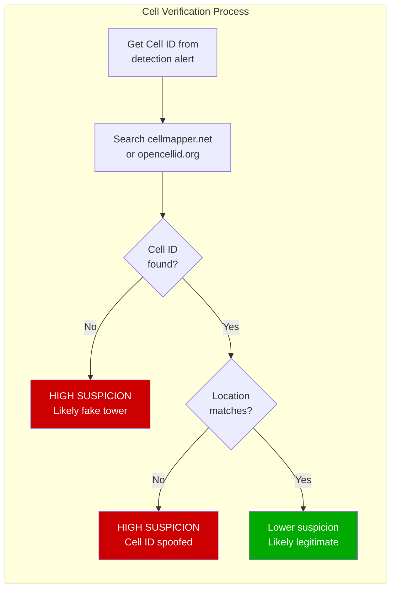

1. **Check if cell exists in public databases:**
   - cellmapper.net
   - opencellid.org
   - If Cell ID doesn't appear, it may be fake

2. **Check if cell appears in multiple locations:**
   - Real towers are FIXED - they don't move
   - If same Cell ID appears in different locations = FAKE

3. **Monitor Timing Advance (if available):**
   - TA indicates distance to tower
   - IMSI catchers may have inconsistent TA values

---

## Appendix B: High-Risk Locations

IMSI catchers are more commonly deployed at:

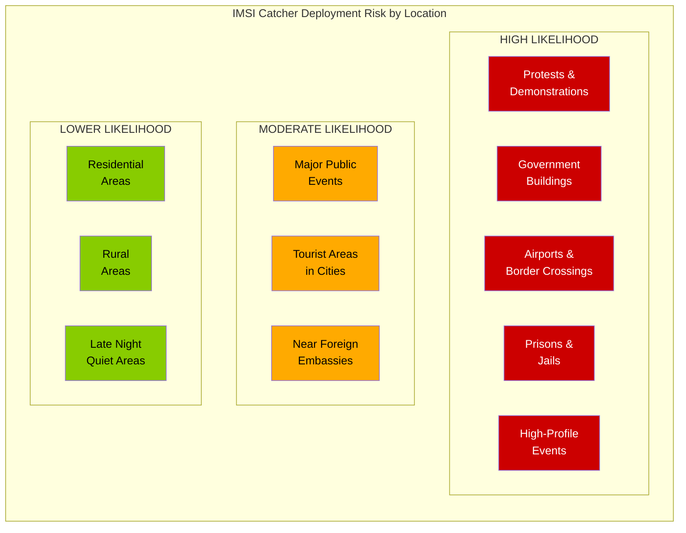

**HIGH LIKELIHOOD:**
- Protests, demonstrations, political gatherings
- Near government buildings (federal, state, local)
- Airports, border crossings (CBP deployment)
- Prisons/jails (contraband phone detection)
- High-profile events (conferences, summits)

**MODERATE LIKELIHOOD:**
- Major public events (concerts, sports)
- Tourist areas in major cities
- Near foreign embassies/consulates

**LOWER LIKELIHOOD:**
- Residential neighborhoods (unless targeted)
- Rural areas
- Late night in quiet areas (unless following someone)

---

*This documentation is based on the actual implementation in `CellularMonitor.kt` and `CellularDetectionHandler.kt`. All thresholds, scoring values, and detection methods are extracted directly from the source code.*
