# Flipper Zero and Hacking Tool Detection System

**Version:** 1.0
**Last Updated:** January 2026
**Component:** BleDetectionHandler

---

## Table of Contents

1. [Overview](#1-overview)
2. [Flipper Zero Detection](#2-flipper-zero-detection)
3. [BLE Spam Attack Detection](#3-ble-spam-attack-detection)
4. [Other Hacking Tools](#4-other-hacking-tools)
5. [Threat Scoring System](#5-threat-scoring-system)
6. [Real-World Sources](#6-real-world-sources)
7. [Runbook: Responding to Detections](#7-runbook-responding-to-detections)
8. [Attack Scenarios](#8-attack-scenarios)
9. [Known Limitations](#9-known-limitations)
10. [Legal Context](#10-legal-context)
11. [Mitigation Advice](#11-mitigation-advice)

---

## 1. Overview

### What is Flipper Zero?

Flipper Zero is a portable multi-tool device designed for hardware hacking, penetration testing, and interacting with access control systems. It combines multiple radio protocols into a small, handheld device with an LCD screen and D-pad interface. The device resembles a small orange and black TV remote with a dolphin mascot displayed on its screen.

**Physical Characteristics:**
- Size: Approximately the size of a small TV remote
- Color: Orange/black body (custom shells available)
- Display: Small LCD screen showing dolphin mascot
- Controls: D-pad navigation

### Flipper Zero Capabilities Overview

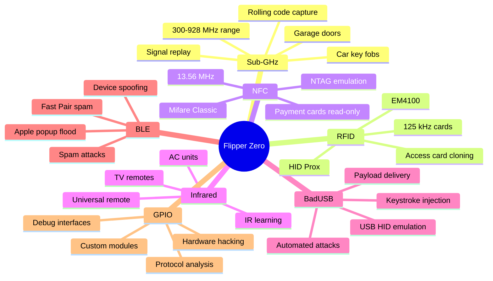

### Legitimate vs Malicious Uses

| Legitimate Uses | Malicious Uses |
|----------------|----------------|
| Security research and education | Cloning access cards for unauthorized entry |
| Penetration testing (authorized) | Capturing and replaying garage door signals |
| Amateur radio experimentation | BLE spam attacks causing device disruption |
| Learning about RF protocols | Car key relay attacks |
| Hardware debugging | BadUSB payload delivery to unlocked computers |
| IoT device testing | Stalking via tracking capabilities |

### Why Detection Matters

1. **Security Awareness**: Knowing when hacking tools are in proximity helps users take protective measures
2. **Active Attack Detection**: BLE spam attacks can be detected and mitigated
3. **Physical Security**: Presence of RFID cloning tools near secure facilities is concerning
4. **Context Assessment**: Detection at a security conference is expected; detection at your home is not
5. **Evidence Collection**: Documenting detections creates patterns useful for investigations

### Hacking Tool Ecosystem Hierarchy

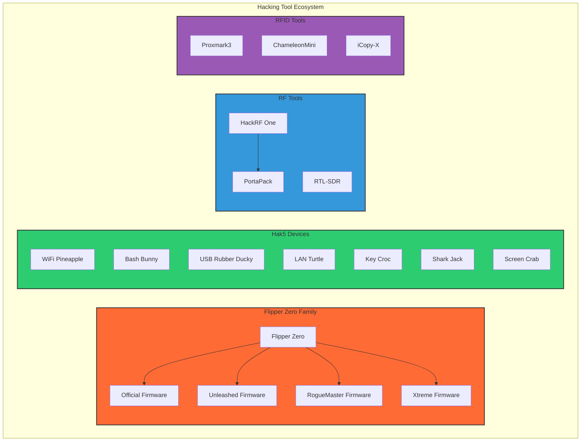

### Other Hacking Tools Detected

This system also detects:
- **Hak5 Devices**: WiFi Pineapple, Bash Bunny, LAN Turtle, USB Rubber Ducky, Key Croc, Shark Jack, Screen Crab
- **RF Tools**: HackRF, PortaPack, RTL-SDR
- **RFID/NFC Tools**: Proxmark, ChameleonMini, iCopy-X
- **Network Attack Tools**: WiFi Pineapple, packet sniffers, MITM devices

---

## 2. Flipper Zero Detection

### Device Identification

The system uses multiple detection methods to identify Flipper Zero devices:

#### BLE Name Patterns

From `DetectionPatterns.kt`:

```kotlin
// Default Flipper Zero naming pattern
pattern = "(?i)^flipper[_\\- ]?(zero)?[_\\- ]?.*"
threatScore = 65
description = "Flipper Zero multi-tool hacking device"

// Serial number format
pattern = "(?i)^flip[_\\- ]?[0-9a-f]+.*"
threatScore = 60
description = "Flipper Zero (serial number format)"
```

#### Firmware Variant Detection

```kotlin
// Custom firmware naming patterns
pattern = "(?i)^(unleashed|roguemaster|xtreme|momentum)[_\\- ]?.*"
threatScore = 75  // Higher score for custom firmware
description = "Flipper Zero with custom firmware - enhanced capabilities"
```

#### BadUSB/BadBT Mode Detection

```kotlin
// BadUSB mode
pattern = "(?i)^badusb[_\\- ]?.*"
threatScore = 85
description = "Flipper Zero in BadUSB mode - keystroke injection capable"

// BadBT mode
pattern = "(?i)^badbt[_\\- ]?.*"
threatScore = 85
description = "Flipper Zero in BadBT mode - Bluetooth keystroke injection"
```

### Firmware Variants

| Firmware | Region Locks | Sub-GHz TX | BLE Spam | Threat Level | Notes |
|----------|--------------|------------|----------|--------------|-------|
| **Official** | Yes | Limited by region | No | Base (65) | Standard features, legal compliance |
| **Unleashed** | No | Full range | Yes | Higher (75) | Removes regional restrictions |
| **RogueMaster** | No | Full range | Yes | Higher (75) | More aggressive features |
| **Xtreme/Momentum** | No | Full range | Yes | Higher (75) | Feature-packed, active development |

### Firmware Variant Comparison

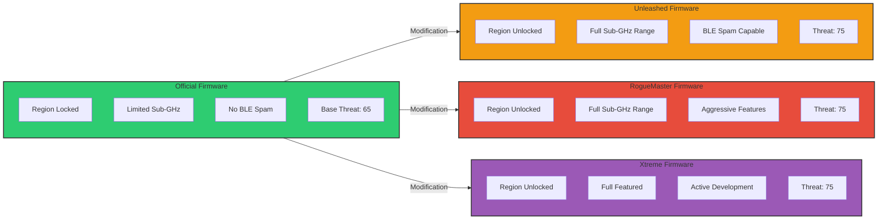

**Detection Differences:**
- Official firmware devices typically advertise with standard "Flipper Zero" naming
- Custom firmware often uses firmware name as prefix (e.g., "Unleashed_Flipper")
- Custom firmware may advertise additional capabilities via service UUIDs

### Capabilities

From `DetectionPatterns.kt`:

| Capability | Frequency/Technology | Use Cases | Concern Level |
|------------|---------------------|-----------|---------------|
| **Sub-GHz** | 300-928 MHz | Garage doors, car key fobs, wireless sensors | High |
| **RFID** | 125 kHz | EM4100, HID Prox access cards | High |
| **NFC** | 13.56 MHz | Mifare, NTAG, EMV payment cards (read-only) | Medium |
| **Infrared** | IR spectrum | TV remotes, AC units, appliances | Low |
| **iButton** | 1-Wire | Building access systems | Medium |
| **GPIO** | Various | Hardware debugging and hacking | Context-dependent |
| **BadUSB** | USB HID | Keystroke injection via USB | High |
| **BadBT** | Bluetooth HID | Bluetooth keystroke injection | High |
| **BLE** | 2.4 GHz | Device impersonation, spam attacks | High |

---

## 3. BLE Spam Attack Detection

### Detection Thresholds

From `BleDetectionHandler.kt`:

```kotlin
/** Time window for BLE spam detection (milliseconds) */
const val BLE_SPAM_DETECTION_WINDOW_MS = 10000L  // 10 seconds

/** Threshold for Apple device advertisements in spam window */
const val APPLE_SPAM_THRESHOLD = 15

/** Threshold for Fast Pair advertisements in spam window */
const val FAST_PAIR_SPAM_THRESHOLD = 10

/** Threshold for unique device names (rapid name changing) */
const val DEVICE_NAME_CHANGE_THRESHOLD = 8

/** Google Fast Pair service UUID */
val UUID_GOOGLE_FAST_PAIR: UUID = UUID.fromString("0000FE2C-0000-1000-8000-00805F9B34FB")
```

### BLE Spam Attack Flow

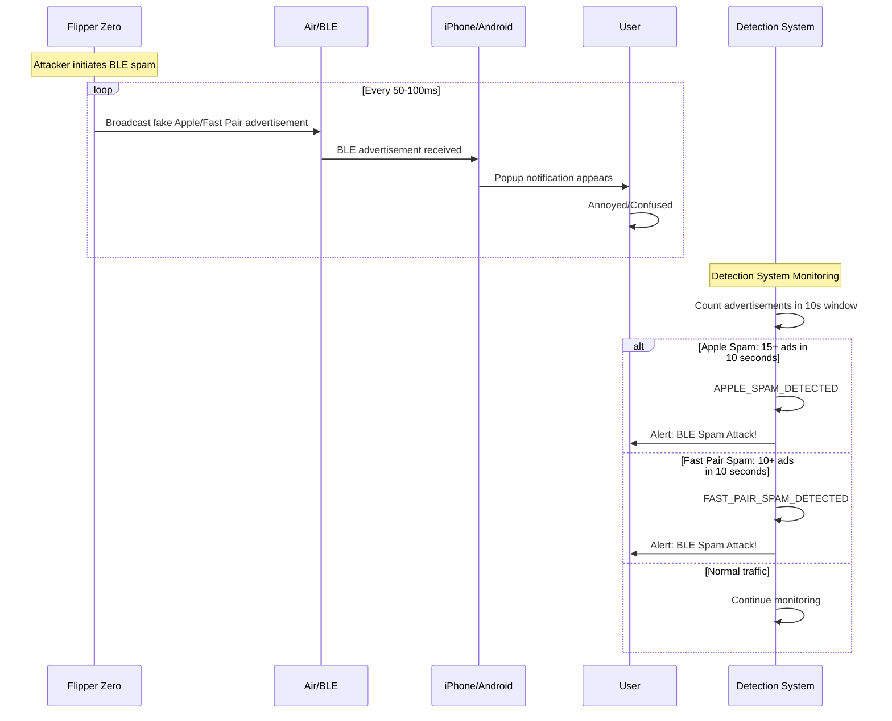

### iOS Popup Attack (Apple BLE Spam)

**How It Works:**
1. Flipper broadcasts fake Apple device advertisements (AirPods, Beats, Apple TV, etc.)
2. iPhones/iPads receive these broadcasts and display pairing request popups
3. Constant popup flood makes devices difficult or impossible to use
4. Can crash older iOS versions

**Detection Method:**
From `BleDetectionHandler.kt`:

```kotlin
// Apple Nearby Action codes that trigger popups
val typeCode = manufacturerData.take(2).uppercase()
return typeCode in listOf(
    "07", "0F", "10", "05", "0C", "0D", "0E", "13", "14",
    "01", "06", "09", "0A", "0B", "11", "12"
)
```

**Apple Advertisement Type Codes:**
- `0x07` = AirPods
- `0x10` = AirPods Pro
- `0x0F` = AirPods Max
- `0x05` = Apple TV setup
- `0x0C` = HomePod
- And others...

**Detection Trigger:** 15+ Apple accessory advertisements within 10 seconds

### Android Fast Pair Spam

**How It Works:**
1. Flipper broadcasts fake Google Fast Pair advertisements
2. Android phones receive these and display pairing notifications
3. Notification shade fills with spam
4. Battery drains from constant notification processing

**Detection Method:**
From `BleDetectionHandler.kt`:

```kotlin
// Track Fast Pair advertisements
if (context.serviceUuids.any { it == UUID_GOOGLE_FAST_PAIR } ||
    context.manufacturerData.containsKey(MANUFACTURER_ID_GOOGLE)) {
    // Track and analyze
}
```

**Detection Trigger:** 10+ Fast Pair advertisements within 10 seconds

### Device Impersonation (Rapid Name Change)

**How It Works:**
1. Single Flipper rapidly changes its advertised device name
2. Appears as multiple different Bluetooth devices
3. Used for confusion, testing device responses, or triggering vulnerabilities

**Detection Method:**
From `BleDetectionHandler.kt`:

```kotlin
// Track device name changes from same MAC
for ((mac, nameEvents) in deviceNameHistory) {
    if (nameEvents.size >= DEVICE_NAME_CHANGE_THRESHOLD) {
        val uniqueNames = nameEvents.map { it.deviceName }.toSet().size
        if (uniqueNames >= DEVICE_NAME_CHANGE_THRESHOLD) {
            // Impersonation detected
        }
    }
}
```

**Detection Trigger:** 8+ unique device names from single MAC within 10 seconds

### Detection Decision Flowchart

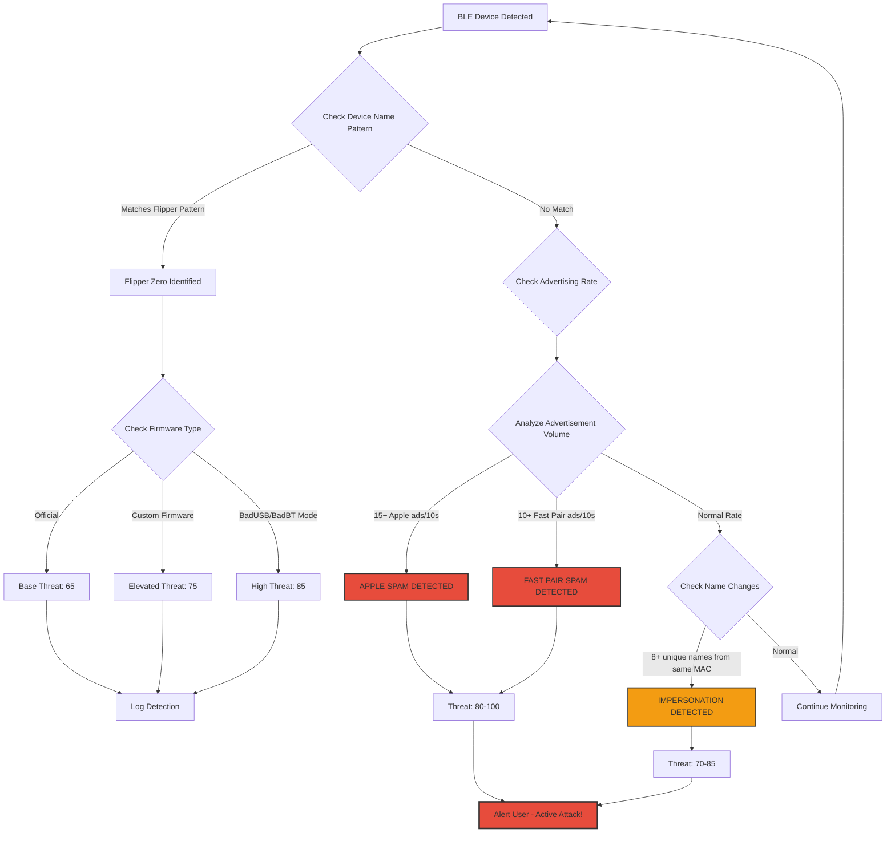

### Spam Analysis Scoring

From `BleDetectionHandler.kt`:

```kotlin
// High event rate is suspicious
if (eventsPerSecond > 5f) {
    suspicionReasons.add("Very high advertisement rate")
    threatScore += 20
} else if (eventsPerSecond > 2f) {
    suspicionReasons.add("Elevated advertisement rate")
    threatScore += 10
}

// Many unique MACs is suspicious (MAC randomization)
if (uniqueMacs.size > 5) {
    suspicionReasons.add("Many unique MAC addresses - likely MAC randomization")
    threatScore += 15
}

// Single MAC with many events
if (uniqueMacs.size == 1 && events.size > 10) {
    suspicionReasons.add("Single source flooding")
    threatScore += 15
}
```

---

## 4. Other Hacking Tools

### Hak5 Devices

From `DetectionPatterns.kt`:

#### WiFi Pineapple
```kotlin
// WiFi detection
pattern = "(?i)^(pineapple|hak5|wifi[_-]?pineapple).*"
threatScore = 90
description = "WiFi Pineapple - network auditing/attack tool"
```

**Capabilities:**
- Evil twin attacks
- Credential capture
- MITM attacks
- Karma attacks (responding to all probe requests)

#### Bash Bunny
```kotlin
pattern = "(?i)^(bash[_\\- ]?bunny|bashbunny).*"
threatScore = 80
description = "Hak5 Bash Bunny - USB attack platform"
```

**Capabilities:**
- Multi-device emulation (keyboard, storage, ethernet)
- Runs Debian Linux internally
- File exfiltration to internal storage
- Network attacks via ethernet emulation
- Credential harvesting

#### LAN Turtle
```kotlin
pattern = "(?i)^(lan[_\\- ]?turtle|lanturtle).*"
threatScore = 80
description = "Hak5 LAN Turtle - covert network access device"
```

**Capabilities:**
- Appears as normal USB ethernet adapter
- Provides remote shell access
- Man-in-the-middle network position
- DNS spoofing and credential capture
- VPN tunneling out of network

#### USB Rubber Ducky
```kotlin
pattern = "(?i)^(rubber[_\\- ]?ducky|rubberducky).*"
threatScore = 75
description = "Hak5 USB Rubber Ducky - keystroke injection device"
```

**Capabilities:**
- Keystroke injection at 1000+ characters/second
- Can open shells, download malware, exfiltrate data
- Works on any OS that accepts USB keyboards
- New versions have WiFi and storage

#### Key Croc
```kotlin
pattern = "(?i)^(key[_\\- ]?croc|keycroc).*"
threatScore = 85
description = "Hak5 Key Croc - keylogger with WiFi exfiltration"
```

**Capabilities:**
- Captures all keystrokes (inline between keyboard and computer)
- WiFi exfiltration of captured data
- Trigger-based payload execution
- Pattern matching for credentials

#### Shark Jack
```kotlin
pattern = "(?i)^(shark[_\\- ]?jack|sharkjack).*"
threatScore = 80
description = "Hak5 Shark Jack - portable network attack tool"
```

**Capabilities:**
- Network reconnaissance
- Automated attack payloads
- Nmap scanning
- Data exfiltration
- Pocket-sized form factor

#### Screen Crab
```kotlin
pattern = "(?i)^(screen[_\\- ]?crab|screencrab).*"
threatScore = 85
description = "Hak5 Screen Crab - HDMI man-in-the-middle"
```

**Capabilities:**
- HDMI video interception
- Screenshot capture
- WiFi exfiltration
- Remote viewing capability
- Captures everything on screen including passwords

### RF Tools

#### HackRF / PortaPack
```kotlin
pattern = "(?i)^(hackrf|portapack).*"
threatScore = 70
description = "HackRF/PortaPack SDR - RF analysis and transmission capable"
```

**Capabilities:**
- Wide frequency range (1 MHz - 6 GHz)
- Transmit capability
- Spectrum analysis
- Protocol decoding
- GPS spoofing capability (illegal)
- Cellular signal analysis

#### RTL-SDR
```kotlin
pattern = "(?i)^(sdr|rtl[_\\- ]?sdr).*"
threatScore = 50  // Lower - receive only
description = "Software Defined Radio device - RF monitoring capable"
```

**Capabilities:**
- Receive-only (no transmit)
- Wide frequency coverage
- Common among radio hobbyists
- Lower threat than HackRF

### RFID Tools

#### Proxmark
```kotlin
pattern = "(?i)^proxmark.*"
threatScore = 80
description = "Proxmark RFID/NFC tool - can clone access cards"
```

**Capabilities:**
- Read/write 125 kHz RFID cards (EM4100, HID Prox)
- Read/write 13.56 MHz NFC cards (Mifare, iClass)
- Emulate cards in real-time
- Sniff card-reader communications
- Brute force weak card encryption

#### ChameleonMini
```kotlin
pattern = "(?i)^(chameleon|chameleomini).*"
threatScore = 75
description = "ChameleonMini RFID emulator - card cloning device"
```

#### iCopy-X
```kotlin
pattern = "(?i)^(icopy|icopy[_\\- ]?x).*"
threatScore = 70
description = "iCopy-X RFID cloner"
```

---

## 5. Threat Scoring System

### Base Threat Scores

From `Detection.kt` - Impact factors for hacking tools:

```kotlin
// Hacking tools - context-dependent impact
DeviceType.FLIPPER_ZERO -> 1.5      // Can be legitimate or malicious
DeviceType.FLIPPER_ZERO_SPAM -> 1.9 // Active attack
DeviceType.HACKRF_SDR -> 1.6
DeviceType.PROXMARK -> 1.7          // RFID cloning capability
DeviceType.BASH_BUNNY -> 1.8
DeviceType.LAN_TURTLE -> 1.7
DeviceType.USB_RUBBER_DUCKY -> 1.8
DeviceType.KEYCROC -> 1.8
DeviceType.SHARK_JACK -> 1.7
DeviceType.SCREEN_CRAB -> 1.6
DeviceType.GENERIC_HACKING_TOOL -> 1.5
```

### Threat Level Thresholds

From `Detection.kt`:

```kotlin
fun scoreToThreatLevel(score: Int): ThreatLevel = when {
    score >= 90 -> ThreatLevel.CRITICAL  // Active attack, immediate action
    score >= 70 -> ThreatLevel.HIGH      // High probability threat
    score >= 50 -> ThreatLevel.MEDIUM    // Moderate concern
    score >= 30 -> ThreatLevel.LOW       // Possible concern
    else -> ThreatLevel.INFO             // Notable but not threatening
}
```

### Threat Context State Diagram

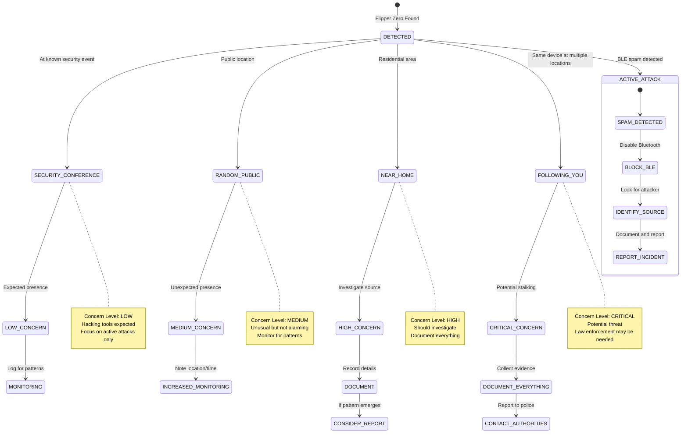

### Detection-Specific Scores

| Detection Type | Base Score | With Attack Indicators | Notes |
|---------------|------------|------------------------|-------|
| Flipper Zero (idle) | 65 | N/A | Presence alone |
| Flipper (custom FW) | 75 | N/A | Enhanced capabilities |
| Flipper BadUSB mode | 85 | N/A | Keystroke injection ready |
| BLE Spam Attack | 60-80 | 80-100 | Based on rate and patterns |
| WiFi Pineapple | 90 | N/A | Network attack tool |
| Proxmark | 80 | N/A | RFID cloning capability |

### Context-Based Adjustments

The system considers context in threat assessment:

**Security Conference Context:**
- Hacking tools expected
- Lower threat urgency
- Still log for pattern analysis

**Random Public Location:**
- Unexpected presence
- Higher concern warranted
- Consider physical security

**Near Secure Facilities:**
- Elevated concern for RFID tools
- Document and potentially report
- Increased monitoring

---

## 6. Real-World Sources

### Flipper Zero Documentation
- **Official Documentation**: [docs.flipper.net](https://docs.flipper.net/)
- **Official GitHub**: [github.com/flipperdevices](https://github.com/flipperdevices)
- **Firmware Repositories**:
  - Unleashed: [github.com/DarkFlippers/unleashed-firmware](https://github.com/DarkFlippers/unleashed-firmware)
  - RogueMaster: [github.com/RogueMaster/flipperzero-firmware-wPlugins](https://github.com/RogueMaster/flipperzero-firmware-wPlugins)

### Security Research on BLE Spam Attacks
- **Techryptic BLE Spam Research**: [github.com/Flipper-XFW/Xtreme-Firmware](https://github.com/Flipper-XFW/Xtreme-Firmware) - Documents BLE spam capabilities
- **Apple Bluetooth Vulnerability Research**: iOS popup spam documented by security researchers in 2023
- **Google Fast Pair Security**: [developers.google.com/nearby/fast-pair](https://developers.google.com/nearby/fast-pair)

### Hak5 Product Documentation
- **Official Hak5 Shop**: [shop.hak5.org](https://shop.hak5.org)
- **Hak5 Documentation**: [docs.hak5.org](https://docs.hak5.org)
- **Hak5 GitHub**: [github.com/hak5](https://github.com/hak5)

### News Coverage of Flipper Attacks
- **Vice/Motherboard**: Coverage of Flipper Zero BLE spam affecting iPhones
- **Ars Technica**: Technical analysis of Flipper capabilities
- **Wired**: Security implications of consumer hacking tools

### iOS/Android Vulnerability Disclosures
- **Apple Security Updates**: Bluetooth-related CVEs
- **Android Security Bulletins**: Fast Pair and Bluetooth vulnerabilities
- **NIST NVD**: CVE database for Bluetooth vulnerabilities

### RFID/NFC Security Research
- **Proxmark Community**: [proxmark.org](https://proxmark.org)
- **RFID Security Research**: Academic papers on access card vulnerabilities
- **HID Global Security Advisories**: Access control system vulnerabilities

---

## 7. Runbook: Responding to Detections

### Response Flowchart

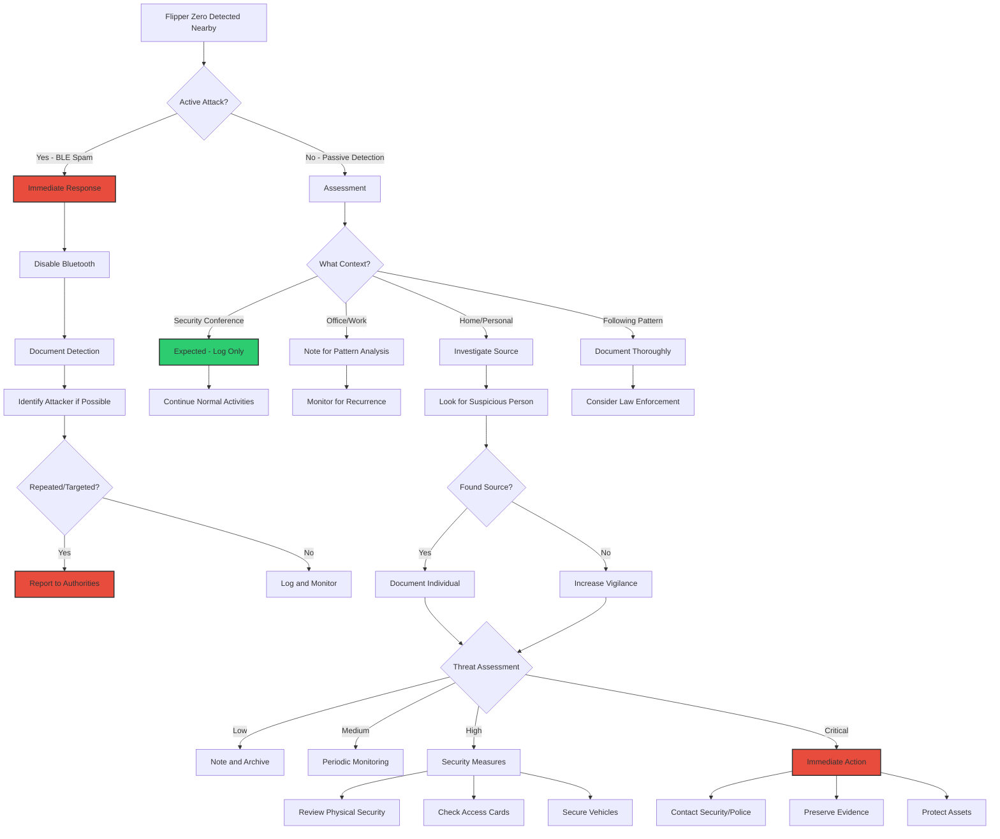

### Flipper Zero Nearby (Idle Detection)

**What It Means:**
- A Flipper Zero device is broadcasting via Bluetooth within range (~10-50m)
- The device owner may be a security researcher, hobbyist, or potential threat
- No active attack is currently detected

**When to Be Concerned:**

| Context | Concern Level | Action |
|---------|---------------|--------|
| Security conference | Low | Expected, log only |
| Office building | Medium | Note for pattern analysis |
| Near secure facility | High | Document and consider reporting |
| Your home | High | Investigate source |
| Following you to multiple locations | Critical | Document, consider authorities |

**Physical Identification:**
1. Look for person with small handheld device
2. Orange/black body (though custom shells exist)
3. Small LCD screen (often showing dolphin mascot)
4. Person may be looking at device then surroundings
5. Range is limited (~10-50m) so person is nearby

### Active BLE Spam Attack

**Immediate Response:**

1. **Stop the Popups:**
   - iOS: Settings > Bluetooth > Off (or use Control Center)
   - Android: Settings > Connected devices > Bluetooth > Off
   - Alternative: Enable Airplane Mode

2. **Identify the Attacker:**
   - Attacker is within ~10-30m (BLE range)
   - Look for person with small device watching others' reactions
   - Note if popups stop when specific person leaves

3. **Document:**
   - Screenshot the detection alert
   - Note time and location
   - Describe any suspicious persons

**Device Protection:**
- Bluetooth off stops the attack immediately
- No permanent damage to device
- Re-enable Bluetooth after leaving area

**Reporting:**
- Consider non-emergency police report if repeated/targeted
- Building security if at workplace
- Transit authority if on public transportation
- Note: BLE spam may violate harassment or computer fraud laws

### Security Conference Context

**Expected Detections:**
- Flipper Zero devices (common among attendees)
- HackRF/SDR equipment
- Proxmark RFID tools
- WiFi Pineapple (for demonstrations)

**Adjusting Sensitivity:**
- Consider enabling "conference mode" if available
- Focus on active attacks rather than presence
- Lower notification priority for passive detections

**Still Concerning:**
- Active BLE spam targeting attendees
- Credential capture attempts
- Unauthorized network attacks
- Stalking behavior (same device following specific person)

---

## 8. Attack Scenarios

### Garage Door Replay Attack

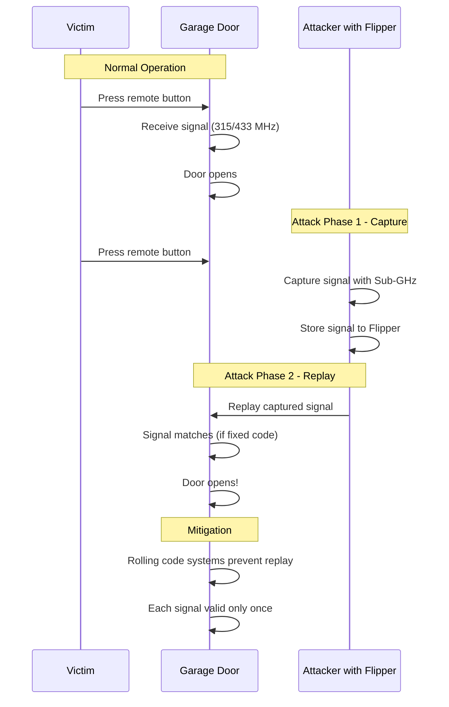

**How It Works:**
1. Attacker captures your garage door signal using Sub-GHz capability
2. If using fixed code (older systems), signal can be replayed
3. Attacker opens garage when you're not home

**Detection:**
- Flipper Zero detected near your home/driveway
- Unusual at this location

**Mitigation:**
- Upgrade to rolling code garage door opener
- Modern systems (after ~1995) typically use rolling codes
- Some older/cheap systems still vulnerable

### Car Key Relay Attack

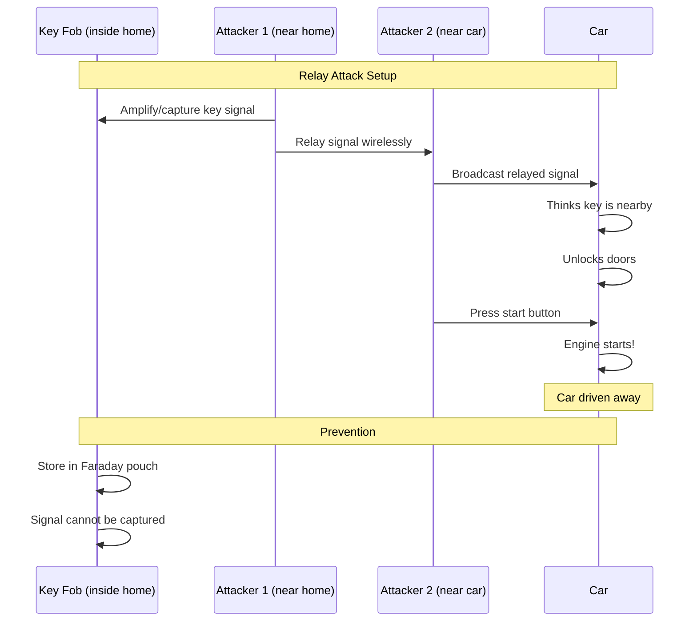

**How It Works:**
1. One attacker near your keys (inside home)
2. Second attacker near your car
3. Key signal relayed between devices
4. Car unlocks and starts without original key

**Detection:**
- Flipper or SDR equipment detected near your vehicle
- May be combined with suspicious person observation

**Mitigation:**
- Faraday pouch/box for keys when not in use
- Check if car has motion-sensor key (sleeps when stationary)
- Some cars have disable key fob option overnight

### BadUSB Payload Delivery

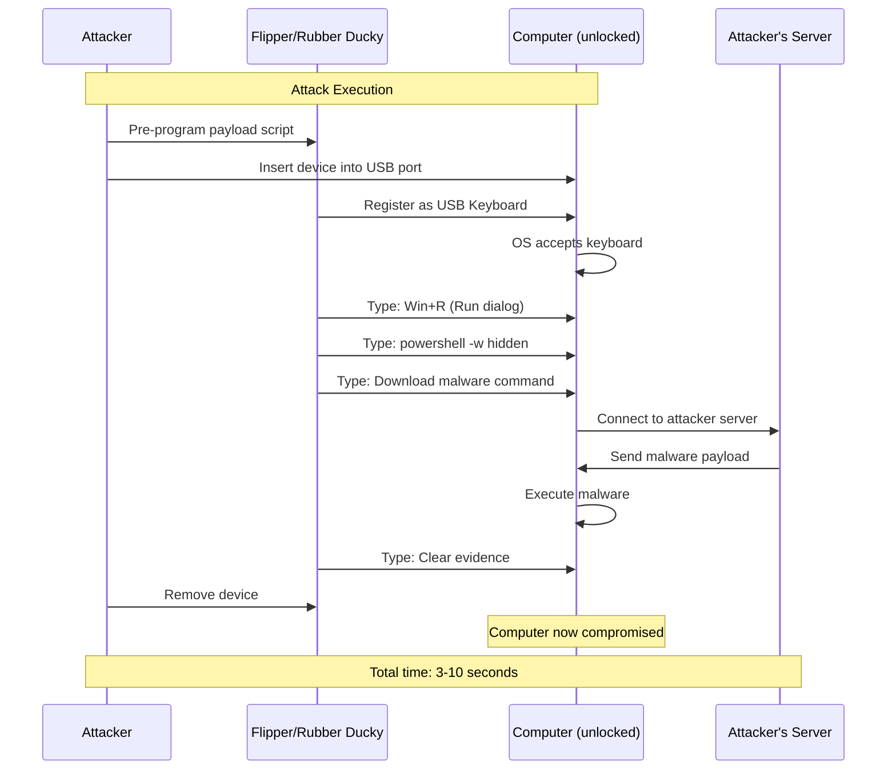

**How It Works:**
1. Attacker plugs Flipper (or Rubber Ducky) into unlocked computer
2. Device types pre-programmed keystrokes at superhuman speed
3. Opens terminal, downloads malware, exfiltrates data
4. Attack completes in seconds

**Detection:**
- Flipper detected in BadUSB mode nearby
- May be too late if already executed

**Mitigation:**
- Never leave computer unlocked
- USB port blockers for unused ports
- Group Policy to restrict USB devices (enterprise)
- Suspicious of anyone near your computer

### Access Card Cloning

**How It Works:**
1. Attacker reads your RFID access card (125 kHz or 13.56 MHz)
2. Card data captured to Flipper or Proxmark
3. Clone card created or emulated directly from device
4. Attacker gains access to secured areas

**Detection:**
- Proxmark or Flipper detected near access control points
- Unusual at secure facility entrances

**Mitigation:**
- Request high-security card types (iClass SE, SEOS)
- Multi-factor authentication (card + PIN)
- Use RFID-blocking wallet for access cards

### BLE Denial of Service

**How It Works:**
1. Attacker floods BLE spectrum with spam advertisements
2. Legitimate Bluetooth devices have difficulty connecting
3. Bluetooth-dependent devices (hearing aids, medical devices) affected
4. Phones unusable due to popup flood

**Detection:**
- BLE spam attack detected by this system
- Threshold: 15+ Apple ads or 10+ Fast Pair ads in 10 seconds

**Mitigation:**
- Disable Bluetooth when not needed
- Move away from attacker (limited range)
- Airplane mode as emergency measure

---

## 9. Known Limitations

### Renamed Devices

**Limitation:**
- Flipper Zero device names can be changed
- Custom firmware allows any device name
- Standard naming patterns won't match renamed devices

**Workaround:**
- BLE spam detection works regardless of device name
- Manufacturer data patterns may still identify device
- Behavioral analysis (advertising rate) helps

### Custom Firmware Evasion

**Limitation:**
- Custom firmware can modify Bluetooth behavior
- Device may advertise with misleading information
- Some firmware removes identifiable patterns

**Workaround:**
- BLE spam detection works on attack behavior, not device ID
- Active attacks are harder to hide than passive presence

### Range Limitations

**BLE Detection Range:**
- Typical: 10-30 meters
- Maximum: ~50 meters (open environment)
- Walls and obstacles reduce range significantly

**Implication:**
- Cannot detect Flipper across large areas
- Detection indicates attacker is nearby
- Useful for proximity awareness, not area surveillance

### What Cannot Be Detected

| Attack Type | Detection Status | Reason |
|------------|------------------|--------|
| Sub-GHz attacks | Not detected | Requires Sub-GHz receiver |
| Infrared attacks | Not detected | Phone lacks IR sensor |
| BadUSB (USB-connected) | Not detected | Not BLE-based |
| iButton attacks | Not detected | Not BLE-based |
| GPIO hardware attacks | Not detected | Physical access required |
| Flipper with BLE disabled | Not detected | No BLE transmission |
| Attacks against other devices | Limited | Only affects your device |

---

## 10. Legal Context

### Flipper Legality by Region

| Region | Status | Notes |
|--------|--------|-------|
| **United States** | Legal to own | Using for unauthorized access is illegal |
| **Canada** | Customs seizures | Some shipments seized; ownership gray area |
| **European Union** | Legal to own | Subject to radio transmission regulations |
| **United Kingdom** | Legal to own | Misuse subject to Computer Misuse Act |
| **Australia** | Legal to own | Subject to RF transmission regulations |
| **Brazil** | Banned by ANATEL | Import prohibited |

### Legitimate Use Cases

1. **Security Research**: Authorized penetration testing
2. **Education**: Learning about RF protocols
3. **Amateur Radio**: Experimentation within licensed bands
4. **Hardware Development**: Prototyping and debugging
5. **Accessibility**: Universal remote for disabled users
6. **Personal Property**: Testing your own access systems

### When Use Becomes Illegal

**Criminal Acts:**
- Cloning someone else's access card without authorization
- Capturing and replaying garage door signals for unauthorized entry
- BLE spam attacks (harassment, disruption)
- BadUSB attacks on computers you don't own
- Car key relay attacks
- Jamming cellular/GPS signals (federal crime)

**Potential Charges:**
- Computer Fraud and Abuse Act (18 U.S.C. 1030)
- Wire fraud
- Unauthorized access to computer systems
- FCC violations for illegal RF transmission
- State-level computer crime statutes
- Harassment/stalking statutes

---

## 11. Mitigation Advice

### Protecting Against Garage Door Attacks

1. **Check Your System:**
   - Systems before ~1995 may use fixed codes (vulnerable)
   - Look for "rolling code" or "code hopping" in documentation

2. **Upgrade if Needed:**
   - Modern rolling code openers (Chamberlain, LiftMaster with Security+ 2.0)
   - Consider smart garage door controllers with encryption

3. **Additional Security:**
   - Interior door lock from garage to house
   - Garage door monitor to detect openings
   - Security cameras covering garage

### Access Card Security

1. **Card Type Awareness:**
   - 125 kHz cards (HID Prox, EM4100) are easily cloned
   - 13.56 MHz with weak encryption (Mifare Classic) can be cracked
   - Request high-security cards (iClass SE, SEOS, DESFire)

2. **Physical Protection:**
   - RFID-blocking wallet or sleeve
   - Don't leave access cards visible/accessible
   - Report lost cards immediately

3. **System Improvements:**
   - Multi-factor authentication (card + PIN)
   - Biometric additions where possible
   - Regular access audits

### Car Key Protection

1. **Faraday Protection:**
   - Store keys in Faraday pouch/box at home
   - Metal container also works (tin, paint can)
   - Test by trying to unlock car with key in container

2. **Vehicle Settings:**
   - Check if car has "key fob sleep" after stillness
   - Some cars allow disabling passive entry overnight
   - Use steering wheel lock as additional deterrent

3. **Awareness:**
   - Note if keyless entry seems sluggish (may indicate relay attempt)
   - Check for unfamiliar vehicles loitering nearby

### BLE Spam Blocking

1. **Immediate Response:**
   - Turn off Bluetooth
   - Enable Airplane Mode if needed

2. **Ongoing Protection:**
   - iOS 17.2+ has some spam protections
   - Android: Disable Fast Pair notifications in Settings
   - Only enable Bluetooth when actively needed

3. **Long-term:**
   - Apple and Google continue to add protections
   - Keep devices updated
   - Consider Bluetooth off as default

### BadUSB Protection

1. **Physical Security:**
   - Never leave computer unlocked
   - Lock screen timeout < 1 minute
   - USB port blockers for unused ports

2. **Technical Controls:**
   - Group Policy: Restrict USB device installation
   - USB device whitelisting
   - Endpoint detection tools

3. **Awareness:**
   - Be suspicious of found USB devices
   - Never plug in unknown USB devices
   - Question why someone needs USB access to your computer

---

## Appendix A: Detection Method Reference

### DeviceType Enum Values (Hacking Tools)

From `Detection.kt`:

```kotlin
FLIPPER_ZERO("Flipper Zero", "dolphin_emoji")
FLIPPER_ZERO_SPAM("Flipper Zero (BLE Spam)", "dolphin_emoji")
HACKRF_SDR("HackRF/SDR Device", "radio_emoji")
PROXMARK("Proxmark RFID Tool", "card_emoji")
USB_RUBBER_DUCKY("USB Rubber Ducky", "duck_emoji")
LAN_TURTLE("LAN Turtle", "turtle_emoji")
BASH_BUNNY("Bash Bunny", "rabbit_emoji")
KEYCROC("Key Croc", "crocodile_emoji")
SHARK_JACK("Shark Jack", "shark_emoji")
SCREEN_CRAB("Screen Crab", "crab_emoji")
GENERIC_HACKING_TOOL("Hacking Tool", "wrench_emoji")
```

### DetectionMethod Enum Values (Hacking Tool Related)

From `Detection.kt`:

```kotlin
FLIPPER_ZERO_DETECTED("Flipper Zero", "Flipper Zero multi-tool hacking device detected via BLE")
FLIPPER_BLE_SPAM("Flipper BLE Spam", "Flipper Zero BLE spam attack detected (popup flood)")
FLIPPER_FAST_PAIR_SPAM("Fast Pair Spam", "Android Fast Pair spam attack detected")
FLIPPER_APPLE_SPAM("Apple BLE Spam", "Apple device impersonation spam attack detected")
HACKING_TOOL_DETECTED("Hacking Tool", "Security testing/hacking tool detected nearby")
```

---

## Appendix B: BLE Spam Attack Data Structures

From `BleDetectionHandler.kt`:

```kotlin
data class BleSpamEvent(
    val timestamp: Long,
    val macAddress: String,
    val deviceName: String?,
    val manufacturerData: String
)

data class DeviceNameEvent(
    val timestamp: Long,
    val deviceName: String
)

enum class BleSpamType {
    APPLE_POPUP,       // iOS popup flood
    FAST_PAIR,         // Android notification spam
    DEVICE_IMPERSONATION  // Rapid name changing
}

data class BleSpamAnalysis(
    val isLikelySpam: Boolean,
    val spamType: String,
    val totalEvents: Int,
    val uniqueSources: Int,
    val eventsPerSecond: Float,
    val suspicionReasons: List<String>,
    val threatScore: Int
)
```

---

## Appendix C: Visual Summary - Complete Detection Flow

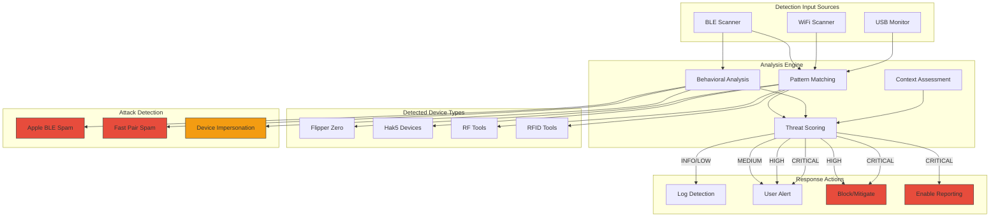

---

## Appendix D: Related Files

- **BleDetectionHandler.kt**: Main BLE detection logic including spam detection
- **DetectionPatterns.kt**: Pattern database for all hacking tools
- **Detection.kt**: Data models and threat scoring
- **ThreatScoring.kt**: Advanced threat calculation

---

*This documentation is based on the Flock You Android application codebase and is intended for security awareness and education purposes.*
