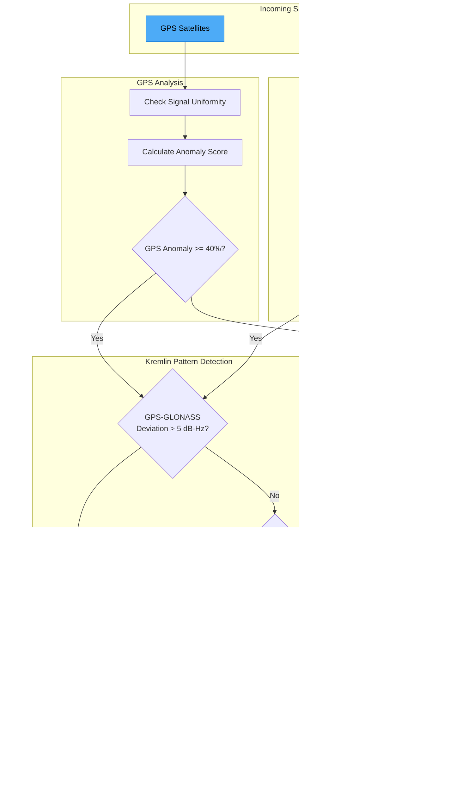

# GNSS Spoofing and Jamming Detection System

## Table of Contents

1. [Overview](#1-overview)
2. [Detection Methods](#2-detection-methods)
3. [Known Attack Patterns](#3-known-attack-patterns)
4. [Constellation Reference](#4-constellation-reference)
5. [Threat Scoring System](#5-threat-scoring-system)
6. [Real-World Sources](#6-real-world-sources)
7. [Runbook: Responding to Detections](#7-runbook-responding-to-detections)
8. [Environmental Context](#8-environmental-context)
9. [Known Limitations](#9-known-limitations)
10. [Technical Reference](#10-technical-reference)

---

## 1. Overview

### What is GNSS?

GNSS (Global Navigation Satellite System) is the umbrella term for satellite-based navigation systems including GPS (USA), GLONASS (Russia), Galileo (EU), BeiDou (China), and regional systems like QZSS (Japan) and IRNSS/NavIC (India).

### Spoofing vs Jamming vs Meaconing

Understanding the differences between these attack types is critical for proper detection and response.


### GPS/GNSS Spoofing

**Spoofing** is the broadcast of fake satellite signals that overpower legitimate signals, causing a receiver to compute an incorrect position. The receiver "locks onto" the stronger fake signals and reports a position chosen by the attacker.

**Key characteristics:**
- Position fix is acquired, but the position is WRONG
- Signals appear healthy (good C/N0, proper modulation)
- Position may "jump" when spoofing starts or stops
- Often all satellites show identical signal strength (from single transmitter)

### GPS/GNSS Jamming

**Jamming** is the broadcast of radio noise on GNSS frequencies that drowns out legitimate satellite signals, preventing the receiver from acquiring any position fix.

**Key characteristics:**
- No position fix possible
- Receiver reports "no satellites" or very weak signals
- Noise floor rises across all frequencies
- AGC (Automatic Gain Control) increases dramatically
- Recovery is immediate when jamming stops

### Meaconing

**Meaconing** (a type of sophisticated spoofing) involves recording real GNSS signals and replaying them with modified timing. This is harder to detect because the signals are genuine but time-shifted.

**Key characteristics:**
- Signals are genuine but delayed
- Position error is proportional to time delay
- Formula: `position_error_meters = time_error_seconds x 299,792,458 (speed of light)`
- 1 microsecond delay = approximately 300 meters position error

### Why Detection Matters

1. **Navigation Safety**: Incorrect position can lead vehicles, ships, or aircraft to wrong locations
2. **Location Privacy**: Spoofing can be used to mask true location from tracking systems
3. **Time Synchronization**: GNSS provides timing for cellular networks, financial systems, and power grids
4. **Security**: Attackers can use spoofing to bypass geofences or location-based access controls

---

## 2. Detection Methods

The system implements multiple detection methods, each targeting different aspects of GNSS spoofing and jamming attacks.

### Detection Pipeline Overview

The following diagram illustrates how incoming satellite data flows through the detection system:


### 2.1 Signal Uniformity Analysis

Real GNSS signals vary in strength due to:
- Different satellite elevation angles (higher = stronger)
- Atmospheric conditions
- Antenna gain patterns
- Multipath environment

**Detection Logic:**

A single spoofing transmitter produces signals with nearly identical strength for all "satellites."

```kotlin
// Thresholds from GnssSatelliteMonitor.kt
const val SUSPICIOUS_CN0_UNIFORMITY_THRESHOLD = 0.15  // dB-Hz variance
const val CN0_UNIFORMITY_WARNING_THRESHOLD = 0.5      // dB-Hz variance

// Decision matrix:
// - Variance < 0.15 dB-Hz = EXTREMELY suspicious (strong spoofing indicator)
// - Variance 0.15-0.5 dB-Hz = Low variance, flag only with other indicators
// - Variance 0.5-5.0 dB-Hz = NORMAL
// - Variance > 5.0 dB-Hz = High variance, likely multipath environment
```

**Normal vs Suspicious:**
| Signal Variance | Assessment |
|-----------------|------------|
| < 0.15 dB-Hz | Extremely uniform - strong spoofing indicator |
| 0.15 - 0.5 dB-Hz | Low variance - monitor with caution |
| 0.5 - 5.0 dB-Hz | Normal operation |
| > 5.0 dB-Hz | High variance - multipath environment |

### 2.2 Elevation Angle Anomaly Detection

Satellites at low elevation angles (near the horizon) should have weak signals due to:
- Longer atmospheric path
- More attenuation
- Higher multipath susceptibility

**Detection Logic:**

Low elevation satellites with high signal strength are physically implausible without a nearby terrestrial transmitter.

```kotlin
// Thresholds from GnssSatelliteMonitor.kt
const val SPOOFING_ELEVATION_THRESHOLD = 5.0         // degrees
const val LOW_ELEVATION_HIGH_SIGNAL_CN0 = 40.0       // dB-Hz

// Detection: Count satellites where:
//   elevation < 5 degrees AND C/N0 > 40 dB-Hz
// If count > 2, this is a strong spoofing indicator
```

### 2.3 Jamming Detection

True jamming prevents satellite acquisition entirely.

```kotlin
// Thresholds from GnssSatelliteMonitor.kt
const val JAMMING_MIN_SATELLITE_LOSS = 10            // Must lose this many satellites
const val JAMMING_MIN_SIGNAL_DROP_DB = 10.0          // Signal must drop by this much
const val JAMMING_MAX_SATELLITES_FOR_DETECTION = 8   // Can't claim jamming with more

// CRITICAL: Cannot claim jamming if:
// - More than 8 satellites visible
// - 10+ satellites used in fix
// - Good signal strength (>30 dB-Hz average) with fix
```

**Jamming Indicators:**
1. Dramatic satellite count drop (lose 10+ satellites)
2. Signal strength degradation across ALL satellites simultaneously
3. Loss of position fix
4. All constellations affected uniformly (not just one)

### 2.4 Cross-Constellation Validation

Different satellite constellations should provide consistent positions. If one constellation behaves differently, it may indicate selective interference.

```kotlin
// Thresholds from GnssSatelliteMonitor.kt
const val CROSS_CONSTELLATION_SIGNAL_RANGE_SUSPICIOUS = 2.0  // dB-Hz
const val MIN_CONSTELLATIONS_FOR_CROSS_CHECK = 3
const val GPS_GLONASS_DEVIATION_THRESHOLD = 15.0             // dB-Hz

// Spoofing indicators:
// - All constellations have identical signal strength (range < 2 dB-Hz)
// - All constellations have suspiciously similar low variance
// - GPS anomalous but GLONASS normal = "Kremlin pattern"
```

### 2.5 Clock Drift Analysis

GNSS provides highly accurate timing. Clock anomalies can indicate signal manipulation.

```kotlin
// Thresholds from GnssSatelliteMonitor.kt
const val MAX_CLOCK_DRIFT_NS = 1_000_000L              // 1ms max drift between measurements
const val driftJumpThresholdNs = 100_000L             // 100 microseconds

// Clock drift trends:
enum class DriftTrend {
    STABLE,      // Normal operation
    INCREASING,  // Drift growing - possible gradual spoofing
    DECREASING,  // Drift shrinking
    ERRATIC      // Unstable - possible meaconing attack
}
```

### 2.6 Geometry Anomaly Detection

Real satellites are distributed across the sky at varying elevations and azimuths.

```kotlin
// Thresholds from GnssSatelliteMonitor.kt
const val ELEVATION_VARIANCE_SUSPICIOUS_THRESHOLD = 100.0  // degrees^2
const val ELEVATION_MEAN_SUSPICIOUS_HIGH = 60.0            // degrees

// Suspicious geometry indicators:
// - All satellites clustered at similar elevations
// - All satellites in one azimuth direction
// - Mean elevation unusually high (>60 degrees)
```

### Satellite Geometry: Normal vs Spoofed

The following diagram illustrates the difference between healthy satellite geometry and suspicious spoofing signatures:


**Geometry Score Calculation:**
- Good geometry = wide elevation spread + good azimuth coverage
- Geometry score ranges from 0.0 to 1.0
- Score < 0.4 indicates poor geometry (may be environmental or spoofing)

### 2.7 Multipath Detection

Multipath occurs when signals reach the receiver via multiple paths (direct + reflections).

```kotlin
// Thresholds from GnssSatelliteMonitor.kt
const val MULTIPATH_SNR_VARIANCE_THRESHOLD = 8.0     // High variance = multipath
const val MULTIPATH_MIN_RATIO = 0.85f               // 85% of signals show multipath
const val MULTIPATH_SUPPRESS_ABOVE_SATELLITES = 15  // Don't report with 15+ sats

// Multipath is NORMAL in:
// - Urban environments (buildings reflect signals)
// - Indoor locations
// - Near water, vehicles, or metal structures
// - Areas with trees or vegetation
```

### 2.8 Gradual Drift Detection (Iranian-Style Attack)

Detects steady position drift in one direction - characteristic of "lead-away" spoofing.

```kotlin
// Thresholds from GnssSatelliteMonitor.kt
const val POSITION_DRIFT_WINDOW_SIZE = 10              // positions to track
const val SUSPICIOUS_DRIFT_RATE_M_PER_S = 5.0          // m/s in one direction
const val DRIFT_DIRECTION_CONSISTENCY_THRESHOLD = 0.8f // 80% same direction

// Detection criteria:
// 1. Drift rate > 5 m/s in consistent direction
// 2. Direction consistency > 80%
// 3. Total drift > 100 meters
```

### Signal Analysis State Machine

The detection system operates as a state machine, transitioning based on observed anomalies:


---

## 3. Known Attack Patterns

### 3.1 Kremlin Circle Pattern (Russian GPS Spoofing)

**Real-world documentation:** Since 2017, ships in the Black Sea have reported being "teleported" to Vnukovo Airport, 37km from the Kremlin.

**Characteristics:**
- Creates circular spoofing zone centered on protected location
- GPS satellites show anomalies (signal uniformity, position errors)
- GLONASS satellites remain NORMAL (Russian system not targeted)
- Affects GPS L1 C/A code primarily

### Kremlin Pattern Detection Logic



**Detection:**
```kotlin
// Kremlin pattern detected when:
// 1. GPS anomaly score >= 40%
// 2. GLONASS health score >= 70%
// 3. GPS-GLONASS signal deviation > 5 dB-Hz or GPS anomaly score >= 50%
```

### 3.2 Iranian RQ-170 Capture Technique (Gradual Drift)

**Real-world documentation:** The 2011 capture of the US RQ-170 drone allegedly used gradual GPS spoofing.

**Characteristics:**
- Gradually shifts position to lead aircraft to wrong location
- Uses "meaconing" - record and replay real signals with modified timing
- Position drift is gradual (meters per second) to avoid detection
- Requires persistent signal manipulation

**Detection:**
- Track position history over time
- Look for consistent drift in one direction
- Flag if drift rate exceeds 5 m/s with >80% directional consistency

### 3.3 Shanghai Port Interference

**Real-world documentation:** Documented GPS interference in Shanghai Huangpu River area affecting commercial shipping.

**Characteristics:**
- Regional pattern affecting multiple vessels simultaneously
- May be inadvertent from nearby military installations
- Affects commercial GPS receivers

**Detection:**
- Multiple devices in same area affected
- Check if anomaly correlates with geographic location

### 3.4 Trucking/Fleet Spoofing (Personal Privacy Devices)

**Real-world documentation:** Drivers hiding location from employer tracking systems.

**Characteristics:**
- Typically single-frequency, affects GPS L1 only
- Low power, affects only the vehicle with the device
- Used to avoid fleet tracking

**Detection:**
- Single device affected while others nearby are normal
- Check if other devices in same location see same anomaly

### 3.5 Consumer Spoofing (Pokemon GO / Gaming)

**Real-world documentation:** Software-based location spoofing for gaming.

**Characteristics:**
- Consumer-grade, very weak signal
- Typically software-only (mock location providers)
- Does NOT affect raw GNSS measurements, only Location API
- Weak spoofing signal from personal privacy device

**Detection:**
- Raw GNSS measurements normal
- Location API reports impossible position
- Check raw measurements vs reported location

---

## 4. Constellation Reference

### GNSS Constellation Coverage Map

The following diagram shows the regional coverage focus of each constellation:


### 4.1 GPS (United States)

| Property | Value |
|----------|-------|
| Operator | US Space Force |
| Satellites | 31 operational |
| Orbital Altitude | ~20,200 km |
| Frequencies | L1 (1575.42 MHz), L2 (1227.60 MHz), L5 (1176.45 MHz) |
| Coverage | Global |
| Code Type | CDMA |
| Authentication | None (civil), P(Y) encrypted (military) |

**Spoofing Notes:**
- Most commonly spoofed constellation
- L1 C/A code is publicly documented
- Military P(Y) codes are encrypted and very hard to spoof

### 4.2 GLONASS (Russia)

| Property | Value |
|----------|-------|
| Operator | Russian Space Forces |
| Satellites | 24 operational |
| Orbital Altitude | ~19,100 km |
| Frequencies | G1 (1602 MHz band), G2 (1246 MHz band), G3 (1202.025 MHz) |
| Coverage | Global |
| Code Type | FDMA (frequency division) |
| Authentication | None |

**Spoofing Notes:**
- FDMA-based - harder to spoof all frequencies simultaneously
- Often unaffected in Russian GPS spoofing operations (Kremlin pattern)
- Compare with GPS for cross-validation

### 4.3 Galileo (European Union)

| Property | Value |
|----------|-------|
| Operator | European Union Agency for the Space Programme |
| Satellites | 30 (28 operational) |
| Orbital Altitude | ~23,222 km |
| Frequencies | E1 (1575.42 MHz), E5a/E5b (1176.45/1207.14 MHz), E6 (1278.75 MHz) |
| Coverage | Global |
| Code Type | CDMA |
| Authentication | **OSNMA (since August 2023)** |

**Spoofing Notes:**
- **OSNMA (Open Service Navigation Message Authentication)** provides cryptographic proof of signal authenticity
- Authentication failure = CONFIRMED spoofing
- Requires OSNMA-capable receiver
- ~10-15 minutes of data needed for initial authentication

### 4.4 BeiDou (China)

| Property | Value |
|----------|-------|
| Operator | China National Space Administration |
| Satellites | 45+ (including regional GEO satellites) |
| Orbital Altitude | MEO: ~21,528 km, GEO: ~35,786 km |
| Frequencies | B1 (1561.098 MHz), B2 (1207.14 MHz), B3 (1268.52 MHz) |
| Coverage | Global (enhanced in Asia-Pacific) |
| Code Type | CDMA |
| Authentication | None (civil) |

**Expected Visibility:**
```kotlin
// Better coverage when: longitude > 70 AND longitude < 180 (Asia-Pacific)
```

### 4.5 QZSS (Japan)

| Property | Value |
|----------|-------|
| Operator | Japan Cabinet Office |
| Satellites | 4 |
| Orbital Altitude | Quasi-zenith orbit (35,786 km apogee) |
| Frequencies | L1, L2, L5, L6 |
| Coverage | Japan and surrounding area |
| Code Type | CDMA (GPS-compatible) |

**Expected Visibility:**
```kotlin
// Expected when: latitude 20-50 AND longitude 120-150 (Japan region)
```

### 4.6 IRNSS/NavIC (India)

| Property | Value |
|----------|-------|
| Operator | Indian Space Research Organisation |
| Satellites | 7 (3 GEO, 4 GSO) |
| Orbital Altitude | ~36,000 km |
| Frequencies | L5 (1176.45 MHz), S (2492.028 MHz) |
| Coverage | India and surrounding area (1500 km radius) |
| Code Type | CDMA |

**Expected Visibility:**
```kotlin
// Expected when: latitude 0-40 AND longitude 60-100 (India region)
```

### 4.7 SBAS (Augmentation Systems)

| System | Region |
|--------|--------|
| WAAS | United States |
| EGNOS | Europe |
| MSAS | Japan |
| GAGAN | India |
| SDCM | Russia |

Provides differential corrections for improved accuracy.

---

## 5. Threat Scoring System

### 5.1 Spoofing Likelihood Calculation

The system calculates spoofing likelihood as a percentage (0-100%).

**Contributing Factors (Positive):**

| Factor | Score Addition |
|--------|---------------|
| Extremely uniform signals (variance < 0.15) | +25% |
| Low-elevation high-signal satellites (>2) | +10% per satellite |
| Clustered elevation distribution | +15% |
| Very low uniformity score (<0.01) | +20% |
| Abnormally high signal (>55 dB-Hz) | +15% |
| No ephemeris data | +10% |
| All constellations identical signals | +20% |
| Cross-constellation identical variance | +15% |

**Reducing Factors (Strong fix evidence against spoofing):**

| Factor | Score Multiplier |
|--------|-----------------|
| 30+ satellites in fix | x0.3 (70% reduction) |
| 20+ satellites in fix | x0.5 (50% reduction) |
| 10+ satellites in fix | x0.7 (30% reduction) |
| 4+ consistent constellations | x0.6 (40% reduction) |

### 5.2 Jamming Likelihood Calculation

Jamming likelihood is ZERO if:
- More than 8 satellites visible
- 10+ satellites used in fix
- Good fix with average signal >30 dB-Hz

**Contributing Factors:**

| Factor | Score Addition |
|--------|---------------|
| Detected jamming with <4 satellites | +40% |
| Signal drops (>5) | +8% per drop beyond 5 |
| C/N0 below baseline with satellite loss | Up to +25% |
| Lost >50% satellites, now <4 | +35% |

### 5.3 Severity Level Mapping

```kotlin
// From GnssDetectionHandler.kt
fun calculateThreatLevel(spoofing: Float, jamming: Float): ThreatLevel {
    val maxLikelihood = maxOf(spoofing, jamming)
    return when {
        maxLikelihood >= 80 -> ThreatLevel.CRITICAL
        maxLikelihood >= 60 -> ThreatLevel.HIGH
        maxLikelihood >= 40 -> ThreatLevel.MEDIUM
        maxLikelihood >= 20 -> ThreatLevel.LOW
        else -> ThreatLevel.INFO
    }
}
```

### 5.4 Anomaly Confidence Levels

| Confidence | Description | Minimum Factors |
|------------|-------------|-----------------|
| CRITICAL | Active attack highly likely | 4+ contributing factors |
| HIGH | Strong indication of attack | 3 contributing factors |
| MEDIUM | Suspicious, investigate | 2 contributing factors |
| LOW | Minor anomaly, monitor | 1 contributing factor |

---

## 6. Real-World Sources

### Academic Papers and Research

1. **"GPS Spoofing and Detection"** - University of Texas at Austin
   - https://radionavlab.ae.utexas.edu/research/gps-spoofing-and-detection
   - Foundational research on civil GPS spoofing techniques

2. **"Assessing the Spoofing Threat: Development of a Portable GPS Civilian Spoofer"** - Humphreys et al., 2008
   - ION GNSS 2008 Conference
   - First public demonstration of civil GPS spoofing

3. **"Detection and Localization of Multiple Spoofing Attackers"** - Psiaki & Humphreys
   - IEEE Transactions on Aerospace and Electronic Systems

### Government and Official Reports

4. **C4ADS Report: "Above Us Only Stars"** (2019)
   - https://c4ads.org/reports/above-us-only-stars/
   - Comprehensive analysis of GPS spoofing around Russian military installations

5. **US Department of Homeland Security GPS Interference Reports**
   - https://www.dhs.gov/science-and-technology/gps-rfi
   - Official government resources on GPS interference

6. **European GNSS Agency (GSA/EUSPA) OSNMA Documentation**
   - https://www.gsc-europa.eu/galileo/services/galileo-open-service-navigation-message-authentication-osnma
   - Official Galileo authentication documentation

### News and Incident Reports

7. **Maritime GPS Spoofing - Black Sea Incidents**
   - https://www.navigation-institute.org/gps-spoofing
   - Documentation of ships reporting false positions

8. **Newark Airport GPS Jammer Incident (2013)**
   - FAA reports of GPS jamming affecting Ground Based Augmentation System
   - Traced to truck driver's personal privacy device

9. **Shanghai Port GPS Interference**
   - MIT Technology Review coverage
   - https://www.technologyreview.com/

### Technical Standards

10. **3GPP TS 38.101-5, TS 36.102**
    - NTN (Non-Terrestrial Network) specifications
    - Defines NTN frequency bands and timing characteristics

11. **GPS Interface Control Document (ICD)**
    - https://www.gps.gov/technical/icwg/
    - Official GPS signal specifications

---

## 7. Runbook: Responding to Detections

### Response Decision Flowchart

The following flowchart guides the response process based on detection type:


### 7.1 Signal Uniformity Anomaly

**Symptoms:** All satellites showing identical or nearly identical signal strength.

**Verification Steps:**

1. **Check variance value:**
   - Variance < 0.15 dB-Hz = Highly suspicious
   - Variance 0.15-0.5 dB-Hz = Monitor closely
   - Variance > 0.5 dB-Hz = Likely normal

2. **Cross-validate with other positioning:**
   - Compare GPS position with cell tower triangulation
   - Compare with WiFi positioning (if available)
   - Check if position matches visible landmarks

3. **Check environment:**
   - Are you indoors? (Signal attenuation can cause uniformity)
   - Are you in a parking garage or tunnel?
   - Indoor weak signals may have reduced variance due to noise floor

4. **Multi-device check:**
   - Ask nearby users if they see same anomaly
   - Single device = possible device issue
   - Multiple devices = possible regional spoofing

### 7.2 Jamming Detection

**Symptoms:** Very few satellites visible, no position fix, degraded signal strength.

**Verification Steps:**

1. **Confirm environment is suitable for GNSS:**
   - Move to open sky area
   - Exit buildings, parking garages, tunnels
   - Get away from overhead obstructions

2. **Check if truly no signal:**
   - Indoor = expected signal loss (NOT jamming)
   - Parking garage = expected signal loss
   - Open sky with no signal = suspicious

3. **Check other devices:**
   - If only your device affected = likely device issue
   - If multiple devices affected = possible active jamming

4. **Move away from suspected source:**
   - Jammers typically have limited range (5-500m)
   - Try moving 100+ meters and recheck

5. **Report suspected jamming:**
   - In US: FCC (illegal, fines up to $100K)
   - In EU: National spectrum authority

### 7.3 Kremlin-Style Pattern (GPS Anomalous, GLONASS Normal)

**Symptoms:** GPS shows spoofing indicators while GLONASS remains healthy.

**Verification Steps:**

1. **Confirm constellation disparity:**
   - Check GPS signal variance vs GLONASS signal variance
   - GPS anomaly score should be significantly higher

2. **Check geographic context:**
   - Are you near a government facility or protected site?
   - This pattern is consistent with state-level spoofing

3. **Cross-validate position:**
   - Trust GLONASS position if available
   - Compare with cell/WiFi positioning

4. **Document for reporting:**
   - Screenshot the anomaly
   - Note time, location, circumstances
   - Report to relevant authorities

### 7.4 Gradual Drift Attack

**Symptoms:** Position slowly drifting in consistent direction over time.

**Verification Steps:**

1. **Compare with visual landmarks:**
   - Can you see the building/street the GPS shows?
   - Is position drifting away from your known location?

2. **Check velocity sanity:**
   - Compare GPS-derived velocity with accelerometer
   - If GPS shows movement but you're stationary = spoofing

3. **Airplane mode reset:**
   - Enable airplane mode for 30 seconds
   - Disable and watch GPS re-acquire
   - Note if position "jumps" when re-acquiring

4. **Check time:**
   - Compare device time with NTP or known accurate source
   - Meaconing shifts time proportionally to position error

### 7.5 When to Take Action

**Take immediate action if:**
- Navigation is actively affected (wrong turn directions)
- Multiple independent indicators present
- Position clearly wrong vs visual reference
- Safety-critical navigation (aviation, maritime)

**Monitor and document if:**
- Single indicator present
- Position appears correct
- Environmental factors may explain anomaly

---

## 8. Environmental Context

### Environmental Context Decision Tree

The following decision tree helps determine when to suppress false positive alerts:


### 8.1 Urban Canyon Behavior

**Characteristics:**
- Tall buildings on both sides of street
- Common in downtown areas
- Signal reflections off glass/steel

**Expected GNSS behavior:**
- High signal variance (multipath)
- Reduced satellite visibility
- Position errors of 1-5 meters typical

**False positive risk:** HIGH - Multipath causes signal variations that can look like spoofing.

**Automatic suppression:**
```kotlin
// Detection logic from GnssSatelliteMonitor.kt
val likelyUrban = cn0Variance > URBAN_MULTIPATH_CN0_VARIANCE_THRESHOLD // 8.0 dB-Hz
// Applies 40% threat score reduction when detected
```

### 8.2 Indoor/Tunnel Behavior

**Characteristics:**
- Inside buildings - signals heavily attenuated
- Parking garages - near-total blockage
- Tunnels - complete signal loss

**Expected GNSS behavior:**
- Very weak or no signal
- Few satellites visible
- Position fix unlikely

**False positive risk:** VERY HIGH - Signal loss is normal, NOT jamming.

**Automatic suppression:**
```kotlin
// Detection logic
val likelyIndoor = avgSignal < INDOOR_SIGNAL_THRESHOLD  // 25.0 dB-Hz
                   && satellitesUsedInFix < MIN_SATELLITES_FOR_FIX  // 4

// Applies 80% threat score reduction
// Suppression continues for 2 minutes after indoor detection
const val INDOOR_SUPPRESSION_DURATION_MS = 120_000L
```

### 8.3 Near Water Reflections

**Characteristics:**
- Lake, ocean, river, or other large water body
- Specular (mirror-like) reflections

**Expected GNSS behavior:**
- Strong multipath
- Signal variance moderately elevated
- Position fix usually maintained

**False positive risk:** MODERATE

### 8.4 Forest/Vegetation

**Characteristics:**
- Dense tree canopy
- Signal attenuation from foliage

**Expected GNSS behavior:**
- Signal attenuation of 10-20 dB
- Reduced satellite visibility
- Position fix may be degraded

### 8.5 When Multipath is NORMAL vs Suspicious

**Normal Multipath (suppress alerts):**
- Position fix maintained with 15+ satellites
- Multipath varies by constellation
- Urban/indoor environment
- Near water or vehicles

**Suspicious Multipath (investigate):**
- ALL constellations affected uniformly
- Very high multipath ratio (>85%)
- No position fix despite open sky
- Multipath pattern inconsistent with environment

---

## 9. Known Limitations

### 9.1 Attacks That Cannot Be Detected

1. **Sophisticated Meaconing:**
   - High-quality replay attacks with correct carrier phase
   - Attacks that maintain time coherence
   - May require external time reference (Galileo OSNMA, NTP) for detection

2. **Multi-Transmitter Spoofing:**
   - Coordinated attack with multiple transmitters
   - Can create realistic signal variance
   - Very expensive and difficult to implement

3. **Simulator-Based Spoofing:**
   - Professional GNSS simulators produce realistic signals
   - May include correct ephemeris and realistic geometry
   - Requires comparison with external sources

4. **Software Mock Location:**
   - Mock location providers bypass raw measurements
   - Not a radio attack - device-level manipulation
   - Raw measurements show normal operation

### 9.2 False Positive Scenarios

1. **Indoor environments:**
   - Weak signals and reduced variance
   - Suppressed after 2 minutes of indoor detection

2. **Device calibration issues:**
   - Some receivers have AGC that normalizes signal levels
   - May cause artificial signal uniformity

3. **Cold start:**
   - Transient signal anomalies during acquisition
   - Allow time for signals to stabilize

4. **Single constellation visible:**
   - In some regions, not all constellations available
   - QZSS and IRNSS are regional only

### 9.3 Hardware Limitations

1. **Consumer-grade receivers:**
   - Limited to civil signals (no military P(Y) code)
   - No access to authenticated signals without OSNMA support
   - Limited multipath mitigation

2. **Raw measurement availability:**
   - Not all Android devices provide raw GNSS measurements
   - API level 24+ required for raw measurements
   - Some OEMs disable raw measurement access

3. **Frequency limitations:**
   - Most consumer devices only receive L1/E1 signals
   - Multi-frequency analysis requires compatible hardware

---

## 10. Technical Reference

### 10.1 C/N0 Signal Strength Reference

C/N0 (Carrier-to-Noise density ratio) is measured in dB-Hz.

| C/N0 (dB-Hz) | Signal Quality | Description |
|--------------|----------------|-------------|
| > 55 | SUSPICIOUS | Too strong for space-based signals |
| 45-55 | EXCELLENT | Best possible conditions |
| 35-45 | GOOD | Typical open sky |
| 25-35 | MEDIUM | Partial obstruction or multipath |
| 15-25 | WEAK | Heavy attenuation (indoor, forest) |
| 0-15 | VERY WEAK | Barely usable |
| < 0 | NOISE | No usable signal |

```kotlin
// From GnssSatelliteMonitor.kt
const val MAX_VALID_CN0_DBH = 55.0  // Above this is suspicious
const val MIN_VALID_CN0_DBH = 10.0  // Below this is noise
const val TERRESTRIAL_SIGNAL_THRESHOLD = 55.0  // Suggests terrestrial transmitter
```

### 10.2 Expected Satellite Counts by Environment

| Environment | Visible Satellites | Used in Fix |
|-------------|-------------------|-------------|
| Open sky | 20-40 | 15-35 |
| Suburban | 15-30 | 10-25 |
| Urban canyon | 8-20 | 5-15 |
| Light forest | 12-25 | 8-18 |
| Dense forest | 5-15 | 3-10 |
| Indoor | 0-5 | 0-3 |
| Parking garage | 0-2 | 0 |

```kotlin
// Thresholds from code
const val MIN_SATELLITES_FOR_FIX = 4
const val GOOD_FIX_SATELLITES = 10
const val EXCELLENT_FIX_SATELLITES = 20
const val STRONG_FIX_SATELLITES = 30
```

### 10.3 Timing and Latency Reference

**GPS Timing Accuracy:**
- GPS provides time accurate to ~100 nanoseconds
- NTP provides time accurate to ~10 milliseconds
- Difference > 1 second is SUSPICIOUS

**Time-Position Relationship:**
```
Position error (meters) = Time error (seconds) x 299,792,458 m/s

Examples:
- 1 nanosecond error = 0.3 meters position error
- 1 microsecond error = 300 meters position error
- 1 millisecond error = 300 kilometers position error
```

### 10.4 Ephemeris and Almanac Basics

**Ephemeris:**
- Precise orbital parameters for each satellite
- Valid for approximately 4 hours
- Broadcast by each satellite in 30-second frames
- Contains: satellite position (X, Y, Z), velocity, clock corrections
- Cold start requires ~30 seconds to download
- Hot start uses cached ephemeris

**Almanac:**
- Coarse orbital parameters for entire constellation
- Valid for several weeks
- Allows receiver to predict which satellites are visible
- Takes ~12.5 minutes to download complete almanac

**Spoofing Relevance:**
- Spoofed signals must provide valid ephemeris to be believable
- Stale ephemeris (wrong satellite positions) can be detected
- Cross-check predicted vs actual satellite positions

### 10.5 PRN Codes

PRN (Pseudo-Random Noise) codes are unique binary sequences that identify each satellite.

```
GPS C/A code: 1023 chips, 1 millisecond period
Each satellite has unique PRN (PRN 1-32 for GPS)
```

**Spoofing Relevance:**
- GPS C/A codes are publicly documented (easy to spoof)
- Military P(Y) codes are encrypted (very hard to spoof)
- Galileo OSNMA adds cryptographic authentication

### 10.6 RAIM (Receiver Autonomous Integrity Monitoring)

```
- Requires 5+ satellites to DETECT a single faulty signal
- Requires 6+ satellites to EXCLUDE the faulty signal
- Computes position using different satellite subsets
- Inconsistent subsets indicate faulty measurement
```

**Limitations:**
- Cannot detect multiple simultaneous faults
- Assumes at most one satellite is faulty
- May not detect sophisticated coordinated spoofing

---

## Appendix: Detection Method Constants Quick Reference

```kotlin
// Signal uniformity thresholds
const val SUSPICIOUS_CN0_UNIFORMITY_THRESHOLD = 0.15  // dB-Hz
const val CN0_UNIFORMITY_WARNING_THRESHOLD = 0.5      // dB-Hz

// C/N0 thresholds
const val MAX_VALID_CN0_DBH = 55.0                    // dB-Hz
const val MIN_VALID_CN0_DBH = 10.0                    // dB-Hz
const val JAMMING_CN0_DROP_THRESHOLD = 15.0           // dB-Hz

// Satellite count thresholds
const val MIN_SATELLITES_FOR_FIX = 4
const val GOOD_FIX_SATELLITES = 10
const val EXCELLENT_FIX_SATELLITES = 20
const val STRONG_FIX_SATELLITES = 30
const val JAMMING_MAX_SATELLITES_FOR_DETECTION = 8

// Geometry thresholds
const val SPOOFING_ELEVATION_THRESHOLD = 5.0          // degrees
const val LOW_ELEVATION_HIGH_SIGNAL_CN0 = 40.0        // dB-Hz
const val ELEVATION_VARIANCE_SUSPICIOUS_THRESHOLD = 100.0  // degrees^2

// Drift detection thresholds
const val MAX_CLOCK_DRIFT_NS = 1_000_000L             // 1 ms
const val SUSPICIOUS_DRIFT_RATE_M_PER_S = 5.0         // m/s
const val DRIFT_DIRECTION_CONSISTENCY_THRESHOLD = 0.8f

// Environmental suppression
const val INDOOR_SIGNAL_THRESHOLD = 25.0              // dB-Hz
const val INDOOR_SUPPRESSION_DURATION_MS = 120_000L   // 2 minutes
const val URBAN_MULTIPATH_CN0_VARIANCE_THRESHOLD = 8.0  // dB-Hz

// Jamming detection
const val JAMMING_MIN_SATELLITE_LOSS = 10
const val JAMMING_MIN_SIGNAL_DROP_DB = 10.0           // dB

// Spoofing/Jamming likelihood thresholds
const val SPOOFING_HIGH_THRESHOLD = 70f
const val SPOOFING_MEDIUM_THRESHOLD = 40f
const val JAMMING_HIGH_THRESHOLD = 70f
const val JAMMING_MEDIUM_THRESHOLD = 40f
```

---

*Document generated from Flock-You-Android source code analysis. Last updated: January 2026.*
