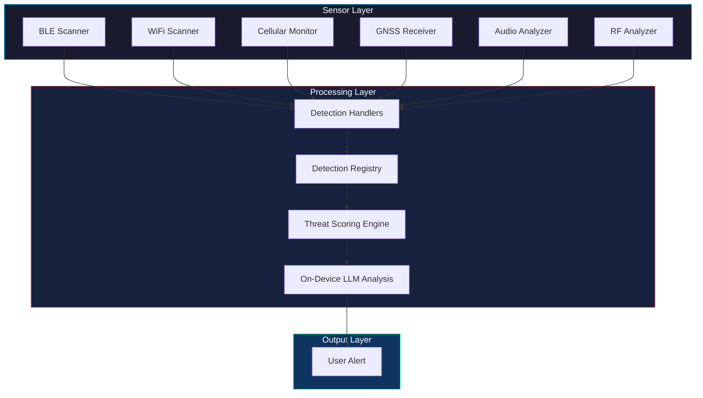
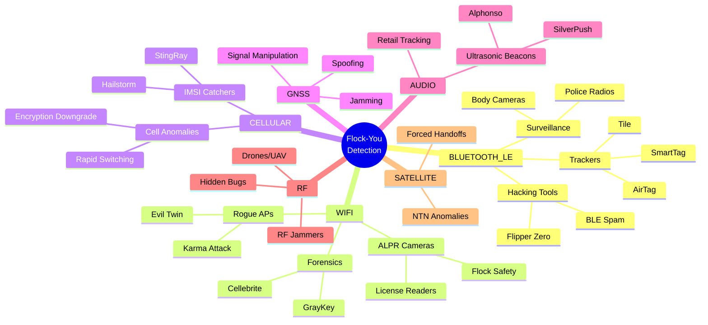
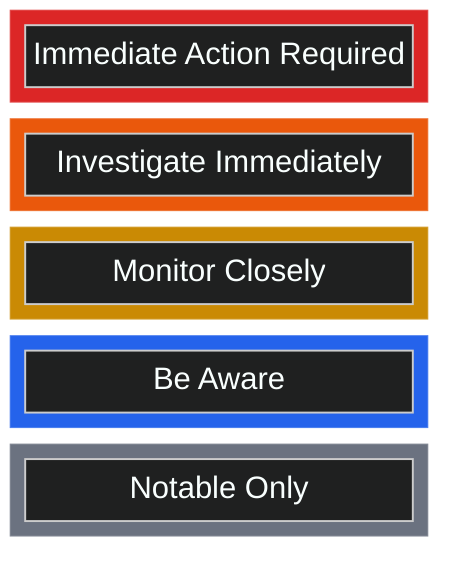
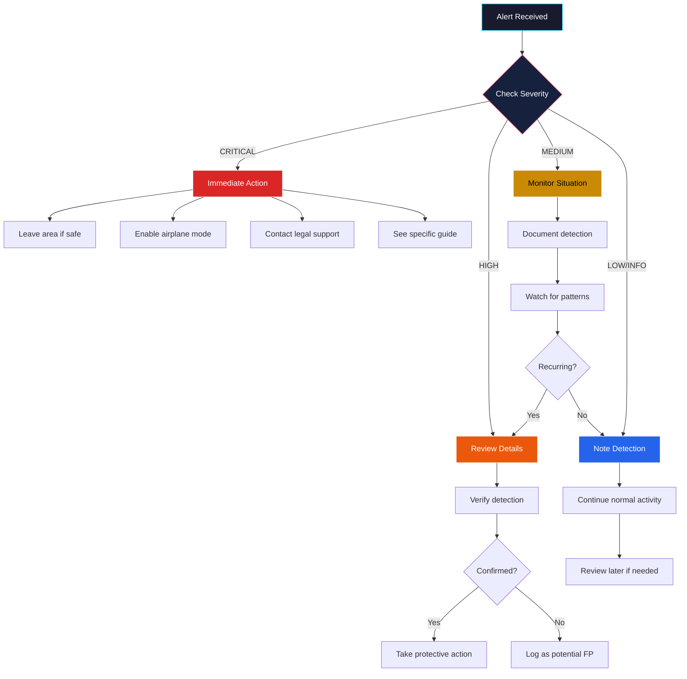
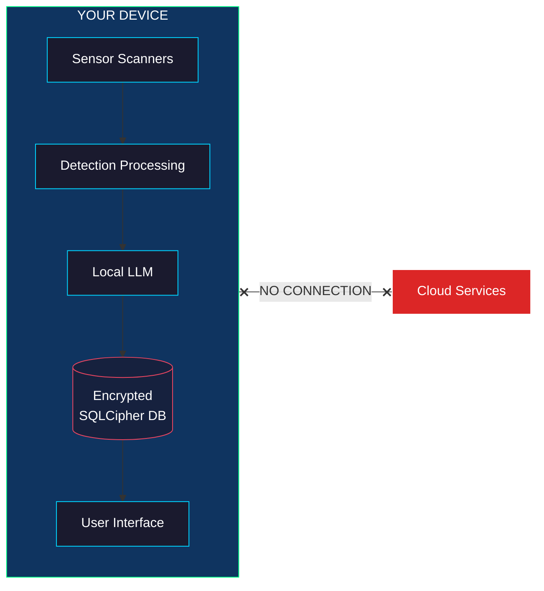
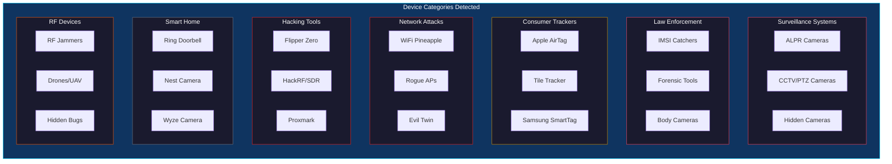
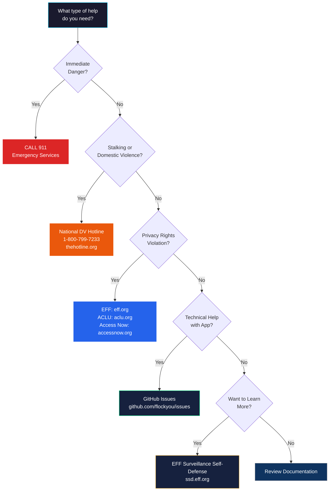
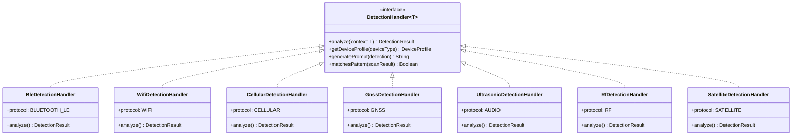
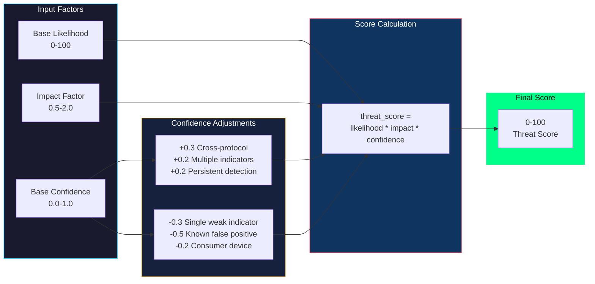

# Flock-You Detection System Documentation

## Master Index

> **Last Updated:** January 2026
> **Version:** 1.0.0

---

## Visual Overview

### Detection System Architecture



### Protocol Coverage Mind Map



### Threat Level Pyramid



### Quick Response Flowchart



### Privacy Architecture



**Privacy Guarantees:**
- All processing happens ON-DEVICE
- NO cloud transmission of any data
- Local LLM only (no OpenAI/Google/etc)
- Data NEVER leaves your phone
- AES-256-GCM encrypted storage

### Device Type Categories



### Documentation Map

```mermaid
flowchart TB
    README["README.md<br/>(This File)"]

    README --> BLE["BLE_TRACKER_DETECTION.md<br/>BLUETOOTH_LE Protocol"]
    README --> WiFi["WIFI_SURVEILLANCE_DETECTION.md<br/>WIFI Protocol"]
    README --> Cell["CELLULAR_IMSI_DETECTION.md<br/>CELLULAR Protocol"]
    README --> GNSS["GNSS_SPOOFING_DETECTION.md<br/>GNSS Protocol"]
    README --> Ultra["ULTRASONIC_TRACKING_DETECTION.md<br/>AUDIO Protocol"]
    README --> Sat["SATELLITE_NTN_DETECTION.md<br/>SATELLITE Protocol"]
    README --> RF["RF_SURVEILLANCE_DETECTION.md<br/>RF Protocol"]
    README --> Flipper["FLIPPER_HACKING_TOOL_DETECTION.md<br/>BLUETOOTH_LE + WIFI"]
    README --> Threat["THREAT_SCORING_FRAMEWORK.md<br/>Scoring System"]
    README --> SatMon["../SATELLITE_MONITORING.md<br/>Satellite Module"]

    BLE --> |Trackers| Track[AirTag, Tile, SmartTag]
    WiFi --> |Cameras| Cam[Flock Safety, Hidden Cams]
    Cell --> |IMSI| IMSI2[StingRay, Hailstorm]

    style README fill:#00ff88,stroke:#fff,color:#000
    style BLE fill:#1a1a2e,stroke:#00d4ff,color:#fff
    style WiFi fill:#1a1a2e,stroke:#00d4ff,color:#fff
    style Cell fill:#1a1a2e,stroke:#00d4ff,color:#fff
    style GNSS fill:#1a1a2e,stroke:#00d4ff,color:#fff
    style Ultra fill:#1a1a2e,stroke:#00d4ff,color:#fff
    style Sat fill:#1a1a2e,stroke:#00d4ff,color:#fff
    style RF fill:#1a1a2e,stroke:#00d4ff,color:#fff
    style Flipper fill:#1a1a2e,stroke:#e94560,color:#fff
    style Threat fill:#16213e,stroke:#ca8a04,color:#fff
    style SatMon fill:#16213e,stroke:#ca8a04,color:#fff
```



### Support Resource Flowchart



---

## 1. Flock-You Detection System Overview

### Mission Statement

Flock-You is an open-source surveillance detection application that empowers individuals to identify and understand surveillance devices in their environment. By detecting police surveillance technology, hidden trackers, IMSI catchers, and other monitoring devices, Flock-You helps people make informed decisions about their privacy and safety.

**"Watch the Watchers"** - Know when surveillance equipment is nearby so you can protect your privacy, document police presence, or simply understand the surveillance landscape around you.

### What the App Detects

Flock-You provides comprehensive detection across seven major categories:

- **Cellular Surveillance**: IMSI catchers (StingRay/Hailstorm), cell site simulators, encryption downgrades
- **GNSS/GPS Attacks**: GPS spoofing, jamming, signal manipulation
- **Bluetooth Trackers**: AirTags, Tile, SmartTags, unknown trackers following you
- **WiFi Surveillance**: Flock Safety ALPR cameras, rogue access points, hidden cameras, evil twin attacks
- **Ultrasonic Tracking**: Cross-device tracking beacons (SilverPush, Alphonso)
- **Satellite Anomalies**: Suspicious NTN connections, forced satellite handoffs
- **RF Surveillance**: Jammers, drones, hidden transmitters
- **Hacking Tools**: Flipper Zero, WiFi Pineapple, Hak5 devices

### Privacy-First Design Principles

1. **No Cloud Processing**: All detection algorithms run entirely on-device
2. **No Data Exfiltration**: Detection data never leaves your device
3. **Local Storage Only**: All data stored in encrypted local database (SQLCipher AES-256-GCM)
4. **No Telemetry**: Zero analytics, crash reporting, or usage tracking
5. **Open Source**: Full code transparency for audit and verification

### On-Device Processing Commitment

Every detection, analysis, and threat assessment happens locally:

- **Pattern Matching**: On-device regex and signature matching
- **Threat Scoring**: Local calculation using enterprise-grade formula
- **LLM Analysis**: Optional local LLM integration (no cloud AI)
- **Data Retention**: User-controlled, locally encrypted

---

## 2. Detection Categories

Quick reference table for all detection categories:

| Category | Threats Detected | Protocol | Documentation |
|----------|------------------|----------|---------------|
| **Cellular** | IMSI catchers, cell anomalies, encryption downgrades | CELLULAR | [CELLULAR_IMSI_DETECTION.md](CELLULAR_IMSI_DETECTION.md) |
| **GNSS** | GPS spoofing, jamming, signal manipulation | GNSS | [GNSS_SPOOFING_DETECTION.md](GNSS_SPOOFING_DETECTION.md) |
| **BLE** | AirTags, Tile, SmartTags, unknown trackers | BLUETOOTH_LE | [BLE_TRACKER_DETECTION.md](BLE_TRACKER_DETECTION.md) |
| **WiFi** | ALPR cameras, rogue APs, hidden cameras, evil twins | WIFI | [WIFI_SURVEILLANCE_DETECTION.md](WIFI_SURVEILLANCE_DETECTION.md) |
| **Ultrasonic** | Cross-device tracking beacons | AUDIO | [ULTRASONIC_TRACKING_DETECTION.md](ULTRASONIC_TRACKING_DETECTION.md) |
| **Satellite** | NTN anomalies, forced handoffs | SATELLITE | [SATELLITE_NTN_DETECTION.md](SATELLITE_NTN_DETECTION.md) |
| **RF** | Jammers, drones, hidden transmitters | RF | [RF_SURVEILLANCE_DETECTION.md](RF_SURVEILLANCE_DETECTION.md) |
| **Hacking Tools** | Flipper Zero, WiFi Pineapple, Hak5 devices | BLUETOOTH_LE/WIFI | [FLIPPER_HACKING_TOOL_DETECTION.md](FLIPPER_HACKING_TOOL_DETECTION.md) |

---

## 3. Threat Level Reference

Flock-You uses a five-tier threat severity system based on enterprise-grade threat scoring:

### CRITICAL (Score 90-100)

**What it means:** Confirmed active threat requiring immediate attention.

**Example threats:**
- Active IMSI catcher with encryption downgrade detected
- Confirmed GPS spoofing attack in progress
- Forensic device (Cellebrite/GrayKey) nearby attempting extraction
- Unknown tracker following you for extended period

**Recommended action:** Take immediate protective measures. Consider leaving the area, disabling radios, or contacting legal support.

### HIGH (Score 70-89)

**What it means:** High probability threat that should be investigated immediately.

**Example threats:**
- Encryption downgrade to 2G detected (strong IMSI catcher indicator)
- Tracker detected at multiple locations you visited
- Evil twin WiFi attack detected
- Flipper Zero BLE spam attack in progress

**Recommended action:** Investigate the source. Document the detection. Consider countermeasures.

### MEDIUM (Score 50-69)

**What it means:** Moderate concern that warrants monitoring.

**Example threats:**
- Suspicious cell parameters but not conclusive
- New unknown tracker nearby
- Flock Safety ALPR camera detected
- Drone detected in vicinity

**Recommended action:** Monitor the situation. Log detections. Be aware of your surroundings.

### LOW (Score 30-49)

**What it means:** Possible concern worth logging and watching.

**Example threats:**
- Single cell tower change while stationary
- Brief ultrasonic detection
- Unknown cell tower (could be new legitimate tower)
- Weak signal from potential surveillance device

**Recommended action:** Note the detection. No immediate action required but maintain awareness.

### INFO (Score 0-29)

**What it means:** Notable but not threatening. Informational only.

**Example threats:**
- Known consumer smart home device (Ring doorbell, Nest camera)
- Normal network handoff
- Retail Bluetooth beacon
- Traffic infrastructure (speed camera, toll reader)

**Recommended action:** No action required. Information logged for completeness.

---

## 4. Detection Protocols

Flock-You monitors seven distinct detection protocols:

### BLUETOOTH_LE
- **Display Name:** Bluetooth LE
- **Icon:** Signal bars
- **Detects:** Trackers (AirTag, Tile, SmartTag), Flipper Zero, body cameras, police radios, Raven gunshot detectors
- **Detection Methods:** BLE name patterns, service UUIDs, manufacturer data

### WIFI
- **Display Name:** WiFi
- **Icon:** Antenna
- **Detects:** Flock Safety ALPR, hidden cameras, rogue APs, surveillance vans, drones
- **Detection Methods:** SSID patterns, MAC OUI prefixes, signal analysis

### CELLULAR
- **Display Name:** Cellular
- **Icon:** Phone
- **Detects:** IMSI catchers (StingRay/Hailstorm), cell site simulators, encryption downgrades
- **Detection Methods:** Network parameter analysis, cell tower tracking, encryption monitoring

### GNSS
- **Display Name:** GNSS/GPS
- **Icon:** Satellite
- **Detects:** GPS spoofing, jamming, signal manipulation, constellation anomalies
- **Detection Methods:** Signal strength analysis, geometry validation, timing verification

### AUDIO
- **Display Name:** Audio/Ultrasonic
- **Icon:** Speaker
- **Detects:** Cross-device tracking beacons (SilverPush, Alphonso), retail beacons
- **Detection Methods:** Frequency spectrum analysis (17.5-22 kHz), pattern matching

### RF
- **Display Name:** RF Analysis
- **Icon:** Radio
- **Detects:** RF jammers, drones, hidden transmitters, spectrum anomalies
- **Detection Methods:** Signal analysis, pattern recognition, interference detection

### SATELLITE
- **Display Name:** Satellite
- **Icon:** Satellite dish
- **Detects:** Suspicious NTN connections, forced satellite handoffs, timing anomalies
- **Detection Methods:** Connection monitoring, timing analysis, network parameter validation

---

## 5. Quick Start Guide

### Understanding Notifications

When Flock-You detects a surveillance device, you receive a notification containing:

1. **Device Type**: What was detected (e.g., "Flock Safety ALPR", "Cell Site Simulator")
2. **Threat Level**: Color-coded severity (Red=Critical, Orange=High, Yellow=Medium, etc.)
3. **Threat Score**: Numeric score (0-100) indicating confidence and severity
4. **Signal Strength**: Estimated proximity based on signal (RSSI)
5. **Detection Method**: How the device was identified

### What to Do When You Get an Alert

**CRITICAL/HIGH Alerts:**
1. Stay calm but alert
2. Note your location and time
3. Consider your options:
   - Leave the area if safe to do so
   - Enable airplane mode if concerned about tracking
   - Document the detection (screenshots)
4. Contact support resources if needed (see Section 10)

**MEDIUM Alerts:**
1. Note the detection
2. Monitor for pattern (same device appearing multiple times)
3. Check if it matches your expected environment
4. No immediate action required

**LOW/INFO Alerts:**
1. Review when convenient
2. These are often expected devices (neighbor's Ring doorbell, etc.)
3. Useful for understanding your surveillance environment

### When to Take Action vs. Ignore

**Take Action When:**
- Same tracker appears at multiple unrelated locations
- Encryption downgrade occurs (2G forced)
- Multiple high-severity alerts in quick succession
- You are in a sensitive situation (protest, meeting, border crossing)
- GPS spoofing detected while navigating

**Safe to Ignore When:**
- Single INFO-level detection of known consumer device
- Expected infrastructure (traffic cameras at intersections)
- Brief, non-repeating LOW-level detections
- Detections near known locations (police station, courthouse)

---

## 6. Architecture Overview

### Detection Handler Pattern

Flock-You uses a modular handler architecture where each detection protocol has a dedicated handler:

```
DetectionHandler<T : DetectionContext>
    |
    +-- BleDetectionHandler (BLUETOOTH_LE)
    +-- WifiDetectionHandler (WIFI)
    +-- CellularDetectionHandler (CELLULAR)
    +-- GnssDetectionHandler (GNSS)
    +-- UltrasonicDetectionHandler (AUDIO)
    +-- RfDetectionHandler (RF)
    +-- SatelliteDetectionHandler (SATELLITE)
```

Each handler implements:
- `analyze(context: T)`: Process detection context and return results
- `getDeviceProfile(deviceType)`: Retrieve device metadata
- `generatePrompt(detection)`: Create prompts for LLM analysis
- `matchesPattern(scanResult)`: Pattern matching for initial detection

### Handler Architecture Diagram



### Registry Coordination

The `DetectionRegistry` serves as the central coordinator:

- **Protocol-based lookup**: `getHandler(DetectionProtocol.BLUETOOTH_LE)`
- **Device type routing**: `getHandlerForDeviceType(DeviceType.AIRTAG)`
- **Aggregate threat calculation**: Combines multiple detections for overall assessment
- **Cross-protocol correlation**: Boosts confidence when same threat seen on multiple protocols

### LLM Integration

Optional local LLM integration for enhanced analysis:

- **Prompt Generation**: Handlers generate structured prompts with detection context
- **Local Processing**: LLM runs on-device (no cloud)
- **Confidence Enhancement**: AI analysis can boost or reduce threat confidence
- **Human-Readable Explanations**: LLM provides natural language threat descriptions

### Scoring System

Threat scores are calculated using an enterprise-grade formula:

```
threat_score = base_likelihood * impact_factor * confidence
```

Where:
- **base_likelihood** (0-100): Probability this is a real threat
- **impact_factor** (0.5-2.0): Potential harm if threat is real
- **confidence** (0.0-1.0): Detection quality adjustments

Confidence adjustments include:
- `+0.3` for cross-protocol correlation
- `+0.2` for multiple confirming indicators
- `+0.2` for persistent detection over time
- `-0.3` for single weak indicator
- `-0.5` for known false positive pattern
- `-0.2` for common consumer device

### Scoring Flow Diagram



---

## 7. Device Types Detected

Comprehensive list of all detectable device types:

### Surveillance Cameras and ALPR

| Device Type | Display Name | Description |
|-------------|--------------|-------------|
| `FLOCK_SAFETY_CAMERA` | Flock Safety ALPR | License plate reader camera with vehicle fingerprinting |
| `LICENSE_PLATE_READER` | License Plate Reader | Generic ALPR system |
| `HIDDEN_CAMERA` | Hidden Camera | Covert WiFi-enabled camera |
| `CCTV_CAMERA` | CCTV Camera | Standard surveillance camera |
| `PTZ_CAMERA` | PTZ Camera | Pan-tilt-zoom surveillance camera |
| `THERMAL_CAMERA` | Thermal Camera | Infrared/thermal imaging camera |
| `NIGHT_VISION` | Night Vision Device | Night vision surveillance equipment |

### Law Enforcement Technology

| Device Type | Display Name | Description |
|-------------|--------------|-------------|
| `STINGRAY_IMSI` | Cell Site Simulator | IMSI catcher for phone interception |
| `CELLEBRITE_FORENSICS` | Cellebrite Forensics | Mobile phone data extraction device |
| `GRAYKEY_DEVICE` | GrayKey Forensics | iPhone/Android password bypass tool |
| `BODY_CAMERA` | Body Camera | Police body-worn camera |
| `POLICE_VEHICLE` | Police/Emergency Vehicle | Law enforcement vehicle |
| `POLICE_RADIO` | Police Radio System | Public safety radio equipment |

### Trackers and Tracking Devices

| Device Type | Display Name | Description |
|-------------|--------------|-------------|
| `AIRTAG` | Apple AirTag | Apple's Bluetooth tracker |
| `TILE_TRACKER` | Tile Tracker | Tile brand Bluetooth tracker |
| `SAMSUNG_SMARTTAG` | Samsung SmartTag | Samsung Galaxy SmartTag tracker |
| `GENERIC_BLE_TRACKER` | BLE Tracker | Unknown Bluetooth tracker |
| `TRACKING_DEVICE` | Tracking Device | Generic GPS/cellular tracker |

### Audio Surveillance

| Device Type | Display Name | Description |
|-------------|--------------|-------------|
| `RAVEN_GUNSHOT_DETECTOR` | Raven Gunshot Detector | Audio surveillance for gunshots |
| `SHOTSPOTTER` | ShotSpotter Sensor | Acoustic gunshot detection system |
| `ULTRASONIC_BEACON` | Ultrasonic Beacon | Cross-device audio tracking beacon |

### Network Attack Devices

| Device Type | Display Name | Description |
|-------------|--------------|-------------|
| `WIFI_PINEAPPLE` | WiFi Pineapple | Hak5 wireless penetration testing device |
| `ROGUE_AP` | Rogue Access Point | Malicious WiFi access point |
| `MAN_IN_MIDDLE` | MITM Device | Man-in-the-middle attack device |
| `PACKET_SNIFFER` | Packet Sniffer | Network traffic capture device |

### Hacking Tools

| Device Type | Display Name | Description |
|-------------|--------------|-------------|
| `FLIPPER_ZERO` | Flipper Zero | Multi-tool hacking device |
| `FLIPPER_ZERO_SPAM` | Flipper Zero (BLE Spam) | Flipper Zero in BLE spam attack mode |
| `HACKRF_SDR` | HackRF/SDR Device | Software-defined radio device |
| `PROXMARK` | Proxmark RFID Tool | RFID cloning and analysis tool |
| `USB_RUBBER_DUCKY` | USB Rubber Ducky | Keystroke injection device |
| `LAN_TURTLE` | LAN Turtle | Covert network access device |
| `BASH_BUNNY` | Bash Bunny | Multi-function attack platform |
| `KEYCROC` | Key Croc | Keylogger with WiFi |
| `SHARK_JACK` | Shark Jack | Portable network attack tool |
| `SCREEN_CRAB` | Screen Crab | HDMI man-in-the-middle device |

### RF and Signal Devices

| Device Type | Display Name | Description |
|-------------|--------------|-------------|
| `RF_JAMMER` | RF Jammer | Radio frequency jamming device |
| `DRONE` | Drone/UAV | Unmanned aerial vehicle |
| `GNSS_SPOOFER` | GNSS Spoofer | GPS spoofing transmitter |
| `GNSS_JAMMER` | GNSS Jammer | GPS signal jammer |
| `HIDDEN_TRANSMITTER` | Hidden Transmitter | Covert RF bug |

### Smart Home and IoT

| Device Type | Display Name | Description |
|-------------|--------------|-------------|
| `RING_DOORBELL` | Ring Doorbell | Amazon Ring smart doorbell |
| `NEST_CAMERA` | Nest/Google Camera | Google Nest security camera |
| `AMAZON_SIDEWALK` | Amazon Sidewalk Device | Amazon mesh network device |
| `WYZE_CAMERA` | Wyze Camera | Wyze smart camera |
| `ARLO_CAMERA` | Arlo Camera | Arlo security camera |

### Traffic and Infrastructure

| Device Type | Display Name | Description |
|-------------|--------------|-------------|
| `SPEED_CAMERA` | Speed Camera | Traffic speed enforcement camera |
| `RED_LIGHT_CAMERA` | Red Light Camera | Intersection enforcement camera |
| `TOLL_READER` | Toll/E-ZPass Reader | Electronic toll collection |
| `TRAFFIC_SENSOR` | Traffic Sensor | Road traffic monitoring sensor |

---

## 8. Detection Methods

All detection methods implemented in the system:

### WiFi Detection Methods

| Method | Display Name | Description |
|--------|--------------|-------------|
| `SSID_PATTERN` | SSID Match | Device identified by WiFi network name pattern |
| `MAC_PREFIX` | MAC Address | Device identified by manufacturer OUI prefix |
| `WIFI_EVIL_TWIN` | Evil Twin AP | Same SSID broadcast from multiple MAC addresses |
| `WIFI_DEAUTH_ATTACK` | Deauth Attack | Rapid WiFi disconnections indicating deauth flood |
| `WIFI_HIDDEN_CAMERA` | Hidden Camera | WiFi network matching hidden camera patterns |
| `WIFI_ROGUE_AP` | Rogue AP | Suspicious or unauthorized access point |
| `WIFI_KARMA_ATTACK` | Karma Attack | AP responding to all probe requests |

### BLE Detection Methods

| Method | Display Name | Description |
|--------|--------------|-------------|
| `BLE_DEVICE_NAME` | BLE Name | Device identified by Bluetooth advertised name |
| `BLE_SERVICE_UUID` | BLE Service | Device identified by Bluetooth service UUIDs |
| `RAVEN_SERVICE_UUID` | Raven Services | Raven gunshot detector identified by specific BLE services |
| `AIRTAG_DETECTED` | AirTag Detected | Apple AirTag tracker detected via BLE |
| `TILE_DETECTED` | Tile Detected | Tile tracker detected via BLE |
| `TRACKER_FOLLOWING` | Tracker Following | Tracker device detected at multiple locations |

### Cellular Detection Methods

| Method | Display Name | Description |
|--------|--------------|-------------|
| `CELL_ENCRYPTION_DOWNGRADE` | Encryption Downgrade | Network forced from 4G/5G to 2G with weak encryption |
| `CELL_SUSPICIOUS_NETWORK` | Suspicious Network | Connected to test/invalid MCC-MNC identifier |
| `CELL_TOWER_CHANGE` | Unexpected Cell Change | Cell tower changed without user movement |
| `CELL_RAPID_SWITCHING` | Rapid Cell Switching | Phone switching towers abnormally fast |
| `CELL_SIGNAL_ANOMALY` | Signal Anomaly | Sudden unexplained signal strength change |
| `CELL_LAC_TAC_ANOMALY` | Location Area Anomaly | LAC/TAC changed unexpectedly |

### GNSS Detection Methods

| Method | Display Name | Description |
|--------|--------------|-------------|
| `GNSS_SPOOFING` | GNSS Spoofing | Fake satellite signals detected |
| `GNSS_JAMMING` | GNSS Jamming | Satellite signals being blocked or degraded |
| `GNSS_SIGNAL_ANOMALY` | GNSS Signal Anomaly | Unusual satellite signal characteristics |
| `GNSS_GEOMETRY_ANOMALY` | GNSS Geometry Anomaly | Impossible satellite positions detected |
| `GNSS_CLOCK_ANOMALY` | GNSS Clock Anomaly | Satellite timing discontinuity detected |

### Ultrasonic Detection Methods

| Method | Display Name | Description |
|--------|--------------|-------------|
| `ULTRASONIC_TRACKING_BEACON` | Tracking Beacon | Ultrasonic beacon for cross-device tracking |
| `ULTRASONIC_AD_BEACON` | Ad Beacon | Advertising/TV tracking ultrasonic signal |
| `ULTRASONIC_RETAIL_BEACON` | Retail Beacon | Retail location tracking ultrasonic |
| `ULTRASONIC_CROSS_DEVICE` | Cross-Device Tracking | Signal linking multiple devices |

### Satellite Detection Methods

| Method | Display Name | Description |
|--------|--------------|-------------|
| `SAT_UNEXPECTED_CONNECTION` | Unexpected Satellite | Satellite connection when terrestrial available |
| `SAT_FORCED_HANDOFF` | Forced Satellite Handoff | Rapid or suspicious handoff to satellite |
| `SAT_SUSPICIOUS_NTN` | Suspicious NTN | Unusual NTN parameters suggesting spoofing |
| `SAT_TIMING_ANOMALY` | Satellite Timing Anomaly | NTN timing doesn't match claimed orbit |

### Hacking Tool Detection Methods

| Method | Display Name | Description |
|--------|--------------|-------------|
| `FLIPPER_ZERO_DETECTED` | Flipper Zero | Flipper Zero multi-tool detected via BLE |
| `FLIPPER_BLE_SPAM` | Flipper BLE Spam | Flipper Zero BLE spam attack detected |
| `FLIPPER_FAST_PAIR_SPAM` | Fast Pair Spam | Android Fast Pair spam attack detected |
| `HACKING_TOOL_DETECTED` | Hacking Tool | Security testing/hacking tool detected |

---

## 9. Privacy Commitment

### No Cloud Processing

- All detection algorithms execute locally on your device
- Pattern matching databases stored locally
- Threat scoring calculations performed on-device
- No network calls to cloud services for analysis

### No Data Collection

- Zero telemetry or analytics
- No crash reporting to external services
- No usage statistics collected
- No advertising or tracking SDKs

### Local LLM Only

- Optional AI analysis uses on-device models only
- No data sent to OpenAI, Google, or other cloud AI
- LLM prompts and responses stay on device
- User controls whether LLM is enabled

### What Data Stays on Device

All the following data is stored locally and never transmitted:

| Data Type | Storage | Encryption |
|-----------|---------|------------|
| Detection history | SQLite/Room | AES-256-GCM |
| Location data | SQLite/Room | AES-256-GCM |
| Cell tower history | SQLite/Room | AES-256-GCM |
| Device signatures | SQLite/Room | AES-256-GCM |
| User preferences | SharedPreferences | Android Keystore |

**Database Encryption:** SQLCipher with key stored in Android Keystore

---

## 10. Resources

### Support Contacts

If you are concerned about being tracked or surveilled, these organizations can help:

| Organization | Contact | Services |
|--------------|---------|----------|
| **National Domestic Violence Hotline** | 1-800-799-7233 | Confidential support for domestic violence survivors |
| **Electronic Frontier Foundation (EFF)** | eff.org | Digital privacy rights and resources |
| **American Civil Liberties Union (ACLU)** | aclu.org | Civil liberties legal support |
| **National Network to End Domestic Violence** | nnedv.org | Safety planning and technology resources |
| **NNEDV Safety Net** | techsafety.org | Technology safety resources |

### External Tools and Databases

| Tool | URL | Description |
|------|-----|-------------|
| **DeFlock** | [deflock.me](https://deflock.me) | Crowdsourced ALPR camera location database |
| **CellMapper** | [cellmapper.net](https://cellmapper.net) | Cell tower mapping and coverage data |
| **OpenCellID** | [opencellid.org](https://opencellid.org) | Open database of cell tower locations |
| **WiGLE** | [wigle.net](https://wigle.net) | Wireless network mapping database |
| **Shodan** | [shodan.io](https://shodan.io) | Internet-connected device search engine |

### Further Reading

#### Academic Papers and Research

- "Detecting and Localizing Cell-Spoofing Attacks in LTE Networks" - IEEE Security & Privacy
- "Who Tracks the Trackers? Analyzing Third-Party Tracking in Mobile Apps" - USENIX Security
- "GPS Spoofing Detection: A Survey" - Computers & Security Journal
- "Ultrasonic Cross-Device Tracking" - ACM CCS

#### News Coverage and Investigations

- The Verge: "How police use StingRay cell phone trackers"
- WIRED: "Inside the Secretive World of IMSI Catchers"
- EFF: "Surveillance Self-Defense Guide"
- Ars Technica: "Flock Safety's ALPR cameras and the surveillance state"

#### Advocacy Organizations

- EFF Surveillance Self-Defense: [ssd.eff.org](https://ssd.eff.org)
- ACLU Privacy & Technology: [aclu.org/issues/privacy-technology](https://aclu.org/issues/privacy-technology)
- Access Now: [accessnow.org](https://accessnow.org)
- Fight for the Future: [fightforthefuture.org](https://fightforthefuture.org)

---

## 11. Documentation Index

### Detection Category Documentation

| Document | Description |
|----------|-------------|
| [CELLULAR_IMSI_DETECTION.md](CELLULAR_IMSI_DETECTION.md) | IMSI catcher and cellular anomaly detection |
| [GNSS_SPOOFING_DETECTION.md](GNSS_SPOOFING_DETECTION.md) | GPS spoofing and jamming detection |
| [BLE_TRACKER_DETECTION.md](BLE_TRACKER_DETECTION.md) | AirTag, Tile, and BLE tracker detection |
| [WIFI_SURVEILLANCE_DETECTION.md](WIFI_SURVEILLANCE_DETECTION.md) | WiFi surveillance and rogue AP detection |
| [ULTRASONIC_TRACKING_DETECTION.md](ULTRASONIC_TRACKING_DETECTION.md) | Ultrasonic cross-device tracking detection |
| [SATELLITE_NTN_DETECTION.md](SATELLITE_NTN_DETECTION.md) | Satellite/NTN anomaly detection |
| [RF_SURVEILLANCE_DETECTION.md](RF_SURVEILLANCE_DETECTION.md) | RF surveillance and drone detection |
| [FLIPPER_HACKING_TOOL_DETECTION.md](FLIPPER_HACKING_TOOL_DETECTION.md) | Flipper Zero and hacking tool detection |

### Framework Documentation

| Document | Description |
|----------|-------------|
| [THREAT_SCORING_FRAMEWORK.md](THREAT_SCORING_FRAMEWORK.md) | Enterprise threat scoring system |
| [../SATELLITE_MONITORING.md](../SATELLITE_MONITORING.md) | Satellite connectivity monitoring module |

### Source Code Reference

| File | Location | Description |
|------|----------|-------------|
| Detection.kt | `data/model/` | Core detection data model and enums |
| DetectionRegistry.kt | `detection/` | Central handler coordination |
| DetectionHandler.kt | `detection/handler/` | Handler interface and base class |
| ThreatScoring.kt | `detection/` | Threat scoring implementation |
| BleDetectionHandler.kt | `detection/handler/` | Bluetooth LE detection |
| WifiDetectionHandler.kt | `detection/handler/` | WiFi detection |
| CellularDetectionHandler.kt | `detection/handler/` | Cellular/IMSI detection |
| GnssDetectionHandler.kt | `detection/handler/` | GNSS/GPS detection |
| UltrasonicDetectionHandler.kt | `detection/handler/` | Ultrasonic detection |
| RfDetectionHandler.kt | `detection/handler/` | RF spectrum detection |
| SatelliteDetectionHandler.kt | `detection/handler/` | Satellite detection |

---

## 12. Contributing

### How to Report Issues

1. **Security Vulnerabilities**: Email security@flockyou.app (do not open public issues)
2. **Bugs**: Open an issue on GitHub with:
   - Device model and Android version
   - Steps to reproduce
   - Expected vs. actual behavior
   - Relevant logs (Settings > Advanced > Error Log)
3. **False Positives**: Open an issue with:
   - Detection details (device type, method, signal strength)
   - Why you believe it's a false positive
   - Location type (urban, rural, home, etc.)

### How to Suggest Improvements

1. **New Device Signatures**: Open an issue or PR with:
   - Device name and manufacturer
   - Detection patterns (SSID, MAC OUI, BLE UUID)
   - Source documentation or research
   - Recommended threat level
2. **Feature Requests**: Open a GitHub discussion with:
   - Use case description
   - Proposed implementation (if any)
   - Privacy implications

### Code Contribution Guidelines

1. **Fork and Branch**: Fork the repo, create a feature branch
2. **Code Style**: Follow existing Kotlin conventions
3. **Tests**: Add tests for new detection patterns
4. **Documentation**: Update relevant docs (including this index)
5. **Privacy Review**: Ensure no data leaves the device
6. **Pull Request**: Open PR with clear description

### Commit Message Format

```
feat(scan): add support for new device type
fix(ble): correct AirTag detection false positives
docs(detection): update threat scoring documentation
```

---

## 13. Changelog

### Version 1.0.0 (January 2026)

**Initial Release**

- 7 detection protocols (BLE, WiFi, Cellular, GNSS, Audio, RF, Satellite)
- 75+ detection patterns for surveillance devices
- Enterprise-grade threat scoring system
- Local LLM integration support
- Encrypted local database (SQLCipher)
- Material 3 dark tactical theme

### Detection Updates

| Version | Date | Changes |
|---------|------|---------|
| 1.0.0 | Jan 2026 | Initial 75+ pattern database |
| 0.9.0 | Dec 2025 | Added Flipper Zero BLE spam detection |
| 0.8.0 | Nov 2025 | Added satellite/NTN monitoring |
| 0.7.0 | Oct 2025 | Added ultrasonic beacon detection |
| 0.6.0 | Sep 2025 | Added GNSS spoofing detection |
| 0.5.0 | Aug 2025 | Added cellular IMSI catcher detection |
| 0.4.0 | Jul 2025 | Added rogue WiFi detection |
| 0.3.0 | Jun 2025 | Added Raven gunshot detector patterns |
| 0.2.0 | May 2025 | Added tracker (AirTag/Tile) detection |
| 0.1.0 | Apr 2025 | Initial WiFi/BLE surveillance detection |

---

## Quick Navigation

- [Visual Overview](#visual-overview)
- [Overview](#1-flock-you-detection-system-overview)
- [Detection Categories](#2-detection-categories)
- [Threat Levels](#3-threat-level-reference)
- [Protocols](#4-detection-protocols)
- [Quick Start](#5-quick-start-guide)
- [Architecture](#6-architecture-overview)
- [Device Types](#7-device-types-detected)
- [Detection Methods](#8-detection-methods)
- [Privacy](#9-privacy-commitment)
- [Resources](#10-resources)
- [Documentation Index](#11-documentation-index)
- [Contributing](#12-contributing)
- [Changelog](#13-changelog)

---

<p align="center">
  <b>Flock-You: Watch the Watchers</b>
  <br/>
  <i>Privacy-first surveillance detection for Android</i>
</p>
