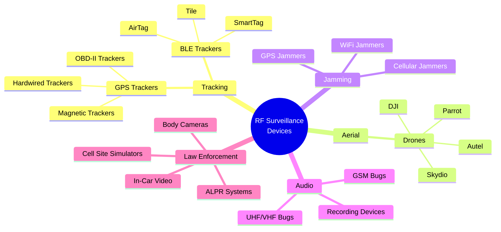
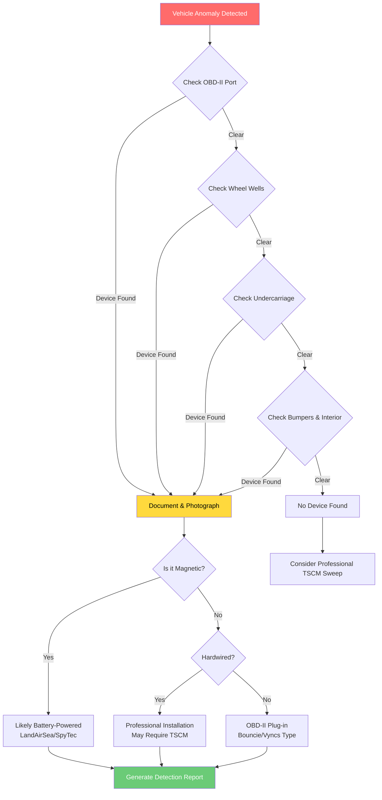
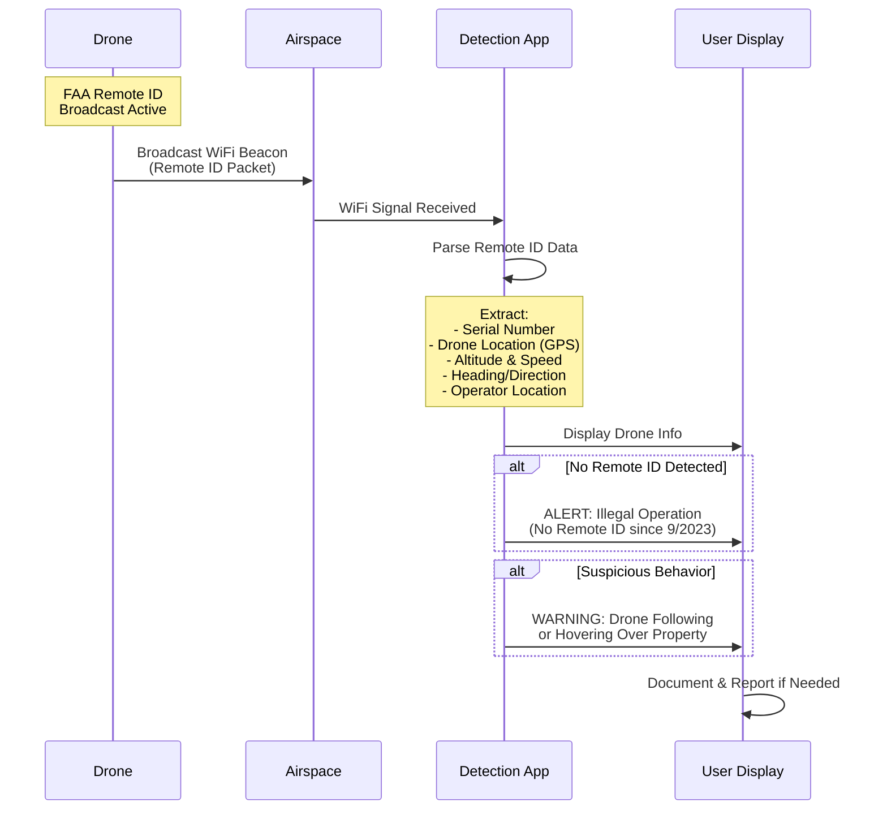
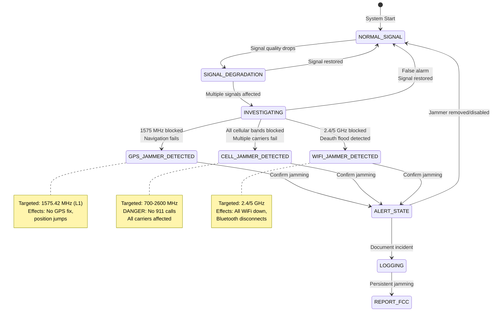
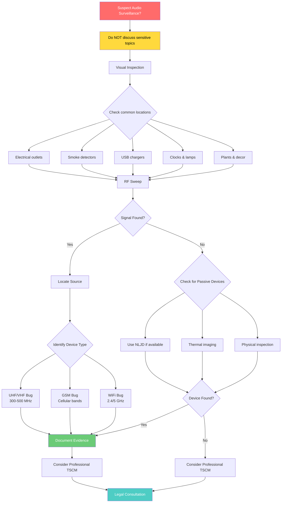
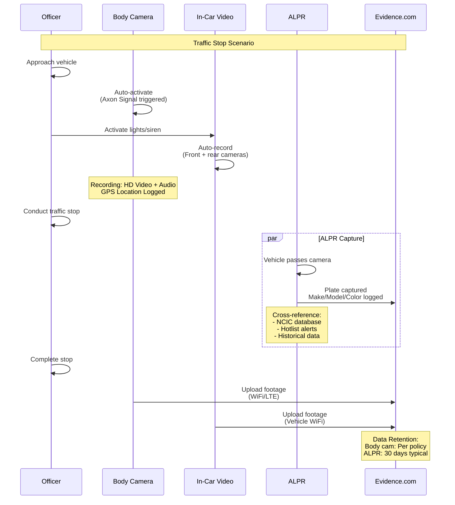
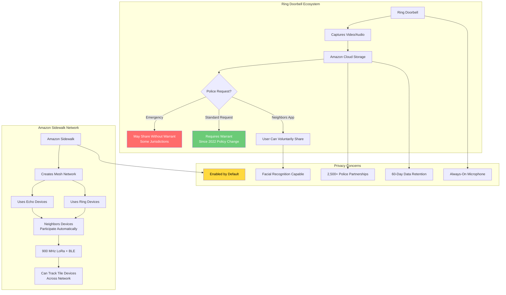
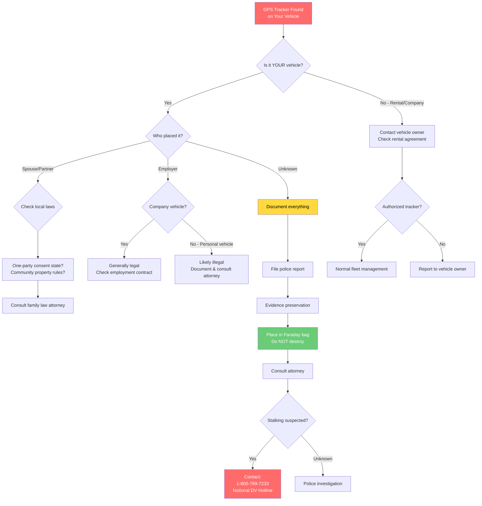

# RF Surveillance and Tracking Device Detection System

## Table of Contents
1. [Overview](#1-overview)
2. [GPS Tracker Detection](#2-gps-tracker-detection)
3. [Drone Detection](#3-drone-detection)
4. [Jammer Detection](#4-jammer-detection)
5. [Professional Surveillance Equipment](#5-professional-surveillance-equipment)
6. [Law Enforcement Equipment](#6-law-enforcement-equipment)
7. [Smart Home / IoT Context](#7-smart-home--iot-context)
8. [Detection Methods](#8-detection-methods)
9. [Real-World Sources](#9-real-world-sources)
10. [Runbook: Responding to Detections](#10-runbook-responding-to-detections)
11. [Physical Search Guide](#11-physical-search-guide)
12. [Known Limitations](#12-known-limitations)
13. [Legal Reference](#13-legal-reference)

---

## 1. Overview

### RF Surveillance Landscape

The modern surveillance landscape encompasses a wide array of RF (Radio Frequency) transmitting devices that can be used to track individuals, intercept communications, or monitor activities. This detection system is designed to identify these devices through multiple protocols:

- **WiFi (2.4 GHz / 5 GHz)**: Hidden cameras, IoT surveillance devices, rogue access points
- **Bluetooth Low Energy (BLE)**: Trackers (AirTag, Tile, SmartTag), body cameras, hacking tools
- **Cellular (various bands)**: IMSI catchers, GSM bugs, GPS trackers with cellular backhaul
- **Sub-GHz (315/433/868/915 MHz)**: Remote controls, LoRa trackers, older surveillance devices
- **GNSS (1.2-1.6 GHz)**: GPS spoofers and jammers

### RF Surveillance Device Hierarchy



### Types of Devices Detected

The system identifies the following categories of surveillance devices:

| Category | Examples | Threat Level |
|----------|----------|--------------|
| **License Plate Readers** | Flock Safety, Vigilant, ELSAG | High |
| **Acoustic Sensors** | Raven, ShotSpotter | Critical |
| **Body Cameras** | Axon Body 3/4, Motorola Si500, WatchGuard | Medium-High |
| **Personal Trackers** | AirTag, Tile, SmartTag | Medium |
| **GPS Trackers** | Bouncie, LandAirSea, SpyTec | High |
| **Drones/UAVs** | DJI Mavic, Autel EVO, Skydio | Medium-High |
| **RF Jammers** | GPS/Cell/WiFi jammers | Critical |
| **Hidden Cameras** | WiFi cameras, P2P cameras | High |
| **Cell Site Simulators** | StingRay, Hailstorm | Critical |
| **Mobile Forensics** | Cellebrite UFED, GrayKey | Critical |
| **Hacking Tools** | Flipper Zero, WiFi Pineapple, Proxmark | Medium-High |

### Detection Methods Used

1. **SSID Pattern Matching**: Regex patterns for WiFi network names (e.g., `(?i)^flock[_-]?.*`)
2. **MAC Address Prefix (OUI) Lookup**: Identifies manufacturer from first 3 octets
3. **BLE Device Name Matching**: Patterns for Bluetooth advertised names
4. **BLE Service UUID Analysis**: Identifies devices by their exposed BLE services
5. **Behavioral Analysis**: Advertising rate, signal strength patterns, location correlation
6. **Cross-Protocol Correlation**: Same device detected on multiple protocols increases confidence

---

## 2. GPS Tracker Detection

### GPS Tracker Detection Flow



### OBD-II Port Trackers

These trackers plug directly into a vehicle's diagnostic port, drawing power continuously from the vehicle.

#### Bouncie GPS Tracker
- **Manufacturer**: Bouncie
- **Power Source**: OBD-II vehicle power (always on)
- **Backhaul**: 4G LTE cellular
- **Typical Use Cases**: Consumer vehicle tracking, teen driver monitoring, fleet management
- **Physical Description**: Small OBD-II plug-in device, usually blue or black, approximately 2x3 inches
- **Data Collected**:
  - Real-time GPS location
  - Vehicle speed
  - Trip history
  - Rapid acceleration/braking events
  - Vehicle diagnostics (DTCs)
  - Geofence alerts

**Detection Methods**:
1. Check OBD-II port under dashboard (driver's side)
2. Look for small device plugged into diagnostic port
3. Use OBD-II scanner to detect unknown device
4. Check for cellular signal near OBD port area

#### Vyncs GPS Tracker
- **Manufacturer**: Vyncs (Agnik)
- **Power Source**: OBD-II vehicle power
- **Backhaul**: 4G LTE cellular
- **Typical Use Cases**: Consumer tracking, insurance telematics, parental monitoring
- **Physical Description**: OBD-II dongle, black plastic, approximately 2x2 inches
- **Data Collected**: GPS location, driving behavior analytics, vehicle health data, fuel economy, trip summaries

#### MOTOsafety GPS Tracker
- **Manufacturer**: MOTOsafety
- **Power Source**: OBD-II vehicle power
- **Backhaul**: 4G LTE cellular
- **Typical Use Cases**: Teen driver monitoring, business fleet tracking
- **Physical Description**: OBD-II plug device with branded logo
- **Data Collected**: Real-time GPS, speed alerts, curfew violations, rapid acceleration/braking

### Magnetic/Battery-Powered Trackers

These trackers use strong magnets to attach to vehicles and rely on internal batteries.

#### LandAirSea Overdrive
- **Manufacturer**: LandAirSea
- **Power Source**: Internal battery
- **Battery Life**: Up to 2 weeks active / 6 months standby
- **Backhaul**: 4G LTE cellular
- **Physical Description**: Small black box, approximately 3x2x1 inches, strong magnet on bottom, waterproof
- **Typical Use Cases**: Private investigation, law enforcement (with warrant), asset tracking, **stalking (illegal)**
- **Threat Score**: 85

**Common Hiding Locations**:
- Under vehicle frame
- Inside wheel wells (all four)
- Behind bumpers (front/rear)
- Under trunk/cargo area
- Attached to metal frame components

**Detection Methods**:
1. Physical search of vehicle undercarriage
2. Check wheel wells (all four)
3. Inspect behind bumpers
4. Look in trunk spare tire area
5. Use flashlight to check frame rails
6. Feel for magnetic attachment points

#### SpyTec GL300
- **Manufacturer**: SpyTec
- **Power Source**: Internal battery
- **Battery Life**: Up to 2.5 weeks
- **Backhaul**: 4G LTE cellular
- **Physical Description**: Small rectangular device, approximately 3x1.5x1 inches, waterproof case available
- **Typical Use Cases**: Personal asset tracking, vehicle tracking, private investigation, rental car monitoring
- **Threat Score**: 80

#### Optimus 2.0 GPS Tracker
- **Manufacturer**: Optimus
- **Power Source**: Internal battery
- **Battery Life**: Up to 2 weeks
- **Backhaul**: 4G LTE cellular
- **Physical Description**: Compact black device with magnetic case option
- **Data Collected**: GPS coordinates, speed, trip history, SOS alerts
- **Threat Score**: 80

### Hardwired Trackers

Professional installations that tap into vehicle wiring for continuous power.

#### Hardwired Fleet Tracker
- **Power Source**: Hardwired to vehicle (always on)
- **Backhaul**: 4G LTE cellular
- **Typical Use Cases**: Commercial fleet management, professional installation, long-term vehicle tracking, **law enforcement (with warrant)**
- **Physical Description**: Small black box connected to vehicle wiring, often hidden in dashboard or under seats
- **Threat Score**: 90

**Common Hiding Locations**:
- Behind dashboard panels
- Under driver/passenger seats
- In center console
- Near OBD-II port (tapped into)
- Inside door panels

**Detection Methods**:
1. Professional TSCM sweep
2. Check for non-factory wiring
3. Inspect under dashboard
4. Look behind panels
5. Trace unusual wires to hidden devices
6. Use RF detector near wiring harness

**Legal Status**: Professional installation requires consent or warrant

---

## 3. Drone Detection

### FAA Remote ID Requirement

As of **September 16, 2023**, the FAA requires most drones operating in the United States to broadcast Remote ID information. This includes:
- Serial number
- Drone GPS coordinates
- Altitude and speed
- Heading/direction
- Operator/controller location
- Timestamp
- Emergency status

### Drone Remote ID Detection Flow



### DJI Drones

DJI is the dominant consumer drone manufacturer. Their drones broadcast Remote ID via WiFi beacon.

#### DJI Mavic Series
- **Control Frequencies**: 2.4 GHz and 5.8 GHz
- **Control Protocol**: OcuSync 2.0/3.0 (proprietary)
- **Remote ID Broadcast**: WiFi Beacon
- **WiFi SSID Patterns**: `(?i)^mavic[-_]?(pro|air|mini|[0-9]).*`
- **BLE Name Patterns**: `(?i)^(mavic|dji)[-_]?.*`
- **MAC OUI Prefixes**: 60:60:1F, 34:D2:62, 48:1C:B9, 60:C7:98
- **Typical Range**: Up to 10km (OcuSync 3.0)

**Suspicious Indicators**:
- Hovering over private property
- Following specific person/vehicle
- Operating at night without lights
- No Remote ID broadcast (illegal)
- Operating near airports/restricted areas

#### DJI Phantom Series
- **Control Frequencies**: 2.4 GHz and 5.8 GHz
- **Control Protocol**: Lightbridge/OcuSync
- **Remote ID Broadcast**: WiFi Beacon
- **WiFi SSID Patterns**: `(?i)^phantom[-_]?[0-9].*`
- **MAC OUI Prefixes**: 60:60:1F, 60:C7:98
- **Typical Range**: Up to 7km

### Other Manufacturers

#### Autel EVO Series
- **Manufacturer**: Autel Robotics
- **Control Frequencies**: 2.4 GHz and 5.8 GHz
- **Control Protocol**: Autel SkyLink
- **Remote ID Broadcast**: WiFi Beacon
- **WiFi SSID Patterns**: `(?i)^(autel|evo)[-_]?(ii|2|lite).*`
- **Typical Range**: Up to 9km
- **Notes**: US-made alternative to DJI

#### Skydio Drones
- **Manufacturer**: Skydio (USA)
- **Control Frequencies**: 2.4 GHz and 5.8 GHz
- **Control Protocol**: Skydio Autonomy
- **Remote ID Broadcast**: WiFi + Bluetooth (both)
- **WiFi SSID Patterns**: `(?i)^skydio[-_]?[0-9x].*`
- **Typical Range**: Up to 6km
- **Notes**: US-made autonomous drone, used by law enforcement/military, autonomous following capability

#### Parrot Anafi
- **Manufacturer**: Parrot (France)
- **Control Frequencies**: 2.4 GHz and 5.8 GHz
- **Control Protocol**: WiFi Direct
- **Remote ID Broadcast**: WiFi Beacon
- **WiFi SSID Patterns**: `(?i)^(parrot|anafi|bebop)[-_]?.*`
- **MAC OUI Prefixes**: A0:14:3D, 90:03:B7, 00:12:1C, 00:26:7E
- **Typical Range**: Up to 4km
- **Notes**: French-made, thermal imaging variants exist

### Remote ID Detection Apps

The following apps can detect drone Remote ID broadcasts:
- **DroneScout** - Official FAA-recommended app
- **OpenDroneID** - Open source reference implementation
- **AirMap** - Commercial drone airspace management

### Suspicious Drone Activity Indicators

| Indicator | Concern Level | Action |
|-----------|---------------|--------|
| No Remote ID broadcast | Critical | Illegal since 9/2023 - document and report |
| Hovering over private property | High | Document, report if persistent |
| Following specific person/vehicle | Critical | Document and contact authorities |
| Night operations without lights | High | FAA violation - report |
| Operating near airports | Critical | Report to FAA immediately |
| Extended surveillance hovering | High | Document time/location |

---

## 4. Jammer Detection

**IMPORTANT**: Operating any RF jammer is **ILLEGAL in the United States** under FCC regulations. Violations can result in fines up to $100,000+ and criminal charges.

### Jammer Detection State Diagram



### GPS Jammers

GPS jammers disrupt satellite navigation signals, commonly used by criminals to defeat vehicle tracking.

**Targeted Frequencies**:
| Band | Frequency | Affected Services |
|------|-----------|-------------------|
| GPS L1 | 1575.42 MHz | GPS navigation, fleet tracking, timing systems |
| GPS L2 | 1227.60 MHz | Precision GPS, survey equipment |
| GLONASS L1 | 1602 MHz | Russian navigation system |

**Detection Signs**:
1. Sudden GPS signal loss while stationary
2. GPS position "jumps" or erratic movement
3. GNSS receiver reports no satellites
4. Multiple devices lose GPS simultaneously
5. GPS accuracy degrades dramatically

**Typical Users**:
- Truckers avoiding fleet tracking (illegal)
- Criminals avoiding location tracking
- Car thieves defeating GPS trackers

**Legal Status**: ILLEGAL in US - up to $100,000 fine + criminal charges (47 U.S.C. Section 333)

**Countermeasures**:
1. Note time and location of jamming
2. Report to FCC if persistent
3. Use cellular-based tracking as backup
4. Professional TSCM equipment can locate jammer

### Cellular Jammers

Cell jammers block all cellular communications in an area.

**Targeted Frequencies**:
| Band | Frequency Range | Affected Services |
|------|-----------------|-------------------|
| 2G/GSM | 850/900/1800/1900 MHz | 2G voice calls, SMS |
| 3G/UMTS | 850/1900/2100 MHz | 3G calls/data |
| 4G/LTE | 700-2600 MHz | LTE data/calls |

**Detection Signs**:
1. All phones lose signal simultaneously
2. Phones show "No Service" or "Emergency Only"
3. Calls drop immediately when entering area
4. Data connections fail completely
5. Multiple carriers affected simultaneously

**DANGER**: Cannot make 911 calls in jammed area

**Legal Status**: ILLEGAL in US except for federal government with waiver

### WiFi Jammers

WiFi jammers disrupt wireless networking and Bluetooth.

**Targeted Frequencies**:
| Band | Frequency Range | Affected Services |
|------|-----------------|-------------------|
| 2.4 GHz | 2400-2483 MHz | WiFi, Bluetooth, IoT devices |
| 5 GHz | 5150-5850 MHz | WiFi 5/6, FPV drones |

**Detection Signs**:
1. Massive deauth packets on all channels
2. All WiFi networks become unreachable
3. Bluetooth devices disconnect
4. Smart home devices go offline
5. Persistent interference across all channels

**Typical Users**:
- Criminals defeating security cameras
- Burglars disabling WiFi alarms
- Corporate espionage

**Countermeasures**:
- Use wired security cameras as backup
- Local recording (SD card) for cameras
- Cellular backup for alarm systems
- Report persistent jamming to FCC

---

## 5. Professional Surveillance Equipment

### Audio Bug Detection Flowchart



### Audio Bugs (UHF/VHF)

#### UHF Audio Transmitter
- **Frequency Bands**: 300-500 MHz (UHF)
- **Modulation**: FM/AM narrowband
- **Transmit Power**: 10-100 mW typically
- **Detection Difficulty**: Medium - RF sweep can detect active transmission
- **Typical Users**: Law enforcement (with warrant), corporate espionage (illegal), private investigators, stalkers (illegal)

**Detection Methods**:
1. Sweep with RF detector in 300-500 MHz range
2. Non-linear junction detector (NLJD)
3. Physical search for hidden devices
4. Check power outlets, lamps, smoke detectors
5. Thermal imaging for active electronics

#### VHF Audio Transmitter
- **Frequency Bands**: 100-300 MHz (VHF)
- **Modulation**: FM typically
- **Detection Difficulty**: Medium-Low (older technology, easier to detect)

### GSM/Cellular Bugs

GSM bugs use cellular networks for unlimited range transmission.

- **Frequency Bands**: Cellular bands (850/900/1800/1900 MHz)
- **Detection Difficulty**: High - only transmits when activated
- **Capabilities**:
  - Remote audio monitoring via phone call
  - Some models include GPS
  - Can be activated remotely

**Detection Methods**:
1. Call the room and listen for ringtone
2. RF detector checking for cellular activity
3. Cell network analyzer looking for unknown devices
4. Physical search of room
5. Check for SIM cards in unusual objects

**Legal Framework**: Wiretapping laws apply; illegal without consent/warrant

### Law Enforcement Trackers

Law enforcement vehicle trackers are professional-grade devices requiring court-approved warrants since **US v. Jones (2012)**.

**Characteristics**:
- Power: 4G LTE cellular backhaul
- Typical deployment: Vehicle-mounted
- Data collected: Real-time GPS, historical movement patterns, speed/direction, stop locations

**Detection Methods**:
1. Professional TSCM vehicle sweep
2. RF detector sweep of vehicle
3. Physical inspection by trained professional
4. Check for unusual cellular activity from vehicle
5. Look for magnetic devices under vehicle

**Legal Framework**: Requires court-approved warrant (US v. Jones 2012)

### TSCM Equipment

If TSCM (Technical Surveillance Countermeasures) equipment is detected, it indicates a professional security sweep is in progress nearby.

**Typical Equipment**:
- Wideband receivers (0-6 GHz coverage)
- Non-linear junction detectors (NLJD)
- Spectrum analyzers
- REI, JJN Digital, and similar manufacturers

**What It Indicates**: If you detect TSCM equipment nearby:
- Corporate security sweep in progress
- Government counter-intelligence operation
- Law enforcement investigation nearby

---

## 6. Law Enforcement Equipment

### Law Enforcement Equipment Timeline



### Body Cameras

#### Axon Body 3/4
- **Manufacturer**: Axon Enterprise
- **WiFi SSID Patterns**: `(?i)^axon[_-]?(body|signal).*`, `(?i)^ab[234].*`
- **BLE Name Patterns**: `(?i)^axon.*`, `(?i)^(body|flex)[_-]?[234].*`
- **Threat Score**: 80

**Capabilities**:
- HD video recording
- GPS location logging
- Automatic activation via Axon Signal
- Real-time streaming (Axon Respond)
- WiFi and LTE upload
- 10+ hour battery life

**Data Uploaded To**: Evidence.com cloud storage

**Axon Signal System**: Automatically triggers body cameras when:
- Weapon is unholstered
- TASER is armed
- Siren is activated
- Vehicle crash detected
- Manual button pressed

Normal advertising rate: ~1 packet per second
Activated rate: 20-50 packets per second

#### Motorola Si500/V300/V500
- **Manufacturer**: Motorola Solutions
- **WiFi SSID Patterns**: `(?i)^(moto|si)[_-]?500.*`, `(?i)^v[35]00.*`
- **BLE Name Patterns**: `(?i)^(si|v)[0-9]+.*`
- **Data Uploaded To**: CommandCentral Vault

#### WatchGuard 4RE (In-Car Video)
- **Manufacturer**: Motorola Solutions (WatchGuard)
- **WiFi SSID Patterns**: `(?i)^watchguard.*`, `(?i)^4re.*`
- **Capabilities**: Multiple camera angles, body camera integration, automatic trigger on lights/siren

### In-Car Video Systems

Modern police vehicles are equipped with multiple camera systems:
- **Front-facing dash camera**
- **Rear-facing prisoner camera**
- **Body camera integration hub**
- **Automatic license plate readers**

Detection indicators include WiFi access points in patrol vehicles for data upload and body camera docking.

### ALPR Systems

#### Flock Safety
- **WiFi SSID Patterns**: `(?i)^flock.*`, `(?i)^falcon.*`, `(?i)^sparrow.*`, `(?i)^condor.*`
- **BLE Name Patterns**: `(?i)^flock.*`
- **MAC OUI Prefixes**: 50:29:4D, 86:25:19 (Quectel LTE modems)
- **Threat Score**: 95

**Capabilities**:
- License plate capture (up to 100 mph)
- Vehicle make/model/color identification
- Vehicle "fingerprinting" (dents, stickers, etc.)
- Real-time hotlist alerts
- Integration with NCIC database
- Cross-jurisdiction data sharing across 1,500+ agencies

**Data Retention**: 30 days standard (may vary by jurisdiction)

#### Vigilant (Motorola Solutions)
- **WiFi SSID Patterns**: `(?i)^vigilant.*`
- **Data Uploaded To**: Vigilant LEARN database
- **Capabilities**: Mobile and fixed ALPR, real-time plate lookups

#### ELSAG (Leonardo DRS)
- **WiFi SSID Patterns**: `(?i)^elsag.*`
- **Capabilities**: Mobile ALPR on patrol vehicles, fixed position cameras

### Police Vehicle Detection

Emergency vehicles can be detected via their lighting system's Bluetooth connections.

**Whelen Engineering Equipment**:
- **BLE Patterns**: `(?i)^cencom[_-]?.*`, `(?i)^wecan[_-]?.*`, `(?i)^whelen[_-]?.*`
- **Threat Score**: 85-90
- **Indicates**: Police/emergency vehicle nearby

**Federal Signal Equipment**:
- **BLE Patterns**: `(?i)^federal[_-]?signal.*`, `(?i)^(valor|integrity|allegiant)[_-]?.*`
- **Threat Score**: 80-85

**Code 3 / SoundOff Signal**:
- **BLE Patterns**: `(?i)^code[_-]?3.*`, `(?i)^soundoff[_-]?.*`
- **Threat Score**: 80

---

## 7. Smart Home / IoT Context

### Smart Home Privacy Flow



### Ring Doorbell

Ring doorbells present significant privacy considerations due to Amazon's law enforcement partnerships.

**WiFi SSID Patterns**: `(?i)^ring[_-]?(doorbell|cam|setup|stick).*`
**MAC OUI Prefixes**: 44:73:D6, 18:B4:30, 0C:47:C9
**Cloud Dependency**: Mandatory
**Threat Score**: 40

**Law Enforcement Access**:
- Partners with **2,500+ police departments** via Neighbors app
- Police can request footage through Neighbors Public Safety Service
- Ring changed policy in 2022 to require warrant unless emergency

**Privacy Concerns**:
1. Footage shared with 2,500+ law enforcement agencies
2. Neighbors app creates surveillance network
3. Audio recording range: 15-25 feet
4. Video recording: 180-degree view
5. Cloud storage on Amazon servers
6. Facial recognition capability (via Neighbors app)
7. Always-on microphone

**Data Retention**: 60 days (Ring Protect subscription)

### Amazon Sidewalk

Amazon Sidewalk creates a shared mesh network using Echo and Ring devices.

**WiFi SSID Patterns**: `(?i)^(amazon[_-]?sidewalk|sidewalk[_-]?bridge).*`
**Cloud Dependency**: Mandatory
**Threat Score**: 45

**How It Works**:
- Uses 900 MHz (LoRa) and Bluetooth for mesh networking
- "Borrows" bandwidth from Ring/Echo devices
- Creates neighborhood-wide low-bandwidth network

**Privacy Concerns**:
1. Can track Tile trackers via network
2. Shared with neighbors' devices without explicit consent
3. Creates neighborhood-wide tracking capability
4. Low-bandwidth but persistent connectivity
5. Enabled by default on Ring/Echo devices

### Matter/Thread Devices

Matter/Thread represents a newer smart home standard with better privacy potential.

**BLE Service UUIDs**: FFF6 (Matter commissioning)
**Default Ports**: 5540 (Matter port)
**Cloud Dependency**: Optional (local control possible)

**Privacy Comparison**:
| Feature | Ring/Alexa | Matter/Thread |
|---------|------------|---------------|
| Cloud Required | Yes | No (optional) |
| Local Control | Limited | Full |
| LE Partnerships | Yes | No |
| Cross-ecosystem | Amazon only | Any certified |

**Privacy Advantages**:
- Local control possible (more private than cloud-dependent)
- Interoperability across ecosystems
- Privacy depends on manufacturer implementation
- Uses Thread mesh on 2.4 GHz (IEEE 802.15.4)

### Smart Home Privacy Profiles

| Device | Manufacturer | LE Sharing | Data Retention | Recommendation |
|--------|--------------|------------|----------------|----------------|
| Ring Doorbell | Amazon | Yes (2,500+ agencies) | 60 days | Disable Neighbors app |
| Nest Camera | Google | Yes (legal process) | 30 days (paid) | Review Google Activity |
| Eufy Camera | Anker | No* | Local | Be skeptical (2022 incident) |
| Blink Camera | Amazon | Yes | 60 days | Same as Ring |

*Eufy claimed "local only" but was caught sending thumbnails to cloud in 2022

---

## 8. Detection Methods

### BLE Signature Matching

The system identifies devices through multiple BLE characteristics:

1. **Device Name Patterns**: Regex matching against advertised BLE names
   - Example: `(?i)^axon[_-]?.*` matches Axon police equipment

2. **Service UUIDs**: Specific BLE services advertised by devices
   - Raven gunshot detectors expose specific services (0x180A, 0x3100, 0x3200, etc.)
   - Apple AirTags use Find My network service (7DFC9000)
   - Samsung SmartTag uses FD5A

3. **Manufacturer Data**: BLE advertisement manufacturer-specific data
   - Apple (0x004C)
   - Samsung (0x0075)
   - Tile (0x00C7)
   - Nordic Semiconductor (0x0059)

### WiFi Pattern Matching

WiFi detection uses multiple methods:

1. **SSID Pattern Matching**: Regex against network names
   - Example: `(?i)^flock[_-]?.*` for Flock Safety cameras

2. **MAC Address Prefix (OUI) Lookup**: First 3 octets identify manufacturer
   - Quectel (50:29:4D) - used in Flock cameras
   - Sierra Wireless (00:0E:8E) - used in police vehicles
   - Cradlepoint (00:30:44) - used in mobile surveillance

3. **Hidden AP Detection**: Networks not broadcasting SSID but responding to probes

### Behavioral Analysis

The system analyzes device behavior to assess threat level:

1. **Advertising Rate Analysis**:
   - Very Low (<0.5 pps): Beacon or power-saving device
   - Normal (0.5-2 pps): Typical BLE device
   - Elevated (2-10 pps): Active device or tracking
   - High (10-20 pps): Aggressive advertising, potential tracker
   - Spike (>20 pps): Activation event or attack

2. **Signal Strength (RSSI) Analysis**:
   - >-40 dBm: Immediate proximity (on person)
   - >-55 dBm: Near (same room)
   - >-70 dBm: Medium distance
   - >-85 dBm: Far
   - <-85 dBm: Edge of detection range

3. **Persistence Analysis**:
   - `seenCount`: Number of times detected
   - Multiple locations: Strong indicator of following

### Cross-Protocol Correlation

Higher confidence when device detected on multiple protocols:

- Same MAC address on WiFi and BLE
- Correlated timing of detections
- Geographic correlation across protocols

**Confidence Adjustments**:
- Multiple indicators: +20% confidence
- Cross-protocol correlation: +30% confidence
- Single indicator only: -30% confidence penalty
- Known consumer device: -20% penalty

### Threat Scoring Formula

```
threat_score = base_likelihood * impact_factor * confidence
```

**Impact Factors by Device Type**:
| Device Type | Impact Factor |
|-------------|---------------|
| IMSI Catcher | 2.0 |
| Cellebrite/GrayKey | 2.0 |
| GNSS Spoofer/Jammer | 1.8 |
| WiFi Pineapple | 1.8 |
| Flipper Zero (spam mode) | 1.9 |
| Trackers (AirTag, Tile) | 1.5 |
| Hidden Camera | 1.3 |
| Flock Safety Camera | 1.2 |
| Ring Doorbell | 0.8 |
| Traffic Camera | 0.6 |

---

## 9. Real-World Sources

### FAA Remote ID Requirements

- **FAA Remote ID Rule**: https://www.faa.gov/uas/getting_started/remote_id
- **Effective Date**: September 16, 2023
- **Requirements**: Drones must broadcast serial number, location, altitude, speed, operator location

### FCC Jammer Regulations

- **FCC Jammer Warning**: https://www.fcc.gov/general/jammer-enforcement
- **Relevant Law**: 47 U.S.C. Section 333 - willful or malicious interference
- **Penalties**: Up to $100,000+ in fines, equipment seizure, criminal charges
- **Report Jamming**: FCC Enforcement Bureau

### TSCM Industry Resources

- **TSCM Overview**: Technical Surveillance Countermeasures
- **Equipment Manufacturers**: REI, JJN Digital, Research Electronics International
- **Professional Organizations**: Espionage Research Institute International (ERII)

### Privacy Research on IoT Devices

- **Ring-Police Partnerships**: EFF - https://www.eff.org/deeplinks/2022/07/ring-reveals-they-give-videos-police-without-user-consent-or-warrant
- **Eufy Cloud Upload Incident (2022)**: Security researchers discovered "local-only" cameras sending data to cloud
- **Amazon Sidewalk Concerns**: https://www.eff.org/deeplinks/2021/05/amazon-sidewalk-opt-out-now

### Law Enforcement Equipment Documentation

- **Axon Products**: https://www.axon.com/products
- **Flock Safety**: https://www.flocksafety.com (EFF analysis: https://www.eff.org/deeplinks/2024/03/how-flock-safety-cameras-can-be-used-track-your-car)
- **StingRay/IMSI Catchers**: https://www.eff.org/pages/cell-site-simulatorsimsi-catchers
- **Cellebrite**: https://www.eff.org/pages/cellebrite

### Court Cases

- **US v. Jones (2012)**: GPS tracking requires warrant
- **Carpenter v. United States (2018)**: Cell site location info requires warrant
- **ACLU ALPR Resources**: https://www.aclu.org/issues/privacy-technology/location-tracking/automatic-license-plate-readers-alprs

---

## 10. Runbook: Responding to Detections

### GPS Tracker Found

**Immediate Actions**:
1. **DOCUMENT**: Take photos with timestamps and location
2. **DO NOT REMOVE** immediately - it may be evidence
3. Note exact location on vehicle
4. Check for additional devices

**Vehicle Inspection Guide**:
1. OBD-II port (under driver's dashboard)
2. All four wheel wells (feel inside plastic liners)
3. Under vehicle frame (use flashlight and mirror)
4. Behind front and rear bumpers
5. Trunk spare tire area
6. Under seats and in center console

**Evidence Handling**:
- If you remove device, place in Faraday bag or metal container
- Preserve any identifying marks, serial numbers
- Do not attempt to access data

**When to Contact Authorities**:
- If you suspect stalking: File police report
- If suspected law enforcement tracker: Consult attorney first
- Document everything for potential legal action

**Legal Considerations**:
- **US v. Jones (2012)**: Police need warrant for GPS tracking
- Unauthorized tracking by individuals is illegal in all states
- Do not destroy device - may be considered tampering with evidence

### Legal Decision Tree for GPS Trackers



### Drone Overhead

**Immediate Actions**:
1. Look up and visually locate the drone
2. Listen for motor sound (distinctive buzzing)
3. Open Remote ID app (DroneScout recommended)

**Documentation**:
- Note time and date
- Record video if possible
- Screenshot Remote ID info (serial number, operator location)
- Note drone behavior (hovering, following, filming)

**When to Report**:
| Situation | Action |
|-----------|--------|
| No Remote ID broadcast | Report to FAA (illegal since 9/2023) |
| Near airport | Report to FAA immediately |
| Persistent surveillance | Report to local police |
| Over private property | Document, report if persistent |
| Following you | Document and contact authorities |

**DO NOT**:
- Attempt to shoot down or interfere with drone
- Throw objects at drone
- Jam drone signals (illegal)

### Hidden Bug Suspected

**Initial Response**:
1. **Do not discuss sensitive topics** while searching
2. Assume you are being heard until area is cleared
3. Consider relocating sensitive conversations

**DIY Detection Steps**:
1. Visual inspection with bright flashlight
2. Check electrical outlets, power strips
3. Examine smoke detectors, clocks, USB chargers
4. Use RF detector (300-500 MHz for traditional bugs)
5. Call your phone and listen for interference

**When to Call Professional TSCM**:
- High-value corporate information at risk
- Domestic violence/stalking situation
- Legal proceedings where evidence matters
- Persistent suspicion despite DIY search
- Need court-admissible documentation

**Professional TSCM Recommendation**:
- Cost: $500-$5,000+ depending on scope
- Equipment: Spectrum analyzers, NLJD, thermal imaging
- Provides documentation for legal proceedings

**DIY Detection Limits**:
- Cannot detect passive devices (no transmission)
- GSM bugs only transmit when called
- Professional bugs may use burst transmission
- Hardware-embedded bugs require NLJD

### Bluetooth Tracker (AirTag/Tile) Following You

**Verification Steps**:
1. Check if tracker appears at multiple distinct locations
2. Use platform-specific detection:
   - **iPhone**: Automatic "AirTag Found Moving With You" alert
   - **Android**: Use AirGuard app or Apple's Tracker Detect
3. Note time correlation with movements

**If Confirmed Following**:
1. **DOCUMENT** - Screenshots with timestamps and locations
2. **DO NOT DESTROY** - It's evidence
3. Remove battery to stop transmission (AirTag: twist and remove back)
4. Place in Faraday bag or metal container

**For AirTags Specifically**:
- NFC tap will show partial phone number and serial
- Wait for automatic sound (8-24 hours)
- iPhone 11+: Use Precision Finding to locate

**Physical Search Locations**:
- Bags, backpacks, purse pockets and linings
- Car wheel wells, under seats
- Jacket and coat pockets
- Phone cases
- Shoes
- Keychains
- Luggage

**If Stalking Suspected**:
- Contact police - unauthorized tracking is illegal
- National Domestic Violence Hotline: 1-800-799-7233
- Document pattern for authorities
- Consider changing routines temporarily

---

## 11. Physical Search Guide

### Vehicle Search Diagram

```
+------------------------------------------------------------------+
|                        VEHICLE SEARCH GUIDE                       |
+------------------------------------------------------------------+

                    FRONT OF VEHICLE
    +--------------------------------------------------+
    |  +--------+                        +--------+    |
    |  | WHEEL  |   +----------------+   | WHEEL  |    |
    |  | WELL   |   |   ENGINE BAY   |   | WELL   |    |
    |  | Check  |   |   Check wiring |   | Check  |    |
    |  | liner  |   |   harnesses    |   | liner  |    |
    |  +--------+   +----------------+   +--------+    |
    |              +------------------+                 |
    |              |  FRONT BUMPER   |                 |
    |              |  Check behind   |                 |
    |              |  and inside     |                 |
    |              +------------------+                 |
    +--------------------------------------------------+

                    MIDDLE OF VEHICLE
    +--------------------------------------------------+
    |                                                   |
    |   DRIVER SIDE              PASSENGER SIDE        |
    |   +-----------+            +-----------+         |
    |   |  OBD-II   |            |   GLOVE   |         |
    |   |  PORT     |            |   BOX     |         |
    |   | (Primary  |            |  Check    |         |
    |   |  check!)  |            |  behind   |         |
    |   +-----------+            +-----------+         |
    |                                                   |
    |   +-------------------------------------------+  |
    |   |              UNDER SEATS                  |  |
    |   |    Check seat rails, under carpets       |  |
    |   +-------------------------------------------+  |
    |                                                   |
    |   +-----------+            +-----------+         |
    |   |   DOOR    |            |   DOOR    |         |
    |   |  PANELS   |            |  PANELS   |         |
    |   |  Remove   |            |  Remove   |         |
    |   |  & check  |            |  & check  |         |
    |   +-----------+            +-----------+         |
    |                                                   |
    |            +------------------+                   |
    |            | CENTER CONSOLE   |                  |
    |            |  Check inside    |                  |
    |            |  and underneath  |                  |
    |            +------------------+                   |
    +--------------------------------------------------+

                     REAR OF VEHICLE
    +--------------------------------------------------+
    |              +------------------+                 |
    |              |   REAR BUMPER   |                 |
    |              |  Check behind   |                 |
    |              |  and inside     |                 |
    |              +------------------+                 |
    |  +--------+                        +--------+    |
    |  | WHEEL  |   +----------------+   | WHEEL  |    |
    |  | WELL   |   |     TRUNK      |   | WELL   |    |
    |  | Check  |   |  Spare tire    |   | Check  |    |
    |  | liner  |   |  compartment   |   | liner  |    |
    |  +--------+   |  Under liner   |   +--------+    |
    |               +----------------+                  |
    +--------------------------------------------------+

                    UNDERCARRIAGE
    +--------------------------------------------------+
    |                                                   |
    |   ============================================   |
    |   |         FRAME RAILS (both sides)        |   |
    |   ============================================   |
    |                                                   |
    |   Use flashlight and mirror to inspect:          |
    |   - Cross members                                |
    |   - Exhaust heat shields                         |
    |   - Any flat metal surfaces                      |
    |   - Magnetic attachment points                   |
    |                                                   |
    +--------------------------------------------------+

TOOLS NEEDED:
  [ ] Bright flashlight
  [ ] Inspection mirror on stick
  [ ] Magnetic wand or strong magnet
  [ ] Mechanic's creeper (for underneath)
```

### Vehicle Search Locations

**Priority Areas** (most common hiding spots):

1. **OBD-II Port** (under driver's dashboard)
   - Look for plugged-in devices that aren't your own
   - Common OBD trackers: Bouncie, Vyncs, MOTOsafety

2. **Wheel Wells** (all four)
   - Feel inside plastic liner
   - Check metal surfaces
   - Magnetic trackers attach here

3. **Undercarriage**
   - Frame rails
   - Cross members
   - Exhaust heat shields
   - Use flashlight and mirror

4. **Bumpers**
   - Behind front bumper (accessible from below)
   - Behind rear bumper
   - Inside bumper cavity

5. **Trunk Area**
   - Spare tire compartment
   - Under trunk liner
   - Trunk hinges area

6. **Interior**
   - Under front seats
   - Under rear seats
   - Center console
   - Behind dashboard panels
   - Door panels

**Tools Needed**:
- Bright flashlight
- Inspection mirror on stick
- Magnetic wand or strong magnet
- Mechanic's creeper (for underneath)

### Room Sweep Basics

**Visual Inspection**:
1. Check all electrical outlets and power strips
2. Examine smoke detectors and carbon monoxide detectors
3. Inspect clocks (alarm clocks, wall clocks)
4. Check USB chargers and adapters
5. Look at picture frames and mirrors
6. Examine plants and decorative items
7. Check air fresheners and dispensers

**IR LED Detection** (for night vision cameras):
1. Darken the room completely
2. Use phone front camera (less IR filtering)
3. Scan slowly for purple/white glowing points
4. Night vision cameras emit IR that phones can see

**Lens Reflection Test**:
1. Turn off room lights
2. Use bright flashlight
3. Scan slowly - camera lenses reflect distinctively
4. Focus on objects facing beds, bathrooms, changing areas

**RF Detection**:
1. Use RF detector in sweep mode
2. Focus on 2.4 GHz band (most WiFi cameras)
3. Check 300-500 MHz (traditional audio bugs)
4. Note any unusual signals

### What to Look For

**Physical Indicators**:
- Small holes in objects (camera lens)
- Unusual placement of everyday objects
- Objects that seem out of place
- New items you don't recognize
- Devices with unexpected LEDs

**Electronic Indicators**:
- Unknown WiFi networks
- Strong signals from specific locations
- Interference on phone calls
- Unusual battery drain on your devices

**Behavioral Indicators**:
- Information leak (someone knows things they shouldn't)
- Unusual sounds (clicking, buzzing)
- Electronics behaving strangely

---

## 12. Known Limitations

### Passive Devices

The system **cannot detect**:
- Recording devices with no wireless transmission
- SD card-only cameras (no WiFi/BLE)
- Audio recorders without transmission
- Hardwired devices with no RF emission

**Mitigation**: Physical inspection and professional TSCM with NLJD (Non-Linear Junction Detector)

### Encrypted Transmissions

The system **cannot read content** of:
- Encrypted communications
- Proprietary protocols
- Frequency-hopping spread spectrum signals

**What We Can Detect**: Presence of device, approximate location, manufacturer (via OUI)

### Professional Equipment

Limitations with professional-grade surveillance:
- Low-probability-of-intercept (LPI) transmissions
- Burst transmission devices
- Store-and-forward devices (no real-time transmission)
- Satellite uplink devices
- Hardwired taps on communications lines

### Detection Range

BLE/WiFi detection range limitations:
| Signal Strength | Estimated Distance | Reliability |
|-----------------|-------------------|-------------|
| > -40 dBm | < 1m | Very High |
| -40 to -55 dBm | 1-5m | High |
| -55 to -70 dBm | 5-20m | Medium |
| -70 to -85 dBm | 20-50m | Low |
| < -85 dBm | > 50m | Very Low |

### MAC Randomization

Modern devices use MAC address randomization:
- iOS randomizes MAC for scanning
- Android randomizes MAC for scanning
- Trackers rotate MACs approximately every 15 minutes

**System Approach**: Identification via:
- Manufacturer data in advertisements
- Service UUIDs
- Device name patterns
- Behavioral correlation

### False Positives

Common sources of false positives:
- Neighbor's smart home devices
- Coworkers with same commute
- Public transit WiFi
- Common consumer electronics
- Security conference attendees (hacking tools)

**Mitigation**:
- Location correlation (3+ distinct locations = strong indicator)
- Behavioral analysis
- Time-based pattern detection
- Cross-protocol correlation

---

## 13. Legal Reference

### GPS Tracker Laws

#### US v. Jones (2012)
- **Holding**: Attaching GPS tracker to vehicle constitutes a search under 4th Amendment
- **Requirement**: Law enforcement must obtain warrant
- **Impact**: Warrantless GPS tracking by police is unconstitutional

#### State Laws
Most states have laws against:
- Tracking someone without consent
- Stalking via electronic means
- Installing tracking device on another's vehicle

**Penalties**: Vary by state, can include felony charges

### Drone Regulations

#### FAA Remote ID Rule (Effective 9/16/2023)
- Most drones must broadcast Remote ID
- Information broadcast: Serial number, location, altitude, speed, operator location
- Exceptions: Very small drones (<250g), certain flying sites

#### Part 107 (Commercial)
- Registration required
- Remote pilot certificate required
- Cannot fly over people without waiver
- Visual line of sight required

#### Recreational Rules
- Registration required for drones >250g
- Cannot fly near airports
- Cannot fly over people
- Must maintain visual line of sight

### Bug/Wiretap Laws

#### Federal Wiretap Act (18 U.S.C. 2511)
- Illegal to intercept wire, oral, or electronic communications
- Exceptions: Consent of one party (federal) or all parties (some states)

#### State Laws
- **One-Party Consent States**: Recording legal if one party consents
- **Two-Party Consent States** (CA, FL, IL, MD, MA, MT, NH, PA, WA): All parties must consent

#### Video Voyeurism Prevention Act
- Federal law prohibiting recording in private spaces
- Applies to hidden cameras in bathrooms, changing rooms, etc.

### IMSI Catcher/Cell Site Simulator

#### Legal Framework
- DOJ policy requires warrant (except exigent circumstances)
- **Carpenter v. United States (2018)**: CSLI requires warrant
- State laws vary on cell-site simulator use

#### Non-Disclosure Agreements
- FBI requires local police to sign NDAs
- Cases have been dropped rather than reveal use
- Creates accountability challenges

### Jammer Laws

#### 47 U.S.C. Section 333
- Illegal to willfully or maliciously interfere with radio communications
- Applies to GPS, cellular, WiFi jammers
- Only federal government can authorize use

#### Penalties
- Fines up to $100,000+ per violation
- Criminal charges possible
- Equipment seizure

### Privacy Laws for Smart Home Devices

#### No Federal Comprehensive Privacy Law
- US lacks federal IoT privacy law
- State laws vary (California CCPA strongest)

#### Ring/Doorbell Considerations
- Recording public areas generally legal
- Audio recording laws vary by state
- Law enforcement access varies by policy

---

## Appendix A: Quick Reference Card

### Threat Level Indicators

| Level | Score | Description | Action |
|-------|-------|-------------|--------|
| CRITICAL | 90-100 | Confirmed active threat | Immediate action |
| HIGH | 70-89 | High probability threat | Investigate immediately |
| MEDIUM | 50-69 | Moderate concern | Monitor closely |
| LOW | 30-49 | Possible concern | Log and watch |
| INFO | 0-29 | Notable but not threatening | Awareness only |

### Emergency Contacts

| Situation | Contact |
|-----------|---------|
| Immediate danger | 911 |
| Domestic violence | 1-800-799-7233 |
| Stalking prevention | stalkingawareness.org |
| FCC jamming report | FCC Enforcement Bureau |
| FAA drone violation | https://www.faa.gov/uas/report |

### Quick Detection Checklist

- [ ] Check OBD-II port
- [ ] Inspect wheel wells
- [ ] Search vehicle undercarriage
- [ ] Scan for unknown BLE devices
- [ ] Scan for unknown WiFi networks
- [ ] Use Remote ID app for drones
- [ ] Check for unusual signal patterns
- [ ] Document findings with photos/timestamps

---

*Document Version: 1.1*
*Based on DetectionPatterns.kt and Detection.kt implementations*
*Last Updated: January 2026*
