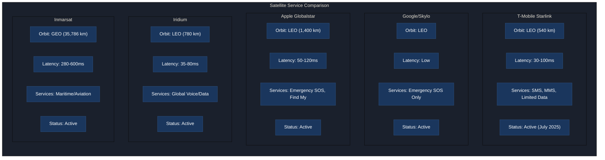
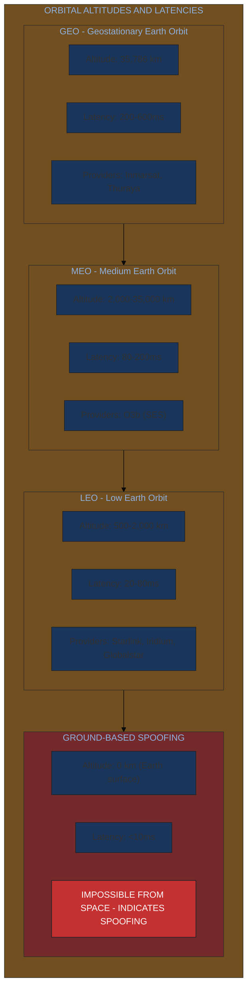
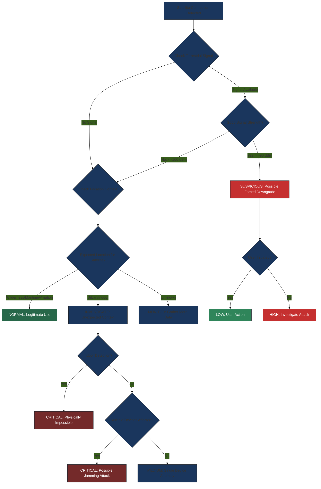
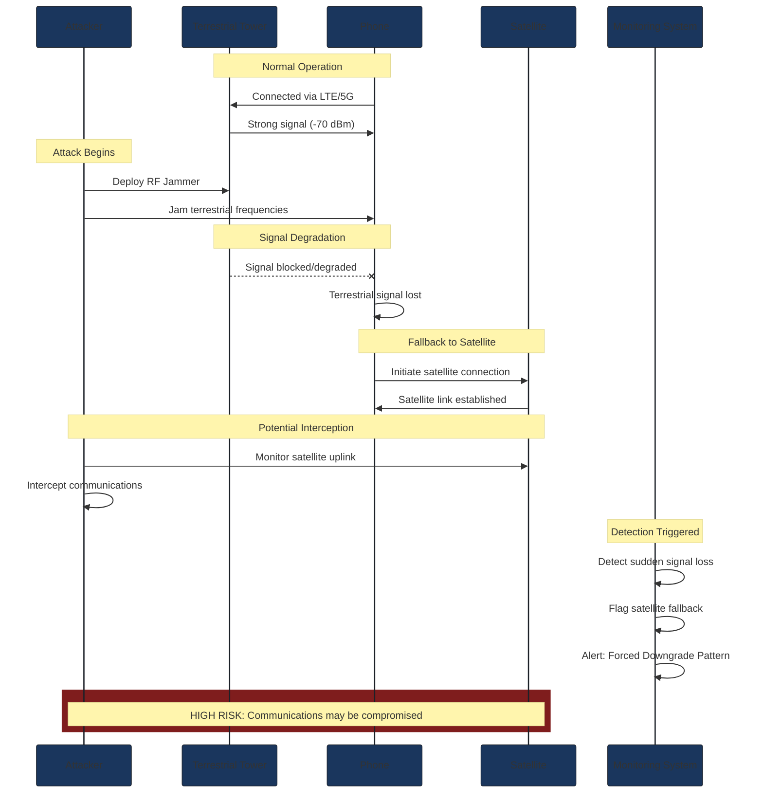
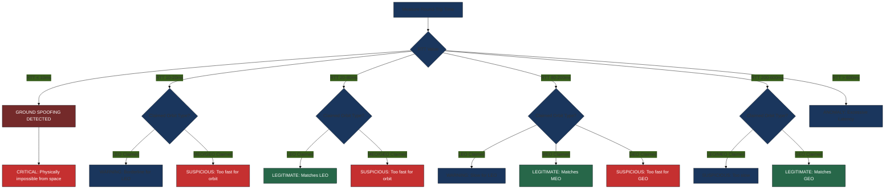
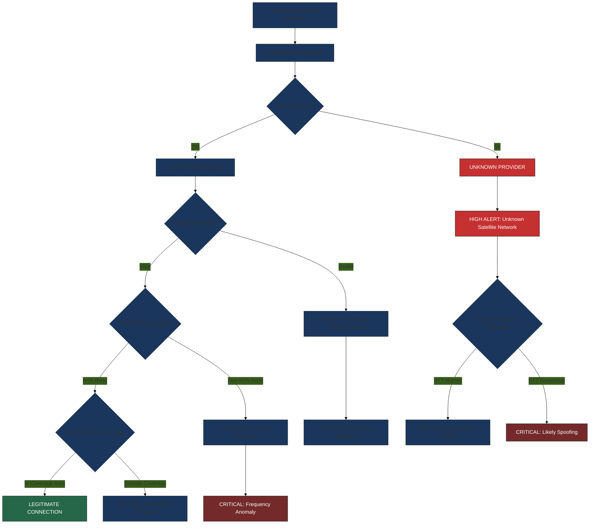
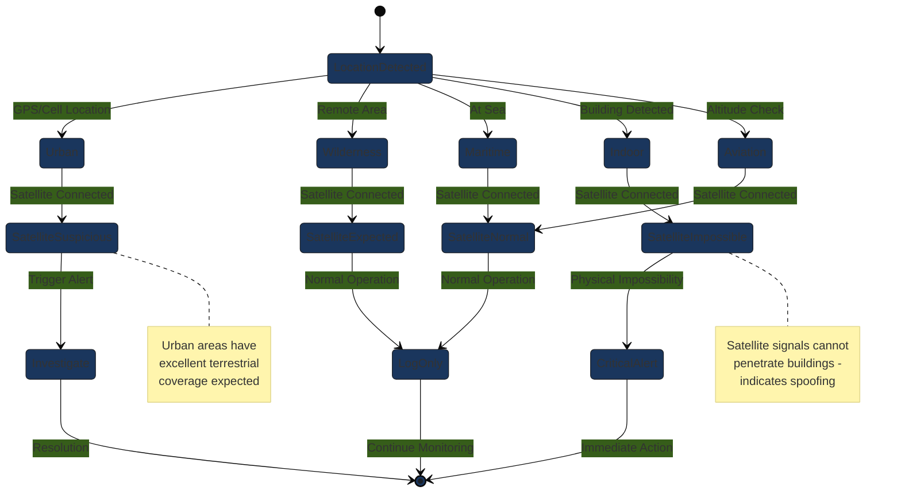
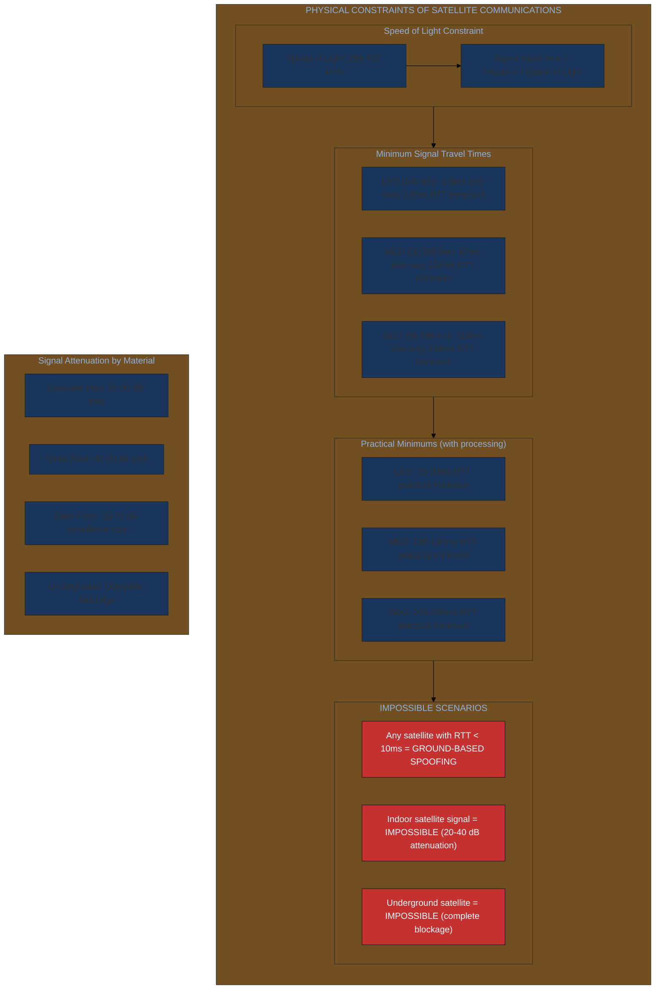

# Satellite/NTN (Non-Terrestrial Network) Detection System

**Document Version:** 1.1
**Last Updated:** January 2026
**Implementation Reference:** `SatelliteDetectionHeuristics.kt`

---

## Table of Contents

1. [Overview](#1-overview)
2. [Supported Satellite Services](#2-supported-satellite-services)
3. [Legitimate Satellite Providers](#3-legitimate-satellite-providers)
4. [Detection Methods](#4-detection-methods)
5. [Threat Scoring System](#5-threat-scoring-system)
6. [Environmental Context](#6-environmental-context)
7. [Real-World Sources](#7-real-world-sources)
8. [Runbook: Responding to Detections](#8-runbook-responding-to-detections)
9. [Physical Constraints Reference](#9-physical-constraints-reference)
10. [Known Limitations](#10-known-limitations)
11. [Future Considerations](#11-future-considerations)

---

## 1. Overview

### What is NTN (Non-Terrestrial Network)?

Non-Terrestrial Networks (NTN) refer to cellular networks that use satellites, aircraft, or other airborne platforms as base stations instead of traditional ground-based cell towers. Standardized under 3GPP Release 17, NTN enables smartphones to communicate directly with satellites using existing LTE and 5G NR protocols.

The key technological components include:

- **3GPP Release 17**: Initial NTN specifications for NB-IoT and LTE over satellite
- **3GPP Release 18**: Enhanced NTN support including 5G NR over satellite
- **NB-IoT NTN**: Narrowband IoT optimized for satellite communication (used by Skylo/Google)
- **LTE NTN**: Standard LTE adapted for satellite propagation delays (used by T-Mobile Starlink)

### Direct-to-Cell Satellite Services

Direct-to-cell (D2C) or Direct-to-Device (D2D) satellite services represent a paradigm shift in satellite communications. Unlike traditional satellite phones that require specialized hardware, D2C services work with standard smartphones by:

1. Using existing cellular spectrum allocated for satellite use
2. Implementing 3GPP NTN protocols in modern smartphone modems
3. Deploying large satellite antennas to compensate for phone antenna limitations
4. Utilizing LEO (Low Earth Orbit) constellations for lower latency

Current active D2C services include:
- **T-Mobile + Starlink** (USA, launched July 2025)
- **One NZ + Starlink** (New Zealand, launched January 2025)
- **Google Pixel + Skylo** (Multiple countries)
- **Apple iPhone + Globalstar** (Emergency SOS only)

### Satellite Service Comparison

The following diagram provides a visual comparison of major satellite service providers:



### Why Monitoring Satellite Connections Matters

Satellite connectivity introduces new security considerations:

1. **Harder to Audit**: Satellite infrastructure is controlled by a small number of operators, making independent security auditing difficult compared to terrestrial networks.

2. **Forced Downgrade Risk**: An attacker could jam terrestrial signals to force a device onto satellite, where interception may be easier or regulatory oversight differs.

3. **Cross-Border Implications**: Satellite communications traverse different jurisdictions with varying legal protections for communications privacy.

4. **Less Encryption Scrutiny**: NTN protocols are newer and may have implementation weaknesses that have not been as thoroughly audited as mature terrestrial protocols.

5. **Location Tracking**: Satellite connections require precise location data for beam pointing, which could be exploited for tracking if the system is compromised.

### Legitimate vs Suspicious Usage

**Legitimate Satellite Usage:**
- Remote wilderness areas (hiking, camping)
- Maritime environments (ships at sea)
- Aviation (commercial and private aircraft)
- Emergency SOS situations
- Rural areas without cellular coverage
- Natural disaster zones with damaged infrastructure

**Suspicious Satellite Usage:**
- Urban areas with excellent cellular coverage
- Indoor locations (physically impossible for satellite signals)
- Sudden switch to satellite when terrestrial signal was strong
- Unknown or unrecognized satellite network identifiers
- Timing characteristics inconsistent with space-based transmission

---

## 2. Supported Satellite Services

### T-Mobile Starlink Direct to Cell

T-Mobile's partnership with SpaceX represents the first large-scale commercial D2C service in the United States.

#### Service Details

| Specification | Value |
|--------------|-------|
| **Launch Date** | July 23, 2025 |
| **Satellite Count** | 650 active satellites |
| **Orbital Altitude** | 540 km (LEO) |
| **Coverage Area** | 500,000 square miles (US) |
| **Orbital Speed** | 17,000 mph |

#### Network Identification

The service displays the following network names on connected devices:
- `T-Mobile SpaceX` (Primary identifier)
- `T-Sat+Starlink` (Alternative identifier)
- `T-Satellite` (Service brand name)
- `Starlink` (Fallback display)

**MCC/MNC Codes:**
- MCC: `310` (United States)
- MNC List: `260`, `200`, `210`, `220`, `230`, `240`, `250`, `270`, `310`, `490`, `660`, `800`

#### Capabilities

| Feature | Status |
|---------|--------|
| SMS | Supported |
| MMS | Supported (added late 2025) |
| Voice | Not yet (coming 2026) |
| Limited Data | Select apps only |
| Emergency 911 | Supported |
| Location Sharing | Supported |

**Supported Apps for Data:**
- WhatsApp
- Google Maps
- AllTrails
- AccuWeather
- X (Twitter)
- T-Life

#### Technical Specifications

| Parameter | Value |
|-----------|-------|
| Standard | 3GPP Release 17 |
| Access Technology | LTE (T-Mobile spectrum) |
| Spectrum Type | Mid-band |
| Typical Latency | 30 ms |
| Maximum Latency | 100 ms (under load) |
| Message Send Time (Typical) | 10 seconds |
| Message Send Time (Max) | 60 seconds |
| Beamforming | Yes |
| TDMA | Yes |
| HARQ Processes | 32 (increased for NTN) |
| Channel Bandwidth Options | 5, 10, 15, 20, 30 MHz |

#### Pricing

| Customer Type | Price |
|--------------|-------|
| T-Mobile (Experience Beyond) | Free |
| AT&T/Verizon Customers | $10/month |

#### Compatible Devices

**Apple:**
- iPhone 14, 14 Plus, 14 Pro, 14 Pro Max
- iPhone 15, 15 Plus, 15 Pro, 15 Pro Max
- iPhone 16, 16 Plus, 16 Pro, 16 Pro Max

**Google:**
- Pixel 9, 9 Pro, 9 Pro XL, 9 Pro Fold
- Pixel 10, 10 Pro, 10 Pro XL

**Samsung:**
- Galaxy S23, S23+, S23 Ultra
- Galaxy S24, S24+, S24 Ultra
- Galaxy S25, S25+, S25 Ultra
- Galaxy Z Fold5, Z Fold6
- Galaxy Z Flip5, Z Flip6

**Motorola:**
- moto g play 2026, moto edge 2025, moto g 5G 2025
- moto g 2024, moto g power 5G 2025
- moto razr 2024, moto razr+ 2024
- moto razr 2025, moto razr+ 2025, moto razr ultra 2025
- moto edge 2024, moto edge 2022
- moto g stylus 2024

---

### Google/Skylo (Pixel Satellite SOS)

#### Network Identification

- `Skylo`
- `Skylo NTN`
- `Satellite SOS`
- `Emergency Satellite`

#### Supported Regions

As of January 2026:
- United States (including Hawaii, Alaska, Puerto Rico)
- Canada
- France
- Germany
- Spain
- Switzerland
- United Kingdom
- Australia

#### Supported Devices

**Pixel 9 Series:**
- Pixel 9
- Pixel 9 Pro
- Pixel 9 Pro XL
- Pixel 9 Pro Fold

**Pixel 10 Series:**
- Pixel 10
- Pixel 10 Pro
- Pixel 10 Pro XL

**Pixel Watch:**
- Pixel Watch 4 (First smartwatch with NB-NTN capability)

#### Technical Specifications

| Parameter | Value |
|-----------|-------|
| Standard | 3GPP Release 17 NB-IoT NTN |
| Modem (Pixel 9) | Exynos 5400 |
| Modem (Pixel 10) | MediaTek T900 |
| Supports SOS | Yes |
| Supports Location Sharing | Yes (new in Android 16) |
| Supports SMS | Carrier dependent |
| Emergency Partner | Garmin Response |
| Free Service Period | 2 years |

#### Android API Indicators

| Component | Value |
|-----------|-------|
| System Service | `SATELLITE_SERVICE` |
| Feature Flag | `android.hardware.telephony.satellite` |
| Manager Class | `android.telephony.satellite.SatelliteManager` |
| Permission | `android.permission.SATELLITE_COMMUNICATION` |

---

### Apple Emergency SOS via Satellite

Apple pioneered consumer satellite connectivity with the iPhone 14, partnering with Globalstar for emergency communications.

#### Network Identification

- `Emergency SOS`
- `Satellite SOS`
- `Globalstar Emergency`

#### Satellite Partner

Globalstar operates the satellite constellation supporting Apple's Emergency SOS service.

#### Supported Countries

As of January 2026:
- United States
- Canada
- United Kingdom
- France
- Germany
- Ireland
- Austria
- Belgium
- Italy
- Luxembourg
- Netherlands
- Portugal
- Spain
- Switzerland
- Australia
- New Zealand
- Japan

#### Supported Devices

**iPhone 14 Series:**
- iPhone 14, 14 Plus, 14 Pro, 14 Pro Max

**iPhone 15 Series:**
- iPhone 15, 15 Plus, 15 Pro, 15 Pro Max

**iPhone 16 Series:**
- iPhone 16, 16 Plus, 16 Pro, 16 Pro Max

#### Technical Specifications

| Parameter | Value |
|-----------|-------|
| Protocol | Proprietary (Globalstar MSS) |
| Constellation Size | 24 satellites |
| Orbital Altitude | 1,400 km (LEO) |
| Supports Emergency SOS | Yes |
| Supports Find My | Yes (iPhone 14+) |
| Supports SMS | No (emergency messaging only) |
| Supports Voice | No |
| Free Service Period | 2 years with iPhone purchase |
| Message Send Time (Typical) | 15 seconds |
| Message Send Time (Max) | 60 seconds |

#### Frequency Bands

| Band | Range |
|------|-------|
| L-band (user to satellite) | 1610-1618 MHz |
| S-band (satellite to user) | 2483-2500 MHz |

---

## 3. Legitimate Satellite Providers

### Orbit Type and Latency Overview

The following diagram illustrates the relationship between orbital altitude and signal latency:



### Globalstar (Apple Partner)

| Specification | Value |
|--------------|-------|
| Display Name | Globalstar |
| Constellation Type | LEO |
| Orbital Altitude | 1,400 km |
| Satellite Count | 24 |
| Coverage | Global (excluding extreme polar regions) |
| Typical Latency | 50 ms |
| Maximum Latency | 120 ms |

**Frequency Bands:**
- L-band Uplink: 1610-1618 MHz
- S-band Downlink: 2483-2500 MHz

**Primary Use Cases:**
- Apple iPhone Emergency SOS
- SPOT satellite messengers
- Asset tracking
- Maritime communications

**Legitimate Usage Context:**
- Emergency situations
- SOS messaging
- SPOT device users
- iPhone satellite features

---

### Iridium (Global Coverage)

Iridium is unique as the only satellite network providing true global coverage, including polar regions.

| Specification | Value |
|--------------|-------|
| Display Name | Iridium |
| Constellation Type | LEO |
| Orbital Altitude | 780 km |
| Satellite Count | 66 (plus spares) |
| Coverage | Global (including polar regions) |
| Typical Latency | 35 ms |
| Maximum Latency | 80 ms |

**Frequency Band:**
- L-band: 1616-1626 MHz

**Primary Use Cases:**
- Satellite phones
- Garmin InReach devices
- Maritime safety
- Aviation communications
- Military and government
- Remote IoT

**Legitimate Usage Context:**
- InReach device users
- Garmin satellite communicators
- Satellite phone users
- Maritime and aviation professionals

---

### Inmarsat (Maritime/Aviation)

| Specification | Value |
|--------------|-------|
| Display Name | Inmarsat |
| Constellation Type | GEO |
| Orbital Altitude | 35,786 km |
| Satellite Count | 14 (I-4, I-5, I-6 series) |
| Coverage | Global (between 76N and 76S latitude) |
| Typical Latency | 280 ms |
| Maximum Latency | 600 ms |

**Frequency Band:**
- L-band: 1525-1559 MHz

**Primary Use Cases:**
- Maritime communications (GMDSS)
- Aviation communications (SwiftBroadband)
- Government and military
- BGAN terminals
- IsatPhone handsets

**Legitimate Usage Context:**
- Maritime environments (ships)
- Aircraft communications
- BGAN terminal users
- IsatPhone users

---

### Thuraya (Regional Coverage)

| Specification | Value |
|--------------|-------|
| Display Name | Thuraya |
| Constellation Type | GEO |
| Orbital Altitude | 35,786 km |
| Satellite Count | 2 (Thuraya 2 and 3) |
| Coverage | Europe, Africa, Middle East, Central Asia, South Asia, Australia |
| Typical Latency | 250 ms |
| Maximum Latency | 500 ms |

**Frequency Band:**
- L-band: 1525-1559 MHz

**Primary Use Cases:**
- Satellite phones (Thuraya X5-Touch, XT-PRO)
- Journalists in remote areas
- NGO and humanitarian organizations
- Oil and gas operations
- Expeditions

**Non-Covered Regions:**
- North America
- South America
- Central America

---

### Expected Latencies by Provider

| Provider | Orbit Type | Min RTT | Typical RTT | Max RTT |
|----------|-----------|---------|-------------|---------|
| Starlink/T-Mobile | LEO (540 km) | 20 ms | 30 ms | 100 ms |
| Iridium | LEO (780 km) | 20 ms | 35 ms | 80 ms |
| Globalstar | LEO (1,400 km) | 25 ms | 50 ms | 120 ms |
| Thuraya | GEO (35,786 km) | 200 ms | 250 ms | 500 ms |
| Inmarsat | GEO (35,786 km) | 200 ms | 280 ms | 600 ms |

---

## 4. Detection Methods

### Detection Decision Flowchart

The following flowchart illustrates the overall detection decision process:



### Unexpected Satellite Switch Detection

**Rule ID:** `SAT_001`
**Severity:** HIGH

This detection identifies when a device switches to satellite connectivity despite having a good terrestrial signal available.

**Detection Logic:**

```kotlin
fun isSuspicious(): Boolean {
    return hadRecentTerrestrialSignal &&
           (terrestrialSignalStrengthDbm ?: -120) > -100 &&
           timesSinceGoodTerrestrialMs < 5000 &&
           !wasUserInitiated
}
```

**Indicators Evaluated:**
- Had recent terrestrial signal (within 5 seconds)
- Terrestrial signal strength was better than -100 dBm
- Switch was not user-initiated
- Current location (urban areas increase severity)

**Severity Mapping:**
- **HIGH**: Suspicious switch in urban area
- **MEDIUM**: Suspicious switch in non-urban area
- **LOW**: Expected satellite usage

---

### Forced Downgrade Attack Detection

**Rule ID:** `SAT_005`
**Severity:** HIGH

Detects potential jammer-based attacks that force devices from superior terrestrial networks (5G/LTE) to satellite connections.

#### Forced Downgrade Attack Sequence



**Attack Pattern:**
1. Attacker deploys radio jammer targeting terrestrial frequencies
2. Device loses terrestrial connectivity despite good coverage
3. Device falls back to satellite connection
4. Attacker may intercept satellite communications or force specific routing

**Detection Indicators:**

```kotlin
data class ForcedDowngradeAttackIndicators(
    val hadGoodTerrestrialSignalDbm: Int?,      // Was signal > -90 dBm?
    val terrestrialSignalDroppedSuddenlyMs: Long?, // < 5000ms = sudden
    val forcedToSatelliteWithinMs: Long?,       // < 30000ms = quick
    val multipleDevicesAffected: Boolean,        // Broader attack
    val locationHasKnownCoverage: Boolean        // Expected coverage exists
)
```

**Severity Levels:**
- **CRITICAL**: Multiple devices affected in known coverage area
- **HIGH**: Single device affected, pattern matches attack
- **MEDIUM**: Suspicious but inconclusive
- **LOW**: Normal network transition

---

### Timing Anomaly Detection

**Rule ID:** `SAT_003`
**Severity:** HIGH

Uses physics-based constraints to detect ground-based spoofing attempts claiming to be satellite connections.

#### Timing Validation Flowchart



**Expected Round-Trip Times by Orbit:**

| Orbit Type | Altitude | Minimum RTT | Maximum RTT |
|-----------|----------|-------------|-------------|
| LEO | 200-2,000 km | 20 ms | 80 ms |
| MEO | 2,000-35,786 km | 80 ms | 200 ms |
| GEO | 35,786 km | 200 ms | 600 ms |

**Ground-Based Spoofing Threshold:** < 10 ms

**Detection Logic:**

```kotlin
fun analyzeRTT(rttMs: Long, claimedOrbit: String): String {
    return when (claimedOrbit.uppercase()) {
        "LEO" -> when {
            rttMs < 10 -> "SUSPICIOUS: RTT too low for LEO satellite"
            rttMs in 20..80 -> "NORMAL: RTT consistent with LEO"
            else -> "WARNING: RTT outside expected LEO range"
        }
        "MEO" -> when {
            rttMs < 80 -> "SUSPICIOUS: RTT too low for MEO"
            rttMs in 80..200 -> "NORMAL"
            else -> "WARNING: RTT outside expected MEO range"
        }
        "GEO" -> when {
            rttMs < 200 -> "SUSPICIOUS: RTT too low for GEO"
            rttMs in 200..600 -> "NORMAL"
            else -> "WARNING: RTT outside expected GEO range"
        }
        else -> "UNKNOWN orbit type"
    }
}
```

**Why This Works:**
- Speed of light is a universal constant (~299,792 km/s)
- Minimum RTT = (2 x altitude / speed of light) + processing time
- No ground-based transmitter can have RTT < 10ms while claiming satellite origin
- RTT below orbit-specific minimum indicates spoofing

---

### Unknown Provider Detection

**Rule ID:** `SAT_002`
**Severity:** CRITICAL

Validates satellite network identifiers against a database of known legitimate providers.

#### Provider Validation Flowchart



**Known Satellite Networks:**
- T-Mobile Starlink identifiers: `T-Mobile SpaceX`, `T-Sat+Starlink`, `T-Satellite`, `Starlink`
- Skylo NTN identifiers: `Skylo`, `Skylo NTN`, `Satellite SOS`, `Emergency Satellite`
- Apple Emergency: `Emergency SOS`, `Satellite SOS`, `Globalstar Emergency`
- Traditional providers: `Globalstar`, `AST SpaceMobile`, `Lynk`, `Iridium`, `Inmarsat`, `Thuraya`

**Validation Function:**

```kotlin
fun isKnownSatelliteNetwork(networkName: String): Boolean {
    val knownNetworks = TMobileStarlink.NETWORK_NAMES +
                       SkyloNTN.NETWORK_NAMES +
                       listOf(
                           "Globalstar", "AST SpaceMobile", "Lynk",
                           "Iridium", "Inmarsat", "Thuraya"
                       )
    return knownNetworks.any { networkName.contains(it, ignoreCase = true) }
}
```

**Alert Trigger:**
Connection to any satellite network not matching known providers triggers a CRITICAL alert.

---

### Frequency Band Validation

**Rule ID:** `SAT_006`
**Severity:** CRITICAL

Verifies that claimed satellite connections use appropriate NTN frequency bands.

**3GPP NTN Frequency Bands (TS 38.101-5, TS 36.102):**

| Band | Uplink (MHz) | Downlink (MHz) | Description | Release |
|------|-------------|----------------|-------------|---------|
| n253 | 1626-1660 | 1525-1559 | MSS L-band (Standard) | Rel-17 |
| n254 | 1626-1660 | 1525-1559 | MSS L-band (Alt Duplex) | Rel-17 |
| n255 | 1626-1660 | 1525-1559 | MSS L-band (Alt Channel) | Rel-17 |
| n256 | 1980-2010 | 2170-2200 | MSS S-band | Rel-17 |
| n510 | 27500-29500 | 17700-20200 | Ka-band | Rel-18 |
| n511 | 27500-30000 | 17700-21200 | Ka-band | Rel-18 |
| n512 | 42500-43500 | (TDD) | Ka-band TDD | Rel-18 |

**Provider-Specific Validation:**

| Provider | Expected Frequency Ranges |
|----------|--------------------------|
| Starlink/T-Mobile | L-band (1525-1660 MHz), S-band (1980-2200 MHz) |
| Skylo | L-band (1525-1660 MHz) |
| Globalstar | L-band (1610-1618 MHz), S-band (2483-2500 MHz) |
| Iridium | L-band (1616-1626 MHz) |

---

### Rapid Switching Detection

**Rule ID:** `SAT_004`
**Severity:** MEDIUM

Detects abnormally frequent satellite handoffs that may indicate interference or manipulation.

**Expected Handoff Patterns:**
- LEO satellites pass overhead in approximately 10-15 minutes
- Minimum handoff interval: 60,000 ms (1 minute)
- Expected handoff interval: 600,000 ms (~10 minutes)
- Maximum normal handoffs per hour: 10

**Detection Function:**

```kotlin
fun analyzeSwitchingPattern(
    handoffTimestamps: List<Long>,
    windowMs: Long = 3600000  // 1 hour
): String {
    val recentHandoffs = handoffTimestamps.filter {
        System.currentTimeMillis() - it < windowMs
    }

    return when {
        recentHandoffs.size > 20 -> "CRITICAL: Extremely rapid switching detected"
        recentHandoffs.size > 10 -> "WARNING: Unusually frequent satellite handoffs"
        else -> "NORMAL: Switching pattern within expected range"
    }
}
```

---

### Ground-Based Spoofing Detection

Identifies terrestrial transmitters attempting to masquerade as satellites.

**Physical Impossibility Indicators:**

```kotlin
data class GroundSpoofingIndicators(
    val rttMs: Long,
    val claimedOrbitType: String,
    val signalStrengthDbm: Int,
    val dopplerShiftHz: Double?
)
```

**Detection Criteria:**

| Indicator | Suspicious If |
|-----------|---------------|
| RTT (LEO) | < 15 ms |
| RTT (MEO) | < 100 ms |
| RTT (GEO) | < 200 ms |
| Signal Strength | > -70 dBm (too strong for satellite) |
| Doppler Shift (LEO/MEO) | < 1000 Hz (satellites move fast) |

---

## 5. Threat Scoring System

### Satellite Anomaly Scoring

The detection system evaluates multiple factors to generate a threat score.

**Indicator Scoring:**

| Indicator | Points | Severity Impact |
|-----------|--------|-----------------|
| Unknown satellite network | 100 | CRITICAL |
| RTT impossible for claimed orbit | 90 | CRITICAL |
| Frequency outside NTN bands | 85 | CRITICAL |
| Urban satellite with good coverage | 60 | HIGH |
| Forced downgrade pattern | 70 | HIGH |
| Timing mismatch detected | 65 | HIGH |
| Rapid switching (>20/hour) | 50 | MEDIUM |
| Unexpected satellite switch | 45 | MEDIUM |
| Indoor satellite claim | 100 | CRITICAL (physically impossible) |

### Environmental Context Multipliers

| Context | Multiplier | Rationale |
|---------|------------|-----------|
| Urban downtown | 1.5x | Excellent coverage expected |
| Indoor/basement | 2.0x | Satellite impossible |
| Remote wilderness | 0.3x | Satellite expected |
| Maritime/aviation | 0.2x | Satellite normal |
| Emergency situation | 0.1x | Emergency SOS expected |

### Severity Level Mapping

| Total Score | Severity | Response |
|-------------|----------|----------|
| 0-25 | INFO | Log for reference |
| 26-50 | LOW | Monitor for patterns |
| 51-75 | MEDIUM | Alert user |
| 76-100 | HIGH | Immediate notification |
| >100 | CRITICAL | Block + notify + log |

---

## 6. Environmental Context

### Environmental Context State Diagram

The following diagram shows how environmental context affects threat assessment:



### Expected Satellite Locations

The following environments have legitimate reasons for satellite connectivity:

#### Aircraft

- **Description:** On commercial or private aircraft
- **Examples:** In-flight, aviation, above 10,000ft
- **Threat Level:** INFO
- **Rationale:** Satellite is normal for aircraft environments

#### Maritime

- **Description:** On ships or boats at sea
- **Examples:** Cruise ship, cargo vessel, yacht, ferry in open water
- **Threat Level:** INFO
- **Rationale:** Terrestrial coverage unavailable at sea

#### Remote Wilderness

- **Description:** Remote wilderness areas
- **Examples:** National parks, mountain trails, desert, Arctic/Antarctic
- **Threat Level:** INFO
- **Rationale:** No terrestrial infrastructure exists

#### Rural Areas Without Coverage

- **Description:** Rural areas with no cellular coverage
- **Examples:** Farmland, remote ranches, isolated communities
- **Threat Level:** INFO
- **Rationale:** Terrestrial coverage gaps are common in rural areas

#### Emergency Situations

- **Description:** Emergency situations with damaged infrastructure
- **Examples:** Natural disaster zone, post-hurricane, earthquake affected area
- **Threat Level:** INFO
- **Rationale:** Emergency SOS via satellite is a legitimate safety feature

---

### Suspicious Satellite Locations

The following environments should NOT have satellite connectivity:

#### Downtown Urban

- **Description:** Downtown urban areas
- **Why Suspicious:** Excellent cellular coverage expected; satellite suggests forced downgrade
- **Threat Level:** MEDIUM to HIGH

#### Shopping Mall

- **Description:** Inside shopping malls or large buildings
- **Why Suspicious:** No sky visibility for satellite; impossible to receive signal
- **Threat Level:** HIGH (physically impossible)

#### Basement/Underground

- **Description:** Basements or underground locations
- **Why Suspicious:** Physically impossible for satellite signal to reach
- **Threat Level:** CRITICAL (physically impossible)

#### Office Building

- **Description:** Inside office buildings
- **Why Suspicious:** Good indoor coverage expected; no satellite signal possible
- **Threat Level:** HIGH

#### Urban Residential

- **Description:** Urban residential areas
- **Why Suspicious:** Good coverage expected; satellite connection is unusual
- **Threat Level:** MEDIUM

#### Subway/Metro

- **Description:** Subway or metro stations
- **Why Suspicious:** Underground = no satellite possible; cellular DAS expected
- **Threat Level:** CRITICAL (physically impossible)

---

### Environmental Expectation Logic

```kotlin
fun isSatelliteExpected(
    isIndoors: Boolean,
    hasSkyClearance: Boolean,
    isUrbanArea: Boolean,
    hasTerrestrialSignal: Boolean,
    isOnAircraftOrShip: Boolean,
    isEmergencySituation: Boolean
): SatelliteExpectation
```

**Decision Matrix:**

| Condition | Expected? | Threat Level |
|-----------|-----------|--------------|
| On aircraft or ship | Yes | INFO |
| Emergency situation | Yes | INFO |
| Remote + no terrestrial + clear sky | Yes | INFO |
| Indoors + no sky visibility | No | HIGH |
| Urban + has terrestrial | No | MEDIUM |
| Otherwise | Uncertain | LOW |

---

## 7. Real-World Sources

### T-Mobile Starlink

- **Official Announcement:** [T-Mobile Direct to Cell](https://www.t-mobile.com/news/network/t-mobile-direct-to-cell)
- **SpaceX Starlink NTN:** [starlink.com](https://www.starlink.com/phones)
- **Coverage Map:** T-Mobile network coverage tools

### 3GPP NTN Specifications

- **TS 38.101-5:** NR User Equipment (UE) radio transmission and reception; Part 5: NTN bands
- **TS 36.102:** NTN frequency bands and channel arrangements
- **3GPP Release 17:** Initial NTN support specifications
- **3GPP Release 18:** Enhanced NTN including 5G NR over satellite

### Satellite Communication Security Research

- **GPS Spoofing Research:** [University of Texas GPS Research](https://radionavlab.ae.utexas.edu/)
- **C4ADS Report:** "Above Us Only Stars" - Analysis of GPS spoofing in conflict zones
- **BlackHat/DEF CON:** Various presentations on satellite security vulnerabilities

### Apple/Google Documentation

- **Apple Emergency SOS via Satellite:** [Apple Support](https://support.apple.com/guide/iphone/use-emergency-sos-via-satellite-iph1e0a71f9d/ios)
- **Google Pixel Satellite SOS:** [Google Support](https://support.google.com/pixelphone/answer/13603492)
- **Android SatelliteManager API:** [Android Developers](https://developer.android.com/reference/android/telephony/satellite/SatelliteManager)

### Global D2C Carrier Partnerships

| Carrier | Country | Partner | Status | Launch Date |
|---------|---------|---------|--------|-------------|
| T-Mobile | USA | Starlink/SpaceX | Active | July 23, 2025 |
| One NZ | New Zealand | Starlink/SpaceX | Active | January 2025 |
| Telstra | Australia | Starlink/SpaceX | Testing | TBD |
| Optus | Australia | Starlink/SpaceX | Testing | TBD |
| Rogers | Canada | Starlink/SpaceX | Testing | TBD |
| KDDI | Japan | Starlink/SpaceX | Testing | TBD |
| Salt | Switzerland | Starlink/SpaceX | Testing | TBD |
| Entel | Chile/Peru | Starlink/SpaceX | Testing | TBD |
| Kyivstar | Ukraine | Starlink/SpaceX | Testing | TBD |
| VMO2 | UK | Starlink/SpaceX | Announced | TBD |
| AT&T | USA | AST SpaceMobile | Testing | TBD |
| Verizon | USA | Skylo | Active | 2025 |
| Orange | France | Skylo | Active | December 11, 2025 |

---

## 8. Runbook: Responding to Detections

### Verification Steps

#### Step 1: Check Phone Status Icon

**Instruction:** Check if your phone shows a satellite icon in the status bar

**Expected Normal:** Satellite icon should only appear when you have no cellular signal

**Suspicious If:** Satellite icon appears while you have strong cellular bars

#### Step 2: Verify Sky Visibility

**Instruction:** Look around - do you have a clear view of the sky?

**Expected Normal:** Satellite connections require direct sky visibility

**Suspicious If:** You're indoors, in a basement, or surrounded by tall buildings

#### Step 3: Check Cellular Settings

**Instruction:** Go to Settings > Network/Cellular > Check your connection type

**Expected Normal:** Should show LTE, 5G, or similar when in normal coverage

**Suspicious If:** Shows satellite/NTN when you're in an urban area with good coverage

### Environmental Verification

#### Check Location Type

**Consider:** Is satellite expected for your current location?

**Satellite Expected:**
- Wilderness, rural areas, at sea, on aircraft

**Satellite Suspicious:**
- Downtown, shopping mall, office building, home with WiFi

#### Ask Others Nearby

**Action:** Ask others nearby if they have cellular signal

**Expected:** If others have good signal, you should too

**Suspicious:** Only your device is forced to satellite while others have normal service

#### Check Coverage Maps

**Action:** Check cellmapper.net or your carrier's coverage map

**Expected:** If map shows good coverage, you should have terrestrial connection

**Suspicious:** Excellent coverage shown but device uses satellite

### Technical Verification

#### Move to Known Coverage Area

**Action:** Move to a location with known good cellular coverage

**Expected:** Device should switch back to terrestrial network quickly

**Suspicious:** Device stays on satellite even in areas with excellent coverage

#### Toggle Airplane Mode

**Action:** Turn airplane mode on for 10 seconds, then off

**Expected:** Device should reconnect to best available network (usually terrestrial)

**Suspicious:** Device immediately reconnects to satellite despite better options

#### Run Latency Test

**Action:** Run a speed test or ping test

**Expected Latencies:**
- LEO satellite: 20-80 ms
- GEO satellite: 250-600 ms

**Suspicious:** Claimed satellite connection with <20 ms latency (physically impossible from space)

### When to Report

**Report Immediately If:**
- Unknown satellite network identifier
- Satellite connection in underground/indoor location
- Latency inconsistent with claimed orbit type
- Multiple devices affected simultaneously
- Occurs repeatedly in same location with good coverage

**Monitor and Document If:**
- Single occurrence in semi-rural area
- Brief satellite connection during network maintenance
- Transition period after exiting indoor location

---

## 9. Physical Constraints Reference

### Physical Constraints Diagram

The following diagram illustrates why certain satellite behaviors are physically impossible:



### Speed of Light Calculations

The speed of light in vacuum is approximately 299,792 km/s (or ~3.33 microseconds per kilometer).

**One-Way Signal Travel Time:**
- LEO (540 km): ~1.8 ms
- MEO (20,200 km - GPS orbit): ~67 ms
- GEO (35,786 km): ~119 ms

**Round-Trip Time (minimum, physics only):**
- LEO (540 km): ~3.6 ms
- MEO (20,200 km): ~134 ms
- GEO (35,786 km): ~238 ms

**Practical Minimum RTT (including processing):**
- LEO: ~15-20 ms
- MEO: ~100-130 ms
- GEO: ~200-280 ms

### Minimum Possible Latencies by Orbit

| Orbit | Altitude | Physics Min RTT | Practical Min RTT | Typical RTT | Max RTT |
|-------|----------|-----------------|-------------------|-------------|---------|
| LEO | 200-2,000 km | 1.3-13.3 ms | 15-20 ms | 20-50 ms | 80-100 ms |
| MEO | 2,000-35,786 km | 13.3-238 ms | 80-100 ms | 100-150 ms | 200 ms |
| GEO | 35,786 km | 238 ms | 200-240 ms | 280-400 ms | 600 ms |

**Critical Detection Threshold:**
- Any claimed satellite connection with RTT < 10 ms is **physically impossible** and indicates ground-based spoofing.

### Why Indoor Satellite is Impossible

Satellite signals cannot penetrate:
- Concrete walls (20-30 dB attenuation)
- Metal roofing (30-40 dB attenuation)
- Underground structures (complete blockage)
- Multi-story buildings (cumulative floor attenuation)

**Signal Budget:**
- Satellite transmit power: ~50W
- Free space path loss at LEO: ~175-185 dB
- Received power: ~-155 to -165 dBW (extremely weak)
- Required clear line of sight to function

**Conclusion:** A claimed satellite connection while indoors, in a basement, parking garage, or subway is **physically impossible** and represents either a detection error or deliberate spoofing.

### Frequency Band Allocations

**ITU-R Mobile Satellite Service (MSS) Bands:**

| Band | Frequency Range | Primary Use |
|------|-----------------|-------------|
| L-band | 1.5-1.7 GHz | Mobile satellite voice/data |
| S-band | 2.0-2.4 GHz | Mobile satellite data |
| C-band | 4-8 GHz | Fixed satellite (backhaul) |
| Ku-band | 12-18 GHz | VSAT, direct broadcast |
| Ka-band | 26.5-40 GHz | High-throughput satellite |

**3GPP NTN Allocated Bands:**
- n253/n254/n255: L-band (1525-1559 MHz DL, 1626-1660 MHz UL)
- n256: S-band (2170-2200 MHz DL, 1980-2010 MHz UL)
- n510/n511/n512: Ka-band (future VSAT/ESIM)

---

## 10. Known Limitations

### Limited Android API Access

1. **SatelliteManager Restrictions:** The `android.telephony.satellite.SatelliteManager` API requires system-level permissions (`android.permission.SATELLITE_COMMUNICATION`) not available to third-party apps.

2. **State Change Listeners:** Only basic state change callbacks are available publicly:
   - `registerStateChangeListener`
   - `unregisterStateChangeListener`

3. **System-Only Methods:** Critical methods require system app privileges:
   - `requestIsSupported`
   - `requestIsEnabled`
   - `requestCapabilities`
   - `requestNtnSignalStrength`

4. **No Direct RTT Measurement:** There is no public API to measure actual round-trip time to satellite.

### Carrier-Specific Implementations

1. **Proprietary Protocols:** Apple's Globalstar implementation uses proprietary protocols not visible to Android.

2. **Network Name Variations:** Carriers may display different network names than documented.

3. **Beta/Test Networks:** Testing networks may use non-standard identifiers.

4. **Regional Differences:** Same carrier may have different implementations across regions.

### New Technology Challenges

1. **Rapidly Evolving Specifications:** 3GPP NTN specs continue to evolve through Release 18 and beyond.

2. **New Providers Emerging:** Additional D2C providers (AST SpaceMobile, Lynk) will require database updates.

3. **Firmware Dependencies:** Satellite modem behavior depends on device-specific firmware.

4. **Limited Historical Data:** NTN is too new to have established baseline behavioral patterns.

5. **False Positive Risk:** Distinguishing legitimate new services from malicious actors is challenging.

---

## 11. Future Considerations

### Expanding Satellite Services

**Near-Term (2026-2027):**
- T-Mobile Starlink voice calling rollout
- AST SpaceMobile commercial service launch
- Additional carrier partnerships worldwide
- Expanded coverage areas for existing services

**Medium-Term (2027-2029):**
- 5G NR over satellite (3GPP Release 18)
- Increased data throughput capabilities
- More device manufacturers supporting NTN
- Potential consumer satellite modems in laptops/tablets

**Long-Term (2029+):**
- Full broadband-quality D2C service
- Integration with 6G planning
- Potential for satellite-only devices

### New Detection Challenges

1. **Increased Legitimacy:** As satellite becomes more common, distinguishing legitimate from suspicious will be harder.

2. **Multi-Orbit Constellations:** Mixed LEO/MEO/GEO operations complicate timing analysis.

3. **Advanced Spoofing:** Attackers may develop more sophisticated timing and frequency spoofing.

4. **Carrier Aggregation:** Simultaneous terrestrial + satellite connections will require new analysis.

5. **Private Networks:** Enterprise satellite deployments may have non-standard configurations.

### 3GPP Roadmap

**Release 17 (Current):**
- NB-IoT over satellite
- LTE over satellite
- Basic NTN architecture

**Release 18 (Ongoing):**
- 5G NR over satellite
- Enhanced mobility
- Coverage enhancement
- Reduced signaling overhead

**Release 19 (Planned):**
- Advanced NTN features
- Improved spectral efficiency
- Enhanced security mechanisms
- Regenerative satellite payloads

### Recommended Updates

1. **Quarterly Database Updates:** Review and update known provider list every 3 months.

2. **New Service Monitoring:** Track announcements from SpaceX, AST, Lynk, and new entrants.

3. **Regulatory Monitoring:** Watch FCC, ITU, and 3GPP for new frequency allocations.

4. **User Feedback Loop:** Incorporate false positive reports to improve detection accuracy.

5. **Academic Collaboration:** Partner with research institutions studying NTN security.

---

## Appendix A: Android SatelliteManager API Reference

### System Service

```kotlin
const val SERVICE_NAME = "satellite"
const val FEATURE = "android.hardware.telephony.satellite"
```

### NT Radio Technology Constants

| Constant | Value | Description |
|----------|-------|-------------|
| UNKNOWN | 0 | Unknown technology |
| NB_IOT_NTN | 1 | NB-IoT over NTN |
| NR_NTN | 2 | 5G NR over NTN |
| EMTC_NTN | 3 | eMTC over NTN |
| PROPRIETARY | 4 | Proprietary (Apple/Globalstar) |

### Modem State Constants

| State | Value | Description |
|-------|-------|-------------|
| IDLE | 0 | Modem idle |
| LISTENING | 1 | Listening for satellite |
| DATAGRAM_TRANSFERRING | 2 | Actively transferring |
| DATAGRAM_RETRYING | 3 | Retrying transmission |
| OFF | 4 | Modem off |
| UNAVAILABLE | 5 | Service unavailable |
| NOT_CONNECTED | 6 | Not connected |
| CONNECTED | 7 | Connected to satellite |
| ENABLING_SATELLITE | 8 | Enabling mode |
| DISABLING_SATELLITE | 9 | Disabling mode |
| UNKNOWN | -1 | Unknown state |

### Datagram Type Constants

| Type | Value | Description |
|------|-------|-------------|
| UNKNOWN | 0 | Unknown type |
| SOS_MESSAGE | 1 | Emergency SOS |
| LOCATION_SHARING | 2 | Location sharing |
| KEEP_ALIVE | 3 | Keep-alive ping |
| LAST_SOS_STILL_NEED_HELP | 4 | SOS follow-up (need help) |
| LAST_SOS_NO_HELP_NEEDED | 5 | SOS follow-up (resolved) |
| SMS | 6 | SMS message |
| CHECK_PENDING_SMS | 7 | Check for pending SMS |

### Required Permissions

```xml
<uses-permission android:name="android.permission.READ_PHONE_STATE" />
<uses-permission android:name="android.permission.ACCESS_FINE_LOCATION" />
<uses-permission android:name="android.permission.SATELLITE_COMMUNICATION" />
```

Note: `SATELLITE_COMMUNICATION` is a system-level permission not available to third-party applications.

---

## Appendix B: Detection Rule Reference

| Rule ID | Name | Severity | Check Function |
|---------|------|----------|----------------|
| SAT_001 | Unexpected Satellite Switch | HIGH | `checkUnexpectedSatelliteSwitch` |
| SAT_002 | Unknown Satellite Network | CRITICAL | `checkUnknownSatelliteNetwork` |
| SAT_003 | Timing Anomaly | HIGH | `checkTimingAnomaly` |
| SAT_004 | Rapid Switching | MEDIUM | `checkRapidSwitching` |
| SAT_005 | Forced Downgrade | HIGH | `checkForcedDowngrade` |
| SAT_006 | Frequency Mismatch | CRITICAL | `checkFrequencyMismatch` |
| SAT_007 | Urban Satellite | MEDIUM | `checkUrbanSatellite` |

---

*This documentation is based on the implementation in `SatelliteDetectionHeuristics.kt` and reflects the state of NTN technology as of January 2026. Updates should be made as new services launch and specifications evolve.*
