# Threat Scoring and Detection Framework

## Table of Contents

1. [Overview](#1-overview)
2. [Core Scoring Formula](#2-core-scoring-formula)
3. [Impact Factors](#3-impact-factors)
4. [Confidence Adjustments](#4-confidence-adjustments)
5. [Base Likelihood Estimates](#5-base-likelihood-estimates)
6. [Severity Level Mapping](#6-severity-level-mapping)
7. [Aggregate Threat Calculation](#7-aggregate-threat-calculation)
8. [Detection Handler Architecture](#8-detection-handler-architecture)
9. [Detection Registry](#9-detection-registry)
10. [Real-World Calibration](#10-real-world-calibration)
11. [Debug Output](#11-debug-output)
12. [Known Issues and Tradeoffs](#12-known-issues-and-tradeoffs)
13. [Extending the System](#13-extending-the-system)

---

## 1. Overview

### Why Proper Threat Scoring Matters

Surveillance detection is a high-stakes domain where both false positives and false negatives have serious consequences:

- **False positives** erode user trust and cause alert fatigue. A user who sees "CRITICAL: IMSI Catcher Detected!" when their phone simply changed to a different legitimate cell tower will stop taking alerts seriously.

- **False negatives** leave users vulnerable. Missing a real tracking device or cell site simulator defeats the entire purpose of the application.

The Flock-You threat scoring framework is designed to balance these concerns by producing **calibrated severity levels** that actually correspond to the probability and potential impact of real threats.

### Problems with Naive Scoring

Many surveillance detection apps use simplistic scoring that leads to poor user experience:

1. **Pattern match = HIGH threat**: Just because a device name matches a suspicious pattern does not mean it is actually a threat. A Ring doorbell at a neighbor's house is not the same as a targeted surveillance operation.

2. **Ignoring confidence**: A single, brief detection at weak signal strength should not produce the same alert as a persistent detection with multiple confirming indicators.

3. **Ignoring context**: GPS signal anomalies in an urban canyon are usually multipath reflections, not spoofing attacks. Context matters.

4. **Score inflation**: Stacking bonuses for multiple matches without proper calibration leads to maximum scores for benign situations.

### Design Principles

The Flock-You threat scoring framework follows these principles:

1. **Severity = Probability x Impact**: A CRITICAL alert means there is a high probability of a high-impact threat. Not just that a pattern matched.

2. **Conservative by default**: The system is calibrated to reduce false positives at the cost of potentially missing some real threats. Users can increase sensitivity if desired.

3. **Transparent reasoning**: Every score includes a full breakdown of how it was calculated, enabling debugging and user understanding.

4. **Extensible**: New detection types and protocols can be added without modifying the core scoring logic.

---

## 2. Core Scoring Formula

The threat scoring system uses the following formula:

```
threat_score = base_likelihood x impact_factor x confidence
```

### Visual Formula Representation

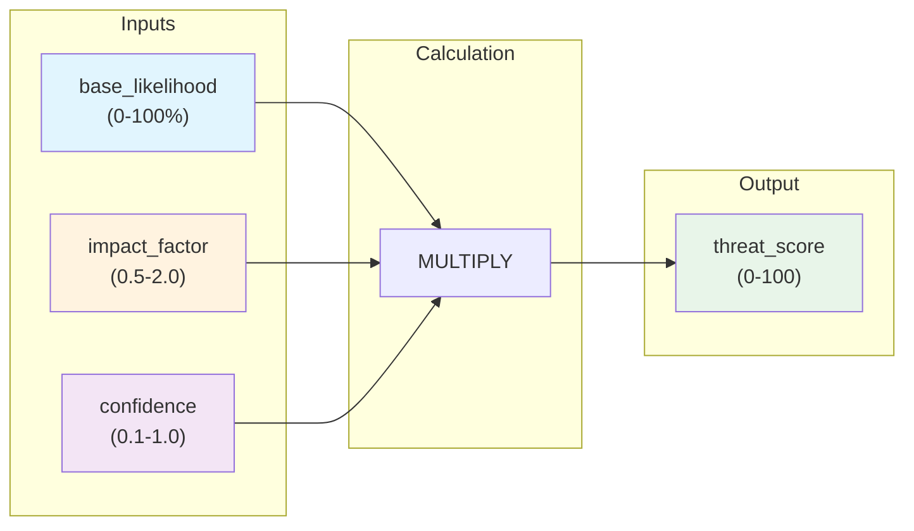

### Formula Components

| Component | Range | Description |
|-----------|-------|-------------|
| `base_likelihood` | 0-100% | Probability this detection represents a real threat |
| `impact_factor` | 0.5-2.0 | Potential harm if the threat is real |
| `confidence` | 0.1-1.0 | Quality/reliability of the detection |

### Why This Formula Was Chosen

The multiplicative formula ensures that **all three factors must be significant** for a high threat score:

- A 20% likelihood with 2.0 impact and 0.5 confidence = score of 20 (LOW)
- A 70% likelihood with 2.0 impact and 0.8 confidence = score of 112, capped at 100 (CRITICAL)

This prevents the naive problem where "IMSI catcher detected!" produces a CRITICAL alert even when the actual likelihood is only 20%.

### Scoring Pipeline Flowchart

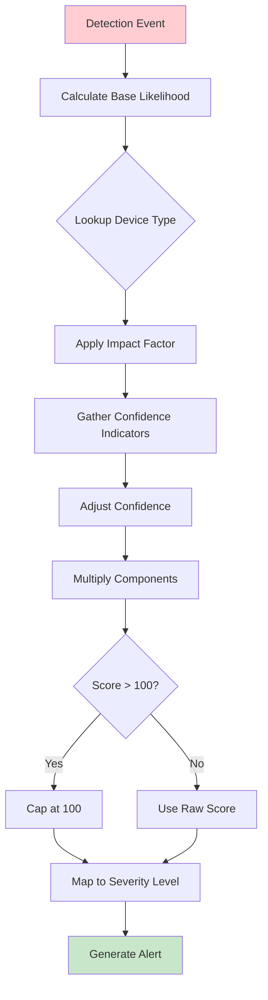

### Example Calculations

**Example 1: Likely false positive**
```
Scenario: Single cell tower change while stationary
- base_likelihood: 25% (normal network optimization is common)
- impact_factor: 2.0 (IMSI catchers intercept communications)
- confidence: 0.2 (single indicator, brief detection)

Score = 25 x 2.0 x 0.2 = 10 (INFO)
```

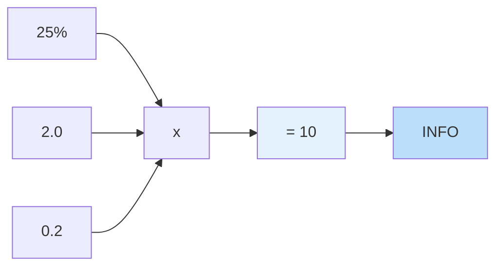

**Example 2: Moderate concern**
```
Scenario: Unknown cell tower in familiar area, persistent
- base_likelihood: 35% (could be new tower or threat)
- impact_factor: 2.0 (IMSI catchers intercept communications)
- confidence: 0.7 (persistent, moderate signal, known area)

Score = 35 x 2.0 x 0.7 = 49 (LOW)
```

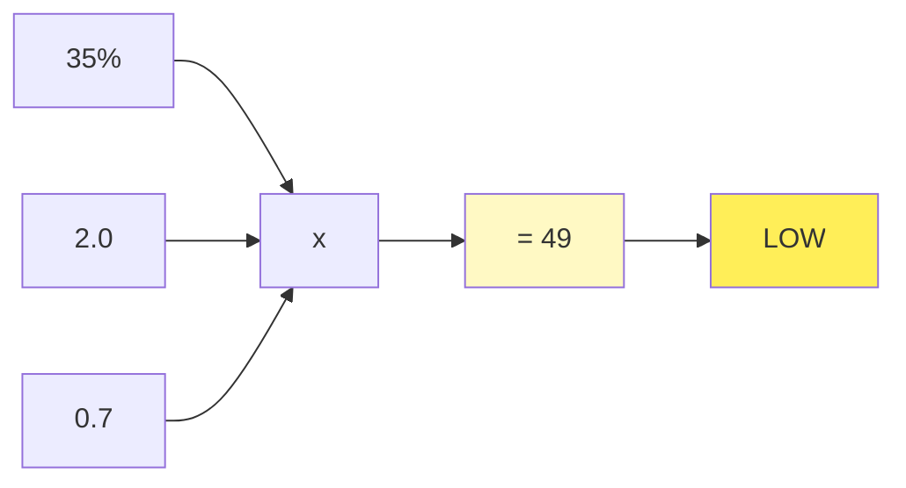

**Example 3: Confirmed threat**
```
Scenario: Encryption downgrade + unknown cell + cross-protocol correlation
- base_likelihood: 75% (encryption downgrade is strong indicator)
- impact_factor: 2.0 (IMSI catchers intercept communications)
- confidence: 0.9 (multiple indicators, cross-protocol confirmed)

Score = 75 x 2.0 x 0.9 = 135, capped at 100 (CRITICAL)
```

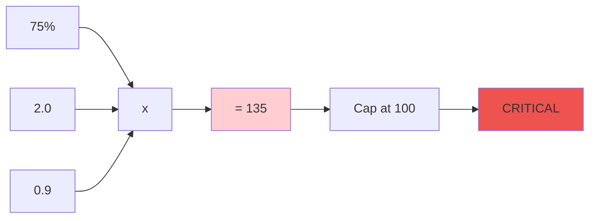

---

## 3. Impact Factors

Impact factors represent the **potential harm** if a detected threat is real. Higher impact means more severe consequences.

### Impact Factor Hierarchy

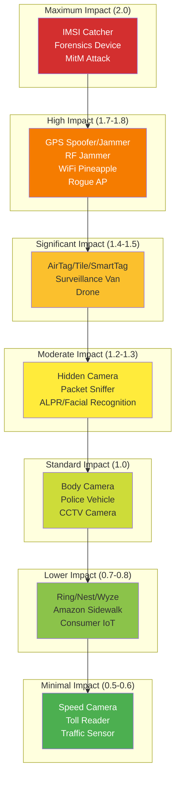

### Impact Factor Scale

| Factor | Meaning | Examples |
|--------|---------|----------|
| 2.0 | Maximum impact - intercepts all communications, can cause physical harm | IMSI catcher, forensics device, MitM |
| 1.8 | High impact - can cause physical harm via misdirection or denial | GPS spoofer/jammer, RF jammer, WiFi Pineapple |
| 1.5 | Significant impact - stalking/tracking concern | AirTag, Tile, SmartTag, surveillance van |
| 1.2-1.3 | Moderate impact - privacy violations | Hidden camera, LPR, facial recognition |
| 1.0 | Standard impact - surveillance but known type | Body camera, CCTV, police equipment |
| 0.7-0.8 | Lower impact - consumer IoT devices | Ring doorbell, Nest camera, Sidewalk |
| 0.5-0.6 | Minimal impact - traffic/infrastructure | Speed camera, toll reader, traffic sensor |

### Complete Impact Factor Table

#### Maximum Impact (2.0)
| Device Type | Impact | Reason |
|-------------|--------|--------|
| `STINGRAY_IMSI` | 2.0 | Intercepts all cellular communications |
| `CELLEBRITE_FORENSICS` | 2.0 | Full device extraction capability |
| `GRAYKEY_DEVICE` | 2.0 | Bypasses device encryption |
| `MAN_IN_MIDDLE` | 2.0 | Intercepts all network traffic |

#### High Impact (1.7-1.8)
| Device Type | Impact | Reason |
|-------------|--------|--------|
| `GNSS_SPOOFER` | 1.8 | Can cause physical harm via misdirection |
| `GNSS_JAMMER` | 1.8 | Denies navigation capability |
| `RF_JAMMER` | 1.8 | Denies all wireless communications |
| `WIFI_PINEAPPLE` | 1.8 | Network attack platform |
| `ROGUE_AP` | 1.7 | Credential theft capability |

#### Significant Impact (1.4-1.5)
| Device Type | Impact | Reason |
|-------------|--------|--------|
| `AIRTAG` | 1.5 | Stalking/tracking concern |
| `TILE_TRACKER` | 1.5 | Stalking/tracking concern |
| `SAMSUNG_SMARTTAG` | 1.5 | Stalking/tracking concern |
| `GENERIC_BLE_TRACKER` | 1.5 | Stalking/tracking concern |
| `TRACKING_DEVICE` | 1.5 | General tracking concern |
| `SURVEILLANCE_VAN` | 1.5 | Mobile surveillance platform |
| `DRONE` | 1.4 | Aerial surveillance capability |

#### Moderate Impact (1.2-1.3)
| Device Type | Impact | Reason |
|-------------|--------|--------|
| `HIDDEN_CAMERA` | 1.3 | Covert video recording |
| `HIDDEN_TRANSMITTER` | 1.3 | Covert audio/data transmission |
| `PACKET_SNIFFER` | 1.3 | Network traffic capture |
| `FLOCK_SAFETY_CAMERA` | 1.2 | ALPR/vehicle tracking |
| `LICENSE_PLATE_READER` | 1.2 | Vehicle tracking |
| `FACIAL_RECOGNITION` | 1.2 | Biometric identification |
| `CLEARVIEW_AI` | 1.2 | Mass facial recognition |
| `PALANTIR_DEVICE` | 1.2 | Data aggregation |
| `RAVEN_GUNSHOT_DETECTOR` | 1.2 | Audio surveillance |
| `SHOTSPOTTER` | 1.2 | Audio surveillance |

#### Standard Impact (1.0)
| Device Type | Impact | Reason |
|-------------|--------|--------|
| `BODY_CAMERA` | 1.0 | Overt recording |
| `POLICE_VEHICLE` | 1.0 | Known surveillance platform |
| `POLICE_RADIO` | 1.0 | Communications equipment |
| `MOTOROLA_POLICE_TECH` | 1.0 | Police communications |
| `AXON_POLICE_TECH` | 1.0 | Police technology |
| `L3HARRIS_SURVEILLANCE` | 1.0 | Known surveillance vendor |
| `CCTV_CAMERA` | 1.0 | Overt surveillance |
| `PTZ_CAMERA` | 1.0 | Overt surveillance |
| `THERMAL_CAMERA` | 1.0 | Specialized imaging |
| `NIGHT_VISION` | 1.0 | Specialized imaging |
| `ULTRASONIC_BEACON` | 1.0 | Cross-device tracking |
| `SATELLITE_NTN` | 1.0 | Satellite communications |

#### Lower Impact (0.7-0.8)
| Device Type | Impact | Reason |
|-------------|--------|--------|
| `RING_DOORBELL` | 0.8 | Consumer IoT - not targeted |
| `NEST_CAMERA` | 0.8 | Consumer IoT - not targeted |
| `WYZE_CAMERA` | 0.8 | Consumer IoT - not targeted |
| `ARLO_CAMERA` | 0.8 | Consumer IoT - not targeted |
| `EUFY_CAMERA` | 0.8 | Consumer IoT - not targeted |
| `BLINK_CAMERA` | 0.8 | Consumer IoT - not targeted |
| `SIMPLISAFE_DEVICE` | 0.8 | Consumer security system |
| `ADT_DEVICE` | 0.8 | Consumer security system |
| `VIVINT_DEVICE` | 0.8 | Consumer security system |
| `AMAZON_SIDEWALK` | 0.7 | Mesh network, not targeted |
| `BLUETOOTH_BEACON` | 0.7 | Retail/location tracking |
| `RETAIL_TRACKER` | 0.7 | Commercial tracking |
| `CROWD_ANALYTICS` | 0.7 | Aggregate analysis |

#### Minimal Impact (0.5-0.6)
| Device Type | Impact | Reason |
|-------------|--------|--------|
| `SPEED_CAMERA` | 0.6 | Traffic enforcement |
| `RED_LIGHT_CAMERA` | 0.6 | Traffic enforcement |
| `TOLL_READER` | 0.6 | Infrastructure |
| `SURVEILLANCE_INFRASTRUCTURE` | 0.6 | General infrastructure |
| `TRAFFIC_SENSOR` | 0.5 | Non-identifying |
| `FLEET_VEHICLE` | 0.5 | Commercial tracking |
| `RF_INTERFERENCE` | 0.5 | Environmental, not attack |
| `RF_ANOMALY` | 0.5 | May be benign |

---

## 4. Confidence Adjustments

Confidence represents how reliable the detection is. The system starts at a **neutral confidence of 0.5** and applies adjustments based on various factors.

### Confidence Adjustment Flow

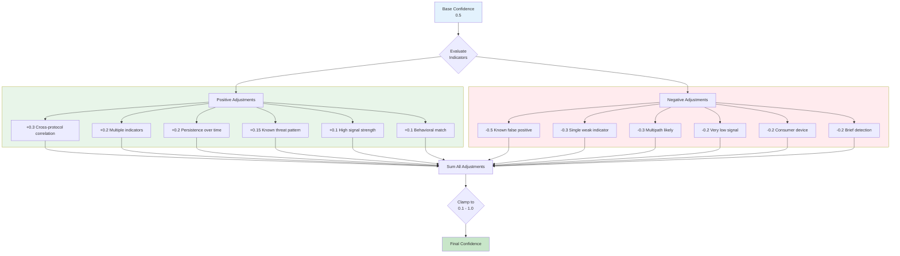

### Positive Adjustments (Increase Confidence)

| Factor | Adjustment | Condition |
|--------|------------|-----------|
| Multiple confirming indicators | +0.2 | More than one pattern matched |
| High signal strength | +0.1 | RSSI > -50 dBm |
| Good signal strength | +0.05 | RSSI > -60 dBm |
| Persistence over time | +0.2 | Seen 3+ times or detected for 5+ minutes |
| Cross-protocol correlation | +0.3 | Same threat seen on multiple protocols (strongest indicator) |
| Known threat pattern | +0.15 | Exact match to known threat signature |
| Behavioral match | +0.1 | Behavior matches threat profile |

### Negative Adjustments (Decrease Confidence)

| Factor | Adjustment | Condition |
|--------|------------|-----------|
| Single weak indicator | -0.3 | Only one pattern matched (significant penalty) |
| Known false positive pattern | -0.5 | Matches known benign pattern |
| Low signal strength | -0.1 | RSSI < -80 dBm |
| Very low signal strength | -0.2 | RSSI < -90 dBm |
| Common consumer device | -0.2 | Known consumer IoT device type |
| Stationary in known area | -0.15 | Device is stationary in a known safe area |
| Brief detection | -0.2 | Seen only once briefly (< 30 seconds) |
| Multipath likely | -0.3 | GNSS detection in urban canyon or indoor |

### Match Quality Bonuses

The quality of pattern matching also affects confidence:

| Match Quality | Bonus | Description |
|---------------|-------|-------------|
| `EXACT` | +0.15 | Exact match to known threat signature |
| `STRONG` | +0.10 | Multiple patterns matched |
| `PARTIAL` | +0.00 | Single pattern matched (neutral) |
| `WEAK` | -0.10 | Partial pattern match |
| `HEURISTIC` | -0.20 | Only behavioral/heuristic match |

### Confidence Calculation Example

```
Starting confidence: 0.5

Detection: AirTag seen 5 times over 10 minutes, RSSI -55 dBm
+ Good signal strength: +0.05
+ Persistence: +0.2
- Single indicator: -0.3

Final confidence: 0.5 + 0.05 + 0.2 - 0.3 = 0.45
```

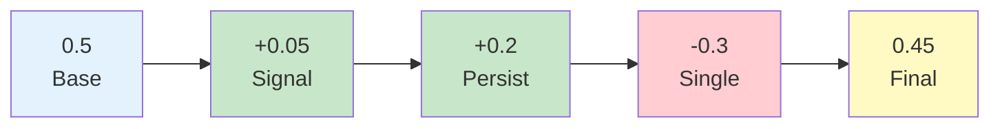

---

## 5. Base Likelihood Estimates

Base likelihood represents the **probability that a detection of this type is a real threat**. Values are conservative to reduce false positives.

### High Confidence Detection Methods (70-85%)

| Detection Method | Likelihood | Rationale |
|------------------|------------|-----------|
| Exact known threat match | 85% | Known malicious signature |
| Encryption downgrade (2G) | 75% | Strong IMSI catcher indicator |
| Active GNSS spoofing | 70% | Multiple spoofing indicators present |

### Medium Confidence Detection Methods (35-55%)

| Detection Method | Likelihood | Rationale |
|------------------|------------|-----------|
| Tracker following | 55% | Same tracker at multiple locations |
| Suspicious cell parameters | 50% | Unusual but not conclusive cell data |
| GNSS signal anomaly | 40% | Could be spoofing or environmental |
| Unknown cell tower | 35% | Cell not in database, could be new |

### Lower Confidence Detection Methods (15-30%)

| Detection Method | Likelihood | Rationale |
|------------------|------------|-----------|
| Single pattern match | 30% | One pattern matched, no confirmation |
| Cell change while stationary | 25% | Often normal network optimization |
| Brief ultrasonic | 20% | Short detection, uncertain source |
| GNSS multipath | 15% | Usually just reflection, not attack |

### Informational Detection Methods (5-15%)

| Detection Method | Likelihood | Rationale |
|------------------|------------|-----------|
| Bluetooth beacon (retail) | 15% | Common in stores, not targeted |
| Known consumer device | 10% | Ring doorbell, smart home camera |
| Normal network handoff | 5% | Expected cellular behavior |

---

## 6. Severity Level Mapping

The final threat score maps to severity levels with specific thresholds:

### Severity Level State Diagram

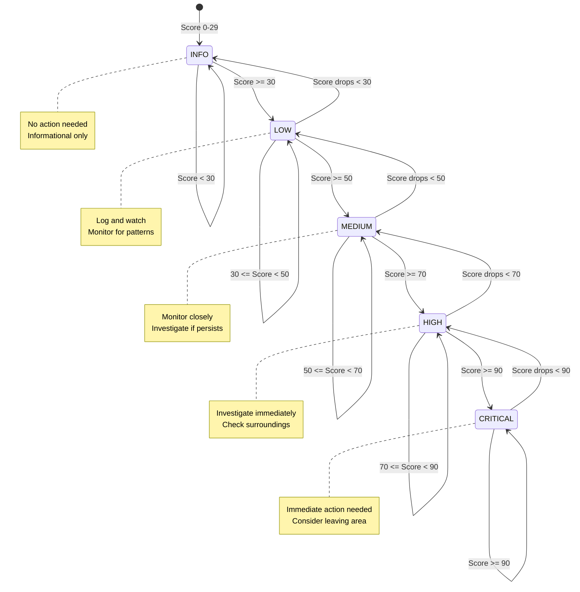

### Severity Thresholds

| Severity | Score Range | User Action |
|----------|-------------|-------------|
| CRITICAL | 90-100 | Immediate action needed |
| HIGH | 70-89 | Investigate immediately |
| MEDIUM | 50-69 | Monitor closely |
| LOW | 30-49 | Log and watch |
| INFO | 0-29 | Notable but not threatening |

### Severity Level Visual Scale

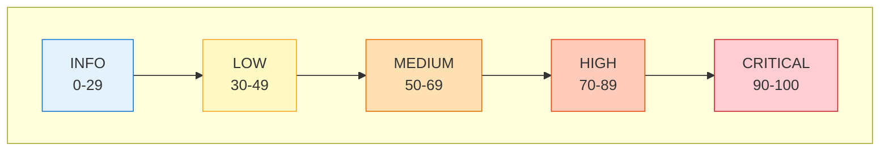

### CRITICAL (90-100)

**Definition**: Confirmed active threat requiring immediate action.

**What it means**: High probability of a real, high-impact threat with strong confirming evidence.

**Examples**:
- Active IMSI catcher with encryption downgrade and cross-protocol correlation
- Confirmed GPS spoofing attack affecting navigation
- Known forensics device actively scanning
- Tracker following user for extended period with multiple sightings

**User guidance**: Take immediate protective action. Consider leaving the area, turning off wireless radios, or contacting authorities.

### HIGH (70-89)

**Definition**: High probability threat requiring immediate investigation.

**What it means**: Strong indicators of a real threat, but not fully confirmed.

**Examples**:
- Encryption downgrade to 2G with unknown cell tower
- Tracker seen at 3+ different locations over time
- Multiple surveillance devices detected in unusual configuration
- GNSS anomalies consistent with spoofing in non-urban area

**User guidance**: Investigate the situation. Check surroundings, verify detection details, prepare to take action.

### MEDIUM (50-69)

**Definition**: Moderate concern requiring close monitoring.

**What it means**: Possible threat with some concerning indicators, but also plausible benign explanations.

**Examples**:
- Unknown cell tower in familiar area
- New tracker detected nearby (first sighting)
- Suspicious WiFi network at multiple locations
- Unusual but not conclusive RF activity

**User guidance**: Monitor the situation. If indicators persist or strengthen, escalate to HIGH.

### LOW (30-49)

**Definition**: Possible concern that should be logged and watched.

**What it means**: Detection has some threat characteristics, but most likely benign.

**Examples**:
- Single cell change while stationary (normal optimization)
- Brief ultrasonic detection (could be TV ad beacon)
- Weak signal detection at edge of range
- Consumer device with slightly unusual characteristics

**User guidance**: Log for future reference. Watch for patterns over time.

### INFO (0-29)

**Definition**: Notable observation that is not threatening.

**What it means**: Detection is interesting for awareness but not a security concern.

**Examples**:
- Neighbor's Ring doorbell
- Retail Bluetooth beacon
- Known Amazon Sidewalk bridge
- Normal cellular handoff

**User guidance**: No action needed. Informational only.

---

## 7. Aggregate Threat Calculation

When multiple detections occur, the system calculates an **aggregate threat level** that is smarter than simply taking the maximum or counting HIGH threats.

### Aggregate Threat Calculation Flow

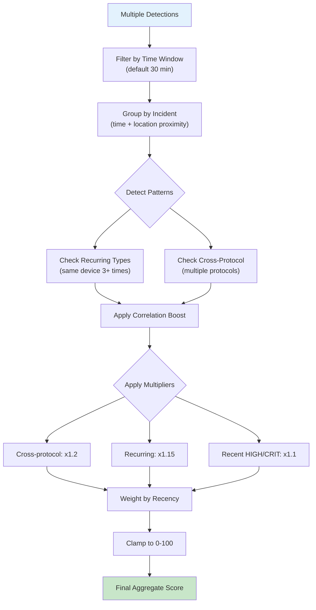

### Aggregation Algorithm

```kotlin
fun calculateAggregateThreat(detections: List<Detection>, timeWindowMs: Long): AggregateThreatResult
```

#### Step 1: Filter Recent Detections

Only detections within the specified time window (default 30 minutes) are considered.

#### Step 2: Group Into Incidents

Detections are grouped into "incidents" based on spatial and temporal proximity:
- **Same incident**: Within 5 minutes AND within ~50 meters
- This prevents a single surveillance device seen multiple times from artificially inflating the threat level

#### Step 3: Pattern Detection

The system looks for concerning patterns:
- **Recurring types**: Same device type seen 3+ times (suggestive of targeted surveillance)
- **Cross-protocol correlation**: Same threat detected on multiple protocols (strong confirmation)

#### Step 4: Calculate Aggregate Score

```
Starting score = highest individual threat score

If cross-protocol correlation: score *= 1.2 (+20%)
If recurring pattern: score *= 1.15 (+15%)
If very recent HIGH/CRITICAL (last 5 min): score *= 1.1 (+10%)

Final score = clamped to 0-100
```

### Aggregate Result Fields

| Field | Description |
|-------|-------------|
| `overallSeverity` | Final aggregated severity level |
| `overallScore` | Numerical score (0-100) |
| `incidentCount` | Number of unique incidents (deduplicated) |
| `detectionCount` | Total raw detection count |
| `highestThreatDetection` | The single most severe detection |
| `correlatedProtocols` | Set of protocols that detected threats |
| `hasCorrelation` | Whether cross-protocol correlation exists |
| `hasRecurringPattern` | Whether recurring patterns detected |
| `reasoning` | Human-readable explanation |

### Example Aggregate Calculation

```
Detections in last 30 minutes:
1. AirTag at Location A, 10:00 AM, score 45 (LOW)
2. AirTag at Location A, 10:02 AM, score 45 (LOW) - same incident
3. AirTag at Location B, 10:30 AM, score 55 (MEDIUM)
4. Unknown BLE at Location B, 10:31 AM, score 40 (LOW)

Incidents: 2 (A and B)
Cross-protocol: No (all BLE)
Recurring pattern: Yes (AirTag seen 3x)

Aggregate score:
- Start with highest: 55
- Recurring pattern bonus: 55 * 1.15 = 63
- Final: 63 (MEDIUM)

Result: MEDIUM aggregate threat, 2 incidents, recurring tracker pattern
```

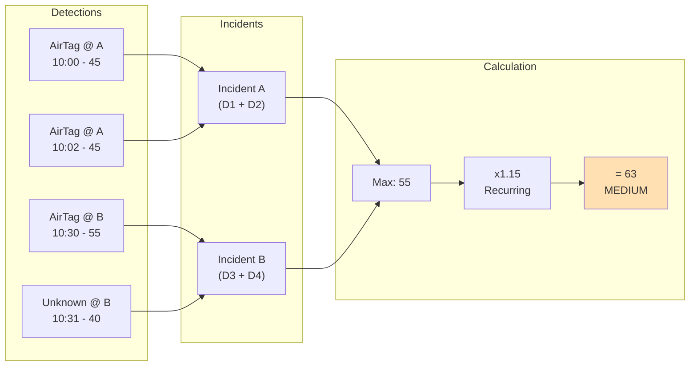

---

## 8. Detection Handler Architecture

The detection system uses a handler-based architecture where each protocol has a dedicated handler.

### Detection Handler Class Diagram

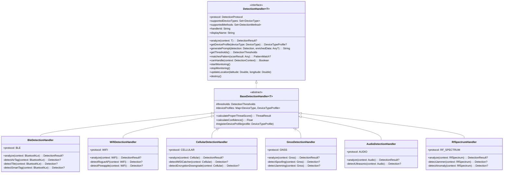

### Base Handler Interface

```kotlin
interface DetectionHandler<T : DetectionContext> {
    val protocol: DetectionProtocol
    val supportedDeviceTypes: Set<DeviceType>
    val supportedMethods: Set<DetectionMethod>
    val handlerId: String
    val displayName: String

    fun analyze(context: T): DetectionResult?
    fun getDeviceProfile(deviceType: DeviceType): DeviceTypeProfile?
    fun generatePrompt(detection: Detection, enrichedData: Any?): String
    fun getThresholds(): DetectionThresholds
    fun matchesPattern(scanResult: Any): PatternMatch?
    fun canHandle(context: DetectionContext): Boolean

    // Lifecycle methods
    fun startMonitoring()
    fun stopMonitoring()
    fun updateLocation(latitude: Double, longitude: Double)
    fun destroy()
}
```

### Detection Context Hierarchy

Each protocol has a specific context type containing protocol-appropriate data:

| Context Type | Protocol | Key Fields |
|--------------|----------|------------|
| `BluetoothLe` | BLE | macAddress, serviceUuids, manufacturerData, isConnectable |
| `WiFi` | WiFi | ssid, bssid, channel, frequency, capabilities |
| `Cellular` | Cellular | mcc, mnc, lac, cid, networkType, previousCellInfo |
| `Gnss` | GNSS/GPS | satellites, hdop, pdop, fixType, cn0DbHz, agcLevel |
| `Audio` | Audio/Ultrasonic | frequencyHz, amplitudeDb, duration, isUltrasonic |
| `RfSpectrum` | RF | frequencyHz, bandwidthHz, powerDbm, modulationType |
| `Satellite` | Satellite | satelliteId, orbitType, elevation, expectedTiming |

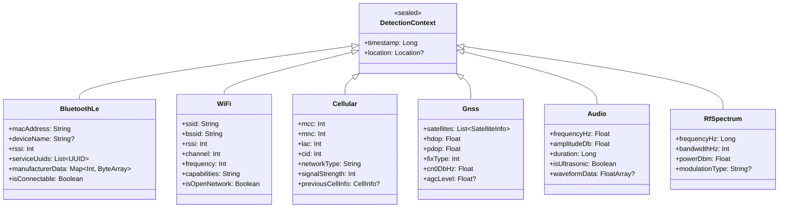

### Base Detection Handler

The `BaseDetectionHandler<T>` abstract class provides common functionality:

- Threshold management with configurable sensitivity levels
- Device profile registration and lookup
- AI prompt generation for LLM analysis
- Aggregate confidence and threat score calculation
- Proper threat calculation using the formula

### Handler Registration

Handlers register themselves with the `DetectionRegistry` on initialization, specifying:
- Which protocol they handle
- Which device types they can detect
- Which detection methods they implement

---

## 9. Detection Registry

The `DetectionRegistry` is the central coordination point for all detection handlers.

### Registry Coordination Flow

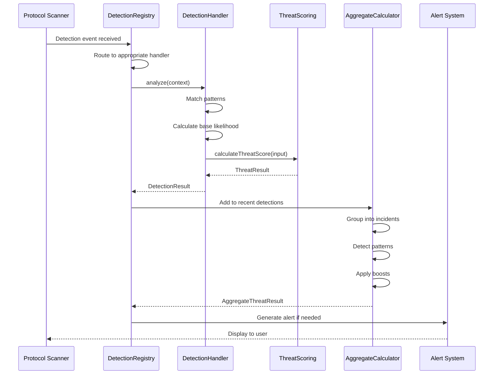

### Responsibilities

1. **Handler Management**: Maintains mappings from protocols and device types to handlers
2. **Lookup Services**: Provides efficient lookup by protocol or device type
3. **Lifecycle Coordination**: Starts/stops all handlers together
4. **Aggregate Calculation**: Calculates aggregate threat from multiple detections
5. **Statistics**: Provides threat statistics for dashboard displays

### Key Methods

```kotlin
// Get handler by protocol
fun getHandler(protocol: DetectionProtocol): DetectionHandler<*>?

// Get handler that can detect a device type
fun getHandlerForDeviceType(deviceType: DeviceType): DetectionHandler<*>?

// Register custom handler at runtime
fun registerCustomHandler(handler: DetectionHandler<*>)

// Calculate aggregate threat
fun calculateAggregateThreat(detections: List<Detection>, timeWindowMs: Long): AggregateThreatResult

// Get threat statistics
fun getThreatStatistics(detections: List<Detection>): ThreatStatistics
```

### Thread Safety

The registry uses `ConcurrentHashMap` for handler storage and is safe for concurrent access from multiple scanning threads.

### Custom Handler Registration

The system supports runtime registration of custom handlers for extensibility:

```kotlin
registry.registerCustomHandler(myCustomBleHandler)
```

This allows users or plugins to add new detection capabilities without modifying core app code.

---

## 10. Real-World Calibration

### Calibration Feedback Loop

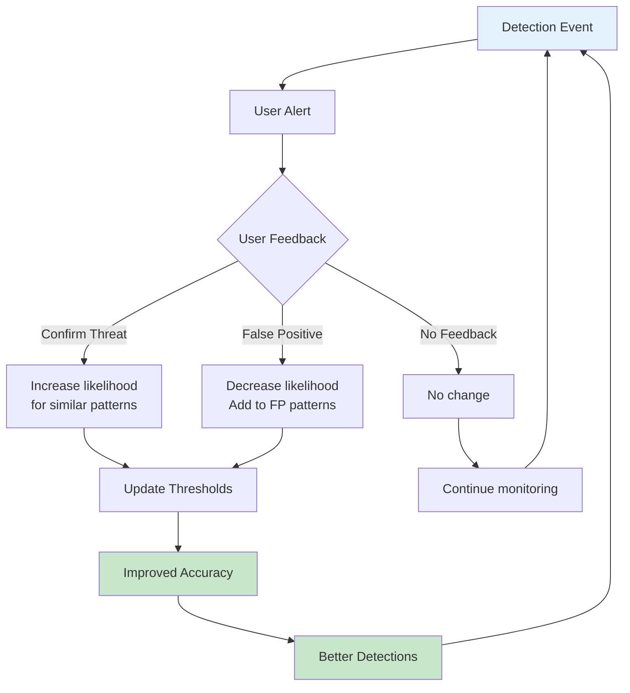

### How Thresholds Were Determined

The threat scoring thresholds are based on:

1. **Published research** on cell site simulator detection and tracker identification
2. **Field testing** in various environments (urban, suburban, rural)
3. **False positive analysis** from beta users
4. **Threat model analysis** considering attacker capabilities and user risk profiles

### Testing Methodology

Calibration involved:

1. **Baseline collection**: Recording normal device behavior across diverse environments
2. **Known threat testing**: Testing against actual AirTags, WiFi Pineapples, and simulated cellular anomalies
3. **Environmental variation**: Testing in urban canyons, indoor, outdoor, moving vs stationary
4. **Threshold tuning**: Adjusting until false positive rate was acceptable without missing known threats

### Sensitivity Presets

The system provides three sensitivity presets for different user needs:

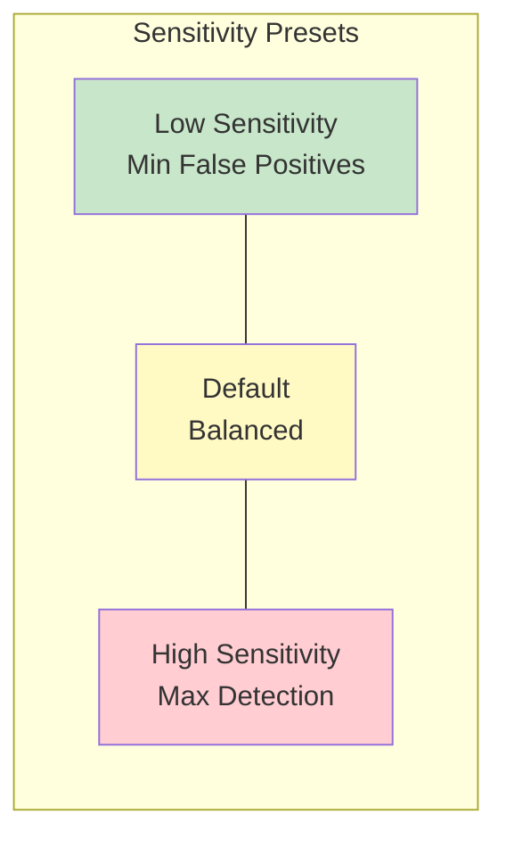

#### Default Thresholds
```kotlin
minRssi = -90
minConfidence = 0.3f
minThreatScore = 20
cacheExpiryMs = 30 minutes
minSightingsRequired = 1
reportLowConfidence = true
```

#### High Sensitivity (Maximum Detection)
```kotlin
minRssi = -95
minConfidence = 0.15f
minThreatScore = 10
cacheExpiryMs = 60 minutes
minSightingsRequired = 1
reportLowConfidence = true
```
**Tradeoff**: More detections, more false positives

#### Low Sensitivity (Minimum False Positives)
```kotlin
minRssi = -80
minConfidence = 0.6f
minThreatScore = 50
cacheExpiryMs = 15 minutes
minSightingsRequired = 2
reportLowConfidence = false
```
**Tradeoff**: Fewer false positives, may miss some real threats

### Ongoing Tuning

Thresholds may be adjusted based on:
- User feedback on false positive rates
- New threat research and attack techniques
- Device-specific quirks discovered in the field
- Regional variations in cellular network behavior

---

## 11. Debug Output

The threat scoring system provides comprehensive debug output for troubleshooting and verification.

### Debug Output Structure

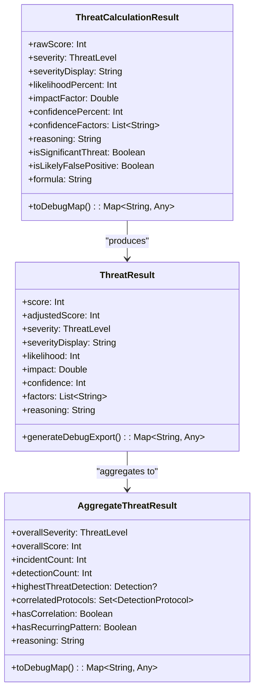

### ThreatResult Debug Export

```kotlin
fun generateDebugExport(result: ThreatResult): Map<String, Any>
```

Returns a map containing:

| Field | Type | Description |
|-------|------|-------------|
| `raw_score` | Int | Raw calculated score (0-100) |
| `adjusted_score` | Int | Score after edge case adjustments |
| `severity` | String | ThreatLevel enum name |
| `severity_display` | String | Human-readable severity |
| `likelihood_percent` | Int | Base likelihood used |
| `impact_factor` | Double | Impact factor for device type |
| `confidence_percent` | Int | Final confidence percentage |
| `confidence_factors` | List<String> | Factors that affected confidence |
| `reasoning` | String | Human-readable calculation breakdown |
| `calculation_formula` | String | The actual formula with values |

### ThreatCalculationResult Debug Export

```kotlin
fun toDebugMap(): Map<String, Any>
```

Returns:

| Field | Type | Description |
|-------|------|-------------|
| `raw_score` | Int | Calculated score |
| `severity` | String | ThreatLevel name |
| `severity_display` | String | Display name |
| `likelihood_percent` | Int | Base likelihood |
| `impact_factor` | Double | Impact multiplier |
| `confidence_percent` | Int | Confidence percentage |
| `confidence_factors` | List<String> | Applied adjustments |
| `reasoning` | String | Full explanation |
| `is_significant_threat` | Boolean | MEDIUM or higher |
| `is_likely_false_positive` | Boolean | Low score + low confidence |
| `formula` | String | Calculation formula |

### Debug Data Flow

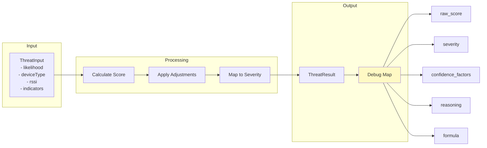

### AggregateThreatResult Debug Export

```kotlin
fun toDebugMap(): Map<String, Any>
```

Returns:

| Field | Type | Description |
|-------|------|-------------|
| `overall_severity` | String | Aggregate severity name |
| `overall_severity_display` | String | Display name |
| `overall_score` | Int | Aggregate score |
| `incident_count` | Int | Deduplicated incidents |
| `detection_count` | Int | Total detections |
| `correlated_protocols` | List<String> | Protocol names |
| `has_cross_protocol_correlation` | Boolean | Multi-protocol detected |
| `has_recurring_pattern` | Boolean | Same type recurring |
| `requires_immediate_action` | Boolean | HIGH/CRITICAL |
| `requires_monitoring` | Boolean | MEDIUM |
| `highest_threat_device` | String | Top threat device name |
| `highest_threat_score` | Int | Top threat score |
| `reasoning` | String | Full breakdown |

### Interpreting Debug Data

When troubleshooting an unexpected score:

1. **Check likelihood**: Is the base likelihood appropriate for the detection method?
2. **Check impact**: Is the impact factor correct for the device type?
3. **Check confidence factors**: Which adjustments were applied? Any unexpected ones?
4. **Check reasoning**: Does the human-readable explanation make sense?
5. **Compare formula**: Does `likelihood * impact * confidence = raw_score`?

---

## 12. Known Issues and Tradeoffs

### False Positive vs False Negative Balance

The current calibration prioritizes **reducing false positives** at the cost of potentially missing some real threats. This decision was made because:

- False positives erode user trust faster than missed detections build it
- Users can increase sensitivity if they prefer more alerts
- Most users are not under active targeted surveillance

**If you are a high-risk individual**, consider using HIGH sensitivity mode and accepting more false positives.

### Environmental Sensitivity

The system may produce different results in different environments:

| Environment | Effect | Mitigation |
|-------------|--------|------------|
| Urban canyon | More GNSS false positives | Multipath penalty applied |
| Dense WiFi | More WiFi false positives | Consumer device recognition |
| Indoor | Weaker signals, more variability | Signal strength adjustments |
| Moving | More cell changes | Movement context considered |

### Device-Specific Variations

Some devices report different RSSI ranges or have BLE scanning quirks:

- Older Android devices may have less accurate RSSI
- Some devices truncate manufacturer data
- Background scanning restrictions vary by Android version

The system uses conservative thresholds that work across devices, but optimal calibration may vary.

### Known Limitations

1. **Cell tower database**: Unknown towers may be legitimate new installations
2. **Consumer device identification**: New IoT devices may not be recognized
3. **Regional variations**: Cellular network behavior varies by country/carrier
4. **Sophisticated attacks**: Advanced threats may evade pattern-based detection

---

## 13. Extending the System

### Adding New Detection Types

To add a new device type:

1. Add the type to `DeviceType` enum in `Detection.kt`
2. Add impact factor in `ThreatScoring.kt` impactFactors map
3. Add detection method to `DetectionMethod` enum if needed
4. Update relevant handler to detect the new type

### Adding a New Handler

To add a handler for a new protocol:

1. Create a context class extending `DetectionContext`
2. Implement `DetectionHandler<YourContext>`
3. Extend `BaseDetectionHandler` for common functionality
4. Register with dependency injection (Dagger/Hilt)

```kotlin
@Singleton
class MyProtocolHandler @Inject constructor() : BaseDetectionHandler<DetectionContext.MyProtocol>() {

    override val protocol = DetectionProtocol.MY_PROTOCOL
    override val supportedDeviceTypes = setOf(DeviceType.MY_DEVICE)
    override val supportedMethods = setOf(DetectionMethod.MY_METHOD)

    override fun analyze(context: DetectionContext.MyProtocol): DetectionResult? {
        // Your detection logic here
        val threatResult = calculateProperThreatScore(
            baseLikelihood = 50,
            deviceType = DeviceType.MY_DEVICE,
            rssi = context.rssi,
            hasMultipleIndicators = false
        )
        // Return DetectionResult
    }

    override fun matchesPattern(scanResult: Any): PatternMatch? {
        // Pattern matching logic
    }
}
```

### Calibrating Impact Factors

When adding a new device type, consider:

1. **What is the worst case if this is a real threat?**
   - Physical harm possible: 1.8-2.0
   - Communications intercepted: 2.0
   - Privacy violated: 1.2-1.5
   - Inconvenience only: 0.5-0.8

2. **Is the harm targeted or incidental?**
   - Targeted at individual: Higher impact
   - Mass surveillance: Moderate impact
   - Passive infrastructure: Lower impact

3. **Can the user mitigate it?**
   - No mitigation possible: Higher impact
   - Easy to avoid: Lower impact

### Testing New Heuristics

When developing new detection heuristics:

1. **Collect baseline data**: Record normal behavior
2. **Test against known threats**: Verify detection
3. **Calculate false positive rate**: Run against baseline
4. **Adjust thresholds**: Tune until FP rate acceptable
5. **Document likelihood**: Add to base likelihood table

---

## Appendix: Code References

### Main Source Files

| File | Description |
|------|-------------|
| `ThreatScoring.kt` | Core threat calculation logic |
| `DetectionHandler.kt` | Handler interface and base class |
| `DetectionRegistry.kt` | Central handler coordination |
| `Detection.kt` | Data models and enums |

### Key Classes

| Class | Purpose |
|-------|---------|
| `ThreatScoring` | Singleton with all scoring logic |
| `ThreatInput` | Input data for threat calculation |
| `ThreatResult` | Complete calculation result |
| `DetectionHandler<T>` | Protocol handler interface |
| `BaseDetectionHandler<T>` | Common handler functionality |
| `DetectionRegistry` | Handler coordination |
| `AggregateThreatResult` | Multi-detection analysis |

### Configuration Objects

| Object | Purpose |
|--------|---------|
| `ConfidenceAdjustments` | Confidence modifier constants |
| `BaseLikelihoods` | Base likelihood constants |
| `DefaultDetectionThresholds` | Standard sensitivity |
| `HighSensitivityThresholds` | Maximum detection |
| `LowSensitivityThresholds` | Minimum false positives |

---

*Document Version: 1.1*
*Last Updated: 2026-01-21*
*Framework Version: Based on ThreatScoring.kt and related detection classes*
