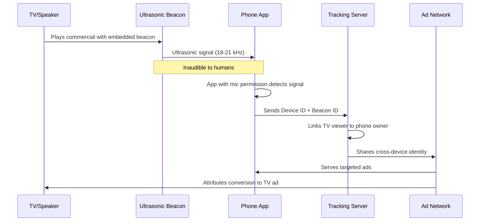
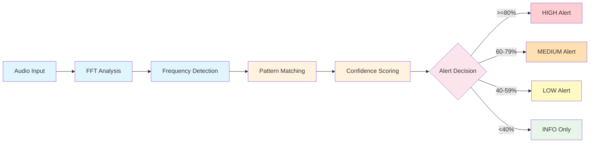
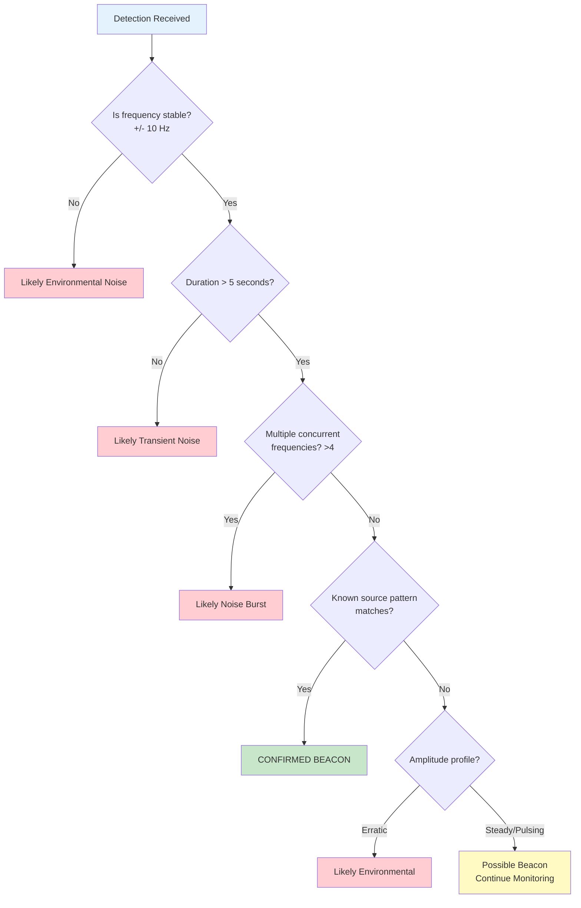
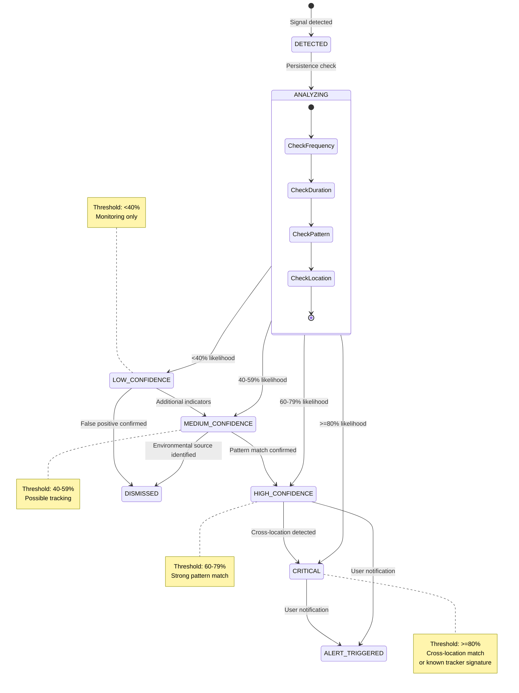
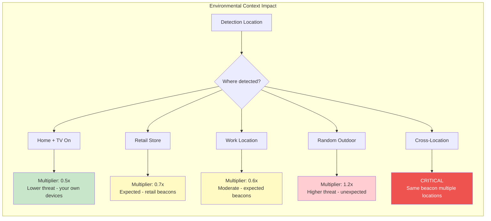
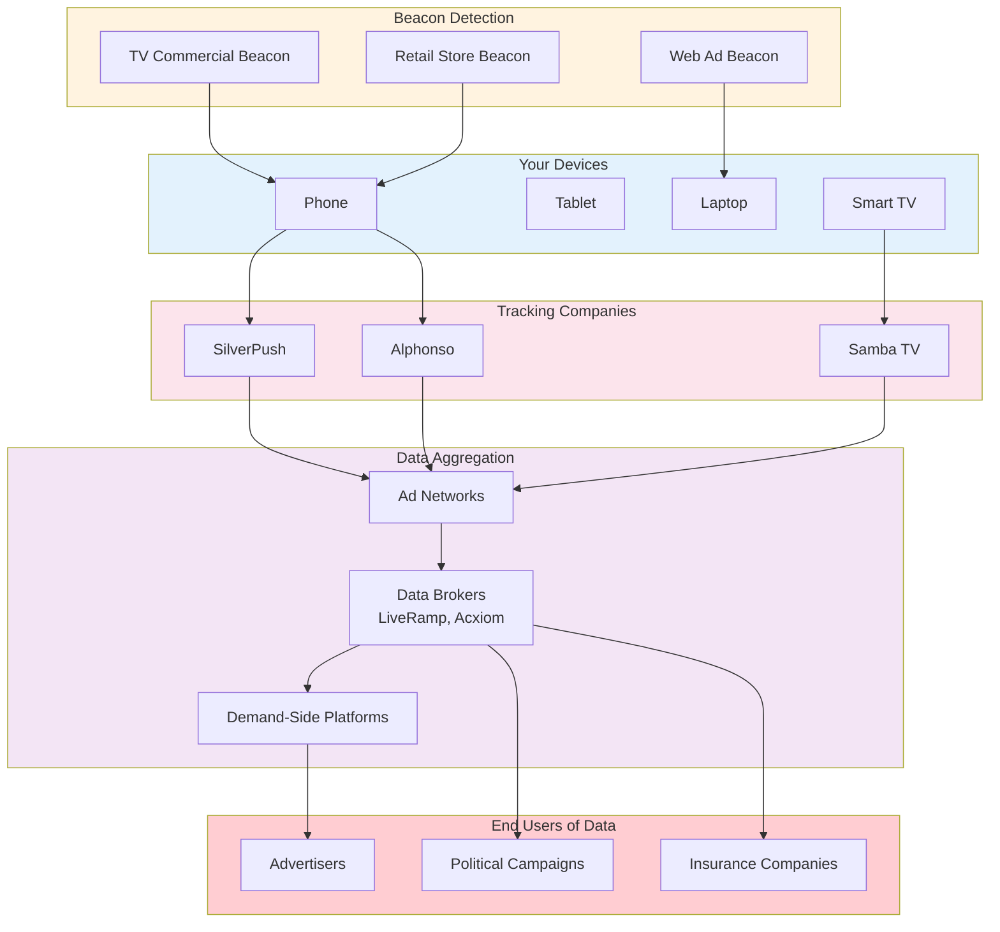
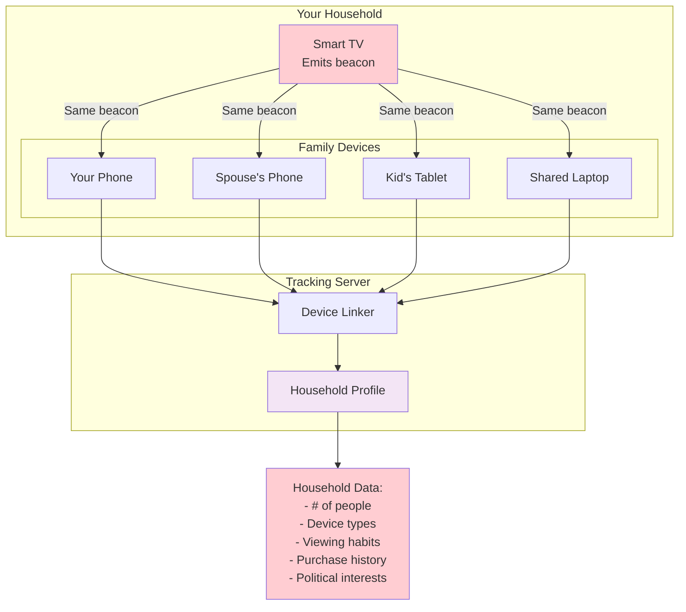
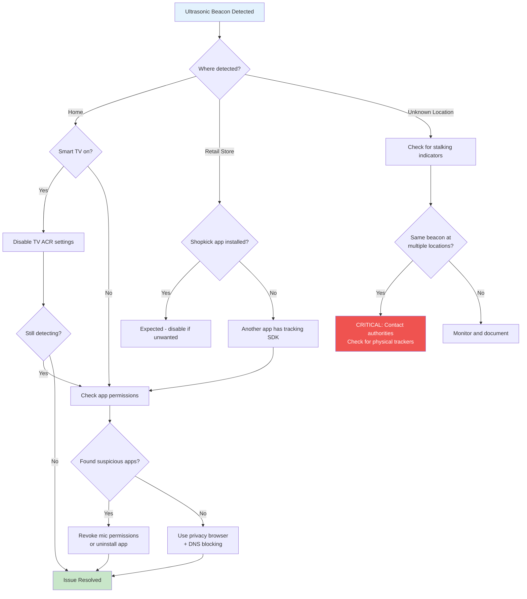

# Ultrasonic Tracking Beacon Detection System

## Table of Contents

1. [Overview](#1-overview)
2. [Detection Methods](#2-detection-methods)
3. [Known Tracking Systems](#3-known-tracking-systems)
4. [False Positive Sources](#4-false-positive-sources)
5. [Threat Scoring System](#5-threat-scoring-system)
6. [Real-World Sources](#6-real-world-sources)
7. [Runbook: Responding to Detections](#7-runbook-responding-to-detections)
8. [Privacy Impact Reference](#8-privacy-impact-reference)
9. [Known Limitations](#9-known-limitations)
10. [Mitigation Advice](#10-mitigation-advice)

---

## 1. Overview

### What is Ultrasonic Cross-Device Tracking?

Ultrasonic cross-device tracking is a surveillance technology that uses inaudible high-frequency audio signals (typically 17.5-22 kHz) to link and track users across multiple devices. These signals, embedded in TV commercials, web advertisements, or retail environments, are picked up by apps on your phone, tablet, or laptop that have microphone access.

### How It Works

1. **Beacon Emission**: A TV commercial, digital ad, or retail speaker emits an ultrasonic tone (inaudible to humans but detectable by device microphones)
2. **App Listening**: Apps with microphone permissions (often hidden in games, flashlight apps, or utility apps) continuously listen for these tones in the background
3. **Device Linking**: When the tone is detected, the app reports back to tracking servers, linking your phone to what you watched or where you visited
4. **Data Aggregation**: Multiple devices in the same household are linked together, building a comprehensive profile

### Cross-Device Tracking Flow

The following diagram illustrates how ultrasonic cross-device tracking works in practice:



### Privacy Implications

- **Cross-Device Tracking**: Links your phone, tablet, laptop, and smart TV into a single identity profile
- **De-anonymization**: Can link anonymous web browsing to your real identity through your phone
- **Location History**: Tracks store visits, time spent in specific aisles, and movement patterns
- **Ad Attribution**: Determines which TV ad led to a purchase on your phone
- **Household Mapping**: Identifies all devices in your home and links them to household members

### History: The SilverPush Controversy

**2015-2017: SilverPush Scandal**
- SilverPush Technologies (India) embedded ultrasonic tracking SDK in 200+ Android apps
- Apps would silently listen for TV commercial beacons without user knowledge
- Federal Trade Commission (FTC) sent warning letters to app developers in 2016
- Center for Democracy & Technology (CDT) filed complaints with the FTC

**2017: Vizio Smart TV Settlement**
- Vizio's Inscape software collected viewing data from 11 million TVs without consent
- FTC and New Jersey AG reached $2.2 million settlement
- Established precedent that covert viewing data collection is deceptive

**2018: Alphonso Investigation**
- New York Times investigation revealed Alphonso SDK in 1,000+ apps including children's games
- Apps like "Honey Quest" and "Pool 3D" were found to be listening for TV audio fingerprints
- Led to increased FTC scrutiny of TV attribution services

---

## 2. Detection Methods

### Detection Pipeline Overview

The system uses a multi-stage pipeline to detect and classify ultrasonic beacons:



### Frequency Detection Range

The system monitors the near-ultrasonic and ultrasonic frequency bands where tracking beacons operate:

```kotlin
// From UltrasonicDetector.kt
private const val ULTRASONIC_LOW = 17500   // Start of near-ultrasonic
private const val ULTRASONIC_MID = 18000   // Common beacon frequency
private const val ULTRASONIC_HIGH = 22000  // Upper limit of human hearing
private const val NYQUIST_LIMIT = SAMPLE_RATE / 2  // 22050 Hz max detectable
```

| Frequency Range | Purpose |
|-----------------|---------|
| 17,500 - 18,500 Hz | Ad tracking beacons (SilverPush, Alphonso, Zapr) |
| 18,500 - 19,500 Hz | Cross-device linking (LISNR, Signal360) |
| 19,500 - 20,500 Hz | Retail presence detection (Shopkick) |
| 20,000 - 22,000 Hz | Smart TV ACR (Samba TV, Inscape) |

### Beacon Frequency Spectrum

The following diagram shows the frequency allocation of known tracking systems:

```mermaid
%%{init: {'theme': 'base', 'themeVariables': { 'primaryColor': '#ff6b6b', 'primaryTextColor': '#fff', 'primaryBorderColor': '#ff6b6b', 'lineColor': '#333', 'secondaryColor': '#4ecdc4', 'tertiaryColor': '#ffe66d'}}}%%
gantt
    title Ultrasonic Beacon Frequency Spectrum (17.5 - 22 kHz)
    dateFormat X
    axisFormat %s kHz

    section Ad Tracking
    SilverPush (18.0 kHz)          :crit, 18000, 18200
    Alphonso (18.5 kHz)            :crit, 18500, 18700

    section Cross-Device
    Signal360 (19.0 kHz)           :active, 19000, 19200
    LISNR (19.5 kHz)               :active, 19500, 19700

    section Retail
    Shopkick (20.0 kHz)            :20000, 20200

    section Smart TV ACR
    Samba TV (20.0-21.0 kHz)       :done, 20000, 21000
```



**Frequency Reference Table:**

| Frequency | Tracking System | Category |
|-----------|-----------------|----------|
| 18.0 kHz | SilverPush | Ad Tracking |
| 18.5 kHz | Alphonso | TV Attribution |
| 19.0 kHz | Signal360 | Location Verification |
| 19.5 kHz | LISNR | Cross-Device Linking |
| 20.0 kHz | Shopkick | Retail Presence |
| 20.0-21.0 kHz | Samba TV | Smart TV ACR |

### Goertzel Algorithm

Rather than performing a full FFT (Fast Fourier Transform), the system uses the **Goertzel algorithm** for efficient single-frequency detection:

```kotlin
// From UltrasonicDetector.kt - Goertzel implementation
private fun goertzel(samples: ShortArray, count: Int, targetFreq: Int): Double {
    val normalizedFreq = targetFreq.toDouble() / SAMPLE_RATE
    val coeff = 2 * kotlin.math.cos(2 * Math.PI * normalizedFreq)

    var s0: Double
    var s1 = 0.0
    var s2 = 0.0

    for (i in 0 until minOf(count, samples.size)) {
        s0 = samples[i] / 32768.0 + coeff * s1 - s2
        s2 = s1
        s1 = s0
    }

    val power = s1 * s1 + s2 * s2 - s1 * s2 * coeff
    return sqrt(abs(power))
}
```

The Goertzel algorithm is O(N) per frequency and more efficient than FFT when detecting a small number of specific frequencies.

### FFT Configuration

```kotlin
// From UltrasonicDetector.kt
private const val SAMPLE_RATE = 44100     // 44.1kHz - standard for detecting up to ~22kHz
private const val FFT_SIZE = 4096         // Good frequency resolution (~10.7 Hz per bin)
private const val BUFFER_SIZE_MULTIPLIER = 4
```

- **Sample Rate**: 44,100 Hz provides Nyquist frequency of 22,050 Hz
- **FFT Size**: 4096 samples gives ~10.7 Hz frequency resolution
- **Bin Width**: `SAMPLE_RATE / FFT_SIZE = 10.77 Hz`

### Signal-to-Noise Thresholds

```kotlin
// From UltrasonicDetector.kt
private const val DETECTION_THRESHOLD_DB = 30.0  // Signal must be 30dB above noise floor
private const val AMPLITUDE_STABILITY_THRESHOLD = 3.0  // dB variance for steady signal
```

A signal must be **30 dB above the noise floor** to be considered for detection. This threshold reduces false positives from ambient noise while still catching legitimate beacons.

### Persistence Requirements

```kotlin
// From UltrasonicDetector.kt
private const val BEACON_DURATION_THRESHOLD_MS = 5_000L   // Must persist for 5 seconds
private const val MIN_DETECTIONS_TO_CONFIRM = 5           // Require 5 detections
private const val MIN_PERSISTENCE_FOR_ALERT_MS = 5_000L   // 5+ seconds for alert
```

- A beacon must be detected **at least 5 times** before being shown in the UI
- Detection must persist for **at least 5 seconds** to trigger an alert
- This filters out transient noise spikes and brief environmental interference

### Modulation Pattern Detection

The system identifies modulation patterns characteristic of specific tracking systems:

| Modulation Type | Tracking System | Characteristics |
|-----------------|-----------------|-----------------|
| **FSK** (Frequency Shift Keying) | SilverPush | Regular on/off pulsing pattern, 2-5 second beacons |
| **PSK** (Phase Shift Keying) | Alphonso | Phase-shifted patterns, continuous ACR |
| **CHIRP** (Frequency Sweep) | LISNR | Frequency sweeps, higher bandwidth |

```kotlin
// From UltrasonicDetector.kt - Modulation detection
enum class AmplitudeProfile(val displayName: String) {
    STEADY("Steady"),
    PULSING("Pulsing"),      // FSK modulation indicator
    MODULATED("Modulated"),  // PSK/CHIRP indicator
    ERRATIC("Erratic")       // Noise indicator
}
```

### Frequency Stability Analysis

True tracking beacons maintain precise frequencies (within +/-10 Hz), while environmental noise drifts:

```kotlin
// From UltrasonicDetector.kt
private const val FREQUENCY_STABILITY_TOLERANCE_HZ = 10  // True beacons are precise
```

---

## 3. Known Tracking Systems

### SilverPush (18,000 Hz - 18,200 Hz)

**Manufacturer**: SilverPush Technologies (India)

**Technical Details**:
- Primary Frequency: 18,000 Hz
- Secondary Frequency: 18,200 Hz (multi-frequency encoding)
- Modulation: FSK (Frequency Shift Keying)
- Beacon Duration: 2,000 - 5,000 ms

**History & Status**:
- SDK was embedded in 200+ apps (2015-2017)
- FTC sent warning letters to developers in 2016
- Supposedly discontinued after regulatory pressure
- Legal Status: `FTC_INVESTIGATED`

**Privacy Impact**: Cross-device linking - connects your phone to TV ads you've been exposed to

```kotlin
// From TrackerDatabase.kt
UltrasonicTrackerSignature(
    id = "silverpush_primary",
    name = "SilverPush Primary",
    manufacturer = "SilverPush Technologies (India)",
    primaryFrequencyHz = 18000,
    modulationType = UltrasonicModulation.FSK,
    beaconDurationMs = 2000L to 5000L,
    privacyImpact = PrivacyImpact.CROSS_DEVICE_LINKING,
    legalStatus = LegalStatus.FTC_INVESTIGATED
)
```

---

### Alphonso (18,500 Hz)

**Manufacturer**: Alphonso Inc (US)

**Technical Details**:
- Primary Frequency: 18,500 Hz
- Modulation: PSK (Phase Shift Keying)
- Mode: Always-on background listening (ACR)

**History & Status**:
- Found in 1,000+ apps including children's games
- New York Times investigation in 2018
- FTC investigated same year
- Legal Status: `FTC_INVESTIGATED`

**Apps Found In**: Games like "Honey Quest", "Pool 3D", and various utility apps

**Privacy Impact**: Viewing habits - fingerprints TV audio to track shows and ads you watch

```kotlin
// From TrackerDatabase.kt
UltrasonicTrackerSignature(
    id = "alphonso_tv",
    name = "Alphonso TV Attribution",
    manufacturer = "Alphonso Inc (US)",
    primaryFrequencyHz = 18500,
    modulationType = UltrasonicModulation.PSK,
    trackingPurpose = UltrasonicTrackingPurpose.TV_ATTRIBUTION,
    privacyImpact = PrivacyImpact.VIEWING_HABITS,
    legalStatus = LegalStatus.FTC_INVESTIGATED
)
```

---

### LISNR (19,500 Hz)

**Manufacturer**: LISNR Inc (US)

**Technical Details**:
- Primary Frequency: 19,500 Hz
- Modulation: CHIRP (Frequency Sweep)
- Bandwidth: Higher than other systems

**Legitimate Uses**: Proximity payments, ticketing, event check-in

**Privacy Concern**: While LISNR has legitimate uses, the same technology enables covert cross-device tracking

```kotlin
// From TrackerDatabase.kt
UltrasonicTrackerSignature(
    id = "lisnr",
    name = "LISNR",
    manufacturer = "LISNR Inc (US)",
    primaryFrequencyHz = 19500,
    modulationType = UltrasonicModulation.CHIRP,
    trackingPurpose = UltrasonicTrackingPurpose.CROSS_DEVICE_LINKING,
    hasLegitimateUses = true
)
```

---

### Shopkick (20,000 Hz)

**Manufacturer**: Shopkick / SK Telecom

**Technical Details**:
- Primary Frequency: 20,000 Hz
- Mode: Retail presence detection

**Deployment Locations**:
- Target
- Macy's
- Best Buy
- Walmart
- CVS

**User Consent**: Usually opt-in for loyalty rewards program

**Privacy Impact**: Location tracking - tracks store visits and time spent in aisles

```kotlin
// From TrackerDatabase.kt
UltrasonicTrackerSignature(
    id = "shopkick",
    name = "Shopkick",
    manufacturer = "Shopkick/SK Telecom",
    primaryFrequencyHz = 20000,
    trackingPurpose = UltrasonicTrackingPurpose.RETAIL_ANALYTICS,
    hasLegitimateUses = true,
    deploymentLocations = listOf("Target", "Macy's", "Best Buy", "Walmart", "CVS")
)
```

---

### Signal360 (19,000 Hz)

**Manufacturer**: Signal360 (US)

**Technical Details**:
- Primary Frequency: 19,000 Hz
- Mode: Location-based advertising

**Deployment Locations**:
- Shopping malls
- Airports
- Large retail complexes

**Privacy Impact**: Location verification for targeted advertising

```kotlin
// From TrackerDatabase.kt
UltrasonicTrackerSignature(
    id = "signal360",
    name = "Signal360",
    manufacturer = "Signal360 (US)",
    primaryFrequencyHz = 19000,
    trackingPurpose = UltrasonicTrackingPurpose.LOCATION_VERIFICATION,
    privacyImpact = PrivacyImpact.LOCATION_TRACKING
)
```

---

### Samba TV / Inscape (20,200 Hz - 21,500 Hz)

**Manufacturer**: Samba TV / Inscape (Vizio)

**Technical Details**:
- Primary Frequencies: 20,200 Hz, 20,800 Hz (Samba TV), 21,500 Hz (Inscape)
- Mode: Automatic Content Recognition (ACR)

**Smart TV Integration**:
- Samsung Smart TVs
- Vizio Smart TVs (Inscape)
- LG Smart TVs
- Sony Smart TVs

**Legal Status**: Vizio paid $2.2M FTC settlement in 2017 for collecting viewing data without consent (`FTC_SETTLED`)

**Privacy Impact**: Tracks EVERYTHING you watch - streaming, cable, gaming, and even HDMI inputs

```kotlin
// From TrackerDatabase.kt
UltrasonicTrackerSignature(
    id = "samba_tv",
    name = "Samba TV ACR",
    manufacturer = "Samba TV",
    primaryFrequencyHz = 20200,
    trackingPurpose = UltrasonicTrackingPurpose.TV_ATTRIBUTION,
    privacyImpact = PrivacyImpact.VIEWING_HABITS,
    deploymentLocations = listOf("Samsung Smart TVs", "Vizio Smart TVs", "LG Smart TVs", "Sony Smart TVs")
)
```

---

### Additional Known Systems

| System | Frequency | Manufacturer | Purpose |
|--------|-----------|--------------|---------|
| **Zapr** | 17,500 Hz | Zapr Media Labs (India) | TV content recognition |
| **TVision** | 19,800 Hz | TVision Insights | TV viewership measurement |
| **Realeyes** | 19,200 Hz | Realeyes | Ad attention measurement |
| **Data Plus Math** | 22,000 Hz | LiveRamp | Cross-platform ad attribution |

---

## 4. False Positive Sources

The system includes comprehensive false positive filtering. These are common sources of ultrasonic frequencies that are NOT tracking beacons:

### False Positive Decision Tree

Use this decision tree to determine if a detection is a true beacon or a false positive:



### CRT Monitors (15,700 - 15,800 Hz)

```kotlin
// From UltrasonicDetector.kt
CRT_MONITOR(
    "CRT Monitor/TV (15.75 kHz)",
    listOf(15700..15800),
    "CRT horizontal scan at 15.75 kHz. Fading out as CRTs become rare."
)
```

**Note**: While mostly obsolete, some older CRT monitors emit a characteristic 15.75 kHz tone from horizontal scan.

### LCD Backlight PWM (20,000 - 25,000 Hz)

```kotlin
LCD_BACKLIGHT(
    "LCD Backlight PWM",
    listOf(20000..25000),
    "LCD backlight pulse-width modulation can generate ultrasonic frequencies."
)
```

LCD displays use PWM (Pulse Width Modulation) to control backlight brightness, which can emit ultrasonic frequencies.

### Switching Power Supplies (20,000 - 100,000 Hz)

```kotlin
SWITCHING_POWER(
    "Switching Power Supply",
    listOf(20000..100000),
    "Laptop chargers, USB adapters, and other switching power supplies emit ultrasonic noise."
)
```

Common sources include:
- Laptop chargers
- USB power adapters
- Phone chargers
- Computer power supplies

### HVAC Ultrasonic Humidifiers (20,000 - 25,000 Hz)

```kotlin
HVAC_HUMIDIFIER(
    "HVAC Ultrasonic Humidifier",
    listOf(20000..25000),
    "Ultrasonic humidifiers in HVAC systems generate constant ultrasonic frequencies."
)
```

### Dog/Pest Deterrents (18,000 - 25,000 Hz)

```kotlin
DOG_PEST_DETERRENT(
    "Dog/Pest Deterrent",
    listOf(18000..25000),
    "Ultrasonic pest/dog deterrent devices emit continuous or pulsed tones in this range."
)
```

These devices intentionally emit ultrasonic tones to deter animals and can overlap with tracking beacon frequencies.

### Fluorescent Lights (20,000 - 40,000 Hz)

```kotlin
FLUORESCENT_LIGHTS(
    "Fluorescent Lights",
    listOf(20000..40000),
    "Fluorescent light ballasts can generate ultrasonic frequencies."
)
```

### How the System Filters False Positives

The system applies multiple heuristics to reduce false positives:

1. **Concurrent Detection Check**: If 5+ frequencies are detected simultaneously, likely ambient noise
   ```kotlin
   private const val MAX_CONCURRENT_BEACONS_FOR_NOISE = 4
   ```

2. **Frequency Stability**: True beacons are precise (+/-10 Hz), noise drifts
   ```kotlin
   private const val FREQUENCY_STABILITY_TOLERANCE_HZ = 10
   ```

3. **Amplitude Stability**: True beacons have consistent amplitude
   ```kotlin
   private const val AMPLITUDE_STABILITY_THRESHOLD = 3.0  // dB variance
   ```

4. **Duration Filtering**: Require 5+ seconds persistence
   ```kotlin
   private const val MIN_PERSISTENCE_FOR_ALERT_MS = 5_000L
   ```

5. **Amplitude Profile Analysis**: ERRATIC profiles indicate noise
   ```kotlin
   if (profile == AmplitudeProfile.ERRATIC) {
       fpScore += 25f
       fpIndicators.add("Erratic amplitude profile - characteristic of environmental noise")
   }
   ```

---

## 5. Threat Scoring System

### Threat Scoring State Diagram

The following state diagram shows how detections transition through confidence levels:



### Tracking Likelihood Calculation

The system calculates a **tracking likelihood percentage** (0-100%) based on multiple factors:

```kotlin
// From UltrasonicDetector.kt
var trackingLikelihood = confidence * 0.4f

// Cross-location detection boosts (strongest indicators)
if (followingUser) trackingLikelihood += 25f
if (beacon.seenAtOtherLocations > 0 && beacon.seenAtHomeLocation) trackingLikelihood += 30f

// Persistence boosts
if (persistenceScore > 0.5f) trackingLikelihood += 15f
if (detectionDuration > MIN_PERSISTENCE_FOR_ALERT_MS) trackingLikelihood += 10f

// Beacon characteristic boosts
if (profile == AmplitudeProfile.PULSING) trackingLikelihood += 10f
if (profile == AmplitudeProfile.MODULATED) trackingLikelihood += 8f
if (snrDb > 20) trackingLikelihood += 10f
if (isFrequencyStable) trackingLikelihood += 12f
if (hasKnownModulation) trackingLikelihood += 15f

// Category adjustments
if (category == SourceCategory.TRACKING) trackingLikelihood += 10f
if (category == SourceCategory.ADVERTISING) trackingLikelihood += 5f
```

### Alert Thresholds

```kotlin
// From UltrasonicDetector.kt
private const val TRACKING_LIKELIHOOD_HIGH = 80f    // HIGH alert - definite tracking beacon
private const val TRACKING_LIKELIHOOD_MEDIUM = 60f  // MEDIUM alert - likely tracking
private const val TRACKING_LIKELIHOOD_LOW = 40f     // LOW alert - possible, needs monitoring
// Below 40% = INFO only, don't create anomaly record
```

| Likelihood | Alert Level | Action |
|------------|-------------|--------|
| >= 80% | **CRITICAL/HIGH** | Immediate attention required |
| 60-79% | **MEDIUM** | Likely tracking, monitor closely |
| 40-59% | **LOW** | Possible tracking, continue monitoring |
| < 40% | **INFO** | No anomaly record created |

### Environmental Context Multipliers



```kotlin
// From UltrasonicDetector.kt
enum class EnvironmentalContext(val displayName: String, val baseThreatMultiplier: Float) {
    HOME("Home Location", 0.5f),           // Your own devices - lower threat
    WORK("Work Location", 0.6f),           // Expected beacons - moderate
    RETAIL("Retail Store", 0.7f),          // Expect beacons - moderate unless following
    OUTDOOR_RANDOM("Random Outdoor", 1.2f), // Higher threat - unexpected
    UNKNOWN("Unknown Location", 1.0f)       // Default multiplier
}
```

- **Home (0.5x)**: Lower threat since it's likely your own smart TV
- **Retail (0.7x)**: Expect beacons like Shopkick
- **Random Outdoor (1.2x)**: Higher threat - unexpected beacons are suspicious

### Cross-Location Detection Boost

The strongest indicator of malicious tracking is detecting the **same beacon at multiple locations**:

```kotlin
// Cross-location detection is the strongest indicator
if (beacon.seenAtHomeLocation && beacon.seenAtOtherLocations > 0) {
    // Same beacon at home AND elsewhere = CRITICAL
    score += 40f
}

if (distinctLocations >= 2) {
    // Following user - major escalation
    score += 30f
}
```

### False Positive Penalty Factors

The system reduces tracking likelihood when false positive indicators are present:

```kotlin
// Reduce FP score if we have strong tracking indicators
if (followingUser) fpScore -= 30f
if (beacon.seenAtOtherLocations > 0 && beacon.seenAtHomeLocation) fpScore -= 40f
if (persistenceScore > 0.7f) fpScore -= 20f
if (matchedSource != KnownBeaconType.UNKNOWN && confidence > 70f) fpScore -= 35f
if (isFrequencyStable) fpScore -= 20f
if (hasKnownModulation) fpScore -= 25f
```

---

## 6. Real-World Sources

### FTC Actions and Investigations

**SilverPush Warning Letters (2016)**
- https://www.ftc.gov/news-events/news/press-releases/2016/03/ftc-issues-warning-letters-app-developers-using-silverpush-code

**Vizio $2.2M Settlement (2017)**
- https://www.ftc.gov/news-events/news/press-releases/2017/02/vizio-pay-22-million-ftc-state-new-jersey-settle-charges-it-collected-viewing-histories-11-million

### Academic Research

**"On the Privacy Risks of Ultrasonic Beacons" - Mavroudis et al. (2017)**
- Published at IEEE European Symposium on Security and Privacy
- First comprehensive study of ultrasonic tracking in mobile apps
- Found SilverPush SDK in 234 Android apps
- https://ieeexplore.ieee.org/document/7961970

**"Ultrasonic Tracking: Privacy Analysis and Protection" - Arp et al. (2017)**
- Technical University of Braunschweig
- Developed detection and blocking techniques

### Privacy Advocacy Reports

**Center for Democracy & Technology (CDT)**
- Filed FTC complaint against SilverPush in 2015
- https://cdt.org/insights/cdt-files-ftc-complaint-against-silverpush/

**Electronic Frontier Foundation (EFF)**
- Coverage of ultrasonic cross-device tracking
- https://www.eff.org/deeplinks/2016/11/ultrasonic-cross-device-tracking

### News Coverage

**New York Times: "That Game on Your Phone May Be Tracking What You're Watching on TV" (2017)**
- Investigation into Alphonso SDK in mobile games
- https://www.nytimes.com/2017/12/28/business/media/alphonso-app-tracking.html

**Wired: "How to Stop Ultrasonic Signals from Tracking You" (2016)**
- https://www.wired.com/2016/11/block-ultrasonic-signals-didnt-know-tracking/

---

## 7. Runbook: Responding to Detections

### Step 1: Identify the Source

**For TV/Ad Tracking Beacons (SilverPush, Alphonso)**:
1. Check if detection correlates with TV commercials being on
2. Mute the TV - detection should stop within seconds
3. Use another phone with ultrasonic detector app to cross-verify

**For Retail Beacons (Shopkick)**:
1. Note if detection happens near store entrance
2. Check if you have Shopkick app installed
3. Move away from the store - signal should drop

**For Smart TV ACR (Samba TV, Inscape)**:
1. Is your smart TV on? Likely coming from the TV itself
2. Turn off the TV - detection should stop
3. Check smart TV settings for ACR options

### Step 2: Check App Permissions

Go to **Settings > Privacy > Microphone** and review which apps have access:

**Red Flags**:
- Games with microphone permission
- Flashlight apps with microphone permission
- Utility apps that don't need voice features
- Apps you don't recognize

### Step 3: Retail Store Expectations

If detected in retail environments (Target, Macy's, Best Buy, Walmart, CVS):
- **With Shopkick app**: Expected behavior for loyalty rewards
- **Without Shopkick app**: Another app may have embedded their SDK
- The beacon only affects you if an app with the SDK has microphone access

### Step 4: Home TV Tracking Mitigation

If detecting Samba TV/Inscape at home:

**Samsung TVs**:
- Settings > Support > Terms & Policy > Viewing Information Services > **Disable**

**Vizio TVs**:
- Settings > System > Reset & Admin > Viewing Data > **Disable**

**LG TVs**:
- Settings > General > LivePlus > **Disable**

**Sony TVs**:
- Settings > Device Preferences > Samba Interactive TV > **Disable**

### Step 5: Cross-Location Detection Response

**If the same beacon is detected at multiple locations you've visited**:

This is a **CRITICAL** finding. Immediate actions:

1. **Check your belongings** for hidden tracking devices
2. **Inspect your vehicle** (wheel wells, under seats, OBD port)
3. **Review installed apps** - look for apps you don't recognize
4. **Check app permissions** - Settings > Privacy > Microphone

If you suspect stalking, **contact local authorities** and document detection times and locations.

---

## 8. Privacy Impact Reference

### Privacy Impact Data Flow

The following diagram shows how your data flows through the tracking ecosystem:



### Household Mapping Visualization



### Cross-Device Tracking Implications

From the code documentation:

```kotlin
/**
 * Real-world ultrasonic tracking knowledge:
 * - Cross-device tracking links phone, tablet, laptop, smart TV
 * - De-anonymization can link anonymous browsing to real identity
 * - Location history tracks store visits and time spent
 * - Ad attribution knows which TV ad made you buy
 * - Household mapping identifies all devices in home
 */
```

### Privacy Impact Classifications

| Impact Type | Description | Systems Using |
|-------------|-------------|---------------|
| `CROSS_DEVICE_LINKING` | Links multiple devices to single identity | SilverPush, LISNR, Data Plus Math |
| `VIEWING_HABITS` | Tracks TV shows, movies, and ads watched | Alphonso, Samba TV, Inscape, Zapr, TVision |
| `LOCATION_TRACKING` | Tracks physical location and movement | Signal360, Shopkick, retail beacons |

### Household Mapping

Ultrasonic beacons can identify all devices in a household by:
1. Detecting when multiple devices hear the same beacon
2. Correlating device proximity over time
3. Building household profiles linking family members
4. Targeting ads to specific household segments

### De-anonymization Risks

Anonymous web browsing can be linked to real identity:
1. Beacon embeds unique ID in TV commercial
2. Your phone app detects the beacon
3. Advertising ID on phone is linked to beacon ID
4. Your "anonymous" web session on laptop is linked through shared IP
5. Real identity established through phone's advertising profile

### Data Broker Ecosystem

Tracking data flows through multiple intermediaries:
- TV attribution companies (Alphonso, Samba TV)
- Data brokers (LiveRamp, Acxiom)
- Demand-side platforms (DSPs)
- Advertisers

Even after app uninstall, collected data persists with data brokers.

---

## 9. Known Limitations

### Microphone Hardware Limitations

- **Frequency Response**: Most phone microphones have reduced sensitivity above 18 kHz
- **MEMS Microphone Variance**: Different microphone models have varying ultrasonic sensitivity
- **Case/Cover Interference**: Phone cases can attenuate ultrasonic frequencies

### Background Audio Access on Android

- **Android 9+**: Background apps have limited microphone access
- **Foreground Service Required**: Continuous monitoring requires foreground service
- **Battery Impact**: Continuous audio sampling increases battery consumption

### Frequencies Outside Detection Range

- **Below 17.5 kHz**: Near-ultrasonic frequencies not monitored
- **Above 22 kHz**: Beyond Nyquist limit with 44.1 kHz sampling
- Some systems may use higher frequencies (48 kHz sampling would be needed)

### Encrypted/Obfuscated Beacons

- **Spread Spectrum**: Some beacons spread signal across frequency range
- **Frequency Hopping**: Advanced beacons may hop between frequencies
- **Low-Power Beacons**: Very quiet beacons may fall below detection threshold

### Environmental Interference

- **High Ambient Noise**: Noisy environments may mask beacon signals
- **Multiple Overlapping Beacons**: Dense retail environments may be difficult to analyze
- **Building Acoustics**: Some buildings may amplify/attenuate specific frequencies

---

## 10. Mitigation Advice

### Mitigation Decision Tree

Use this decision tree to determine the best mitigation strategy:



### App Permission Audit

1. **Review Microphone Permissions**:
   - Settings > Privacy > Microphone
   - Revoke access from apps that don't genuinely need voice features

2. **High-Risk App Categories** (often contain tracking SDKs):
   - Free games
   - Flashlight apps
   - QR code scanners
   - Weather apps
   - Battery optimizers
   - File managers

3. **Use Permission Managers**:
   - Android: App Ops or Permission Manager apps
   - Consider per-app microphone blocking

### Microphone Access Controls

**Grant Microphone Permission Only When Needed**:
- Use "Ask every time" option when available
- Revoke permission immediately after use
- Prefer apps that don't require microphone for core features

**Consider Microphone Blockers**:
- Hardware microphone blockers (physical switches)
- Software-based ultrasonic jammers (play interfering tones)

### TV Commercial Muting

Simple but effective:
- **Mute TV during commercials** - prevents beacon reception
- Use commercial-skipping DVR features
- Consider ad-free streaming services

### Smart TV ACR Disabling

Disable Automatic Content Recognition in your smart TV:
- See [Step 4 in Runbook](#step-4-home-tv-tracking-mitigation) for TV-specific instructions
- Consider using external streaming devices (Roku, Apple TV, Fire Stick) instead of built-in smart TV apps
- Some external devices may also have ACR - check their privacy settings

### Privacy-Focused Alternatives

**App Stores**:
- F-Droid (open-source Android apps)
- Aurora Store (Google Play frontend with privacy features)

**Browsers**:
- Firefox Focus (blocks trackers by default)
- Brave (built-in ad/tracker blocking)

**DNS**:
- NextDNS, AdGuard DNS, or Pi-hole to block tracking domains

### Legal Rights

**Under GDPR** (EU):
- Right to know what data is collected
- Right to request deletion
- Ultrasonic tracking requires explicit consent

**Under CCPA** (California):
- Right to know what data is sold
- Right to opt-out of data sales
- Right to request deletion

**FTC Guidance**:
- The FTC has ruled that covert ultrasonic tracking can be deceptive
- Apps must clearly disclose this type of tracking
- Burying consent in Terms of Service may not be sufficient

---

## Appendix: Detection Constants Reference

```kotlin
// Audio Parameters
SAMPLE_RATE = 44100                    // Hz
CHANNEL_CONFIG = CHANNEL_IN_MONO
AUDIO_FORMAT = ENCODING_PCM_16BIT
FFT_SIZE = 4096                        // Samples

// Frequency Ranges
ULTRASONIC_LOW = 17500                 // Hz
ULTRASONIC_MID = 18000                 // Hz
ULTRASONIC_HIGH = 22000                // Hz
NYQUIST_LIMIT = 22050                  // Hz

// Detection Thresholds
DETECTION_THRESHOLD_DB = 30.0          // dB above noise floor
BEACON_DURATION_THRESHOLD_MS = 5000    // Minimum persistence
MIN_DETECTIONS_TO_CONFIRM = 5          // Detection count
ANOMALY_COOLDOWN_MS = 60000            // Between alerts
FREQUENCY_TOLERANCE = 100              // Hz matching window

// Alert Thresholds
TRACKING_LIKELIHOOD_HIGH = 80          // %
TRACKING_LIKELIHOOD_MEDIUM = 60        // %
TRACKING_LIKELIHOOD_LOW = 40           // %

// False Positive Thresholds
FREQUENCY_STABILITY_TOLERANCE_HZ = 10  // Hz
AMPLITUDE_STABILITY_THRESHOLD = 3.0    // dB variance
MAX_CONCURRENT_BEACONS_FOR_NOISE = 4   // Count

// Scan Timing
DEFAULT_SCAN_DURATION_MS = 5000        // Per scan
DEFAULT_SCAN_INTERVAL_MS = 20000       // Between scans
```

---

*Document generated from UltrasonicDetector.kt and TrackerDatabase.kt source code analysis*
