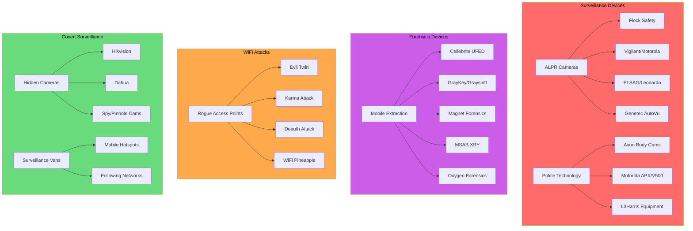
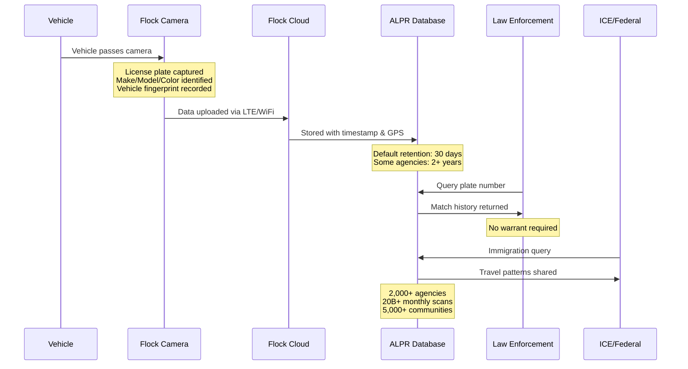
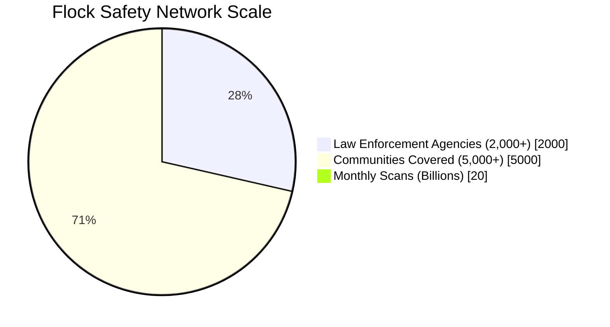
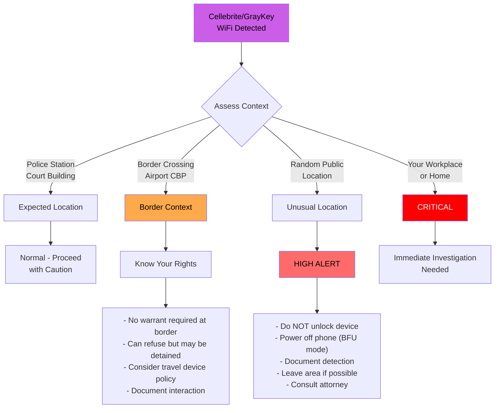
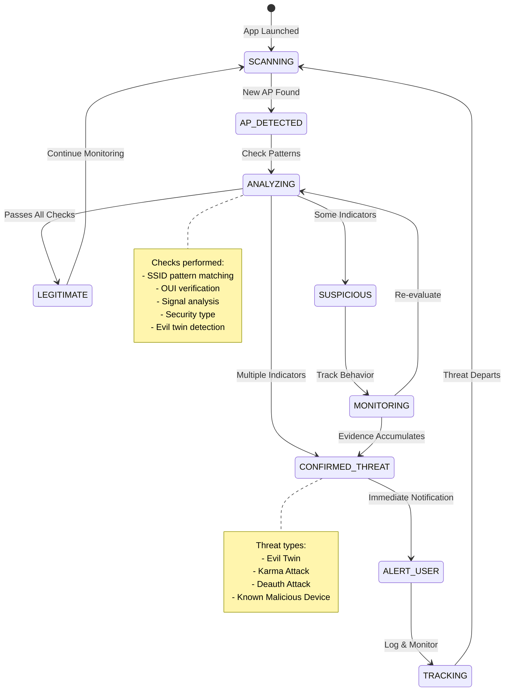
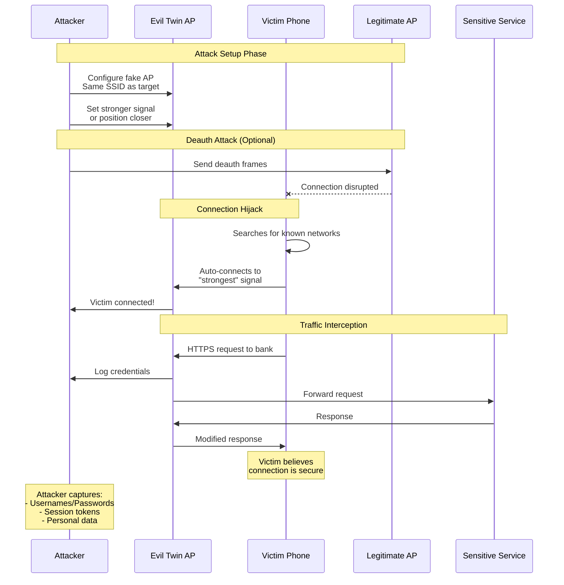
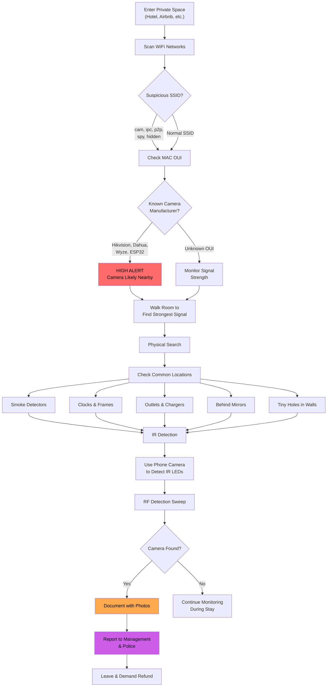
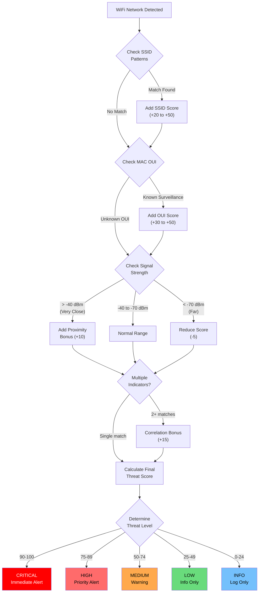

# WiFi Surveillance Detection System

## Table of Contents

1. [Overview](#1-overview)
2. [ALPR/Surveillance Camera Detection](#2-alprsurveillance-camera-detection)
3. [Police Technology Detection](#3-police-technology-detection)
4. [Forensics Device Detection](#4-forensics-device-detection)
5. [Rogue AP / Attack Detection](#5-rogue-ap--attack-detection)
6. [Hidden Camera Detection](#6-hidden-camera-detection)
7. [Surveillance Van Detection](#7-surveillance-van-detection)
8. [Threat Scoring System](#8-threat-scoring-system)
9. [Real-World Sources](#9-real-world-sources)
10. [Runbook: Responding to Detections](#10-runbook-responding-to-detections)
11. [Known Limitations](#11-known-limitations)
12. [Mitigation Advice](#12-mitigation-advice)

---

## 1. Overview

### WiFi-Based Surveillance Landscape

The WiFi Surveillance Detection system monitors for wireless networks associated with surveillance infrastructure, law enforcement equipment, forensics devices, and malicious access points. Modern surveillance devices frequently emit WiFi signals for configuration, data upload, or management purposes - creating a detectable signature.

### Device Category Hierarchy



### Types of Threats Detected

The system detects the following categories of WiFi-based threats:

| Category | Description | Threat Level |
|----------|-------------|--------------|
| **ALPR Cameras** | Automated License Plate Readers (Flock Safety, Vigilant, etc.) | High |
| **Police Technology** | Body cameras, radios, in-car systems (Axon, Motorola) | Medium-High |
| **Forensics Devices** | Phone extraction tools (Cellebrite UFED, GrayKey) | Critical |
| **Rogue Access Points** | Evil twin, Karma attacks, WiFi Pineapple | Critical |
| **Hidden Cameras** | Covert surveillance cameras in private spaces | High |
| **Surveillance Vans** | Mobile surveillance units with hotspots | High |
| **Following Networks** | Devices that track your movement across locations | Critical |

### Why This Matters

- **Privacy**: ALPR systems capture license plates of all passing vehicles 24/7
- **Location Tracking**: Your movements can be reconstructed from ALPR databases
- **Data Extraction**: Forensics devices can extract deleted data from phones
- **Network Security**: Rogue APs can intercept credentials and inject malware
- **Personal Safety**: Hidden cameras violate reasonable privacy expectations

### Implementation Files

- `WifiDetectionHandler.kt` - Main detection handler and pattern matching
- `RogueWifiMonitor.kt` - Advanced anomaly detection (evil twins, following networks)
- `DetectionPatterns.kt` - SSID patterns and MAC OUI database

---

## 2. ALPR/Surveillance Camera Detection

Automated License Plate Recognition (ALPR) cameras continuously scan and record vehicle information. Many ALPR systems use WiFi for configuration and data upload.

### Flock Safety ALPR Data Flow



### Flock Safety

**The most common ALPR system in the United States with 5,000+ communities and 20+ billion monthly plate scans.**

#### SSID Patterns Detected

```kotlin
// From DetectionPatterns.kt
"(?i)^flock[_-]?.*"      // Primary Flock pattern
"(?i)^fs[_-].*"          // FS prefix variant
"(?i)^falcon[_-]?.*"     // Falcon camera model
"(?i)^sparrow[_-]?.*"    // Sparrow compact model
"(?i)^condor[_-]?.*"     // Condor multi-lane model
```

#### What Flock Cameras Collect

| Data Type | Details |
|-----------|---------|
| License Plate | 100% capture rate at speeds up to 100 mph |
| Vehicle Make/Model | Identified automatically |
| Color | Vehicle color classification |
| Direction | Travel direction and timestamp |
| Vehicle Fingerprint | Bumper stickers, damage, modifications |
| GPS Coordinates | Precise camera location |

#### Law Enforcement Access

- **2,000+ police agencies** have direct database access
- No warrant required for law enforcement queries
- Data shared across Flock's nationwide network
- Some jurisdictions allow ICE access for immigration enforcement

#### ALPR Coverage Statistics



#### Data Retention Policies

| Entity | Default Retention | Maximum |
|--------|-------------------|---------|
| Flock Default | 30 days | Configurable |
| HOA Customers | 30 days | 90+ days |
| Law Enforcement | Varies | 2+ years in some jurisdictions |

#### Resource: deflock.me

The community-maintained [deflock.me](https://deflock.me) project maps known Flock camera locations. Use this resource to:
- Check camera locations in your area
- Plan routes to avoid surveillance clusters
- Contribute sightings of new cameras

### Vigilant (Motorola Solutions)

Motorola's ALPR platform competes with Flock Safety.

#### Detection Patterns

```kotlin
"(?i)^vigilant[_-]?.*"   // Vigilant ALPR systems
```

#### Capabilities

- Similar license plate capture as Flock
- Integration with Motorola police technology ecosystem
- CommandCentral evidence management platform
- Nationwide law enforcement data sharing

### Other ALPR Systems

#### ELSAG

Leonardo (formerly Finmeccanica) ALPR systems used primarily by law enforcement.

#### Genetec AutoVu

```kotlin
"(?i)^genetec[_-]?.*"    // Genetec Security Center
"(?i)^autovu[_-]?.*"     // AutoVu ALPR
```

Enterprise video management with ALPR capabilities.

#### Generic ALPR Patterns

```kotlin
"(?i)^alpr[_-]?.*"       // Generic ALPR
"(?i)^lpr[_-]?cam.*"     // License Plate Reader
```

---

## 3. Police Technology Detection

### Motorola Equipment

Motorola Solutions is the dominant provider of public safety communications equipment.

#### APX Radios

```kotlin
"(?i)^apx[_-]?.*"        // APX Radio System
"(?i)^astro[_-]?.*"      // ASTRO Radio System
```

**Models**: APX 6000, APX 7000, APX 8000, APX NEXT

**WiFi Usage**:
- Firmware updates
- Configuration changes
- Key loading for encryption

**Capabilities**:
- Encrypted P25 voice communications
- GPS tracking
- Emergency alerts

#### Motorola Body Cameras

```kotlin
"(?i)^moto[_-]?(body|cam|radio|apx).*"   // Motorola police equipment
"(?i)^v[_-]?[35]00[_-]?.*"               // V300/V500 Body Cameras
"(?i)^watchguard[_-]?.*"                  // WatchGuard brand
```

**WiFi Usage**:
- Evidence upload to CommandCentral
- Firmware updates
- Configuration sync

### Axon Equipment

Axon Enterprise (formerly TASER International) dominates the body camera market.

#### Body Cameras

```kotlin
"(?i)^axon[_-]?.*"                         // General Axon equipment
"(?i)^(axon[_-]?)?(body|flex)[_-]?[234]?.*" // Body 2/3/4, Flex
"(?i)^taser[_-]?.*"                         // TASER devices
```

**Models**: Body 2, Body 3, Body 4, Flex 2

**WiFi Usage**:
- Evidence upload to Evidence.com cloud
- Live streaming (Axon Respond)
- Firmware updates

#### Axon Fleet (In-Car Cameras)

```kotlin
"(?i)^evidence[_-]?.*"   // Evidence.com sync
```

**Features**:
- Dash cameras with automatic incident recording
- Syncs with body cameras when officer exits vehicle
- WiFi bulk upload at station

#### Axon Signal Triggers

**Automatic Camera Activation**:
- Firearm drawn from holster
- TASER armed or deployed
- Vehicle siren/lights activated
- Vehicle crash detected
- Vehicle door opens

**Real-World Confirmation**:
- Strong signal suggests officer/vehicle within 30-50 feet
- Axon Signal devices activate ALL nearby body cameras
- Presence indicates active police engagement

### L3Harris

L3Harris Technologies manufactures advanced surveillance and communications equipment.

```kotlin
"(?i)^l3harris[_-]?.*"            // L3Harris equipment
"(?i)^stingray[_-]?.*"            // StingRay IMSI catcher
"(?i)^(hail|king|queen)storm[_-]?.*" // Hailstorm/Kingfish
"(?i)^(harris|xg)[_-]?[0-9]+.*"   // XG Radio series
```

#### Why Detection is Rare

**StingRay/IMSI Catchers are almost never detected via WiFi because**:
- Operational security is paramount
- Cell site simulators don't typically broadcast WiFi
- Equipment is classified/export-controlled
- Real StingRay use involves strict concealment

**If you see a "StingRay" SSID**:
- It's likely a joke/honeypot (common WiFi name prank)
- Could be training exercise or equipment testing
- Document time/location if concerned
- Real IMSI catchers affect your cellular service, not WiFi

---

## 4. Forensics Device Detection

Mobile forensics devices can extract data from locked phones, including deleted content. Detection near you may indicate device seizure risk.

### Forensics Device Proximity Response



### Cellebrite UFED

**Universal Forensic Extraction Device - the industry standard for mobile forensics.**

#### SSID Patterns

```kotlin
"(?i)^cellebrite[_-]?.*"                    // Cellebrite
"(?i)^ufed[_-]?(touch|4pc|ultimate|premium)?.*" // UFED variants
"(?i)^(physical|logical)[_-]?analyzer.*"    // Analysis tools
```

#### Capabilities

| Extraction Type | What It Gets |
|----------------|--------------|
| Physical | Raw device image, deleted data recovery |
| Logical | Active files, databases, app data |
| Cloud | iCloud, Google, social media accounts |

**Extracted Data Includes**:
- All photos, videos, documents
- Text messages (including deleted)
- Call logs and voicemails
- App data (Signal, WhatsApp, Telegram)
- Passwords and authentication tokens
- Location history and GPS logs
- Browser history and bookmarks

#### Cost and Deployment

- **Price**: $15,000-$30,000+ per unit
- **Users**: Police, FBI, border agents, military, corporate security
- **Deployment**: Typically at stations/labs, but mobile deployment possible

#### Border Crossing Context

- Border agents can search devices without warrant
- "Consent" may be coerced at border crossings
- UFED is standard equipment at major ports of entry
- Consider travel mode / secondary device

### GrayKey (Grayshift)

**Specifically designed to crack iPhones.**

```kotlin
"(?i)^graykey[_-]?.*"    // GrayKey device
"(?i)^grayshift[_-]?.*"  // Grayshift company
```

#### iPhone Cracking Capabilities

- Can bypass screen locks on many iPhone models
- Brute-force passcode attacks
- Full filesystem extraction
- Founded by ex-Apple engineers

#### Detection Implications

- **Exclusively sold to law enforcement**
- **Price**: $15,000-$30,000 per unit
- Detection near you is **highly unusual**
- Strong signal suggests active forensic operation

### Other Forensics Tools

#### Magnet Forensics

```kotlin
"(?i)^magnet[_-]?(forensic|axiom|acquire).*"
```

- Magnet AXIOM: Cloud and device forensics
- Can recover data from cloud services

#### MSAB XRY

```kotlin
"(?i)^(msab|xry)[_-]?.*"
```

- Swedish mobile forensics company
- Used by law enforcement worldwide

#### Oxygen Forensics

```kotlin
"(?i)^oxygen[_-]?forensic.*"
```

- Oxygen Forensic Detective
- Mobile data extraction and analysis

---

## 5. Rogue AP / Attack Detection

The `RogueWifiMonitor` class implements sophisticated detection of WiFi-based attacks.

### Rogue AP Detection State Diagram



### Evil Twin Attack Flow



### Evil Twin Detection

**Same SSID from different MAC addresses with suspicious signal patterns.**

#### How It Works

```kotlin
// From RogueWifiMonitor.kt
private const val EVIL_TWIN_SIGNAL_DIFF_THRESHOLD = 15 // dBm
```

The detector:
1. Tracks SSID to BSSID mappings
2. Groups BSSIDs by device (handles dual-band/mesh routers)
3. Calculates signal strength variance
4. Filters out common legitimate networks
5. Reports when signal difference exceeds threshold

#### Detection Criteria

| Indicator | What It Means |
|-----------|---------------|
| Same SSID, different BSSID | Multiple APs with same name |
| Signal strength variance > 15-30 dBm | Different physical locations |
| New/rarely-seen BSSID | Unknown AP impersonating known network |
| Open network mimicking secured | Missing WPA/WPA2 security |

#### False Positive Reduction

The system accounts for:
- Dual-band routers (2.4GHz + 5GHz + 6GHz)
- Mesh networks (Eero, Google WiFi, etc.)
- Enterprise deployments with multiple APs
- OUI similarity analysis for related devices

### Karma Attack Detection

**AP responding to all probe requests, impersonating any network your device asks for.**

#### Detection Method

```kotlin
WifiAnomalyType.KARMA_ATTACK  // Detection type
```

Karma attacks are detected when:
- An AP responds to networks it shouldn't know about
- Same AP advertises multiple unrelated SSIDs
- Network appears with names matching user's saved networks

#### WiFi Pineapple Detection

```kotlin
"(?i)^(pineapple|hak5|wifi[_-]?pineapple).*"
```

Common tool for Karma attacks - detected via SSID pattern.

### Deauth Attack Detection

**Rapid disconnection patterns indicating active attack.**

#### Detection Parameters

```kotlin
// From RogueWifiMonitor.kt
private const val DEAUTH_WINDOW_MS = 60_000L  // 1 minute window
private const val DEAUTH_THRESHOLD = 5        // 5 disconnects triggers alert
```

#### How It Works

1. Monitors WiFi disconnect events
2. Tracks disconnection timestamps
3. Alerts when 5+ disconnects occur within 1 minute
4. Often indicates attacker forcing you onto rogue AP

#### Attack Pattern

1. Attacker sends deauthentication frames
2. Your device disconnects from legitimate AP
3. Your device auto-reconnects to strongest signal
4. Attacker's evil twin has stronger signal
5. You connect to malicious network

---

## 6. Hidden Camera Detection

The system detects WiFi networks from surveillance cameras that may be hidden in private spaces.

### Hidden Camera Search Flowchart



### Common OUIs (MAC Address Prefixes)

```kotlin
// From RogueWifiMonitor.kt - HIDDEN_CAMERA_OUIS set

// Hikvision (world's largest surveillance camera maker)
"B4:A3:82", "44:19:B6", "54:C4:15", "28:57:BE",
"C0:56:E3", "4C:BD:8F", "18:68:CB", "C4:2F:90"

// Dahua (second largest, Chinese state-linked)
"E0:50:8B", "3C:EF:8C", "4C:11:BF", "A0:BD:1D",
"90:02:A9", "B0:A7:32"

// Known spy/covert camera manufacturers
"00:18:AE"  // Shenzhen TVT
"7C:DD:90"  // Shenzhen Ogemray (spy cameras)
"D4:D2:52"  // Shenzhen Bilian (mini/pinhole cameras)
"E8:AB:FA"  // Shenzhen Reecam (nanny cams)

// Espressif (ESP8266/ESP32 - common in cheap cameras)
"5C:CF:7F", "60:01:94", "A4:7B:9D", "24:0A:C4", "84:F3:EB"

// Consumer brands often found in unauthorized placement
"2C:AA:8E", "D0:3F:27"  // Wyze
"78:8B:2A", "64:09:80"  // Xiaomi/YI
```

### SSID Patterns

```kotlin
// From RogueWifiMonitor.kt - HIDDEN_CAMERA_SSID_PATTERNS

// Generic camera naming
"(?i)^(hd|ip|wifi)?[-_]?cam(era)?[-_]?[0-9a-f]*$"
"(?i)^(spy|nanny|hidden|covert|mini|pinhole)[-_]?cam.*"

// Brand-specific defaults
"(?i)^(yi|wyze|blink|ring|arlo|nest|eufy)[-_]?.*"
"(?i)^(ezviz|hikvision|hik)[-_]?.*"
"(?i)^(dahua|dh|ipc)[-_]?.*"

// Common default SSID formats
"(?i)^ipc[-_]?[0-9a-f]{6,}$"       // IPCamera defaults
"(?i)^p2p[-_]?[0-9a-f]+$"          // P2P camera protocol
"(?i)^wificam[-_]?[0-9a-f]*$"      // WiFi camera defaults

// Disguised camera SSIDs
"(?i)^(clock|smoke|outlet|charger|usb)[-_]?cam.*"
```

### Airbnb/Hotel Context

**Where to Check**:
- Hotel rooms, Airbnbs, rental properties
- Changing rooms, bathrooms
- Behind mirrors, in smoke detectors
- Clocks, picture frames, electrical outlets

**Legal Context**:
- Recording in private spaces without consent is **illegal**
- Hotels/landlords are liable for hidden cameras
- Report to police if found

---

## 7. Surveillance Van Detection

### Following Network Patterns

The system tracks networks that appear at multiple of YOUR locations.

#### Detection Algorithm

```kotlin
// From RogueWifiMonitor.kt
private const val TRACKING_DURATION_MS = 300_000L  // 5 minutes
private const val FOLLOWING_LOCATION_THRESHOLD = 0.001  // ~100m

// Minimum distance before reporting (configurable)
var minTrackingDistanceMeters: Double = 1609.0  // 1 mile default
```

#### Following Network Analysis

The `FollowingNetworkAnalysis` data class computes:

| Metric | Description |
|--------|-------------|
| `sightingCount` | Number of times network detected |
| `distinctLocations` | Different locations where seen |
| `pathCorrelation` | How closely network follows user (0-1) |
| `totalDistanceTraveledMeters` | Distance user traveled while followed |
| `signalTrend` | STABLE, APPROACHING, DEPARTING, ERRATIC |
| `vehicleMounted` | Movement suggests vehicle |
| `possibleFootSurveillance` | Slower, closer movements |
| `followingConfidence` | Overall confidence score (0-100%) |

### SSID Characteristics

```kotlin
// From RogueWifiMonitor.kt - SURVEILLANCE_VAN_PATTERNS

// Fleet vehicle patterns (real surveillance uses bland names!)
"(?i)^(van|unit|car|truck)[-_]?[0-9]{1,4}$"
"(?i)^(vehicle|veh|fleet)[-_]?[0-9]{1,4}$"
"(?i)^mp70[-_]?[0-9a-f]+$"              // Sierra Wireless
"(?i)^ibr[-_]?[0-9]+.*"                  // Cradlepoint
"(?i)^airlink[-_]?.*"                    // Sierra AirLink

// Suspiciously generic hotspot names
"(?i)^(work|service|utility|maint)[-_]?(van|truck|vehicle)[0-9]*$"
"(?i)^(plumber|electric|cable|repair)[-_]?[0-9]+$"
```

**Important**: Real surveillance operations use **bland, generic names** - NOT "FBI_Van"!

### Signal Mapping

To locate the source of a suspicious network:

1. Walk around the area with the app
2. Note where signal is strongest
3. Look for vehicles with:
   - Running engines (for equipment power)
   - Tinted windows
   - Unusual antennas
   - No company markings
   - Occupants waiting

---

## 8. Threat Scoring System

### Detection Decision Flowchart



### How WiFi Threats Are Scored

Each detection pattern has a base threat score (0-100).

```kotlin
// Example from DetectionPatterns.kt
DetectionPattern(
    pattern = "(?i)^flock[_-]?.*",
    deviceType = DeviceType.FLOCK_SAFETY_CAMERA,
    threatScore = 95,  // High threat score
    ...
)
```

### Threat Score Ranges

| Score Range | Threat Level | Examples |
|-------------|--------------|----------|
| 90-100 | CRITICAL | StingRay, Cellebrite, GrayKey, Following Networks |
| 75-89 | HIGH | Flock cameras, Axon equipment, Evil Twin |
| 50-74 | MEDIUM | Hidden cameras, Generic ALPR, Body cameras |
| 25-49 | LOW | Smart home cameras, Retail beacons |
| 0-24 | INFO | Common legitimate networks |

### Pattern Matching Confidence

Base confidence is adjusted by:

```kotlin
// From WifiDetectionHandler.kt
private fun calculateConfidence(context: WifiDetectionContext, baseConfidence: Float): Float {
    var confidence = baseConfidence

    // Signal strength adjustments
    when {
        context.rssi > IMMEDIATE_PROXIMITY_RSSI -> confidence += 0.05f  // Very close
        context.rssi > STRONG_SIGNAL_RSSI -> confidence += 0.02f        // Close
        context.rssi < -80 -> confidence -= 0.05f                        // Far
    }

    // Hidden SSID = less certainty
    if (context.isHidden) confidence -= 0.1f

    // WPA3/WPA2 security = less suspicious
    if (context.capabilities.contains("WPA3") ||
        context.capabilities.contains("WPA2")) {
        confidence -= 0.02f
    }

    return confidence.coerceIn(0f, 1f)
}
```

### Multiple Indicator Correlation

Higher confidence is assigned when:
- SSID pattern match + suspicious OUI
- Strong signal + unusual location
- Network follows across multiple locations
- Multiple anomaly types from same network

---

## 9. Real-World Sources

### EFF on Flock Safety

- [How Flock Safety Cameras Can Be Used to Track Your Car](https://www.eff.org/deeplinks/2024/03/how-flock-safety-cameras-can-be-used-track-your-car)
- Detailed analysis of Flock's nationwide surveillance network
- Privacy implications and data sharing practices

### ACLU ALPR Resources

- [You Are Being Tracked: ALPR Technology](https://www.aclu.org/issues/privacy-technology/location-tracking/you-are-being-tracked)
- State-by-state ALPR regulations
- Legal challenges to mass surveillance

### Cellebrite Capabilities

- [EFF: Cellebrite](https://www.eff.org/pages/cellebrite)
- [Cellebrite UFED Product Page](https://cellebrite.com/en/ufed/)
- Technical capabilities and law enforcement usage

### StingRay / IMSI Catchers

- [EFF: Cell Site Simulators](https://www.eff.org/pages/cell-site-simulatorsimsi-catchers)
- [ACLU: Stingray Tracking Devices](https://www.aclu.org/issues/privacy-technology/surveillance-technologies/stingray-tracking-devices)
- Legal and technical overview

### Evil Twin Attack Research

- IEEE papers on WiFi security attacks
- WiFi Pineapple documentation (Hak5)
- OWASP wireless testing guides

### Hidden Camera Detection

- Airbnb hidden camera discovery guides
- RF detection methodology
- IR LED detection techniques

---

## 10. Runbook: Responding to Detections

### ALPR Camera Sighting Response

**When Flock/ALPR detected nearby:**

1. **Document the Detection**
   - Screenshot with timestamp and location
   - Note signal strength and SSID

2. **Visual Confirmation**
   - Look for small rectangular box on pole/post
   - IR illuminators may show red glow at night
   - Often paired: one camera per traffic direction

3. **Contribute to Community**
   - Report location to deflock.me
   - Note if new installation or existing

4. **Consider Route Planning**
   - Use deflock.me to plan alternative routes
   - Understand cameras are at fixed locations

### Forensics Device Proximity Response

**When Cellebrite/GrayKey detected nearby:**

1. **Assess Context**
   - Are you at a police station or border crossing?
   - Is there a legitimate forensics operation nearby?
   - Is this a public area or controlled environment?

2. **Protect Your Device**
   - Do NOT unlock your phone for anyone without warrant
   - Know your rights regarding device searches
   - Consider powering off device (enables BFU protection)

3. **Document Location**
   - Strong signal suggests very close proximity
   - Note exact location and time
   - This is unusual to detect in public

4. **Legal Awareness**
   - You generally have no obligation to provide passcode
   - Border crossing rules differ from normal stops
   - Consult attorney if concerned

### Rogue AP Response

**When Evil Twin / Karma Attack detected:**

1. **Disconnect Immediately**
   - Turn off WiFi on your device
   - Use cellular data for sensitive activities

2. **Identify the Threat**
   - Compare detected BSSID to your known router's MAC
   - Note if network is open (should be secured)
   - Check if "free WiFi" appeared unexpectedly

3. **Verify Sensitive Sessions**
   - Check SSL certificates on banking/email sites
   - Look for HTTPS downgrade to HTTP
   - Be wary of unexpected login prompts

4. **Remediation**
   - Forget the suspicious network
   - Change passwords from a secure connection
   - Enable 2FA on important accounts
   - Use VPN for future WiFi connections

### Hidden Camera Search Procedure

**When hidden camera network detected:**

1. **Initial Scan**
   - Note signal strength to estimate proximity
   - Walk room to find where signal is strongest

2. **Physical Search**
   - Check smoke detectors, clocks, outlets
   - Examine decorative items and picture frames
   - Look behind mirrors
   - Check for tiny holes in walls/ceiling

3. **Technical Detection**
   - Use phone camera to detect IR LEDs (appear purple/white)
   - Sweep with RF detector for transmitters
   - Check for unusual WiFi networks

4. **If Found**
   - Document with photos before touching
   - Report to property management
   - Consider police report (illegal in private spaces)
   - Leave if rental - demand refund

---

## 11. Known Limitations

### Encrypted SSIDs

- Some surveillance devices use non-descript SSIDs
- Enterprise-grade equipment may not broadcast
- Hidden SSIDs reduce but don't eliminate detection

### MAC Randomization on APs

- Some APs randomize their BSSID
- OUI detection less reliable with randomization
- Behavior-based detection still works

### Detection Range Limits

| Signal Strength | Approximate Range |
|-----------------|-------------------|
| > -40 dBm | Within 10-15 feet |
| -40 to -50 dBm | 15-30 feet |
| -50 to -70 dBm | 30-100 feet |
| < -70 dBm | 100+ feet |

### Scan Frequency

- Android limits WiFi scans (throttled to ~4/minute)
- Battery optimization may delay scans
- Moving quickly may miss some networks

### False Positives

Common false positive sources:
- Dual-band/mesh routers appearing as "evil twins"
- Consumer IoT devices with camera-like OUIs
- Neighbor's smart home devices
- Commuter devices with same route

---

## 12. Mitigation Advice

### Mitigation Flowchart

```mermaid
flowchart TD
    START["Protect Against<br/>WiFi Surveillance"]

    START --> AUTO["1. Disable Auto-Join"]
    AUTO --> AUTO_STEPS["- Settings > WiFi > Auto-Join OFF<br/>- Remove saved public networks<br/>- Manually select networks"]

    AUTO_STEPS --> VPN["2. Use VPN"]
    VPN --> VPN_STEPS["- Encrypt all traffic<br/>- Hide browsing from rogue APs<br/>- Prevent credential theft"]

    VPN_STEPS --> MAC["3. Enable MAC Randomization"]
    MAC --> MAC_STEPS["- iOS: On by default (14+)<br/>- Android: WiFi > Privacy settings<br/>- Prevents cross-network tracking"]

    MAC_STEPS --> AUDIT["4. Audit Saved Networks"]
    AUDIT --> AUDIT_STEPS["- Delete unused networks<br/>- Remove open/public WiFi<br/>- Keep only trusted networks"]

    AUDIT_STEPS --> VERIFY["5. Verify Before Connecting"]
    VERIFY --> VERIFY_STEPS["- Confirm network authenticity<br/>- Check for WPA2/WPA3<br/>- Avoid unexpected 'free WiFi'"]

    VERIFY_STEPS --> MONITOR["6. Monitor Connections"]
    MONITOR --> MONITOR_STEPS["- Watch for cert warnings<br/>- Note unexpected login prompts<br/>- Use cellular for banking"]

    MONITOR_STEPS --> TRAVEL["7. Travel Security"]
    TRAVEL --> TRAVEL_STEPS["- Secondary device for borders<br/>- Full-disk encryption<br/>- VPN to home country"]

    style START fill:#74c0fc,color:#000
    style AUTO fill:#69db7c,color:#000
    style VPN fill:#69db7c,color:#000
    style MAC fill:#69db7c,color:#000
    style AUDIT fill:#69db7c,color:#000
    style VERIFY fill:#ffa94d,color:#000
    style MONITOR fill:#ffa94d,color:#000
    style TRAVEL fill:#cc5de8,color:#000
```



### VPN Usage

**Always use VPN on public WiFi:**
- Encrypts traffic even on compromised networks
- Prevents credential interception
- Hides browsing activity from rogue APs

### Auto-Join Settings

**Disable auto-join for public networks:**
- Prevents automatic connection to evil twins
- Remove saved networks you no longer use
- Prefer manual network selection in sensitive areas

### MAC Randomization

**Enable MAC randomization on your device:**
- iOS: On by default (iOS 14+)
- Android: Settings > WiFi > Advanced > Privacy > Use randomized MAC

**Benefits:**
- Prevents tracking across networks
- Reduces WiFi probe request fingerprinting
- Makes following detection harder for adversaries

### Network Hygiene

1. **Audit Saved Networks**
   - Remove networks you no longer use
   - Delete open/public networks
   - Keep only trusted home/work networks

2. **Verify Networks Before Connecting**
   - Check BSSID matches expected (advanced)
   - Confirm WPA2/WPA3 security
   - Be suspicious of unexpected "free WiFi"

3. **Monitor for Anomalies**
   - Watch for certificate warnings
   - Note unexpected login prompts
   - Be aware of degraded connection quality

4. **Physical Security**
   - Be aware of surroundings when handling sensitive data
   - Don't access banking on public WiFi
   - Consider cellular for sensitive transactions

### Travel Recommendations

- Use secondary device for border crossings
- Enable full-disk encryption
- Consider travel mode settings
- Know local laws regarding device searches
- VPN to home country for sensitive access

---

## Appendix: Detection Methods Summary

| Detection Method | Enum Value | Description |
|------------------|------------|-------------|
| SSID Pattern | `SSID_PATTERN` | Regex matching against known patterns |
| MAC Prefix | `MAC_PREFIX` | OUI matching against manufacturer database |
| Evil Twin | `WIFI_EVIL_TWIN` | Same SSID from different MACs |
| Deauth Attack | `WIFI_DEAUTH_ATTACK` | Rapid disconnection patterns |
| Hidden Camera | `WIFI_HIDDEN_CAMERA` | Camera SSID/OUI patterns |
| Rogue AP | `WIFI_ROGUE_AP` | Suspicious access points |
| Signal Anomaly | `WIFI_SIGNAL_ANOMALY` | Unusual signal behavior |
| Following | `WIFI_FOLLOWING` | Network at multiple user locations |
| Surveillance Van | `WIFI_SURVEILLANCE_VAN` | Mobile surveillance patterns |
| Karma Attack | `WIFI_KARMA_ATTACK` | AP responding to all probes |

---

*Documentation generated from Flock You Android codebase - WifiDetectionHandler.kt, RogueWifiMonitor.kt, DetectionPatterns.kt*
